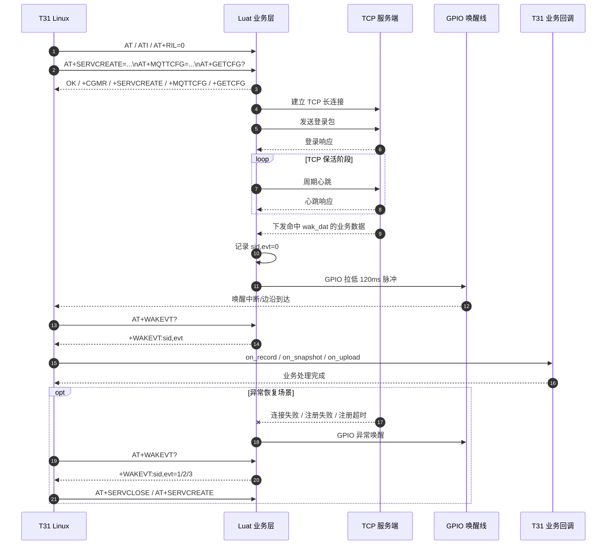

# t31_linux 代码说明

## 1. 目录定位

`t31_linux` 是一套运行在 T31 Linux 用户态的示例代码，用来和本工程中的 Luat Cat.1 业务脚本通信。

它的目标不是直接做音视频处理，而是完成下面几件事：

- 通过串口向 Luat Cat.1 发送业务 AT 命令
- 读取版本、运行配置、唤醒事件等信息
- 监听 Cat.1 侧 GPIO 唤醒脉冲
- 在收到唤醒事件后，调用 T31 侧业务回调
- 在连接失败、注册失败、注册超时等场景下，重建业务通道

这套代码默认面对的是本仓库里的 Lua 业务层，而不是直接面对 Cat.1 底层固件。

相关说明文档见：[T31_LINUX_AT_PASSTHROUGH.md](../T31_LINUX_AT_PASSTHROUGH.md)

## 2. 目录结构

```text
t31_linux/
├─ main.c        # 入口：注册 media_ops、t31_runtime_start
├─ runtime.h/c   # 业务工作线程（唤醒循环）
├─ media_ops.h/c # 拍照/录像/上传 功能接口（可外部调用）
├─ api.h/c       # 4G AT 客户端
├─ serial.h/c    # UART 接收线程
├─ gpio.h/c      # GPIO 唤醒监听线程
├─ config.h/c    # ini/json 配置
├─ MEDIA_OPS.md  # 媒体接口与线程说明
├─ client.ini    # 配置样例
└─ Makefile
```

## 3. 核心运行模型

### 3.1 总体流程

`main.c` 主流程（线程化）：

1. `media_ops_register()` 注册产品层拍照/录像实现（可选）
2. `t31_runtime_start()` → `client_init`（bootstrap AT）+ **工作线程**
3. 工作线程循环：`gpio` 唤醒 → `WAKEVT?` → `PIRSTAT?` → `media_dispatch_wake_event` 或 `client_handle_event`
4. 主线程或其他模块可随时调用 `media_snapshot()` / `media_record_start()` 等
5. `t31_runtime_shutdown()` 退出

详见 [MEDIA_OPS.md](MEDIA_OPS.md)。

### 3.2 时序图

下面这张图把主链路串起来了：

- T31 Linux 先通过 AT 和 Luat 业务层建立控制关系
- Luat 业务层负责 TCP 长连接、登录和心跳保活
- 服务器下发命中唤醒条件的数据后，Luat 通过 GPIO 脉冲唤醒 T31
- T31 再通过 `AT+WAKEVT?` 读取事件，并进入本地业务回调



### 3.3 线程模型

当前实现是“两条后台线程 + 一个主线程”的结构：

- 主线程：负责初始化、等待唤醒、处理事件、执行业务回调
- 串口线程：负责 UART 接收和应答等待
- GPIO 线程：负责通过 epoll 监听 Cat.1 唤醒 GPIO

### 3.4 串口模型

`serial.c` 维护一个 `serial_port_t`：

- 持有串口 fd 和 epoll fd
- 用 `tx_lock` 保证串口命令串行发送
- 用 `lock + cond` 等待应答完成
- 用 `rx_buf` 缓存一次应答
- 通过“接收空闲超时”判断一条串口返回已结束

这一层本质上把串口 AT 交互封装成了同步请求接口：

- `serial_request()`

## 4. GPIO 唤醒模型

本板 **Cat.1 GPIO29（1.8V）→ T31 `PB27`（3.3V 输入）**：协议为**低电平脉冲**（空闲高、120ms 拉低），`gpio.c` 配置**下降沿**。sysfs 编号一般为 **59**（`wake_gpio=59`）。模组 **GPIO22** 仅 **t3x 供电**，不再兼做唤醒脉冲。详见 [`doc/T31_WAKE_PROTOCOL.md`](../doc/T31_WAKE_PROTOCOL.md)。

`gpio.c` 维护一个 `gpio_monitor_t`，使用 sysfs GPIO 接口：

- 导出 GPIO
- 配置为输入
- 配置下降沿触发
- 用 epoll 等待 `POLLPRI`

当 Cat.1 拉低唤醒脚时：

- GPIO 线程把事件记入 `pending_count`
- 主线程通过 `gpio_wait_event()` 取出事件
- 然后继续调用 `AT+WAKEVT?` 查询具体原因

## 5. 配置模型

`config.c` 支持两种配置格式：

- ini
- json

入口函数：

- `config_init_defaults()`
- `config_load()`

默认配置由 [types.h](types.h) 定义，典型项包括：

- `uart_dev`
- `baudrate`
- `wake_gpio`
- `read_timeout_ms`
- `wake_wait_timeout_ms`
- `sid`
- `server_ip`
- `server_port`
- `login_hex`
- `login_rsp_hex`
- `heartbeat_hex`
- `heartbeat_sec`
- `wake_hex`
- `critical_flag`
- `run_type`
- `mqtt_host` / `mqtt_port` / `mqtt_ssl` / `mqtt_username` / `mqtt_password` / `mqtt_client_id`（经 `AT+MQTTCFG` 下发 4G，见 [HOST_MQTT_UART.md](../doc/HOST_MQTT_UART.md)）

示例配置文件见：

- [client.ini](client.ini)
- [client.json](client.json)

## 6. 对外 API

主要对外接口定义在 [api.h](api.h)。

### 6.1 生命周期接口

- `client_init()`：初始化客户端、串口、GPIO 和 Luat 通信
- `client_shutdown()`：关闭串口线程、GPIO 线程，释放资源

### 6.2 事件处理接口

- `client_wait_wakeup()`：等待 GPIO 唤醒，并读取 `WAKEVT`
- `client_handle_event()`：根据事件类型执行业务回调或异常恢复

### 6.3 业务层命令接口

- `client_ping()`：发送 `AT`
- `client_get_version()`：发送 `ATI`
- `client_get_runtime_config()`：发送 `AT+GETCFG?`
- `client_create_service()`：发送 `AT+SERVCREATE=...`
- `client_close_service()`：发送 `AT+SERVCLOSE=n`
- `client_query_wakeup()`：发送 `AT+WAKEVT?`
- `client_get_pir_stat()`：发送 `AT+PIRSTAT?`（PIR 策略与计数，见 [T31_4G_AT_INTERACTION.md](../doc/T31_4G_AT_INTERACTION.md)）

### 6.4 原始 AT 接口

- `client_request()`：发送任意原始 AT 字符串
- `client_set_passthrough()`：控制 `AT+RIL=0/1`

这两个接口配合使用时，可以访问 Lua 业务层未接管的底层标准 AT。

## 7. 回调模型

业务回调由 `business_callbacks_t` 描述，当前支持：

- `on_server_data`
- `on_record`
- `on_snapshot`
- `on_upload`
- `on_talkback`

事件处理规则如下：

- 如果注册了 `on_server_data`，`evt=0` 时优先调用它
- 如果没有注册 `on_server_data`，则按顺序尝试调用 `on_record`、`on_snapshot`、`on_upload`、`on_talkback`

因此，T31 侧可以把自己的录像、抓拍、上传、对讲逻辑直接挂到这些回调上。

## 8. 与 Luat 侧的关系

本目录的代码默认对应 Lua 业务层的 AT 命令，而不是直接操作底层固件。

当前 Luat 侧主要处理这些命令：

- `AT`
- `AT+RIL=0/1`
- `AT+SERVCREATE=...`
- `AT+SERVCLOSE=n`
- `AT+WAKEVT?`
- `AT+GETCFG?`
- `ATI`
- `AT+CGMR`
- `AT+GETVER`

这意味着：

- `t31_linux` 默认是和 Lua 业务层通信
- 如果要访问 Lua 未接管的底层标准 AT，需要先打开透传

相关代码位置：

- Luat 侧命令分发：[app/app_main.lua](../app/app_main.lua)
- Linux 侧接口封装：[api.c](api.c)

## 9. 启动和构建

构建脚本在 [Makefile](Makefile)：

```make
CC ?= gcc
CFLAGS ?= -O2 -Wall -Wextra -std=c11 -pthread
TARGET := main
SRC := main.c api.c config.c gpio.c log.c serial.c
```

当前默认编译方式：

```bash
cd t31_linux
make
./main client.ini
```

如果在 T31 交叉编译环境下使用，需要把 `CC` 改成对应的交叉编译器前缀。

## 10. 运行时行为

初始化阶段，`client_init()` 会完成以下动作：

1. 加载配置
2. 打开串口线程
3. 打开 GPIO 监听线程
4. 发送 `AT`
5. 发送 `ATI`
6. 发送 `AT+RIL=0`
7. 发送 `AT+SERVCREATE=...`
8. 发送 `AT+GETCFG?`

随后 `main.c` 还会额外打印：

- 版本信息响应
- 当前运行配置响应

## 11. 异常恢复策略

`client_handle_event()` 当前支持 4 类事件：

- `EVT_SERVER_DATA`
- `EVT_CONNECT_FAIL`
- `EVT_REGISTER_FAIL`
- `EVT_REGISTER_TIMEOUT`

其中：

- `EVT_SERVER_DATA`：触发业务回调
- 其余异常事件：执行“关闭通道 -> 重新创建通道”恢复逻辑

这是和 Luat 侧保活机制保持一致的一种最小恢复实现。

## 12. 当前限制

这份代码目前有几个明显边界：

- GPIO 使用的是 sysfs 方式，适合旧内核或简单场景，新内核更建议迁移到 gpiod
- 示例业务回调只是日志占位，需要替换成实际录像、抓拍、上传逻辑
- 当前环境里没有可用的本地 C 编译器，因此仓内主要做了语法级和结构级校验
- 串口交互默认按当前 Luat 业务协议设计，若 Lua 侧协议变更，Linux 侧也要同步调整

## 13. 建议阅读顺序

如果后续要继续维护或集成，建议按下面顺序阅读：

1. [main.c](main.c)
2. [api.h](api.h)
3. [api.c](api.c)
4. [types.h](types.h)
5. [config.c](config.c)
6. [serial.c](serial.c)
7. [gpio.c](gpio.c)

这样最容易先看清主流程，再看协议和底层实现。