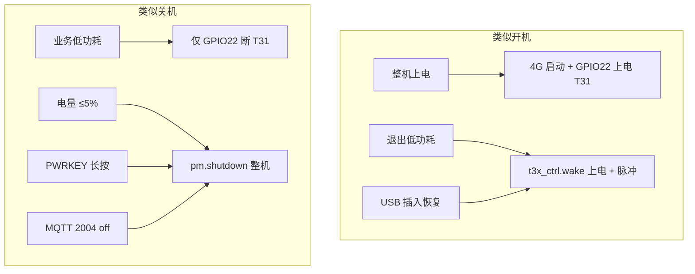
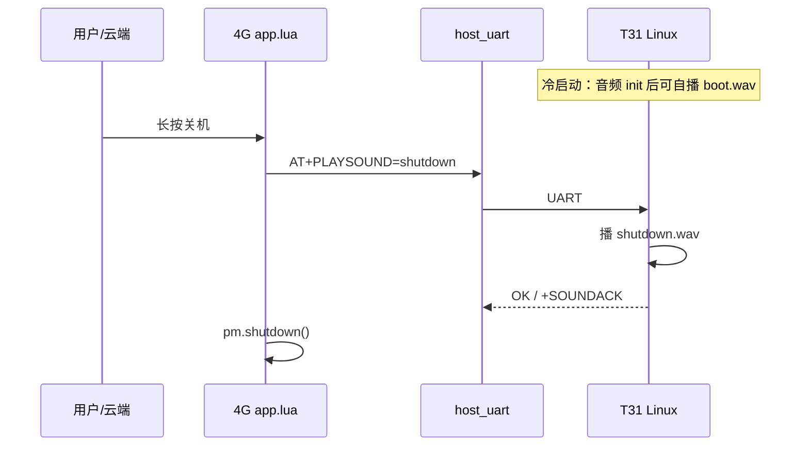
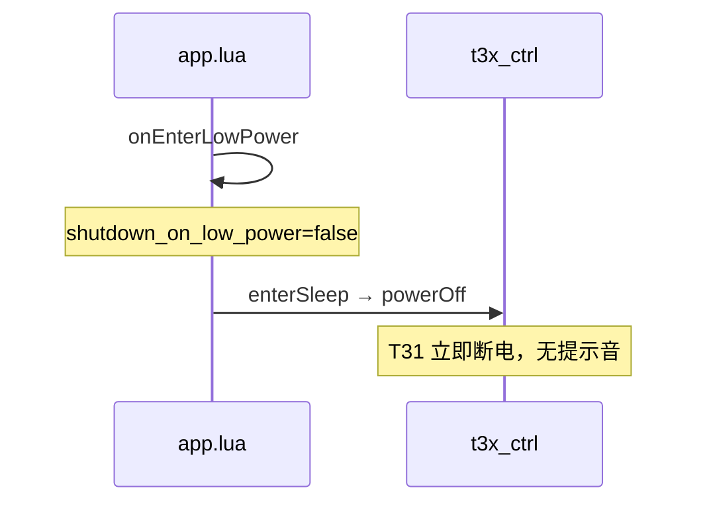
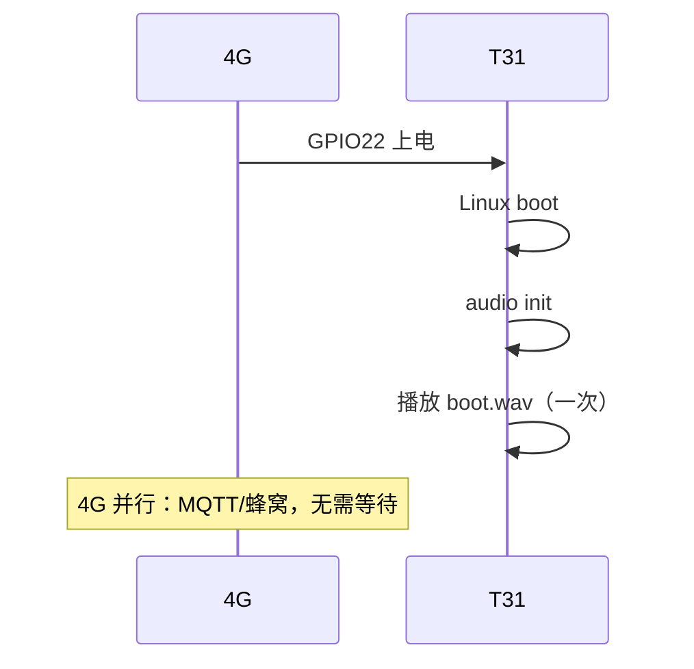

# 4G + T31 可视门铃：开机 / 关机提示音方案

> 适用：**Air780EHM（4G）+ T31（协处理器）** 低功耗门铃  
> 硬件音频：T31 `HPOUT` / `SPEAK_EN`（见 [T31_CAT1_GPIO.md](T31_CAT1_GPIO.md) §2.4）  
> 协作框架：[T31_4G_FRAMEWORK.md](T31_4G_FRAMEWORK.md) · 唤醒：[T31_WAKE_PROTOCOL.md](T31_WAKE_PROTOCOL.md) · 低功耗：[LOW_BATTERY_AND_LOW_POWER.md](LOW_BATTERY_AND_LOW_POWER.md)

**当前固件状态（v1_20260529）**：4G `user/sound_prompt.lua` + T31 `audio_prompt.c` 桩已实现 `AT+PLAYSOUND`；低功耗休眠默认不播关机音；**PIR 唤醒不播开机音**（`boot_on_wake=false`）。

---

## 1. 结论（先看）

| 项目 | 建议 |
|------|------|
| **谁播音** | **T31**（喇叭、`SPEAK_EN`、Codec 在 T31 侧） |
| **4G 做什么** | **编排**：上电时序、发 AT/唤醒、**等播完再断电** |
| **Air780 TTS** | 模组固件可有 TTS，板级通常无喇叭，**不作为门铃提示音主路径** |
| **业务休眠** | 默认 **不播** 关机音（省电、少打扰） |
| **用户关机** | 建议 **播关机音** 后再 `pm.shutdown()` |
| **插 USB** | 保持 T31 上电、忽略低电量时，**不必因电量播关机音** |

---

## 2. 硬件与现状

### 2.1 音频在 T31

| 网络 | T31 | 说明 |
|------|-----|------|
| MICLP | 41 | 麦克风 |
| HPOUT | 44 | 耳机/喇叭模拟输出 |
| SPEAK_EN | GPIO | 功放使能 |

4G 侧无独立音频输出引脚；串口 **UART1** 与 T31 通信（`config.UART_CFG`）。

### 2.2 电源与「开机 / 关机」在软件里的含义

本工程里 **T31 可被单独断电**（GPIO22），4G 可常电联网，因此「开机音 / 关机音」要区分场景，不能简单等同「整机上电 / 整机掉电」。



### 2.3 当前代码行为（无提示音）

| 场景 | 4G 模块 | T31 电源 |
|------|---------|----------|
| 应用启动 | `t3x_ctrl.start()` → `powerOn()` | 上电 |
| 进入低功耗 | `app.onEnterLowPower()` → `enterSleep()` | **立即** `powerOff()` |
| 退出低功耗 | `onExitLowPower()` → `wake()` | 上电 + GPIO29 脉冲 |
| 用户关机 | `onPowerOff()` → `pm.shutdown()` | 随整机断电 |
| 电量保护关机 | `battery_guard` 延时后 `pm.shutdown()` | 随整机断电 |

关键代码路径：

- `user/t3x_ctrl.lua`：`powerOn()` / `powerOff()` / `enterSleep()` / `wake()`
- `user/app.lua`：`onEnterLowPower` / `onExitLowPower` / `onPowerOff`
- `user/host_uart.lua`：`notify_host(sid, evt)` → GPIO29 脉冲 + `AT+WAKEVT?`

**问题**：`enterSleep()` 与 `onPowerOff()` 均未在断电前通知 T31 播放，音频会被硬切断。

---

## 3. 推荐架构

### 3.1 分工



| 侧 | 职责 |
|----|------|
| **T31** | Codec/`SPEAK_EN` 初始化；加载 `boot.wav` / `shutdown.wav`；执行播放；可选回 `+SOUNDACK` |
| **4G** | 配置哪些场景播音；发 AT；**等待超时或 ACK**；再 `powerOff()` / `pm.shutdown()` |

### 3.2 为何开机音可 T31 自发、关机音需 4G 等待

| 类型 | 原因 |
|------|------|
| **开机音** | T31 上电后 Linux 启动，4G 尚未知 T31 就绪时刻；可在 T31 `runtime` 或产品进程 **音频 ready 后自播** |
| **关机音** | 必须先播完再断 GPIO22 或整机掉电，必须由 **4G 在断电前发指令并等待** |

---

## 4. 场景与是否播音（产品建议）

| 场景 | 触发 | 建议播音 | 说明 |
|------|------|----------|------|
| **整机上电** | 电池/K1 开机 | ✅ 开机音 | 冷启动一次，用户可感知设备就绪 |
| **低功耗唤醒** | PIR/MQTT/云端 | ❌ 默认不播 | 频繁唤醒费电、吵；可配置开启短「滴」 |
| **USB 插入恢复 T31** | GPIO27 | ❌ 默认不播 | 充电/维护场景 |
| **业务休眠** | USB 拔出 / MQTT 2002 | ❌ 默认不播 | 仅断 T31，非用户感知「关机」 |
| **用户长按关机** | PWRKEY | ✅ 关机音 | 明确反馈 |
| **云端关机** | MQTT 2004 `off` | ✅ 关机音 | 同用户关机 |
| **电量 ≤5% 自动关机** | `battery_guard` | ⚠️ 静音或极短 beep | 电量极低，避免长播导致来不及关机 |

插 **USB（GPIO27）** 时：`battery_guard` 忽略低电量并保持 T31 上电（见 [LOW_BATTERY_AND_LOW_POWER.md](LOW_BATTERY_AND_LOW_POWER.md)），**不因电量播关机音**。

---

## 5. 协议设计（建议）

### 5.1 方案 A：扩展 AT（推荐）

由 `user/host_uart.lua` 解析，与现有 `AT+LOWPOWER`、`AT+POWEROFF` 一致。

| 命令 | 方向 | 说明 |
|------|------|------|
| `AT+PLAYSOUND=boot` | 4G → T31 | 播开机提示 |
| `AT+PLAYSOUND=shutdown` | 4G → T31 | 播关机提示 |
| `AT+PLAYSOUND?` | 查询 | `+PLAYSOUND:idle` / `playing` / `done` |
| `+SOUNDACK` | T31 → 4G | 播放结束（可选，用于精确等待） |

示例：

```text
4G → T31: AT+PLAYSOUND=shutdown
T31 → 4G: \r\nOK\r\n
... 播放中 ...
T31 → 4G: \r\n+SOUNDACK:shutdown\r\nOK\r\n   （可选）
```

### 5.2 方案 B：扩展 WAKEVT `evt`

| evt | 含义 | 说明 |
|-----|------|------|
| 0 | 业务数据 | 现有 |
| 1～3 | TCP/MQTT 异常 | 现有 |
| **4** | 播开机提示 | 4G `notify_host(sid, 4)` |
| **5** | 播关机提示 | 播完 T31 可主动断电准备（仍建议 4G 等 ACK） |

T31 `runtime_worker` 收到后调 `media_play_prompt()`，与 [MEDIA_OPS.md](../t31_linux/MEDIA_OPS.md) 扩展一致。

### 5.3 T31 侧实现要点

- 在 `t31_linux` 或君正 IMP 产品层增加 `audio_prompt_play(const char *name)`。
- 资源路径示例：`/etc/sounds/boot.wav`、`/etc/sounds/shutdown.wav`（格式以 Codec 支持为准）。
- `media_ops` 可预留：`media_play_prompt(client, "boot")`；`media_talkback` 为对讲预留，与提示音分开。
- 播放时拉高 `SPEAK_EN`，播完拉低（具体以原理图为准）。

---

## 6. 4G 侧挂接点（实现时）

### 6.1 建议配置 `config.lua`

```lua
_G.SOUND_CFG = {
    enabled = true,
    boot_on_cold_start = true,       -- 整机上电（或发 AT+PLAYSOUND=boot）
    boot_on_wake = false,            -- 低功耗唤醒
    shutdown_on_user_off = true,     -- PWRKEY / AT+POWEROFF / 2004 off
    shutdown_on_low_power = false,   -- onEnterLowPower 业务休眠
    shutdown_on_battery_off = false, -- battery_guard ≤5%
    play_timeout_ms = 2500,          -- 无 SOUNDACK 时最大等待
}
```

开关也可放 `app_config.lua` → `MODULE_FLAGS.sound_prompt`。

### 6.2 修改点一览

| 文件 | 时机 | 动作 |
|------|------|------|
| `user/app.lua` | `t3x_ctrl.start()` 之后 | 可选：等 T31 AT 就绪后发 `boot`（或交给 T31 自播） |
| `user/app.lua` | `onExitLowPower()` | `boot_on_wake=true` 时播 |
| `user/app.lua` | `onEnterLowPower()` | `shutdown_on_low_power=true` 时：**先播 → 等待 → 再** `enterSleep` |
| `user/app.lua` | `onPowerOff()` | **先播 → 等待 → 再** `pm.shutdown()` |
| `user/battery_guard.lua` | ≤5% 关机定时器 | 按 `shutdown_on_battery_off` |
| `user/host_uart.lua` | 新增 | `AT+PLAYSOUND=` 解析与发送、`play_and_wait()` 封装 |
| `user/t3x_ctrl.lua` | 可选 | `enterSleepWithSound()` 封装「通知 + 延时 + powerOff」 |

### 6.3 关机 / 休眠统一流程（伪代码）

```lua
local function playShutdownIfNeeded()
    if not SOUND_CFG.enabled or not SOUND_CFG.shutdown_on_xxx then
        return
    end
    if not t3xModule.getState().powered_on then
        return
    end
    host_uart.play_sound("shutdown", SOUND_CFG.play_timeout_ms)
end

local function onEnterLowPower()
    playShutdownIfNeeded()  -- 仅当配置开启
    -- 原有：setLowPowerMode、enterSleep、publishRest...
end

local function onPowerOff()
    playShutdownIfNeeded()
    pm.shutdown()
end
```

**注意**：`play_sound` 必须在 **task 内** 使用 `sys.wait`，不可在同步回调里长时间阻塞。

---

## 7. 时序示例

### 7.1 用户长按关机（推荐体验）


### 7.2 业务低功耗（默认不播音）



### 7.3 冷启动开机音（T31 自发）



---

## 8. 与低功耗 / 电量的关系

| 机制 | 与提示音关系 |
|------|----------------|
| `onEnterLowPower` | 默认不断音前通知；若以后要休眠音，须改 `enterSleep` 顺序 |
| `battery_guard` ≤10% | 断 T31 + 1002，**不建议**长关机音 |
| `battery_guard` ≤5% | 整机 `pm.shutdown()`；可配置极短 beep 或静音 |
| USB 插入 | `onUsbInserted` 保持 T31 上电，**不触发** 低电量关机音 |
| T31 烧录模式 | 关停 MQTT/UART/RNDIS 时 **跳过** 提示音逻辑 |

---

## 9. 实施步骤（建议顺序）

1. **T31**：单测本地播放 `boot.wav` / `shutdown.wav`（`SPEAK_EN` + Codec）。
2. **T31**：串口实现 `AT+PLAYSOUND=` 与 `OK`（可选 `+SOUNDACK`）。
3. **4G**：`host_uart` 增加 `play_sound(name, timeout_ms)`。
4. **4G**：仅改 `onPowerOff`（用户/云端关机）先播再关。
5. **4G**：`SOUND_CFG` 入库 `config.lua`，默认关闭「休眠音 / 唤醒音」。
6. **联调**：示波器/日志确认 **播完后再断 GPIO22**。
7. **文档**：在 [T31_4G_AT_INTERACTION.md](T31_4G_AT_INTERACTION.md) 登记 `AT+PLAYSOUND`。

---

## 10. 测试清单

| # | 操作 | 预期 |
|---|------|------|
| 1 | 冷上电 | 一声开机提示（T31 自发或 AT） |
| 2 | PIR 唤醒录像 | **无** 开机音（默认） |
| 3 | USB 拔出进低功耗 | **无** 关机音（默认） |
| 4 | PWRKEY 长按关机 | 关机音后整机掉电 |
| 5 | MQTT 2004 `off` | 同长按关机 |
| 6 | 低电量 5% 自动关机 | 静音或短 beep（按配置） |
| 7 | 插 USB 后低电量 | 不关机、不播低电量关机音 |
| 8 | 烧录模式 GPIO28 长按 | 不触发提示音流程 |

---

## 11. 相关文档与代码

| 类型 | 路径 |
|------|------|
| GPIO / 音频引脚 | [T31_CAT1_GPIO.md](T31_CAT1_GPIO.md) §2.4 |
| 唤醒与 AT | [T31_WAKE_PROTOCOL.md](T31_WAKE_PROTOCOL.md)、[UART_PROTOCOL.md](UART_PROTOCOL.md) |
| T31 媒体扩展 | [../t31_linux/MEDIA_OPS.md](../t31_linux/MEDIA_OPS.md) |
| 低功耗 / 电量 | [LOW_BATTERY_AND_LOW_POWER.md](LOW_BATTERY_AND_LOW_POWER.md) |
| 4G 电源控制 | `user/t3x_ctrl.lua`、`user/app.lua` |
| 串口 AT | `user/host_uart.lua` |
