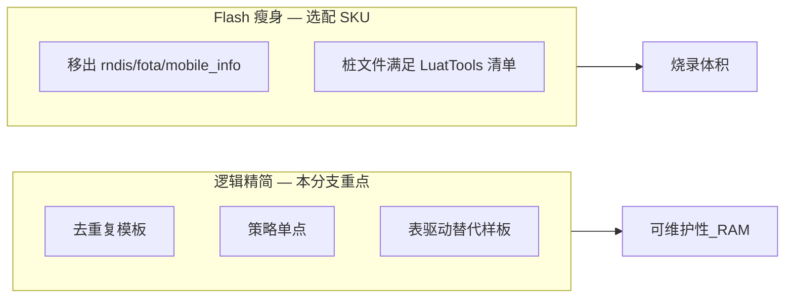

# Cat.1 逻辑精简规划（不减功能）

> **分支**：`cat1_slim_logic`（基于 `lowpwr_t3x_cat1`）  
> **原则**：合并重复逻辑、统一策略单点；**不删 MQTT/PIR/低功耗/提示音等业务能力**。  
> **关联**：[CAT1_SLIMMING_FLOW.md](./CAT1_SLIMMING_FLOW.md)（Flash 移文件）、[CAT1_USER_LIB_SLIM.md](./CAT1_USER_LIB_SLIM.md)（开关速查）、[`archive/slim/README.md`](../archive/slim/README.md)

---

## 1. 现状诊断

### 1.1 体积分布

| 区域 | 源码约 | 占比 | 说明 |
|------|--------|------|------|
| `user/` | ~255 KB | 66% | 业务编排 |
| `lib/` | ~95 KB | 34% | 驱动/策略；LuatTools 编译 `lib/*.lua` 根目录**全部**文件 |

脚本区上限约 **384KB**（`luatos.json` → `only_luac_code=True`）。源码合计约 **350KB**，编译后仍可能顶满上限。

### 1.2 三大热点（宜内部合并，不宜删除）

| 文件 | 行数 | 约 KB | 主要职责 |
|------|------|-------|----------|
| `user/host_uart.lua` | 1941 | 63.5 | AT/HEX/STR 协议、T3x 查询、WLED/USB/HOSTEVT/PIRSTAT |
| `user/net_mqtt.lua` | 1296 | 46.1 | MQTT 200x↓ / 100x↑ 全协议、蜂窝 bootstrap、pending host 队列 |
| `user/app.lua` | 1078 | 40.2 | 启动链（18 步）、低功耗/USB/MQTT/PIR 事件桥、烧录模式 |

其余 `user/*.lua` 与 `lib/*.lua` 体量见 [CAT1_USER_LIB_SLIM.md §1](./CAT1_USER_LIB_SLIM.md)。

---

## 2. 两类优化（勿混做）



| 手段 | 省 RAM/启动 | 省 Flash | 减功能风险 |
|------|-------------|----------|------------|
| `MODULE_FLAGS=false` + `optMod` | 是 | **否** | 低（运行时不加载） |
| 同文件内合并重复函数 | 略 | **略**（删行才省） | 低 |
| 文件移出 → `archive/slim/` | 间接 | **是** | 中（须桩 + 开关） |
| 合并 `host_uart`/`net_mqtt`/`app` | — | 否 | **高（勿做）** |

**本规划聚焦 A 类**；B 类仅在量产 SKU 明确不需要某能力时执行（见 §6）。

---

## 3. 重复逻辑地图

### 3.1 `host_uart.lua`（收益最大）

#### 查询模板（4～5 处相同骨架）

涉及：`queryHostGb28181`、`queryHostTfCard`、`queryHostRecord`、`queryHostIpcStatus`。

```
busy 锁 → ensure_t3x_for_host_query → bootWait → sendString → waitUntil → 写缓存
```

**建议**：抽象 `hostQuery(opts)`，各查询仅配置：

- AT 命令字符串
- `sys.waitUntil` 事件名
- 解析/默认值
- `config.lua` 对应 cfg 段（`HOST_IDENTITY_CFG` 等）
- `state.*_query_busy` 字段名

#### 编码设置

`setHostVideoEncode` / `setHostAudioEncode` 共享「查当前 → 拼 AT → await」流程。

**建议**：合并为 `setHostEncode(scope, opts)`，`scope` 为 `"video"` | `"audio"`。

#### 体构建

`build_hostevt_body` 与 `build_pirstat_body` 均调用 `pir_runtime.buildAtBody` + `host_event.summarize`，仅扩展字段名不同。

**建议**：`buildPirWakeBody(extFields)` 统一内核。

---

### 3.2 跨文件策略重复

| 策略 | 散落位置 |
|------|----------|
| USB 插入时禁止 4G rest | `app.onEnterLowPower`、`net_mqtt.usbBlocks4gRest`、`host_uart` 低功耗拦截 |
| USB 物理插入判定 | `usb_charge`、`battery_guard`、`t3x_policy`、`app`、`net_mqtt` |
| 设备 IMEI | `app.getImei`、`net_mqtt.getDeviceId`、`host_uart.get_device_imei` |
| T3x 上电门禁 | `sound_prompt`、`time_sync`、`host_uart`（wled/query/encode）各一套 `ensureT3xPowered` |

**建议新增薄层**（功能由现有 `config.lua` 驱动，行为不变）：

| 模块 | 职责 |
|------|------|
| `lib/usb_policy.lua` | `isUsbInserted()`、`mayEnterRest()`（读 `HOST_USB_CFG.block_4g_rest_when_usb`） |
| `lib/device_id.lua` | IMEI 单点解析 |
| `t3x_ipc.ensurePowered(tag)` | 上收四处 T3x 上电样板（`t3x_policy.mayPowerT3x` + `t3x_ctrl.powerOn`） |

---

### 3.3 `net_mqtt.lua`

| 类型 | 位置 | 建议 |
|------|------|------|
| 上行 JSON 手工拼接 | `publishStatus`、`publishSimInfo`、`publishPirDetect` 等 | 表驱动：`UP_PUBLISH[cmd] = { build = fn }` |
| 下行需 T3x | `handleDownlink2006/2007` + `handleHostDownlink` | 已部分统一，可扩展到更多 200x |
| USB rest | `usbBlocks4gRest` | 委托 `usb_policy.mayEnterRest()` |
| bootstrap | `main` + `app.bootMqtt` + `bootstrapNetwork` | 理清单次启动链，避免重复 `wait net_ready` |

---

### 3.4 `app.lua`

| 类型 | 位置 | 建议 |
|------|------|------|
| 烧录检查明细日志 | `checkT3xBurnPreconditions*`（约 571–689 行） | `T3X_BURN_CFG.debug_checks` 开关，量产关日志、逻辑保留 |
| rest 门禁重复 | `onEnterLowPower`、`setupEventHandlers` POWER_ENTER_REST | 委托 `usb_policy` |
| PIR 唤醒重复 | `onPirMediaAction`、`onPirStopRecording` 等 | `wakeT3xForPir(sid, reason)` |
| 纯日志订阅 | `MQTT_SERVER_DATA`、`GPIO_VBUS_CHANGED` 等 | 合并为 `debugLogSubscriber` |

---

### 3.5 明确可删的重复（零功能损失）

`t3x_ctrl.lua` 中 **`pulseUsbDebugEn` 定义两次**（约 218 行与 248 行），后者覆盖前者，属复制粘贴错误，删除一段即可。

---

### 3.6 `lib/` 侧（逻辑向）

| 模块 | 说明 |
|------|------|
| `low_power_wakeup.lua` | 已是良好 consolidation 范例，**勿再拆** |
| `usb_rndis.lua` | `switch`/`rebind`/`open` 重复 flymode→重开序列；可抽 `withRndisCycle(fn, opts)` |
| `led.lua` | 门球 `LED_CFG.mode=single_blue` 仅用部分 API；dual/呼吸路径可迁 `archive/slim`（SKU 裁剪） |
| `cellular_bootstrap` | 60s `startCellInfoRefresh` 可在无 `mobile_info` 时按需启动 |
| `host_event` / `t3x_policy` / `uart_bridge` | 分层合理，保持独立 |

**lib 与 user 分工**（勿合并）：

| lib | user | 关系 |
|-----|------|------|
| `low_power_wakeup` | `net_tcp`、`app` | 策略门面 vs 实现 |
| `t3x_policy` | `t3x_ctrl` | 门禁 vs GPIO |
| `host_event` | `host_uart`、`pir_runtime` | 汇总 vs AT 解析 |
| `pir` | `pir_ctrl` | GPIO ISR vs 会话（注意 lib→user 反向 require，可改事件订阅） |
| `led` | `led_ctrl` | 原语 vs 板级任务 |

---

## 4. 明确不要动的边界

以下合并**只会增大单文件、降低可测性**，文档与实机已验证：

- **勿**将 `host_uart` 并入 `app` 或 `net_mqtt`
- **勿**删减 `net_mqtt` 200x/100x 协议语义
- **勿**拆掉 `low_power_wakeup` + `net_tcp` 二选一策略
- **勿**为省行数删除 PIR 会话、电池守护、HOSTEVT 四条 AT 链路

`net_tcp` 桩、`mobile_info` 归档属于 Flash 策略，与逻辑精简**分 PR**。

---

## 5. 实施路线（`cat1_slim_logic`）

按**风险低 → 收益高 → 波及面大**排序。

### 阶段 0 — 立刻可做（&lt; 1 天，零行为变化）

| # | 项 | 文件 |
|---|-----|------|
| 0.1 | 删除重复 `pulseUsbDebugEn` | `user/t3x_ctrl.lua` |
| 0.2 | 修复 `peripheral.getConfig` 中 `ledCtrl` → `led_ctrl`（若仍存在笔误） | `user/peripheral.lua` |
| 0.3 | 修正 `archive/slim/README.md`：TCP 完整版为 `archive/slim/user/net_tcp.lua`（非 `net_tcp_full.lua`） | `archive/slim/README.md` |

### 阶段 1 — `host_uart` 内聚（约 200～300 行）

| # | 项 |
|---|-----|
| 1.1 | `hostQuery()` 统一 `queryHostGb28181` / `queryHostTfCard` / `queryHostRecord` / `queryHostIpcStatus` |
| 1.2 | `setHostEncode()` 合并 video/audio |
| 1.3 | `buildPirWakeBody()` 统一 HOSTEVT / PIRSTAT |

### 阶段 2 — 跨模块策略单点（约 150 行）

| # | 项 |
|---|-----|
| 2.1 | 新增 `lib/usb_policy.lua` |
| 2.2 | 新增 `lib/device_id.lua` |
| 2.3 | `t3x_ipc.ensurePowered(tag)` 替换 `sound_prompt` / `time_sync` / `host_uart` 四处样板 |

### 阶段 3 — `net_mqtt` + `app` 表驱动（约 150～200 行）

| # | 项 |
|---|-----|
| 3.1 | 上行 JSON 发布表驱动 |
| 3.2 | 烧录检查 `T3X_BURN_CFG.debug_checks` |
| 3.3 | PIR / MQTT 事件订阅表驱动 |

### 阶段 4 — `lib/` 内部去重（可选）

| # | 项 |
|---|-----|
| 4.1 | `usb_rndis.withRndisCycle` |
| 4.2 | `led.lua` single_blue SKU 裁 dual 路径 |
| 4.3 | `cellular_bootstrap` 按需 `startCellInfoRefresh` |

---

## 6. 选配 Flash 瘦身（与逻辑精简分 PR）

仅在 SKU 确认后执行；**不删协议能力**，用开关 + 移文件 + 桩：

| 项 | 约省 | 条件 |
|----|------|------|
| `lib/usb_rndis.lua` → `archive/slim` | ~9 KB | `RNDIS_ENABLE=0` |
| `lib/fota.lua` + `lib/libfota2.lua` | ~15 KB | 无 OTA、`fota=false` |
| `user/sound_prompt.lua` 桩化 | ~7 KB | 无提示音需求 |
| `lib/mobile_info.lua` | ~5 KB | 已归档 |
| `user/net_tcp.lua` 桩 | ~8 KB | `mode=mqtt`（已完成） |

门球量产若保留 RNDIS、FOTA、提示音，则 Flash 主要靠 **阶段 1～3 删行** 与 **编译后实测**，收益有限；逻辑精简的价值在**可维护性与少漂移**。

---

## 7. 验收清单（每阶段合并后）

- [ ] **MQTT**：2001–2007、2010–2012、2020 下行；1001–1011 上行
- [ ] **低功耗**：rest 进/出、USB 插入拦截 rest、`AT+HOSTIDLE` / HOSTEVT
- [ ] **PIR**：2010 录像/拍照、PIRSTAT / HOSTEVT body
- [ ] **T3x 查询**：GB28181、TF、RECORD、IPC、编码（2012/2020）
- [ ] **T3x 电源**：`IPCPOWEROFF`、USBRESET、`+CAT1:USB`
- [ ] **提示音**（若 `sound_prompt=true`）：冷启动 boot、用户关机 shutdown
- [ ] **蜂窝**：`bootstrapNetwork`、2005 SIM、联通 APN

详细场景见 [CAT1_SLIMMING_FLOW.md §6](./CAT1_SLIMMING_FLOW.md)。

---

## 8. 优先级速查

| 优先级 | 内容 | 预估节省（源码行） | 风险 |
|--------|------|-------------------|------|
| **P0** | `pulseUsbDebugEn` 去重、`hostQuery`、`setHostEncode`、`usb_policy`、`device_id` | 250～350 行 | 低 |
| **P1** | HOSTEVT/PIRSTAT 合并、`t3x_ipc.ensurePowered`、MQTT 上行表驱动、烧录日志开关 | 200～300 行 | 中 |
| **P2** | 调试订阅合并、`led` dual 外置、`cellular` 按需轮询 | 100～150 行 | 低～中 |
| **P3** | `config.lua` HOST_* 等待时间基表继承 | 配置维护 | 极低 |

---

## 9. 修订记录

| 日期 | 说明 |
|------|------|
| 2026-06-10 | 初版：`cat1_slim_logic` 分支逻辑精简规划 |
| 2026-06-10 | **已落地阶段 0 + 阶段 1**：`t3x_ctrl` 去重 `pulseUsbDebugEn`；`peripheral` 修 `led_ctrl`；`archive/slim/README` 修正 `net_tcp` 路径；`host_uart` 新增 `run_host_query`、`build_pir_wake_context`、`setHostEncode` |
| 2026-06-10 | **已落地阶段 2**：`lib/usb_policy.lua`、`lib/device_id.lua`、`t3x_ipc.ensurePowered` |
| 2026-06-10 | **已落地阶段 3**：`publishUplink`、`debug_checks`、`subscribePirMqttBridge` |

---

## 10. 已落地项（`cat1_slim_logic`）

| 阶段 | 项 | 文件 |
|------|-----|------|
| 0 | 删除重复 `pulseUsbDebugEn` | `user/t3x_ctrl.lua` |
| 0 | `ledCtrl` → `led_ctrl` | `user/peripheral.lua` |
| 0 | `net_tcp` 恢复路径修正 | `archive/slim/README.md` |
| 1 | `run_host_query` 统一 GB28181/IPC/RECORD/TFCARD | `user/host_uart.lua` |
| 1 | `build_pir_wake_context` 统一 HOSTEVT/PIRSTAT | `user/host_uart.lua` |
| 1 | `setHostEncode` 合并 video/audio | `user/host_uart.lua` |

| 2 | `lib/usb_policy.lua` USB/rest 门禁单点 | `lib/usb_policy.lua`，`app`/`net_mqtt`/`host_uart` |
| 2 | `lib/device_id.lua` IMEI 单点 | `lib/device_id.lua`，`app`/`net_mqtt`/`host_uart` |
| 2 | `t3x_ipc.ensurePowered(tag)` | `user/t3x_ipc.lua`，`sound_prompt`/`time_sync`/`host_uart` |

| 3 | `formatUplink` / `publishUplink` 上行表驱动 | `user/net_mqtt.lua` |
| 3 | `T3X_BURN_CFG.debug_checks` 烧录明细日志 | `user/config.lua`、`user/app.lua` |
| 3 | PIR/MQTT 桥接表驱动 + `wakeT3xForPir` | `user/app.lua` |

**待做（阶段 4 起）**：`usb_rndis` 内部去重、`led` dual 路径外置。
