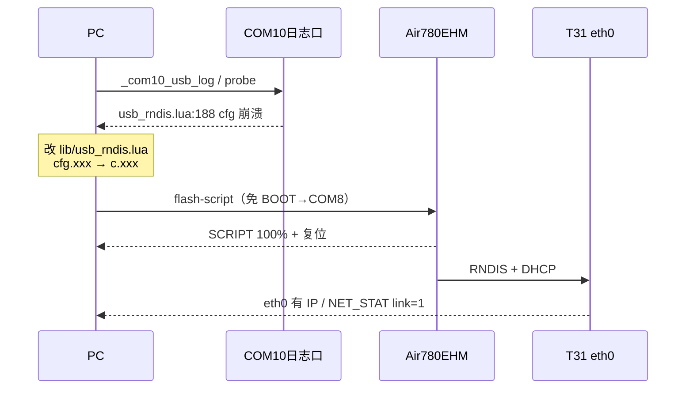

# Cat.1 开机异常：RNDIS `cfg` 崩溃排查与脚本烧录

> 实机（2026-08-25）：T31 侧 `eth0` down / 无 IP；COM10 日志显示 `usb_rndis.open` 启动即崩。  
> 根因：瘦身重构后 `cfg` 为函数，误用 `cfg.xxx` 索引。  
> 修复后用 **`flash-script`** 烧脚本（不是 `mqtt_tools_gui.bat`）。

相关：

- 模块说明：[modules/USB_RNDIS_FLOW.md](modules/USB_RNDIS_FLOW.md)
- T31 eth0 / DHCP 慢：[T31X_ETH0_DHCP_SLOW_BOOT.md](T31X_ETH0_DHCP_SLOW_BOOT.md)
- 烧录 GUI：`tools/cat1_flash_gui.bat` / `tools/gui/02_Cat1烧录.bat`
- MQTT 联调 GUI：`tools/mqtt_tools_gui.bat`（**只测 MQTT，不烧录**）

---

## 0. 续：MQTT `IP_LOSE` 振荡（2026-08-25 闭环）

**现象**：`IP_READY` 后约数十秒 `tcp_err -13` → MQTT 关 socket → `IP_LOSE` → 重连 `connect ret=-1` 循环。

**根因（叠层）**：

1. RNDIS `open()` 的 **flymode** 与 `app.start` 里 MQTT 并行，易撞 IP；
2. T31 `AT+USBRESET` 触发 **flymode rebind**，再次打断蜂窝；
3. MQTT 未绑蜂窝网卡 / 未做 IP_LOSE 冷却。

**修复（脚本 `001.000.048`）**：

| 项 | 改动 |
|----|------|
| `RNDIS_CFG.refresh_on_ip` | 默认 `false`；refresh 后 `waitClllRdy` |
| `usb_rndis.open` | flymode 后等蜂窝 IP，再 `RNDIS_NET_STABLE` |
| `app.bootMqtt` | 等 `waitForNetStable` 后再起 MQTT |
| `net_mqtt` | 优先 `socket.LWIP_GP`；IP_LOSE 停自动重连+冷却；用 `MQTT_CFG.autoreconn_ms` |
| `HOST_USB_CFG` | `usb_reset_soft_rebind=true`（只拨 USB 电源）；`usb_reset_boot_guard_sec=180` |
| 版本上报 | `pubVersion` 字段名与 `cllcVrsn` 对齐（`scrpVrsn`） |

**验收**：烧 `flash-script` → 设备上行 `1003`；下行 `2003`/`2008` 应答；`scriptVersion=001.000.048`。

闭环脚本：`tools/debug/_mqtt_ip_lose_closed_loop.py`

---

## 1. 串口角色（本机常见）

| 串口 | VID:PID | 用途 |
|------|---------|------|
| **COM7** | `0403:6001`（FTDI） | T31 调试口（`root` 空密码） |
| **COM10** | `19D1:0001`（`x.2`） | Cat.1 **USB 日志口**（Luatools「USB 打印」） |
| COM9 / COM11 | `19D1:0001`（`x.4` / `x.6`） | Cat.1 其它复合口 |
| COM8（短暂） | 下载模式 | 免 BOOT / 按 BOOT 后出现的烧录口 |

运行态合宙口一般为 **3～4 个**；BOOT 下载通常只剩 **1 个**。

---

## 2. 现象对照

### 2.1 T31（COM7）

```text
eth0  BROADCAST MULTICAST   # 无 UP、无 inet
operstate=down
RX/TX = 0
/tmp/ipc/app.log:
  [NET_STAT] blink fault link=0 reach=0 ... usb_host=0
  [GB28181] SIP register lost (network/platform unreachable)
```

`lsusb` 仍可能看到 `19d1:0001`，说明 USB 设备枚举了，但 **RNDIS 数据面未起来**。

### 2.2 Cat.1（COM10）

蜂窝侧正常，例如：

```text
I/main LuatOS@Air780EHM ...
I/user.main project=PANSHI_CAT1 version=001.000.002 ...
+CEREG: 1,1
+CSQ: 31
```

但紧接着：

```text
E/user.coroutine.resume usb_rndis.lua:188: attempt to index a function value (upvalue 'cfg')
stack traceback:
        usb_rndis.lua:188: in upvalue 'hookIpRdy'
        usb_rndis.lua:252: in function '...usb_rndis.luac.open'
        main.lua:139: ...
```

同时常见：

```text
I/user.app_main usb_state 0 boot
I/user.battery_guard usb_removed
```

结论：**模组 Lua 起来了、4G 也注册了，RNDIS 在 `open()` 里崩掉 → T31 拿不到网。**

---

## 3. 抓 COM10 日志

日志口优先 **115200**（本机 921600 偶发 `ClearCommError`）；帧为 `0x7E` 封装，用工程解码脚本：

```bat
cd /d D:\项目\linfeng\AIR780EHM\AIR780EHM
python tools\gui\flash\cat1_flash.py list
python tools\gui\flash\cat1_flash.py probe --port COM10
python tools\debug\_com10_usb_log.py 30
```

或看原始探测（不解码）：

```bat
python tools\gui\flash\cat1_flash.py probe --port COM10
```

关键关键字：`usb_rndis`、`coroutine.resume`、`cfg`、`usb_state`、`IP_READY`、`CEREG`。

---

## 4. 根因（代码）

真源：[`lib/usb_rndis.lua`](../lib/usb_rndis.lua)

```lua
local function cfg()
    return _G.RNDIS_CFG or {}
end
```

`cfg` 是函数。取字段必须先：

```lua
local c = cfg()
if c.refresh_on_ip_ready ~= true then
```

瘦身重构后两处误写成 `cfg.xxx`（对函数做索引）：

| 位置 | 错误写法 | 正确写法 |
|------|----------|----------|
| `rfrsAllw()` | `cfg.refresh_on_ip` / `cfg.refresh_only_usb` | `c.refresh_on_ip` / `c.refresh_only_usb` |
| `hookIpRdy()`（约 188 行） | `cfg.refresh_on_ip_ready` | `c.refresh_on_ip_ready` |

`open()` → `hookIpRdy()` 必经，故一开机就崩。

---

## 5. 修复与烧录

### 5.1 改代码

确认 `lib/usb_rndis.lua` 中上述字段均使用局部表 `c`，不是函数 `cfg`。

### 5.2 烧脚本（对齐 Luatools「下载脚本」）

**不要**用 `tools\mqtt_tools_gui.bat`（那是 MQTT 协议客户端）。

命令行（推荐，可免 BOOT）：

```bat
cd /d D:\项目\linfeng\AIR780EHM\AIR780EHM
python tools\gui\flash\cat1_flash.py list
python tools\gui\flash\cat1_flash.py flash-script --wait 90
```

流程要点：

1. 打包当前 `user/` + `lib/` → LuaDB（约 300+ KB）
2. 运行态向 COM10 发免 BOOT：`7E00007E` + `AT+ECRST=delay,799` + `7E00027E`
3. 等待出现下载口（如 COM8）
4. 只烧 **SCRIPT** 分区，底层不变
5. 复位重启

GUI 等价入口：

```bat
tools\cat1_flash_gui.bat
```

或 `tools\gui\02_Cat1烧录.bat`。

若免 BOOT 失败：按住模组 **BOOT** → 复位/上电 → 等到只剩 1 个合宙口 → 再执行 `flash-script`。

### 5.3 实机烧录记录（2026-08-25）

```text
脚本 LuaDB 335.1 KB，35 个文件
soc 模板: ...\PANSHI_CAT1_001.000.002_LuatOS-SoC_V2044_Air780EHM_8.soc
发现下载口 COM8，开始烧录
烧录 SCRIPT ... 100%
烧录完成
```

复位后 COM10：`+CEREG: 1,1`、`CSQ≈28`，**不再出现** `attempt to index a function value (upvalue 'cfg')`。

---

## 6. 烧录后验收

### Cat.1（COM10）

```bat
python tools\debug\_com10_usb_log.py 25
```

期望：

- 有 `I/user.main project=PANSHI_CAT1 ...`
- **无** `usb_rndis.lua:188` / `index a function value`
- 蜂窝 `+CEREG: 1,1`，CSQ 正常

### T31（COM7）

```bat
python tools\debug\_com7_cmd.py "ifconfig eth0" "ping -c 2 192.168.10.1"
```

期望：

- `eth0` `UP` 且有 `inet addr`（常见 `192.168.10.2`）
- `/tmp/ipc` 中 `NET_STAT` 的 `link` / `usb_host` 不再长期为 0

### MQTT 联调（可选）

```bat
tools\mqtt_tools_gui.bat
```

仅用于上下行命令，与本次脚本烧录无关。

---

## 7. 工具对照（避免搞错）

| 工具 | 作用 |
|------|------|
| `tools\cat1_flash_gui.bat` / `02_Cat1烧录.bat` | Cat.1 **烧录 GUI** |
| `python tools\gui\flash\cat1_flash.py flash-script` | 命令行 **只烧脚本** |
| `python tools\gui\flash\cat1_flash.py reboot` | 运行态 `AT+ECRST` 软复位 |
| `tools\mqtt_tools_gui.bat` / `03_MQTT测试.bat` | **MQTT 测试**，不烧录 |
| `tools\debug\_com10_usb_log.py` | 抓并解码 COM10 USB 日志 |
| `tools\debug\_com7_cmd.py` | T31 COM7 执行 shell |

---

## 8. 流程简图


