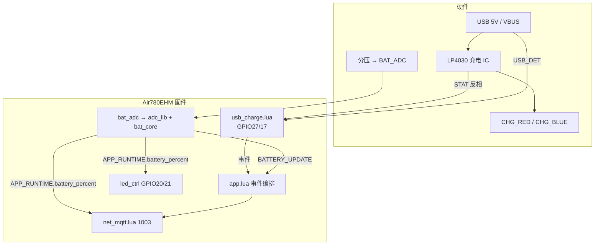
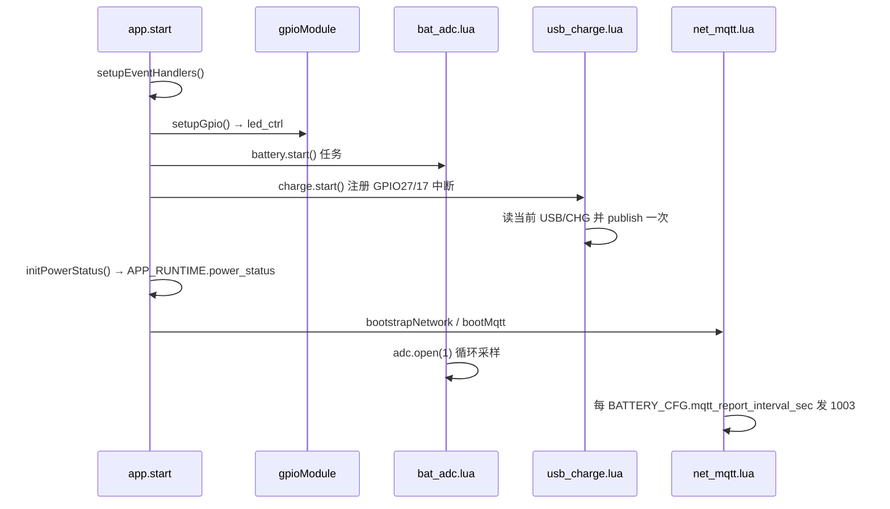
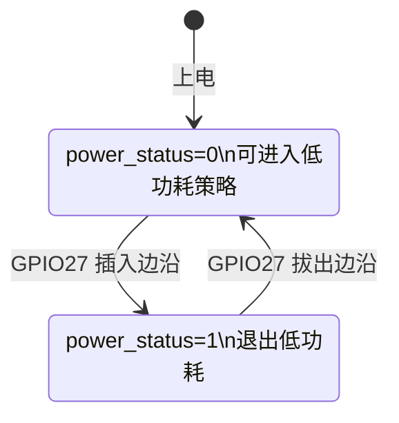
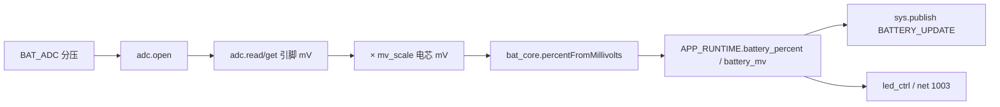

# 充电、指示灯与电池电量（固件流程说明）

> **指示灯专篇**（两套灯规则、场景对照、调试）：[LED_INDICATORS.md](LED_INDICATORS.md)

本文描述 **T3x + Air780EHM** 工程中：USB 插入检测、充电状态、**两套指示灯**、**ADC1/BAT_ADC** 采样电量，以及 **MQTT 1003** 上报的完整流程。硬件引脚详见仓库根目录 [`T3X_CAT1_GPIO.md`](../T3X_CAT1_GPIO.md) §3.1。

---

## 1. 总览：两套灯 + 三条数据路径

| 类别 | 硬件/网络 | 谁控制 | 固件模块 |
|------|-----------|--------|----------|
| **充电板双色灯** | `CHG_RED` / `CHG_BLUE` | LP4030（U17）**硬件自动** | 不控 GPIO，仅读 `CHG_STATE` |
| **模组电量灯** | **GPIO21 蓝（BAT_STAT_LED）** | 固件 `led_ctrl` | 开机/电量/MQTT；**GPIO20 本板未用** |
| **USB 插入** | GPIO27 `USB_DET` | 固件中断 | `lib/usb_charge.lua` |
| **充电中/充满** | GPIO17 `CHG_STATE` | 固件只读+中断 | `lib/usb_charge.lua` |
| **电池电压** | ADC1 `BAT_ADC` | 固件周期采样 | `user/bat_adc.lua`（编排 `adc_lib` + `bat_core`） |
| **云端电量** | MQTT `1003` / `status` | `remainPower` 字段 | `user/net_mqtt.lua` |



---

## 2. 硬件与引脚

### 2.1 引脚对照（`user/config.lua` → `GPIO_IN` / `GPIO_OUT`）

| 配置项 | GPIO | 网络 | 方向 | 作用 |
|--------|------|------|------|------|
| `GPIO_IN.usb_det` | **27** | USB_DET | 输入 | USB 线缆/座插入检测 |
| `GPIO_IN.chg_state` | **17** | CHG_STATE | 输入 | 充电 IC 状态（经 Q16 与 STAT **反相**） |
| `GPIO_OUT.led_red` | **20** | 模组红灯 | 输出 | 低电量指示 |
| `GPIO_OUT.bat_stat_led` | **21** | **BAT_STAT_LED** | 输出 | 中高电量蓝灯，`led_ctrl` 拉低点亮（`on_level=0`，见 `config.lua`） |
| `BATTERY_CFG.adc.channel` | **1** | BAT_ADC（ADC1） | 模拟输入 | 电池电压分压采样 |

### 2.2 充电板指示灯（MCU **不** 驱动）

| 网络 | 驱动源 | 典型含义 |
|------|--------|----------|
| **CHG_RED** | U17 **STAT** + Q18 | **充电进行中**（恒流/恒压阶段，由芯片 STAT 决定） |
| **CHG_BLUE** | Q18 与红灯互补 | **未在充电 / 充满维持**（STAT 为高时） |

固件**不得**对 `CHG_RED`/`CHG_BLUE` 做 `gpio.set`；只需读 **GPIO17**。

### 2.3 CHG_STATE 与 `isCharging()`（`lib/usb_charge.lua`）

`CHG_STATE` 与 LP4030 的 **STAT 反相**（见原理图 Q16）：

| U17 STAT | GPIO17 电平 | `charge.isCharging()` | 充电板灯（硬件） |
|----------|-------------|-------------------------|------------------|
| 低（充电活跃） | 高 | **1**（`chg_active_level = 1`） | 通常 **CHG_RED 亮** |
| 高（充满/空闲） | 低 | **0** | 通常 **CHG_BLUE 亮** |

若现场“灯亮但 `isCharging` 反了”，修改 `lib/usb_charge.lua` 内 `CHARGE_CONFIG.chg_active_level`（`0` 或 `1`），**不要**改 GPIO 输出。

### 2.4 USB_DET 有效电平

| 配置（`usb_charge.lua` 内常量） | 默认值 | 含义 |
|-----------------------------|--------|------|
| `usb_inserted_level` | `0` | 上拉输入时，**插入 USB 多为低电平** |
| `debounce_ms` | `50` | GPIO 双边沿中断防抖 |

---

## 3. 指示灯显示规则（用户可见）

> 完整规则见 **[LED_INDICATORS.md](LED_INDICATORS.md)**（本板 **单蓝灯 GPIO21**）。

充电过程中可能**同时**看到充电板灯与模组灯，含义不同。

### 3.1 充电板灯（硬件，与 ADC 电量无关）

| 用户场景 | 充电板显示 | 依据 |
|----------|------------|------|
| 插入 USB，电池正在充 | **红灯 CHG_RED** | LP4030 STAT → 硬件 |
| 电池充满或芯片报告非充电 | **蓝灯 CHG_BLUE** | 同上 |
| 未插 USB、电池放电 | 由 STAT/电池电压决定，**不由模组 GPIO 控制** | 硬件 |

### 3.2 模组蓝灯（GPIO21）

见 [LED_INDICATORS.md](LED_INDICATORS.md)：**闪2下 / 常亮 / 慢闪 / 快闪**。  
**插 USB 且 `isCharging()` 时**：不因低 ADC 快闪，蓝灯只表示 MQTT 联网（充电进度看 CHG_RED）。

---

## 4. 固件模块与配置

### 4.1 相关文件

| 文件 | 职责 |
|------|------|
| `user/config.lua` | `GPIO_IN`/`GPIO_OUT`、`BATTERY_CFG` |
| `../user/app_config.lua` | `MODULE_FLAGS` |
| `lib/usb_charge.lua` | USB_DET / CHG_STATE 双边沿中断、发布应用事件 |
| `lib/adc_lib.lua` | `adc.setRange` / `adc.open` / 读引脚 mV、`mv_scale`（导出 `_G.adcLib`） |
| `lib/bat_core.lua` | mV→%、耗电率、写入 `APP_RUNTIME.battery_percent` / `APP_RUNTIME.battery_mv` |
| `user/vbat.lua` | 周期 ADC 采样、发布 `BATTERY_UPDATE` |
| `user/battery_guard.lua` | 未插 USB 时按 `BATTERY_CFG.guard` 分级保护 |
| `user/app.lua` | 订阅事件、更新 `APP_RUNTIME.power_status`、触发 MQTT、低功耗与 USB 关系 |
| `user/led_ctrl.lua` | GPIO20/21 电量图案（读 `BATTERY_CFG.led`） |
| `user/net_mqtt.lua` | `publishStatus()` → 上行 **1003** |

### 4.2 模块开关（`app_config.lua` → `MODULE_FLAGS`）

| 标志 | 建议 | 说明 |
|------|------|------|
| `charge = true` | 本板必须 | 使用 GPIO27/17，**不用** `pmd_runtime` |
| `battery = true` | 需要电量/MQTT/模组灯时 | 启动 `vbat.start()` |
| `battery_guard = true` | 电池供电场景建议开 | `BATTERY_CFG.guard`，见 [LOW_BATTERY_AND_LOW_POWER.md](LOW_BATTERY_AND_LOW_POWER.md) |
| `pmd_runtime = false` | 本板 | PMD USB 路径与 `charge` 二选一 |
| `gpio = true` | 需要模组 LED/PIR 时 | 内含 `led_ctrl` |

### 4.3 可调参数（`config.lua` → `BATTERY_CFG`）

完整表见 [CONFIG.md §BATTERY_CFG](CONFIG.md#batterycfg-字段一览)。摘要：

| 字段 | 默认 | 说明 |
|------|------|------|
| `adc.channel` | `1` | LuatOS ADC 通道 1 = **ADC1 / BAT_ADC** |
| `adc.mv_scale` | `4090/1311` | 引脚 mV × scale = 电芯 mV |
| `cell.v_max_mv` / `v_min_mv` | 4200 / 3000 | 满电 / 截止 → 100% / 1% |
| `sample_interval_ms` | `10000` | 采样周期（ms） |
| `mqtt_report_interval_sec` | `60` | MQTT **1003** 周期（秒） |
| `led.*` | 70 / 20 等 | 模组红蓝灯阈值与时序 |
| `guard.*` | 15 / 10 / 5 等 | 未插 USB：停 PIR(≤15%) / 休眠 T3x / 关机 |

---

## 5. 上电启动流程



顺序（`app.lua`）：

1. `setupEventHandlers()` — 订阅 `GPIO_USB_DET_CHANGED`、`GPIO_CHG_STATE_CHANGED`、`BATTERY_UPDATE`
2. `setupGpio()` — 启动 `led_ctrl`（读后续更新的 `APP_RUNTIME.battery_percent`）
3. `startBackgroundServices()` — `bat_adc.start()` + `usb_charge.start()`
4. `initPowerStatus()` — 读 `charge.isUsbInserted()` 设置 `APP_RUNTIME.power_status`
5. MQTT 联网后，`net_mqtt.lua` 定时 `publishStatus()`，并在 USB/充电状态变化时由 `app` 额外触发

---

## 6. USB 插入 / 拔出流程

### 6.1 `usb_charge.lua` 侧

1. GPIO27 **双边沿**中断（50ms 防抖，上拉）
2. `readUsbInserted()`：`gpio.get(27) == usb_inserted_level`
3. 状态变化 → `sys.publish(APP_EVENTS.GPIO_USB_DET_CHANGED, 1|0)`

### 6.2 `app.lua` 侧

| 事件 | 动作 |
|------|------|
| USB **插入** (`inserted=1`) | `applyUsbInsertState(true)` → `APP_RUNTIME.power_status=1`，`onExitLowPower()`，发布 `GPIO_VBUS_CHANGED` |
| USB **插入** 且 MQTT 已连 | 延迟 **2s** 调用 `net.publishStatus()`（便于服务器看到 `powerStatus`） |
| USB **拔出** (`inserted=0`) | `APP_RUNTIME.power_status=0`；若未在低功耗则 `onEnterLowPower()`；必要时 `startMqtt()` |



---

## 7. 充电过程与 CHG_STATE 流程

### 7.1 典型时间线（插 USB 给电池充电）

| 阶段 | USB_DET | CHG_STATE / isCharging | 充电板灯 | 模组灯 |
|------|---------|------------------------|----------|--------|
| 1. 未插 USB | 未插入 | 0 | 硬件自维持 | 按 ADC 电量 |
| 2. 插入 USB | 插入 | 常变为 1 | **CHG_RED** | 仍按 ADC（电量可能仍低→红闪） |
| 3. 恒流/恒压充电 | 插入 | 1 | **CHG_RED** | ADC 百分比逐渐上升→蓝闪/蓝常亮 |
| 4. 充满 | 插入 | 0 | **CHG_BLUE** | ADC 近 100% 时多为蓝常亮 |
| 5. 维持充满 | 插入 | 0 | **CHG_BLUE** | 蓝常亮 |
| 6. 拔 USB | 未插入 | — | 硬件 | 按 ADC |

### 7.2 `usb_charge.lua` 充电状态中断

与 USB 相同模式：GPIO17 双边沿 → `readCharging()` → 变化时发布 `GPIO_CHG_STATE_CHANGED`。

### 7.3 `app.lua` 对充电状态变化的处理

- 打日志：充电中 / 充满或未充
- 若 MQTT 在线：立即 `publishStatus()`（`powerStatus` 仍为 USB 插入状态；`remainPower` 来自最近一次 ADC）

---

## 8. ADC 读取电池电量流程

### 8.1 数据流



### 8.2 分层逻辑

| 层 | 模块 | 循环内职责 |
|----|------|------------|
| 硬件 | `adc_lib` | `setRange` → `open` → `readPinMillivolts` → `pinToCellMillivolts` |
| 算法 | `bat_core` | `percentFromMillivolts`、`updateConsumptionRate`、`exportGlobals` |
| 业务 | `bat_adc` | `sys.taskInit` 周期 `wait(sample_interval_ms)`、发布 `BATTERY_UPDATE` |

`app.lua` 仍 `require "bat_adc"`；`bat_adc` 内部 `require "adc_lib"`、`require "bat_core"`（与 `usb_charge`→`gpio_util` 相同，勿依赖 `_G` 自动加载）。

### 8.3 电量计算公式

```
若 voltage >= v_max_mv  → 100%
若 voltage <= v_min_mv  → 1%
否则 percent = floor((voltage - v_min_mv) / ((v_max_mv - v_min_mv) / 100))
```

现场标定（本板 2026-05-20 实测）：

| 参数 | 值 | 说明 |
|------|-----|------|
| `adc.mv_scale` | `4090/1311` | 万用表 4090mV 时 pin≈1311mV |
| `cell.v_max_mv` | `4200` | 满充 4.2V |
| `cell.v_min_mv` | `3000` | 截止约 3.0V |

复标：`mv_scale = 万用表mV / 日志pin_mV`；插 USB 充电时建议在稳定后读表。

### 8.4 与充电硬件的关系

- **CHG_STATE** 表示充电 IC 是否在“充电过程”中，**不直接参与**百分比计算。
- **百分比** 仅来自 **BAT_ADC** 电压；USB 插入后电压会上升，ADC 反映的是电池端电压（分压后）。

---

## 9. MQTT 上报

### 9.1 上行 1003（`net.publishStatus`）

主题：`/panshi/app/{imei}/status`（以工程 `net_mqtt.lua` 为准）

示例：

```json
{
  "deviceNo": "862323084068124",
  "dataType": "1003",
  "powerStatus": "1",
  "usbInserted": 1,
  "charging": 1,
  "remainPower": "85",
  "batteryMv": "4079",
  "lowPowerMode": "normal",
  "time": "2026-05-19 12:00:00"
}
```

| 字段 | 来源 |
|------|------|
| `powerStatus` | 兼容字段，同 `usbInserted` |
| `usbInserted` | GPIO27 `usb_charge.isUsbInserted()` |
| `charging` | GPIO17 `usb_charge.isCharging()` |
| `remainPower` | `APP_RUNTIME.battery_percent`（ADC 百分比） |
| `batteryMv` | `APP_RUNTIME.battery_mv`（电芯 mV） |
| `lowPowerMode` | `APP_RUNTIME.low_power_mode` → `rest` / `normal` |

### 9.2 上报时机

| 触发 | 间隔/条件 |
|------|-----------|
| MQTT 连接后周期任务 | 每 `BATTERY_CFG.mqtt_report_interval_sec`（默认 **60s**） |
| USB 插入 | 插入后约 **2s**（且 `APP_RUNTIME.online_status==1`） |
| CHG_STATE 变化 | 立即（充电开始/充满边沿） |
| 电量 ADC 更新 | `BATTERY_UPDATE` 触发，间隔 ≥ `mqtt_battery_report_min_sec`（默认 **30s**） |
| 平台主动查询 | 下发 `{"dataType":"2003"}` 立即应答 1003 |

ADC 每 **10s** 更新一次 `APP_RUNTIME.battery_percent`；MQTT 60s 上报的是**最近一次采样值**，二者周期独立。

---

## 10. 应用事件一览

| 事件名（`APP_EVENTS`） | 发布者 | 参数 | 订阅者（主要） |
|------------------------|--------|------|----------------|
| `GPIO_USB_DET_CHANGED` | usb_charge.lua | `1` 插入 / `0` 拔出 | app → `applyUsbInsertState`、MQTT |
| `GPIO_CHG_STATE_CHANGED` | usb_charge.lua | `1` 充电中 / `0` 否 | app 日志、MQTT |
| `GPIO_VBUS_CHANGED` | app | `power_status` | 日志等 |
| `BATTERY_UPDATE` | bat_adc.lua | `percent, mV, rate` | app 日志；led_ctrl 间接读 `APP_RUNTIME.battery_percent` |

---

## 11. 调试建议

| 现象 | 检查项 |
|------|--------|
| 插 USB 无充电板灯 | 5V、U17、电池路径（硬件）；非固件 GPIO 灯 |
| `isCharging` 与灯相反 | `usb_charge.lua` → `chg_active_level` |
| `remainPower` 一直 `--` | `MODULE_FLAGS.battery`、`adc.open` 是否成功、日志 `battery` |
| 充满仍红闪 | 校准 `cell.v_max_mv`/`cell.v_min_mv`；看 `BAT_ADC` mV 日志 |
| MQTT 无 1003 | `MODULE_FLAGS.mqtt`、`APP_RUNTIME.online_status`、网络 |

日志 TAG：`charge`、`battery`、`app`、`net`。

---

## 12. 相关文档

- [`T3X_CAT1_GPIO.md`](../T3X_CAT1_GPIO.md) — 引脚与 LP4030 硬件说明  
- [`MQTT_PROTOCOL.md`](MQTT_PROTOCOL.md) — 1003 等数据类型  
- [`PIR_HARDWARE.md`](PIR_HARDWARE.md) — GPIO30 / PIR_MCU_DET 人体检测  
- [`KEY_GPIO.md`](KEY_GPIO.md) — GPIO 按键（`lib/key` + `keyConfig`）  
- [`CONFIG.md`](CONFIG.md) — 配置分层与引脚总表  
