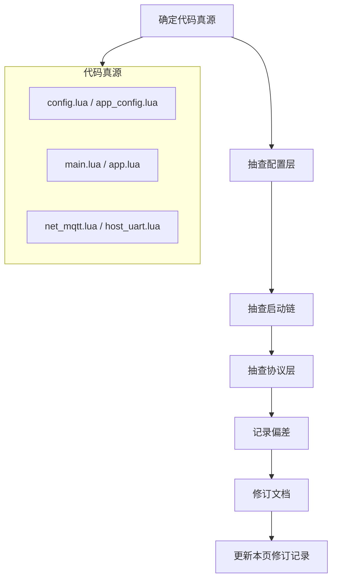

# 代码与文档对照审计（780EHM_PJ）

> **用途**：记录 doc/ 与 `user/*.lua`、`lib/*.lua` 的核验流程、结论与修订清单。  
> **代码真源**：`user/config.lua`、`user/app_config.lua`、`user/main.lua`、`user/app.lua`（启动顺序以 `app.start` 为准）。  
> **最近审计**：2026-06-10

---

## 1. 核验流程（建议每次大改后执行）



### 1.1 配置层

| 核对项 | 代码位置 | 对照文档 |
|--------|----------|----------|
| GPIO 编号 | `GPIO_IN` / `GPIO_OUT` | `CONFIG.md`、`T3X_CAT1_GPIO.md` |
| 电量阈值 | `BATTERY_CFG.guard` | `CONFIG.md`、`LOW_BATTERY_AND_LOW_POWER.md` |
| `mv_scale` | `BATTERY_CFG.adc` | `CONFIG.md`、`CHARGE_BATTERY.md` |
| OTA `product_key` | `main.lua` `PRODUCT_KEY` | `CONFIG.md`、`MQTT_*` |
| `MODULE_FLAGS` | `app_config.lua` | `CONFIG.md`、`CAT1_*` |
| 唤醒通道 | `LOW_POWER_WAKEUP_CFG.mode` | `CAT1_LOWPWR_MQTT_TCP_STRATEGY.md` |

### 1.2 启动链

| 核对项 | 代码位置 | 对照文档 |
|--------|----------|----------|
| `main.lua` 入口 | `require`、RNDIS、cellular、`bootstrapNetwork` | `CALL_GRAPH.md` §1 |
| `app.start()` 逐步顺序 | `app.lua` `start()` 函数体 | `CALL_GRAPH.md` §1.1、`PROJECT_DOC.md` §1.3、`CODE_ANALYSIS.md` §3.2 |
| MQTT 异步 | `bootMqtt` → `mqttTask` → `publishConnectUplink` | `T3X_LOW_POWER.md`、`CALL_GRAPH.md` §1.2 |

### 1.3 协议层

| 核对项 | 代码位置 | 对照文档 |
|--------|----------|----------|
| MQTT dataType | `net_mqtt.lua` `DT` 表 + `handleDownlink*` | `MQTT_PROTOCOL.md`、`CALL_GRAPH.md` §6 |
| T3x 入站 AT | `host_uart.lua` `AT_CMD_TABLE` | `UART_AT_COMMANDS.md` |
| 4G→T3x 主动 AT | `host_uart` 内 `uart_bridge.sendString` | `UART_AT_COMMANDS.md` §编码/IPC |
| 串口底层 | `lib/uart_bridge.lua` 唯一 `uart.setup` | `UART_PROTOCOL.md` |

### 1.4 模块清单

| 目录 | 数量 | 对照文档 |
|------|------|----------|
| `user/*.lua` | 19（含 `bat_adc` 桩） | `PROJECT_DOC.md` §9、`README.md` |
| `lib/*.lua` | 18 | `lib/archive/README.md`、`CALL_GRAPH.md` §8 |

---

## 2. 审计结论摘要（2026-06-10）

| 维度 | 匹配度 | 说明 |
|------|--------|------|
| 配置 / GPIO / 电量 | **高** | `CONFIG.md` 与 `config.lua` 一致 |
| MQTT dataType | **高** | 2001–2007、2010–2012、2020 ↔ 1001–1007、1010–1012、1020 |
| AT（T3x→4G 入站） | **高** | `UART_AT_COMMANDS.md` ↔ `AT_CMD_TABLE` |
| conack / 1003 周期 | **高** | `publishConnectUplink()`；初值 `low_power_interval_sec=30` |
| Cat.1 精简 / TCP | **高** | `LOW_POWER_WAKEUP_CFG.mode`；无 `MODULE_FLAGS.net_tcp` |
| **启动链顺序** | **曾偏低** | 已按 `app.lua` 1106–1157 修订总览文档 |
| 模块职责表述 | **曾中** | `uart_bridge` vs `host_uart` 分工已澄清 |

---

## 3. `app.start()` 真源顺序（维护时请同步三份总览文档）

> 源码：`user/app.lua` 函数 `start()`，约 1106–1157 行。

| # | 条件 | 动作 |
|---|------|------|
| 1 | 始终 | `setupEventHandlers()`（内含 `pir_ctrl.start()`） |
| 2 | `battery_guard` | `battery_guard.start(hooks)` |
| 3 | `watchdog` | `setupWatchdog()` |
| 4 | `uart_bridge` | `setupUartBridge()`：`uart_bridge.start()` + **`host_uart.start()`**（同函数内） |
| 5 | 始终 | 订阅 `HOST_UART_FIRST_AT` → USB 策略同步 |
| 6 | 始终 | **`initPowerStatus()`**（可触发 `onEnterLowPower`，**早于** t3x/GPIO） |
| 7 | 始终 | `scheduleBootUsbPolicySync()` |
| 8 | 始终 | `t3x_ctrl.start()` |
| 9 | `sound_prompt` | `sound_prompt.start()` + `onAppStarted()` |
| 10 | `time_sync` | `time_sync.start()` |
| 11 | `gpio` | `setupGpio()` → `peripheral.start()` |
| 12 | `pmd_runtime` | `setupPmd()` |
| 13 | flags | `startBackgroundServices()`：`vbat` / `usb_charge` / `sntp_sync` / `mobile_info` |
| 14 | `rndis` | `setupRndis()` |
| 15 | `mqtt` | `net_mqtt.bootstrapNetwork()`（**`main.lua` 已调一次，此处幂等再调**） |
| 16 | 始终 | `bootMqtt()` → `startMqtt()` → `net.start()` |
| 17 | `fota` | `setupFota()` |
| 18 | 始终 | `startHeartbeat()`（10s） |

**注意**：

- `sound_prompt` / `time_sync` 在 **t3x 上电之后、GPIO 之前** 启动，不在 `startBackgroundServices()` 内。
- `initPowerStatus` 在 **t3x/GPIO/电量采样之前**，上电无 USB 时可能先进入 rest，MQTT 仍由后续 `bootMqtt` 异步拉起。

### 3.1 `main.lua` 入口（在 `app.start` 之前）

```
require config, app_config, key_config
[MODULE_FLAGS.rndis]     sys.taskInit(usb_rndis.open)
[MODULE_FLAGS.cellular]  cellular_bootstrap.start()
[MODULE_FLAGS.mqtt]      net_mqtt.bootstrapNetwork()   ← 第一次
app.start(peripheral, net_mqtt, t3x_ctrl)
sys.run()
```

---

## 4. 分层职责（易混点）

| 模块 | 职责 | 不做 |
|------|------|------|
| `lib/uart_bridge.lua` | 唯一 `uart.setup`；`sendString`/`write`；`STR:`/`HEX:` 行协议 | 不解析 T3x 业务 AT |
| `user/host_uart.lua` | T3x **入站** AT（`AT_CMD_TABLE`）；**出站** `AT+VENC`/`GB28181`/`IPCPOWEROFF` 等 | 不直接 `uart.setup` |
| `user/net_mqtt.lua` | MQTT 上下行、`publishConnectUplink` | 不操作 UART |
| `user/app.lua` | 编排、`bootMqtt`、低功耗、事件订阅 | 不直接 `uart.setup` |

---

## 5. 修订记录

| 日期 | 动作 |
|------|------|
| 2026-06-10 | 首轮：修订 `CONFIG`/`CALL_GRAPH`/`PROJECT_DOC`/`CODE_ANALYSIS`/`CHARGE_BATTERY`/`README`/Cat.1 文档；归档 T31 桩 |
| 2026-06-10 | 二轮：按 `app.start` 真源修订启动链；澄清 `uart_bridge`/`host_uart`；`T3X_CAT1_GPIO` `led_red`；本页创建 |

---

## 6. 相关文档

| 文档 | 用途 |
|------|------|
| [CALL_GRAPH.md](CALL_GRAPH.md) | require、事件流、启动链速查 |
| [PROJECT_DOC.md](PROJECT_DOC.md) | 模块 API、业务流程 |
| [CODE_ANALYSIS.md](CODE_ANALYSIS.md) | 架构与风险 |
| [CONFIG.md](CONFIG.md) | 配置索引 |
