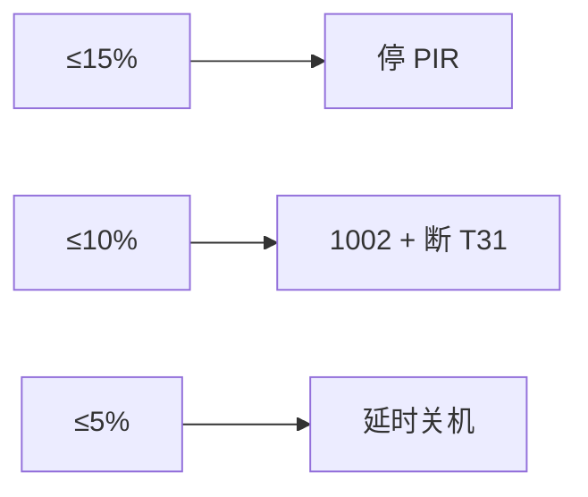

# 配置说明（命名规范与索引）

> **硬件**：[`../user/config.lua`](../user/config.lua)  
> **开关/事件**：[`../user/app_config.lua`](../user/app_config.lua)  
> **按键策略**：[`../user/key_config.lua`](../user/key_config.lua)  
> **PIR 媒体**：[`../user/pir_ctrl.lua`](../user/pir_ctrl.lua)  
> **t3x 协处理器**：[`../user/t3x_ctrl.lua`](../user/t3x_ctrl.lua)  
> **加载**：`main.lua` → `config` → `app_config` → `key_config`

## 命名约定

| 类别 | 规则 | 示例 |
|------|------|------|
| Lua 文件 | `snake_case` | `uart_bridge.lua`（lib）、`host_uart.lua`（T31 串口业务）、`t3x_ctrl.lua`、`pir_ctrl.lua` |
| 配置表 | `*_CFG` | `GPIO_IN`、`MQTT_CFG` |
| 运行时 | `APP_RUNTIME` | `battery_percent`、`online_status` |
| 表内字段 | `snake_case` | `init_level`、`trigger_mode` |

---

## Air780 GPIO 编号对照（`config.lua`）

> **`pin` 列 = Luat GPIO 号**（非模组物理 Pin）。完整表见 [T31_CAT1_GPIO.md §1.1](T31_CAT1_GPIO.md#11-780ehm_pj-固件-gpio-对照configlua-真源)。  
> **易混**：Luat **GPIO26** = 模组 **Pin25** `CAN_TXD`（`T31_BOOT`）；模组 **Pin26** = `PWM4`。

| 方向 | `config` 键 | Luat GPIO | 模组 Pin | 丝印 | 原理图网络 |
|------|-------------|-----------|----------|------|------------|
| IN | `pwr_key` | 46 | 7 | PWRKEY | K1 |
| IN | `boot_key` | 28 | 78 | GPIO28 | 烧录键 |
| IN | `coproc_ready` | 29 | 30 | GPIO29 | 协处理器就绪 |
| IN | `usb_det` | 27 | 16 | GPIO27 | USB_DET |
| IN | `chg_state` | 17 | 100 | GPIO17 | CHG_STATE |
| IN | `pir_det` | 30 | 31 | GPIO30 | PIR_MCU_DET |
| IN | `misc_pullup` | 7 | 7 | — | 预留 |
| OUT | `led_red` | 20 | 102 | GPIO20 | LED_RED |
| OUT | `bat_stat_led` | 21 | 107 | GPIO21 | BAT_STAT_LED |
| OUT | `t3x_pwr_wake` | 22 | 19 | GPIO22 | CPU_PWR_EN |
| OUT | `t3x_boot` | **26** | **25** | **CAN_TXD** | **T31_BOOT** |
| OUT | `t3x_ota` | 32 | 33 | GPIO32 | USB_DEBUG_EN |
| OUT | `t3x_mcu_int` | 29 | 30 | GPIO29 | MCU_INT_CPU |

烧录三根输出：**GPIO26 + GPIO32 + GPIO22** → [T31_BURN_MODE.md](T31_BURN_MODE.md)

---

## GPIO_IN（输入）

每个信号一项，**按注释分组**写在 `config.lua` 中。

| 字段 | 类型 | 说明 |
|------|------|------|
| `pin` | number | **Luat GPIO 号**（见上文对照表；≠ 模组物理 Pin） |
| `net_name` | string | 原理图网络名 |
| `pull` | string | `pullup` / `pulldown` |
| `trigger_mode` | string | `rising` / `falling` / `both` |
| `debounce_ms` | number | 防抖(ms) |
| `active_level` | 0/1 | 有效电平（插入/触发/按下） |

| 键 | Luat GPIO | 默认 `active_level` | 模组 Pin | 说明 |
|----|-----------|---------------------|----------|------|
| `pwr_key` | **46**（`gpio.PWR_KEY`） | **0** | 7 PWRKEY | 按下为低 |
| `boot_key` | 28 | **0** | 78 GPIO28 | 长按烧录 |
| `coproc_ready` | 29 | **1** | 30 GPIO29 | 下拉，就绪为高 |
| `usb_det` | 27 | **0** | 16 GPIO27 | USB 插入为低 |
| `chg_state` | 17 | **1** | 100 GPIO17 | 充电中为高 |
| `pir_det` | 30 | **1** | 31 GPIO30 | PIR 触发为高 |
| `misc_pullup` | 7 | 1 | 7 | 预留 |

初始化由 `lib/gpio_util.lua` → `setup_input_entry()` 完成（非 `init_level` 驱动）。

---

## GPIO_OUT（输出）

| 字段 | 类型 | 说明 |
|------|------|------|
| `pin` | number | **Luat GPIO 号**（见上文对照表；≠ 模组物理 Pin） |
| `net_name` | string | 原理图网络名 |
| `init_level` | 0/1 | **上电** `gpio.setup` 电平（通常 **0**=灭/断电） |
| `on_level` | 0/1 | 逻辑「开」（通常 **1**=亮/供电） |

| 键 | Luat GPIO | `init_level` | `on_level` | 模组 Pin | 模块 |
|----|-----------|--------------|------------|----------|------|
| `led_red` | 20 | **0** | **1** | 102 | `led_ctrl` |
| `bat_stat_led` | 21 | **0** | **1** | 107 | `led_ctrl` |
| `t3x_boot` | **26** | **0** | **1** | **25** `CAN_TXD` | `t3x_ctrl` → `T31_BOOT` |
| `t3x_ota` | 32 | **0** | **1** | 33 | `t3x_ctrl` → `USB_DEBUG_EN` |
| `t3x_pwr_wake` | 22 | **0** | **1** | 19 | `t3x_ctrl` → `CPU_PWR_EN` |
| `t3x_mcu_int` | 29 | 1 | 0 | 30 | `t3x_ctrl` → `MCU_INT_CPU` 脉冲 |

修改 LED/协处理器默认亮灭：**只改 `init_level` / `on_level`**，无需改业务代码。

---

## PIR / 电池 / 连接

- `PIR_CFG`：由 `GPIO_IN.pir_det` 自动带出中断参数 + `PIR_COOLDOWN_MS.frequent`
- `BATTERY_CFG`：ADC 采样、模组灯、电量保护（真源 [`config.lua`](../user/config.lua)）；行为见 [LOW_BATTERY_AND_LOW_POWER.md](LOW_BATTERY_AND_LOW_POWER.md)
- `T3X_BURN_CFG.min_battery_percent`：烧录前最低电量（默认 20%，与 `guard` 无关）
- `MODULE_FLAGS.battery_guard`：[`app_config.lua`](../user/app_config.lua)，`false` 可关闭电量保护

### `BATTERY_CFG` 字段一览

| 分组 | 字段 | 默认 | 说明 |
|------|------|------|------|
| **adc** | `channel` | `1` | BAT_ADC / ADC1 |
| | `mv_scale` | `4090/1311` | 引脚 mV × scale = 电芯 mV |
| | `divider` | 1000K+510K | `mv_scale` 为 nil 时自动计算 |
| **cell** | `v_max_mv` / `v_min_mv` | 4200 / 3000 | 映射 100% / 1% |
| | `sample_interval_ms` | 10000 | `vbat` 采样周期 |
| | `mqtt_report_interval_sec` | 60 | MQTT 1003 `remainPower` 周期 |
| **led** | `high_threshold` | 70 | &gt;70% 蓝常亮 |
| | `medium_threshold` | 20 | 20～70% 蓝闪；≤20% 红闪 |
| | `high_hold` / `medium_*` / `low_*` | 见 config | `led_ctrl` → `lib/led` 时序 |
| **guard** | `enabled` | true | 总开关（另受 `MODULE_FLAGS.battery_guard`） |
| | `ignore_when_usb_inserted` | true | **GPIO27 插入**时忽略阈值并保持 T31 上电 |
| | `pir_suspend_percent` | 15 | 未插 USB 且 ≤15%：暂停 PIR |
| | `pir_resume_percent` | 17 | &gt;17% 恢复 PIR（滞回） |
| | `t31_rest_percent` | 10 | ≤10%：`onEnterLowPower` + MQTT 1002 + 断 T31 |
| | `recover_rest_percent` | 12 | &gt;12% 退出电量休眠 |
| | `shutdown_percent` | 5 | ≤5%：延时关机 |
| | `shutdown_delay_ms` | 3000 | 关机前等待；插 USB 可取消 |
| | `require_valid_sample` | true | 电量 `--` 时不执行 guard |

兼容：`_G.BATTERY_GUARD_CFG` 指向 `BATTERY_CFG.guard`（旧代码/文档可继续用此名）。

### 未插 USB 时的电量动作（摘要）

插 **USB_DET（GPIO27）** 后：不执行上表，并 `wake` T31。

### `SOUND_CFG` 提示音（`config.lua`）

| 字段 | 默认 | 说明 |
|------|------|------|
| `enabled` | true | 总开关（`MODULE_FLAGS.sound_prompt`） |
| `boot_on_cold_start` | true | 上电约 `boot_delay_ms` 后发 `AT+PLAYSOUND=boot` |
| `boot_on_wake` | **false** | 低功耗/PIR 唤醒 **不播** 开机音 |
| `shutdown_on_user_off` | true | PWRKEY / MQTT / AT 关机前播 `shutdown` |
| `shutdown_on_low_power` | false | 业务休眠前不播 |
| `shutdown_on_battery_off` | false | 5% 自动关机不播 |
| `boot_delay_ms` | 6000 | 等 T31 就绪 |
| `play_timeout_ms` | 2500 | 等 `+SOUNDACK` 超时 |

实现：`user/sound_prompt.lua`（4G）、`t31_linux/audio_prompt.c`（T31 桩）。见 [BOOT_SHUTDOWN_SOUND.md](BOOT_SHUTDOWN_SOUND.md)。

### `TIME_SYNC_CFG` 时间同步（`config.lua`）

| 字段 | 默认 | 说明 |
|------|------|------|
| `enabled` | true | 总开关（`MODULE_FLAGS.time_sync`） |
| `min_valid_unix` | 1704067200 | 低于此视为未同步（防 1970） |
| `sync_on_sntp` | true | SNTP 成功后 `AT+TIMESET` |
| `sync_before_wake` | true | GPIO 唤醒前先设时 |
| `host_boot_wait_ms` | 1500 | T31 上电后等 UART 就绪 |

见 [TIME_SYNC.md](TIME_SYNC.md)。

- `UART_CFG`（`lib/uart_bridge` 唯一数据源）：

| 字段 | 默认值 | 说明 |
|------|--------|------|
| `id` | `1` | UART 口（接 T31） |
| `baud` | `115200` | 波特率，8N1 |
| `line_protocol` | `true` | 按 `\r\n` 拆行 |
| `rx_line_max` | `4096` | 行缓冲上限 |

- `MQTT_CFG` / `WDT_CFG` / `FOTA_CFG`：见 `config.lua` 文末

---

## 相关文档

[README.md](README.md) · [KEY_GPIO.md](KEY_GPIO.md) · [CHARGE_BATTERY.md](CHARGE_BATTERY.md) · [LOW_BATTERY_AND_LOW_POWER.md](LOW_BATTERY_AND_LOW_POWER.md) · [T31_CAT1_GPIO.md](T31_CAT1_GPIO.md)
