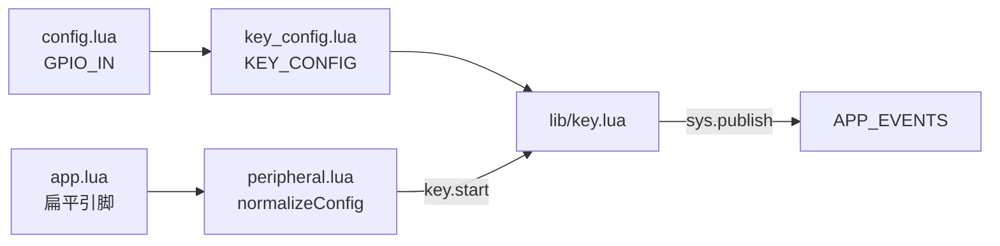

# GPIO 按键与就绪信号（lib/key）

> 引脚：`user/config.lua` → `GPIO_IN`  
> 按键策略：`../user/key_config.lua` → `KEY_CONFIG`  
> 实现：`lib/key.lua` · 聚合启动：`user/peripheral.lua`

---

## 1. 调用关系



| 层级 | 文件 | 作用 |
|------|------|------|
| 引脚 | `config.lua` | `GPIO_IN.pwr_key` / `boot_key` / `coproc_ready` |
| 策略 | `key_config.lua` | `KEY_CONFIG`（防抖、长短按、`APP_EVENTS` 键名） |
| 聚合 | `peripheral.lua` | `require "key"`，`key.start(sub.key)` |
| 驱动 | `lib/key.lua` | `gpio_util` 中断、长短按判定、就绪边沿 |
| 业务 | `app.lua` | 订阅 `GPIO_PWRKEY_*`、`GPIO_BOOTKEY_*`、`GPIO_COPROC_READY` |

**已移除**：`user/powerKey.lua`、`user/t3xKey.lua`（逻辑并入 `lib/key.lua`）。

---

## 2. KEY_CONFIG 结构（`key_config.lua`）

```lua
-- 引脚来自 GPIO_IN；事件键名对应 appConfig.APP_EVENTS
_G.KEY_CONFIG = {
    pwrkey = {
        pin = GPIO_IN.pwr_key.pin,    -- 35
        triggerMode = "both",
        pull = "pullup",
        debounce = 50,
        longPressMs = 3000,
        events = { short = "GPIO_PWRKEY_SHORT", long = "GPIO_PWRKEY_LONG" },
    },
    bootkey = {
        pin = GPIO_IN.boot_key.pin,   -- 28
        longPressMs = 2000,
        events = { short = "GPIO_BOOTKEY_SHORT", long = "GPIO_BOOTKEY_LONG" },
        -- triggerMode / pull / debounce 同 pwrkey 可配
    },
    ready = {
        pin = GPIO_IN.coproc_ready.pin, -- 29
        triggerMode = "rising",
        pull = "pulldown",
        activeLevel = 1,
        event = "GPIO_COPROC_READY",
    },
}
```

| 段 | 类型 | 说明 |
|----|------|------|
| `pwrkey` / `bootkey` | 长短按 | 按下低电平（`pressLevel=0`），释放判短按；超时判长按 |
| `ready` | 电平边沿 | 达到 `activeLevel` 发布 `event`，可选 `onReady` 回调 |

---

## 3. peripheral 扁平参数

`app.setupGpio()` 示例：

```lua
gpioModule.start({
    pwrkeyPin = GPIO_IN.pwr_key.pin,
    bootkeyPin = GPIO_IN.boot_key.pin,
    readyPin = GPIO_IN.coproc_ready.pin,
})
```

| 扁平字段 | 写入 `KEY_CONFIG` 段 |
|----------|----------------------|
| `pwrkeyPin` / `onPwrkeyShort` / `onPwrkeyLong` | `pwrkey` |
| `bootkeyPin` / `onBootkeyShort` / `onBootkeyLong` | `bootkey` |
| `readyPin` / `onReady` | `ready` |

未传扁平字段时，`key.start({})` 仍使用 `key_config.lua` 中的 `KEY_CONFIG`。

---

## 4. 应用事件

| 配置 `events` / `event` | `APP_EVENTS` 键 | 典型订阅方 |
|-------------------------|-----------------|------------|
| pwrkey short/long | `GPIO_PWRKEY_SHORT` / `GPIO_PWRKEY_LONG` | `app` → 关机/日志 |
| bootkey short/long | `GPIO_BOOTKEY_SHORT` / `GPIO_BOOTKEY_LONG` | 短按日志；**长按** → [`T31_BURN_MODE.md`](T31_BURN_MODE.md)（电量≥50%、关停 MQTT/PIR/UART 后 `t3x_ctrl.enterBootMode`） |
| ready | `GPIO_COPROC_READY` | `app` → `t3x_ctrl.exitBootMode()` |

---

## 5. 与 pins_air780ehm.json

| 功能 | 固件 GPIO | 备注 |
|------|-----------|------|
| 电源键 | **35**（`GPIO_IN.pwr_key`） | JSON Pin7 为模组 **PWR_KEY** 硬件脚，若不一致请改 `config.lua` |
| BOOT 键 | **28** | |
| 协处理器就绪 | **29** | |

---

## 6. 相关文档

- [PROJECT_DOC.md](./PROJECT_DOC.md) — 启动顺序、GPIO 表  
- [CALL_GRAPH.md](./CALL_GRAPH.md) — require 与事件速查  
- [CHARGE_BATTERY.md](./CHARGE_BATTERY.md) — USB/充电（`lib/usb_charge.lua`）  
