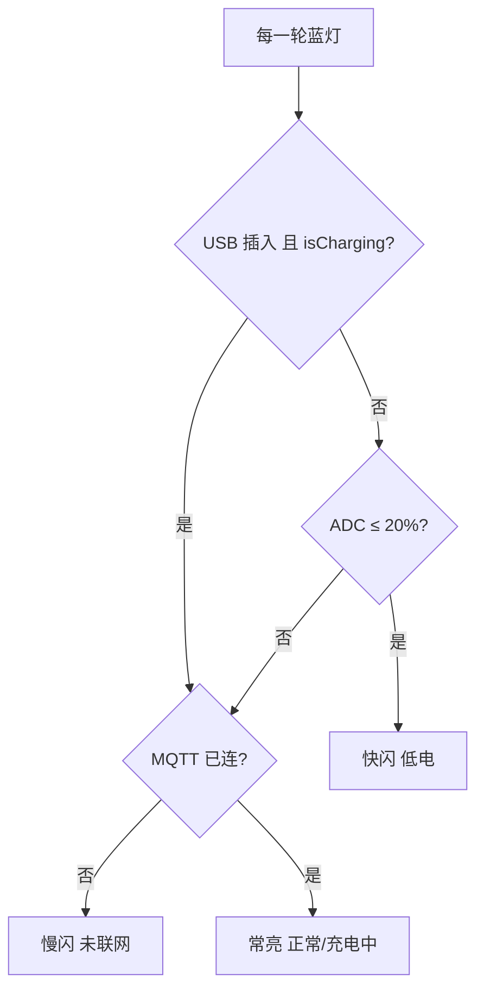

# 指示灯说明（CAT1 蓝灯 GPIO21）

> 本板 **只有一盏蓝灯**（GPIO21 / LED2）。  
> 充电板红/蓝（CHG_RED/BLUE）表示是否在充电，见 [CHARGE_BATTERY.md](CHARGE_BATTERY.md) §3.1。

---

## 用户识别卡（GPIO21 蓝灯）

| 你看到 | 含义 | 怎么办 |
|--------|------|--------|
| **闪 2 下**（上电不久） | 设备已开机 | 无需处理 |
| **一直亮** | 正常（已联网；或 **正在充电** 且已联网） | 可正常使用 |
| **慢闪**（约 1 秒一亮一灭） | **未连上云端**（充电中低电时也用这个，不报快闪） | 查 SIM/信号/MQTT |
| **快闪**（约 0.4 秒） | **电量低**（≤20%）且 **未在充电** | 充电或换电池 |

```text
未插 USB / 未在充电：低电快闪 > 未联网慢闪 > 常亮
插 USB 且正在充电：   跳过低电快闪 → 只判 未联网慢闪 / 常亮
```

---

## 插 USB 充电 vs 蓝灯（为何不冲突）

两套灯、两条逻辑：

| | GPIO21 蓝灯 | CHG_RED / CHG_BLUE |
|--|-------------|-------------------|
| 表示 | 电量 + **4G 联网**（充电中有特殊规则） | **是否在充电** |
| 读 USB 吗 | 是（与 `isCharging()` 配合） | 硬件 STAT |

### 充电中不报低电快闪

**问题**：电池很低时插上 USB，ADC 仍可能是 12%，以前蓝灯会 **快闪**，但充电板已亮 **红**，用户会困惑。

**现规则**（`LED_CFG.suppress_low_when_charging = true`）：

| 条件 | GPIO21 蓝灯 |
|------|-------------|
| **GPIO27 插入** 且 **`isCharging()==1`**（CHG_STATE 充电中） | **不** 因 ADC≤20% 快闪 |
| 同上 + MQTT 未连 | **慢闪**（只表示联网） |
| 同上 + MQTT 已连 | **常亮** |
| 插 USB 但 **已充满**（`isCharging()==0`） | 仍按 ADC：低电仍可快闪 |
| **未插 USB** + 低电 | **快闪**（不变） |

充电进度看 **充电板红灯**；蓝灯在充电过程中只帮你看 **云端连没连上**。



---

## 和 `battery_guard` 的区别

| | 蓝灯 | battery_guard |
|--|------|---------------|
| 插 USB 低电 | 充电中 **不报快闪** | **暂停** 关机/断 T3x |
| 数据来源 | ADC + MQTT + USB/CHG | ADC + USB |

保护策略与灯态 **可以不一致**（保护更严、灯更友好）。

---

## 要不要 T3x 告诉 CAT1 网络状态？

**不要。** MQTT 在 CAT1，`online_status` 由 `net_mqtt` 更新。

可选：`LED_CFG.notify_t3x_net_led` 让 CAT1 → T3x 同步 NET_STAT_LED（PB17），与 GPIO21 无关。

---

## 配置

`user/config.lua` → `LED_CFG`：

| 字段 | 默认 | 说明 |
|------|------|------|
| `suppress_low_when_charging` | **true** | USB+充电中跳过低电快闪 |
| `low_percent` | 20 | 未充电时 ≤20% 快闪 |
| `offline_blink_ms` | 1000 | 慢闪周期 |
| `check_network` | true | 是否判 MQTT 离线 |

---

## 代码与日志

| 文件 | 作用 |
|------|------|
| `user/led_ctrl.lua` | `readChargeFlags()`、`runtimeSnapshot()` |
| `lib/led.lua` | `runSimpleBlueCycle` 充电分支 |
| `lib/usb_charge.lua` | `isUsbInserted()` / `isCharging()` |

日志示例：

```text
led_ctrl 蓝灯 充电中-慢闪(联网) bat=12 online=0 usb=true chg=true
led_ctrl 蓝灯 充电中-常亮 bat=15 online=1 usb=true chg=true
led_ctrl 蓝灯 低电-快闪 bat=12 online=1 usb=false chg=false
```

---

## 变更

| 版本 | 说明 |
|------|------|
| 充电友好 | USB+`isCharging` 时跳过低电快闪，蓝灯只表示联网 |
| 简化版 | 常亮 / 慢闪 / 快闪 + 开机 2 闪 |
