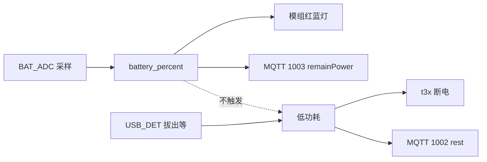
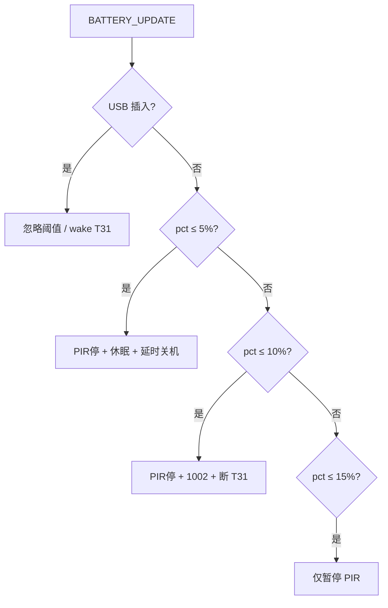

# 4G CAT1 低电量与低功耗行为说明

> 版本：`v1_20260528`  
> 代码真源：[`user/vbat.lua`](../user/vbat.lua)、[`user/app.lua`](../user/app.lua)、[`user/led_ctrl.lua`](../user/led_ctrl.lua)、[`user/net_mqtt.lua`](../user/net_mqtt.lua)、[`user/config.lua`](../user/config.lua)  
> 相关：[CHARGE_BATTERY.md](CHARGE_BATTERY.md)（充电/ADC/MQTT 1003 流程）、[T31_BURN_MODE.md](T31_BURN_MODE.md)（烧录电量门槛）

---

## 1. 两个概念（勿混淆）

| 概念 | 判定依据 | 典型标志 |
|------|----------|----------|
| **低电量** | ADC 采样 → `APP_RUNTIME.battery_percent` / `battery_mv` | 模组 **GPIO20 红灯闪**（&lt;20%） |
| **低功耗模式** | `APP_RUNTIME.low_power_mode == 1` | 日志 `进入低功耗`、MQTT `lowPowerMode: "rest"` |

**重要**：未插 USB 时，**`battery_guard`** 会按电量自动暂停 PIR、休眠 T31、极低电量关机（见 §8）。**插入 USB** 时忽略上述阈值并保持 T31 上电。另有 **USB 拔出 / 云端 / AT** 触发的低功耗（见 §4）。

---

## 2. 低电量：固件会做什么

### 2.1 采样与全局变量

| 模块 | 周期 | 动作 |
|------|------|------|
| `user/vbat.lua` | `BATTERY_CFG.sample_interval_ms`（默认 **10s**） | ADC1 读分压 → 电芯 mV → 百分比 |
| 写入 | — | `APP_RUNTIME.battery_percent`、`battery_mv`、`battery_consumption_rate` |
| 事件 | 每次有效采样 | `sys.publish("BATTERY_UPDATE", pct, mv, rate)` |

电量换算（[`config.lua`](../user/config.lua) → `BATTERY_CFG.cell`）：

| 电芯电压 | 百分比 |
|----------|--------|
| ≥ `v_max_mv`（默认 4200） | 100% |
| ≤ `v_min_mv`（默认 3000） | **1%**（不会为 0%） |
| 中间 | 线性插值取整 |

### 2.2 模组指示灯（GPIO20 红 / GPIO21 蓝）

由 `led_ctrl` + `lib/led.runBatteryPattern` 循环显示（与充电板 CHG_RED/CHG_BLUE **无关**）：

| 电量 | 模组灯 |
|------|--------|
| **&gt; 70%** | 蓝灯常亮（约 10s） |
| **20% ～ 70%** | 蓝灯闪烁 |
| **&lt; 20%** | **红灯闪烁**（默认 20 组） |
| 未知 `--` | 红蓝灭 |

阈值在 `user/led_ctrl.lua` → `LED_CONFIG.battery`（`high_threshold=70`、`medium_threshold=20`）。

`app.lua` 订阅 `BATTERY_UPDATE` 时 **仅打日志**，不因低电量改业务状态。

### 2.3 MQTT 与串口

| 通道 | 行为 |
|------|------|
| **MQTT 1003** | 约每 `mqtt_report_interval_sec`（默认 **60s**）上报 `remainPower` = 当前电量；`lowPowerMode` 为 `rest`/`normal`（表示低功耗标志，**不是**“低电量”） |
| USB/充电变化 | `app` 可触发额外 `publishStatus()` |
| **AT+GETCFG?** | 返回 `battery`、`vbat` |
| 心跳 | `[ALIVE #n]` 日志含 `bat=xx%` |

低电量 **不会** 自动发 MQTT **1002 休眠**。

### 2.4 唯一与电量相关的业务限制：T31 烧录

GPIO28 **BOOT 长按** 进入烧录前检查（[`T3X_BURN_CFG`](../user/config.lua)）：

| 配置项 | 默认 | 说明 |
|--------|------|------|
| `min_battery_percent` | **20** | 低于则拒绝烧录 |
| `require_battery_valid` | **true** | 采样未就绪（`--`）也拒绝 |

不满足：日志 `t3x 烧录条件不满足`，**红灯闪**，不关机。详见 [T31_BURN_MODE.md](T31_BURN_MODE.md)。

### 2.5 低电量时自动执行（`battery_guard`，未插 USB）

| 动作 | 条件 |
|------|------|
| 暂停 PIR | ≤ 15% |
| `onEnterLowPower()` + 1002 + 断 T31 | ≤ 10% |
| `pm.shutdown()` | ≤ 5%（延时 3s，插入 USB 可取消） |

**插 USB 时**：不执行上表，并 `wake` T31。  
其他关机仍可由 **PWRKEY 长按**、MQTT/AT `2004`、`AT+POWEROFF` 触发。

---

## 3. 充电与 USB 对电量的影响

- **CHG_STATE（GPIO17）**：表示充电 IC 是否在充电，**不参与**百分比计算。
- **USB_DET（GPIO27）**：外壳 USB 座插入检测，影响 `power_status` 与低功耗（§4），不直接改 ADC 算法。
- 插 USB 充电时电芯电压上升，ADC 百分比会随采样逐渐升高；模组灯可能从红闪变为蓝闪/蓝常亮。

硬件与引脚详见 [CHARGE_BATTERY.md](CHARGE_BATTERY.md)。

---

## 4. 低功耗模式：触发与动作

### 4.1 触发来源（与电量无关）

| 来源 | 条件/说明 |
|------|-----------|
| **USB 拔出** | `GPIO_USB_DET_CHANGED` → `applyUsbInsertState(false)` → `onEnterLowPower()` |
| **MQTT 2002** | `lowPowerMode: "enter"` → `POWER_ENTER_REST` |
| **AT+LOWPOWER=ENTER** | 且 `power_status==0`、当前未在低功耗 |
| **上电 init** | 仅当未启用 `charge` 且无 USB 时的旧路径 |

**例外（v1_20260528）**：若 **RNDIS 已开启**（`usb_rndis.isEnabled()`），GPIO27 显示“未插入”时 **不** 因 USB 拔出进入低功耗（PC 调试线场景 GPIO27 可能仍为 0）。

### 4.2 进入低功耗时 `app.onEnterLowPower()`

| 序号 | 动作 |
|------|------|
| 1 | `APP_RUNTIME.low_power_mode = 1` |
| 2 | `t3x_ctrl.enterSleep({ modemHibernate = false })` → **T31 断电（GPIO22）**，**4G 保持蜂窝/MQTT** |
| 3 | `net_mqtt.publishRest()` → 上行 **1002** |
| 4 | 若已配置 `net_tcp` → 关闭 TCP 通道 |

默认 **不** 调用 `pm.hibernate()`（整模组休眠会断 MQTT）。

### 4.3 退出低功耗

| 来源 | 动作 |
|------|------|
| USB 插入 | `onExitLowPower()` → `t3x_ctrl.wake()` 上电 T31 |
| MQTT 2002 exit | `POWER_EXIT_REST` |
| AT+LOWPOWER=EXIT | 同上 |

---

## 5. 关机与重启（需显式触发）

| 触发 | 结果 |
|------|------|
| **PWRKEY 长按** | `pm.shutdown()`（USB 刚插入 5s 内忽略，防误触） |
| MQTT **2004** `off` / `shutdown` | `DEVICE_POWER_OFF_REQUEST` |
| MQTT **2004** `reboot` | 约 500ms 后 `pm.reboot()` |
| **AT+POWEROFF** / **AT+REBOOT** | 经 `host_uart` 回调 |

均 **不是** 低电量自动触发。

---

## 6. 配置速查

| 文件 | 关键项 |
|------|--------|
| `user/config.lua` | `BATTERY_CFG.adc/cell`、`BATTERY_CFG.led`、`BATTERY_CFG.guard`、`T3X_BURN_CFG.min_battery_percent` |
| `user/app_config.lua` | `MODULE_FLAGS.battery`、`battery_guard`、`charge`、`rndis` |
| `user/led_ctrl.lua` | 从 `BATTERY_CFG.led` 加载灯效（勿在模块内改阈值） |

---

## 7. 现场排查

| 现象 | 可能原因 |
|------|----------|
| 红灯闪、日志电量 15% | 正常 **低电量指示**，非低功耗 |
| 日志 `进入低功耗`、T31 断电 | **低功耗**（查 USB_DET / 云端 2002 / AT） |
| 云端 `remainPower` 低但设备仍联网 | 设计如此：低电量仍常电 MQTT |
| 无法进 T31 烧录 | 电量 &lt; 20% 或采样未就绪 |
| PC RNDIS 调试时误休眠 | 确认 `rndis=true` 且 RNDIS 已 open；或 GPIO27 误报拔出 |

---

## 8. 电量保护策略（`user/battery_guard.lua`）

**仅当外壳 USB 未插入**（`GPIO27` / `APP_RUNTIME.power_status == 0`）时生效；**USB 插入则忽略电量**，并 **保持 T31 上电**。

| 电量（未插 USB） | 动作 |
|------------------|------|
| **≤ 15%** | `pir_ctrl.suspend()` 暂停 PIR |
| **≤ 10%** | `onEnterLowPower()` → MQTT **1002** + **T31 断电** |
| **≤ 5%** | 约 **3s** 后 `pm.shutdown()` 关机 |
| **&gt; 12%**（曾电量休眠） | 退出电量休眠、恢复 T31 |
| **&gt; 17%**（曾暂停 PIR） | `pir_ctrl.resume()` |

配置：[`user/config.lua`](../user/config.lua) → `_G.BATTERY_CFG.guard`（电量保护）、`_G.BATTERY_CFG.led`（红蓝灯阈值）  
兼容别名：`_G.BATTERY_GUARD_CFG`（指向 `BATTERY_CFG.guard`）  
开关：[`user/app_config.lua`](../user/app_config.lua) → `MODULE_FLAGS.battery_guard`

**说明**：

- USB **拔出** 仍会走原有 `applyUsbInsertState`（高电量时也会 `onEnterLowPower` 仅断 T31，4G/MQTT 常电）。
- **RNDIS 调试** 且 GPIO27 仍为未插入时，电量保护 **仍会执行**（与 RNDIS 跳过 USB 拔出低功耗不同）。
- T31 **烧录模式** 期间不执行电量保护。
