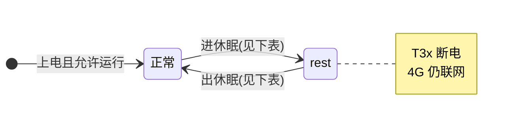
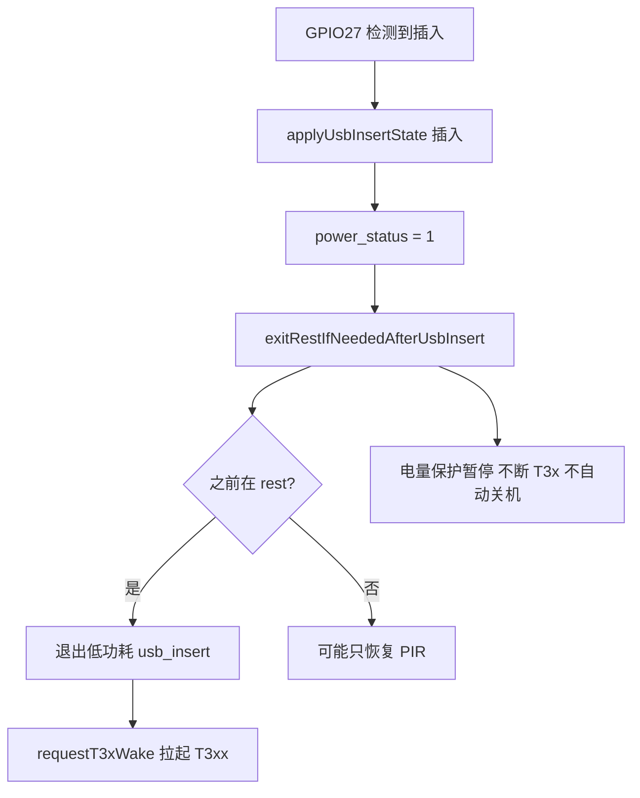
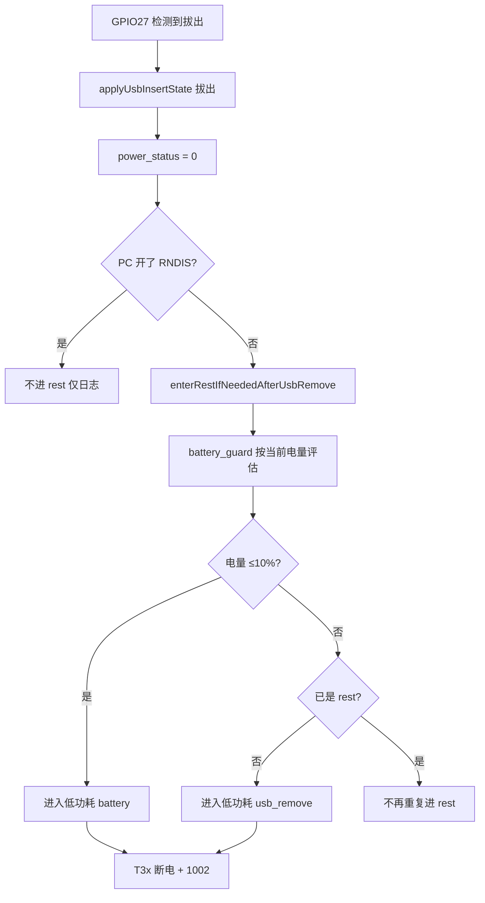
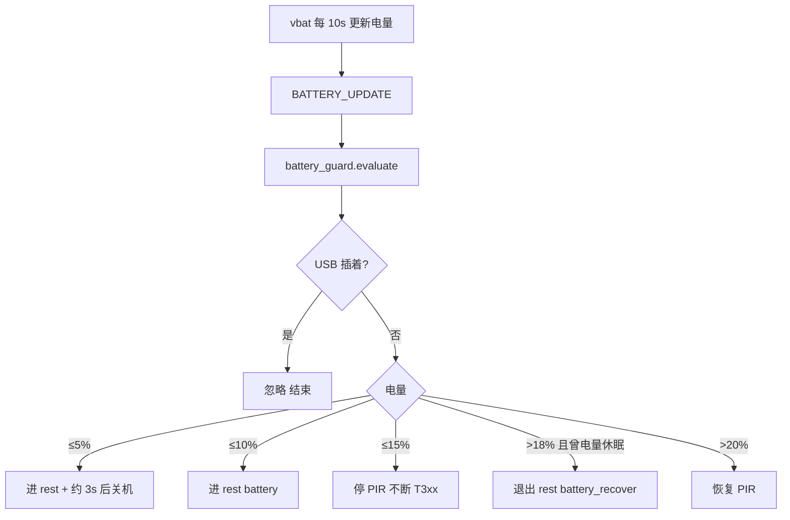
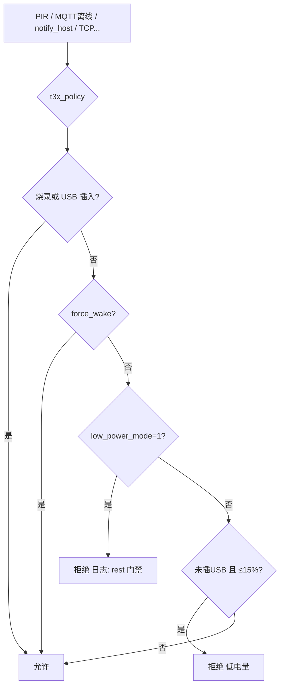

# 低电量、USB、低功耗与 T3x 供电

> 代码：`app`（rest 状态）· `battery_guard`（电量）· `t3x_policy`（T3x 门禁）· `t3x_ctrl`（GPIO22）  
> 详表与配置见文末 **附录** · 架构：[POWER_USB_BATTERY_T3X_LOGIC.md](POWER_USB_BATTERY_T3X_LOGIC.md)  
> **启停循环专题**：[T3X_BATTERY_USB_T3X_OSCILLATION.md](T3X_BATTERY_USB_T3X_OSCILLATION.md)（USB+充电抬升+T3x 耗电是否循环）  
> **PDF**：同目录 [LOW_BATTERY_AND_LOW_POWER.pdf](LOW_BATTERY_AND_LOW_POWER.pdf)（`python scripts/md_to_pdf.py doc/LOW_BATTERY_AND_LOW_POWER.md` 可重新生成）

---

## 一分钟看懂

设备平时只有两种「工作姿态」：

| 姿态 | `low_power_mode` | MQTT 1003 | T3x（GPIO22） | 4G |
|------|------------------|-----------|---------------|-----|
| **正常** | `normal` (0) | 可录像/PIR | **上电/可唤醒** | 联网 |
| **休眠 rest** | `rest` (1) | 上报 1002 | **断电** | **仍联网** |

记住三句话：

1. **插 USB（GPIO27）** → 当作「有外部电」，低电量保护暂停，尽量让 T3x 保持/恢复运行。  
2. **拔 USB** → 先按电量算账，再按规则进 rest（RNDIS 调试除外）。  
3. **已在 rest 时** → 不要随便唤醒 T3x；要醒须「退出 rest」或 `force_wake`（插 USB、云端 2002 退出等）。

---

## 总览：状态怎么来回跳



### 什么情况下进入 rest？

| 谁触发 | 典型原因（日志 `进入低功耗`） | 常见吗 |
|--------|------------------------------|--------|
| 拔 USB 座 | `usb_remove` | ★★★ |
| 电量 ≤10%（未插 USB） | `battery` | ★★★ |
| 云端 MQTT 2002 | `mqtt_2002` | ★★ |
| AT+LOWPOWER=ENTER | `at` | ★ |
| 启动无 USB（旧配置） | `boot_no_usb` | 少见 |

### 什么情况下退出 rest？

| 谁触发 | 日志 `退出低功耗` |
|--------|------------------|
| 插 USB 座 | `usb_insert` |
| 电量恢复到 >18%（曾电量休眠） | `battery_recover` |
| 云端 2002 退出 | `mqtt_2002` |
| AT+LOWPOWER=EXIT | `at` |

进入、退出 rest 的**具体动作永远相同**（只是 `reason` 不同）：

```text
【进 rest】onEnterLowPower(reason)
    → low_power_mode = 1
    → T3x enterSleep（断 GPIO22）
    → MQTT 发 1002

【出 rest】onExitLowPower(reason)
    → low_power_mode = 0
    → requestT3xWake(force_wake) 拉起 T3x
```

---

## 场景流程（按日常使用顺序看）

### 场景 A：用户把设备插上 USB 座



**你可以理解成**：插电 = 充电 + 允许 T3x 干活，即使 `remainPower` 还很低。

---

### 场景 B：用户从座上拿走设备（拔 USB）



**两条线（最容易混）**：

1. **电量线**：≤10% → `battery` 进 rest。  
2. **拔座线**：电量还高也会 `usb_remove` 进 rest（产品规则：离座就休眠）。

---

### 场景 C：不插 USB，电量慢慢掉（仅电池）



与场景 B 的区别：**没有拔座事件**，纯靠百分比阶梯。

---

### 场景 D：已在 rest，又来了「唤醒」请求



**典型现象**：`remainPower=12`、`lowPowerMode=rest` 时 MQTT 离线 **不会** 再把 T3x 拉起来（v1.2 已修）。

---

### 场景 E：冷启动上电

```text
1. initPowerStatus()     → 读 GPIO27，写入 power_status
2. t3x_ctrl.start()      → t3x_policy.bootPowerOn()
       插 USB              → T3x 上电
       未插 USB 且电量>15% → T3x 上电
       未插 USB 且低电/rest → 跳过 T3x 上电（等充电或插座）
3. battery_guard 延迟评估一次电量
```

---

## 一张表：能不能动 T3xx？

| 条件 | T3x 上电/唤醒 |
|------|----------------|
| T3x 烧录中 | ✅ |
| **USB 座插入** | ✅（低电也尽量保持） |
| 未插 USB，电量 **≤15%** | ❌（policy） |
| **`lowPowerMode=rest`** | ❌ 除非 `force_wake` |
| 正常 + 电量够 + 非 rest | ✅ PIR/业务等 |
| rest 下 **MQTT 离线** | ❌ 不硬唤醒 |

优先级口诀：`烧录 > USB > 电量(未插USB) > rest门禁 > 平常唤醒`

---

## 和 MQTT 1003 的对应关系

| 字段 | 表示什么 | 注意 |
|------|----------|------|
| `remainPower` | 电池 ADC% | 与 USB **无关**；插电后仍可能很低 |
| `usbInserted` | USB 座是否插入 | 1=插入 |
| `lowPowerMode` | 业务休眠 rest/normal | **不是**「低电量」本身 |

---

## 日志怎么对流程

| 看到这条日志 | 说明 |
|--------------|------|
| `USB拔出` → `进入低功耗 usb_remove` | 场景 B 拔座线 |
| `进入低功耗 battery` | 场景 C ≤10% |
| `退出低功耗 usb_insert` | 场景 A |
| `t3x_policy 跳过唤醒` + `low_power_mode=rest` | 场景 D，正常 |
| `MQTT离线 跳过硬唤醒` | rest 下不拉 T3x |
| `启动跳过 T3x 上电` | 场景 E 低电未插 USB |

---

## 附录 A：三层代码模型（查代码用）

```text
① 状态  APP_RUNTIME（电量 / USB / rest）
② 策略  app + battery_guard（要不要进 rest）
③ 执行  t3x_policy + t3x_ctrl（能不能动 T3x）
```

USB 函数：`applyUsbInsertState` → 拔出 `enterRestIfNeededAfterUsbRemove` / 插入 `exitRestIfNeededAfterUsbInsert`。

---

## 附录 B：事件 → 代码路径

| 事件 | 代码入口 | reason |
|------|----------|--------|
| GPIO27 拔出 | `enterRestIfNeededAfterUsbRemove` | `battery` 或 `usb_remove` |
| GPIO27 插入 | `exitRestIfNeededAfterUsbInsert` | `usb_insert` |
| 电量 ≤10% | `battery_guard.evaluate` | `battery` |
| 电量 >18% 恢复 | `exitBatteryRest` | `battery_recover` |
| MQTT 2002 | `POWER_ENTER/EXIT_REST` | `mqtt_2002` |
| AT+LOWPOWER | `host_uart` | `at` |
| 启动无 USB | `initPowerStatus` | `boot_no_usb` |

---

## 附录 C：电量分级（未插 USB）

| 电量 | 动作 |
|------|------|
| ≤15% | 停 PIR |
| ≤10% | 进 rest（`battery`） |
| ≤5% | 约 3s 后关机 |
| >18% | 可退出电量 rest |
| >20% | 恢复 PIR |

配置：`BATTERY_CFG.guard` · 开关：`MODULE_FLAGS.battery_guard`

---

## 附录 D：配置与变更

| 文件 | 项 |
|------|-----|
| `config.lua` | `BATTERY_CFG.guard`、`T3X_POLICY_CFG` |
| `app_config.lua` | `battery_guard`、`t3x_policy`、`charge` |

| 版本 | 变更 |
|------|------|
| v1.2+ | 易懂流程章节；USB 拔插独立函数；`onEnter/Exit` 带 reason |
| v1.2 | `t3x_policy`；rest/MQTT 离线不误唤醒 T3x |

关机：PWRKEY / MQTT·AT 2004；自动仅 **≤5% 未插 USB**。
