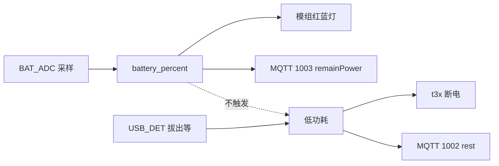
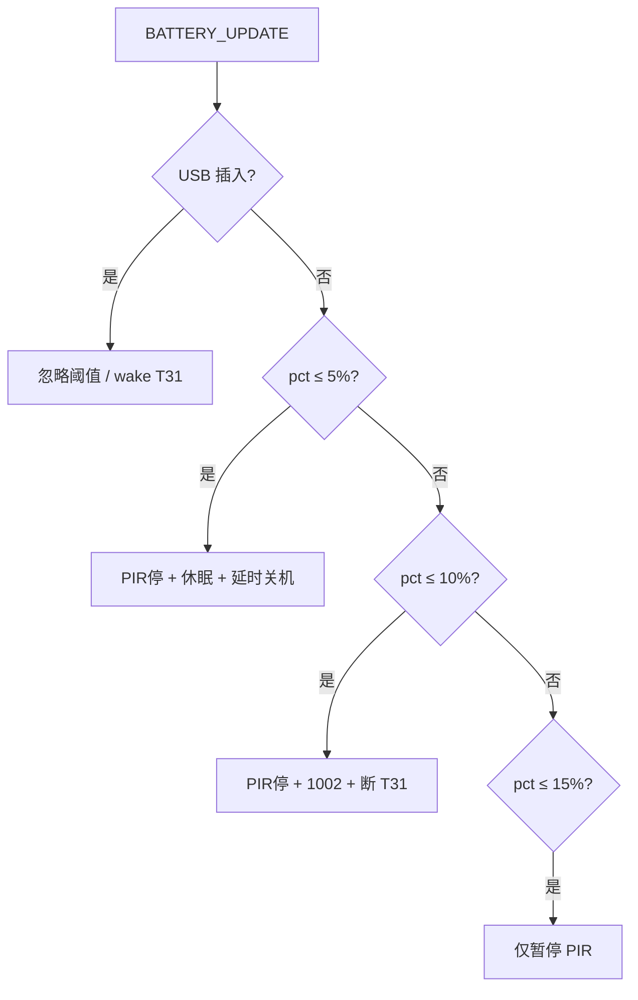
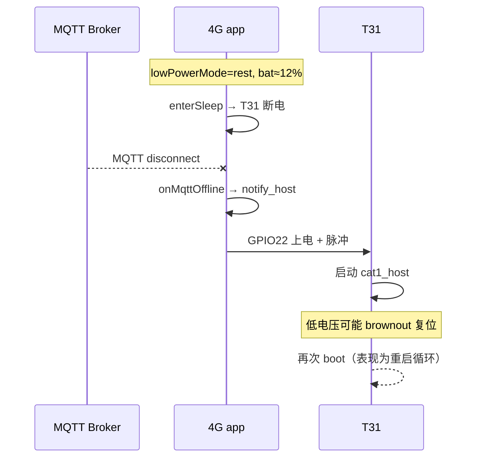
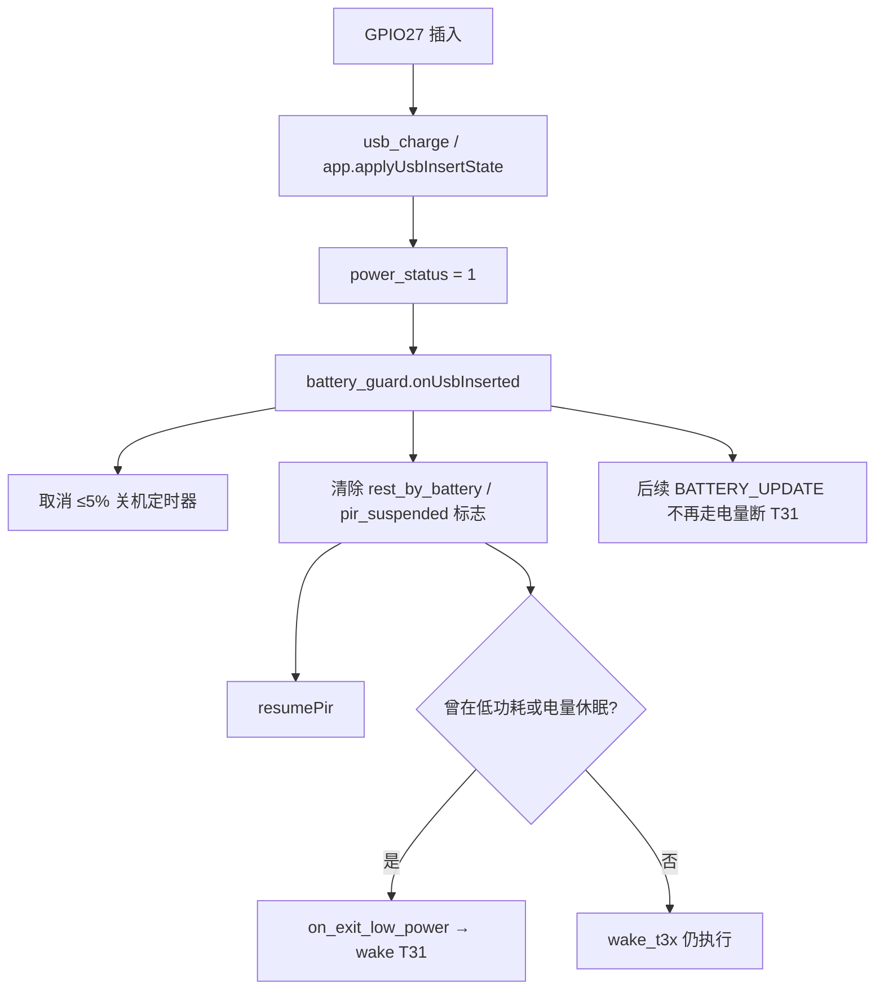

# 4G CAT1 低电量与低功耗行为说明

> 版本：`v1_20260529`  
> 代码真源：[`user/vbat.lua`](../user/vbat.lua)、[`user/app.lua`](../user/app.lua)、[`user/led_ctrl.lua`](../user/led_ctrl.lua)、[`user/net_mqtt.lua`](../user/net_mqtt.lua)、[`user/battery_guard.lua`](../user/battery_guard.lua)、[`user/host_uart.lua`](../user/host_uart.lua)、[`user/t3x_ctrl.lua`](../user/t3x_ctrl.lua)、[`user/config.lua`](../user/config.lua)  
> 相关：[CHARGE_BATTERY.md](CHARGE_BATTERY.md)（充电/ADC/MQTT 1003 流程）、[T31_BURN_MODE.md](T31_BURN_MODE.md)（烧录电量门槛）

---

## 1. 两个概念（勿混淆）

| 概念 | 判定依据 | 典型标志 |
|------|----------|----------|
| **低电量** | ADC 采样 → `APP_RUNTIME.battery_percent` / `battery_mv` | 模组 **GPIO20 红灯闪**（&lt;20%） |
| **低功耗模式** | `APP_RUNTIME.low_power_mode == 1` | 日志 `进入低功耗`、MQTT `lowPowerMode: "rest"` |

**重要**：未插 USB 时，**`battery_guard`** 会按电量自动暂停 PIR、休眠 T31、极低电量关机（见 §8）。**插入 USB** 时忽略上述阈值并保持 T31 上电。另有 **USB 拔出 / 云端 / AT** 触发的低功耗（见 §4）。  
**逻辑总览**（四维度、上电时序、优先级、已知缺口）：[POWER_USB_BATTERY_T31_LOGIC.md](POWER_USB_BATTERY_T31_LOGIC.md)



---

## 2. 低电量：固件会做什么

### 2.1 采样与全局变量

| 模块 | 周期 | 动作 |
|------|------|------|
| `user/vbat.lua` | `BATTERY_CFG.sample_interval_ms`（默认 **10s**） | ADC1 读分压 → 电芯 mV → 百分比 |
| 写入 | — | `APP_RUNTIME.battery_percent`、`battery_mv`、`battery_consumption_rate` |
| 事件 | 每次有效采样 | `sys.publish("BATTERY_UPDATE", pct, mv, rate)` |

电量换算（[`config.lua`](../user/config.lua) → `BATTERY_CFG.cell`）：

| 电芯电压 | 百分比 |
|----------|--------|
| ≥ `v_max_mv`（默认 4200） | 100% |
| ≤ `v_min_mv`（默认 3000） | **1%**（不会为 0%） |
| 中间 | 线性插值取整 |

### 2.2 模组指示灯（GPIO20 红 / GPIO21 蓝）

由 `led_ctrl` + `lib/led.runBatteryPattern` 循环显示（与充电板 CHG_RED/CHG_BLUE **无关**）：

| 电量 | 模组灯 |
|------|--------|
| **&gt; 70%** | 蓝灯常亮（约 10s） |
| **20% ～ 70%** | 蓝灯闪烁 |
| **&lt; 20%** | **红灯闪烁**（默认 20 组） |
| 未知 `--` | 红蓝灭 |

阈值在 `user/led_ctrl.lua` → `LED_CONFIG.battery`（`high_threshold=70`、`medium_threshold=20`）。

`app.lua` 订阅 `BATTERY_UPDATE` 时 **仅打日志**，不因低电量改业务状态。

### 2.3 MQTT 与串口

| 通道 | 行为 |
|------|------|
| **MQTT 1003** | 约每 `mqtt_report_interval_sec`（默认 **60s**）上报 `remainPower` = 当前电量；`lowPowerMode` 为 `rest`/`normal`（表示低功耗标志，**不是**“低电量”） |
| USB/充电变化 | `app` 可触发额外 `publishStatus()` |
| **AT+GETCFG?** | 返回 `battery`、`vbat` |
| 心跳 | `[ALIVE #n]` 日志含 `bat=xx%` |

低电量 **不会** 自动发 MQTT **1002 休眠**。

### 2.4 唯一与电量相关的业务限制：T31 烧录

GPIO28 **BOOT 长按** 进入烧录前检查（[`T3X_BURN_CFG`](../user/config.lua)）：

| 配置项 | 默认 | 说明 |
|--------|------|------|
| `min_battery_percent` | **20** | 低于则拒绝烧录 |
| `require_battery_valid` | **true** | 采样未就绪（`--`）也拒绝 |

不满足：日志 `t3x 烧录条件不满足`，**红灯闪**，不关机。详见 [T31_BURN_MODE.md](T31_BURN_MODE.md)。

### 2.5 低电量时自动执行（`battery_guard`，未插 USB）

| 动作 | 条件 |
|------|------|
| 暂停 PIR | ≤ 15% |
| `onEnterLowPower()` + 1002 + 断 T31 | ≤ 10% |
| `pm.shutdown()` | ≤ 5%（延时 3s，插入 USB 可取消） |

**插 USB 时**：不执行上表，并 `wake` T31。  
其他关机仍可由 **PWRKEY 长按**、MQTT/AT `2004`、`AT+POWEROFF` 触发。

---

## 3. 充电与 USB 对电量的影响

- **CHG_STATE（GPIO17）**：表示充电 IC 是否在充电，**不参与**百分比计算。
- **USB_DET（GPIO27）**：外壳 USB 座插入检测，影响 `power_status` 与低功耗（§4），不直接改 ADC 算法。
- 插 USB 充电时电芯电压上升，ADC 百分比会随采样逐渐升高；模组灯可能从红闪变为蓝闪/蓝常亮。

硬件与引脚详见 [CHARGE_BATTERY.md](CHARGE_BATTERY.md)。

---

## 4. 低功耗模式：触发与动作

### 4.1 触发来源（与电量无关）

| 来源 | 条件/说明 |
|------|-----------|
| **USB 拔出** | `GPIO_USB_DET_CHANGED` → `applyUsbInsertState(false)` → `onEnterLowPower()` |
| **MQTT 2002** | `lowPowerMode: "enter"` → `POWER_ENTER_REST` |
| **AT+LOWPOWER=ENTER** | 且 `power_status==0`、当前未在低功耗 |
| **上电 init** | 仅当未启用 `charge` 且无 USB 时的旧路径 |

**例外（v1_20260528）**：若 **RNDIS 已开启**（`usb_rndis.isEnabled()`），GPIO27 显示“未插入”时 **不** 因 USB 拔出进入低功耗（PC 调试线场景 GPIO27 可能仍为 0）。

### 4.2 进入低功耗时 `app.onEnterLowPower()`

| 序号 | 动作 |
|------|------|
| 1 | `APP_RUNTIME.low_power_mode = 1` |
| 2 | `t3x_ctrl.enterSleep({ modemHibernate = false })` → **T31 断电（GPIO22）**，**4G 保持蜂窝/MQTT** |
| 3 | `net_mqtt.publishRest()` → 上行 **1002** |
| 4 | 若已配置 `net_tcp` → 关闭 TCP 通道 |

默认 **不** 调用 `pm.hibernate()`（整模组休眠会断 MQTT）。

### 4.3 退出低功耗

| 来源 | 动作 |
|------|------|
| USB 插入 | `onExitLowPower()` → `t3x_ctrl.wake()` 上电 T31 |
| MQTT 2002 exit | `POWER_EXIT_REST` |
| AT+LOWPOWER=EXIT | 同上 |

---

## 5. 关机与重启（需显式触发）

| 触发 | 结果 |
|------|------|
| **PWRKEY 长按** | `pm.shutdown()`（USB 刚插入 5s 内忽略，防误触） |
| MQTT **2004** `off` / `shutdown` | `DEVICE_POWER_OFF_REQUEST` |
| MQTT **2004** `reboot` | 约 500ms 后 `pm.reboot()` |
| **AT+POWEROFF** / **AT+REBOOT** | 经 `host_uart` 回调 |

均 **不是** 低电量自动触发。

---

## 6. 配置速查

| 文件 | 关键项 |
|------|--------|
| `user/config.lua` | `BATTERY_CFG.adc/cell`、`BATTERY_CFG.led`、`BATTERY_CFG.guard`、`T3X_BURN_CFG.min_battery_percent` |
| `user/app_config.lua` | `MODULE_FLAGS.battery`、`battery_guard`、`charge`、`rndis` |
| `user/led_ctrl.lua` | 从 `BATTERY_CFG.led` 加载灯效（勿在模块内改阈值） |

---

## 7. 现场排查

| 现象 | 可能原因 |
|------|----------|
| 红灯闪、日志电量 15% | 正常 **低电量指示**，非低功耗 |
| 日志 `进入低功耗`、T31 断电 | **低功耗**（查 USB_DET / 云端 2002 / AT） |
| 云端 `remainPower` 低但设备仍联网 | 设计如此：低电量仍常电 MQTT |
| 无法进 T31 烧录 | 电量 &lt; 20% 或采样未就绪 |
| PC RNDIS 调试时误休眠 | 确认 `rndis=true` 且 RNDIS 已 open；或 GPIO27 误报拔出 |
| **T31 低电量 `rest` 下反复重启** | 见 **§9**（MQTT 离线误唤醒、电量阈值抖动、欠压 brownout） |
| **低电量同时插 USB** | 见 **§10**（忽略电量保护、恢复 T31/PIR、取消关机） |

---

## 8. 电量保护策略（`user/battery_guard.lua`）

**仅当外壳 USB 未插入**（`GPIO27` / `APP_RUNTIME.power_status == 0`）时生效；**USB 插入则忽略电量**，并 **保持 T31 上电**。

| 电量（未插 USB） | 动作 |
|------------------|------|
| **≤ 15%** | `pir_ctrl.suspend()` 暂停 PIR |
| **≤ 10%** | `onEnterLowPower()` → MQTT **1002** + **T31 断电** |
| **≤ 5%** | 约 **3s** 后 `pm.shutdown()` 关机 |
| **&gt; 12%**（曾电量休眠） | 退出电量休眠、恢复 T31 |
| **&gt; 17%**（曾暂停 PIR） | `pir_ctrl.resume()` |

配置：[`user/config.lua`](../user/config.lua) → `_G.BATTERY_CFG.guard`（电量保护）、`_G.BATTERY_CFG.led`（红蓝灯阈值）  
兼容别名：`_G.BATTERY_GUARD_CFG`（指向 `BATTERY_CFG.guard`）  
开关：[`user/app_config.lua`](../user/app_config.lua) → `MODULE_FLAGS.battery_guard`



**说明**：

- USB **拔出** 仍会走原有 `applyUsbInsertState`（高电量时也会 `onEnterLowPower` 仅断 T31，4G/MQTT 常电）。
- **RNDIS 调试** 且 GPIO27 仍为未插入时，电量保护 **仍会执行**（与 RNDIS 跳过 USB 拔出低功耗不同）。
- T31 **烧录模式** 期间不执行电量保护。

---

## 9. 低电量 + `rest` 下 T31 反复重启（FAQ）

### 9.1 典型云端状态（MQTT 1003）

未插 USB、已进入业务低功耗时，周期 **1003** 可能类似：

```json
{
  "deviceNo": "862323084068124",
  "dataType": "1003",
  "powerStatus": "0",
  "remainPower": "12",
  "lowPowerMode": "rest",
  "time": "2026-06-02 13:30:49"
}
```

| 字段 | 含义 |
|------|------|
| `powerStatus: "0"` | 外壳 USB **未插入**（GPIO27） |
| `lowPowerMode: "rest"` | 业务低功耗，设计上 **T31 应断电**（GPIO22） |
| `remainPower: "12"` | ADC 电量约 **12%**（低电，PIR 已暂停） |

**注意**：`rest` 表示 **低功耗标志**，不是“已经关机”；4G 模组通常仍保持蜂窝/MQTT 联网。

### 9.2 12% 时电量保护实际在做什么

配置见 `BATTERY_CFG.guard`（[`user/config.lua`](../user/config.lua)）：

| 阈值 | 动作 | **12% 是否触发** |
|------|------|------------------|
| ≤ 15% | 暂停 PIR | ✅ |
| ≤ 10% | `onEnterLowPower()` + 1002 + **断 T31** | ❌（12 > 10） |
| > 12%（曾电量休眠） | 退出电量休眠、**唤醒 T31** | ❌（12 不大于 12） |
| ≤ 5% | 延时整机关机 | ❌ |

因此：**12% 且已在 `rest` 时，电量保护不会再次主动断 T31，也不会因 12% 而退出休眠**（需 **>12%**，例如 13% 才会 `exitBatteryRest`）。

### 9.3 为什么会出现 T31「一直重启」

常见为 **软件误唤醒 + 低电压带载** 叠加，而非 T31 主动重启。

#### 原因 ①：MQTT 离线仍唤醒 T31（未判断 `rest`/低电量）

[`user/app.lua`](../user/app.lua) 订阅 `MQTT_OFFLINE` 时 **无条件** 唤醒：

```lua
local function onMqttOffline()
    log.info("app", "MQTT离线")
    sendWakePulse(2, 0)   -- → host_uart.notify_host → t3x powerOn + GPIO 脉冲
end
```

[`user/host_uart.lua`](../user/host_uart.lua) 的 `notify_host()` 在 T31 已断电时会 **先 `powerOn()` 再发脉冲**，且 **不检查** `APP_RUNTIME.low_power_mode`。

低电量时蜂窝/MQTT 易 **断线 → autoreconn → 再断线**，每次离线都可能把 T31 拉起。若启用 `time_sync`，还会在脉冲前 **上电并等待约 1.5s**，进一步加重负载。

#### 原因 ②：电量在 10%～13% 边界抖动 → 断/上电循环

| 配置项 | 默认 |
|--------|------|
| `t31_rest_percent` | 10（≤10% 断 T31） |
| `recover_rest_percent` | 12（**>12%** 才恢复） |

典型振荡：

```text
10% → battery_guard 断 T31 → 负载减小 → ADC 读到 13%
13% → exitBatteryRest → onExitLowPower → wake T31
T31 上电 → 负载增大 → 电压跌落 → 又读到 10%
10% → 再断 T31 …
```

4G 串口可见 **`t3x上电` / `t3x断电` / `唤醒设备`** 交替出现。

#### 原因 ③：低电压 brownout（硬件）

12% 附近若 GPIO22 仍给 T31 供电：

- T31 启动 `cat1_host`、媒体模块上电 **浪涌电流大**
- 电芯电压瞬间被拉低 → T31 **欠压复位**
- 4G 侧可能仍认为 T31 已上电 → 表现为 **T31 侧反复 boot**

日志可能 **只有** `t3x上电`，未必成对出现 `t3x断电`。

### 9.4 现象与日志对照

在 **4G 调试串口** 按时间搜索：

| 关键字 | 可能原因 |
|--------|----------|
| `MQTT断开` / `MQTT离线` + `t3x 唤醒` | MQTT 抖动导致 **rest 下误唤醒** |
| `battery_guard` + `休眠阈值` / `退出电量休眠` | **10%↔13%** 电量边界振荡 |
| `t3x上电` 与 `t3x断电` **交替** | 软件 power 循环 |
| 仅 `t3x上电`，T31 反复 boot | 多为 **欠压 brownout** |
| `[ALIVE]` 中 `lowPwr=1 bat=12%` | 与 1003 一致：rest + 低电 |

### 9.5 处理建议

| 优先级 | 建议 |
|--------|------|
| **现场** | 12% 附近 **插 USB 充电**；接受 T31 必须保持断电，避免远程唤醒录像 |
| **固件（推荐）** | `rest` 或 `battery_percent ≤ 15%` 时：**禁止** `onMqttOffline` / `notify_host` 对 T31 `powerOn` |
| **固件** | `sendWakePulse` / `time_sync.pushBeforeNotify` 统一加低功耗/低电量门禁 |
| **配置** | 加宽迟滞，例如 ≤10% 休眠、**≥18%** 才恢复，减少 10～13% ADC 抖动 |
| **排查** | 对照 §9.4 抓一段完整串口日志再定因 |

### 9.6 相关代码索引

| 模块 | 路径 | 说明 |
|------|------|------|
| MQTT 离线唤醒 | [`user/app.lua`](../user/app.lua) | `onMqttOffline` → `sendWakePulse` |
| GPIO 唤醒 + 上电 | [`user/host_uart.lua`](../user/host_uart.lua) | `notify_host()` |
| T31 电源 | [`user/t3x_ctrl.lua`](../user/t3x_ctrl.lua) | `powerOn` / `powerOff` / `enterSleep` / `wake` |
| 电量分级 | [`user/battery_guard.lua`](../user/battery_guard.lua) | `evaluate()` |
| 时间同步唤醒 | [`user/time_sync.lua`](../user/time_sync.lua) | `pushBeforeNotify` |
| 阈值配置 | [`user/config.lua`](../user/config.lua) | `BATTERY_CFG.guard` |



---

## 10. 低电量同时插入 USB 时软件如何处理

**结论**：外壳 USB 插入（`power_status == 1`）后，**电量保护策略整体失效**，优先保证 **T31 上电、PIR 恢复、取消自动关机**；ADC 仍上报低 `remainPower`，模组红灯仍可能闪（仅指示，不触发断 T31）。

### 10.1 USB 如何判定「已插入」

| 来源 | 说明 |
|------|------|
| **GPIO27** | `lib/usb_charge.lua` 读 `usb_det`，发布 `GPIO_USB_DET_CHANGED` |
| **运行时** | `APP_RUNTIME.power_status = 1` |
| **battery_guard** | `isUsbInserted()` 读 `power_status`，或 `app` 注入的 `hooks.is_usb_inserted()` |

配置：`BATTERY_CFG.guard.ignore_when_usb_inserted = true`（默认 **true** = 插 USB 则忽略电量阈值）。

### 10.2 插入 USB 时的调用链



[`user/app.lua`](../user/app.lua) 插入分支：

```lua
-- USB 插入
battery_guard.onUsbInserted()   -- 优先走电量保护恢复
-- 若无 battery_guard：onExitLowPower()
```

[`user/battery_guard.lua`](../user/battery_guard.lua) `onUsbInserted()`：

| 步骤 | 动作 |
|------|------|
| 1 | `cancelShutdownTimer()` — 若 ≤5% 已启动 3s 关机，**取消** |
| 2 | `guard.rest_by_battery = false`、`guard.pir_suspended = false` |
| 3 | 若曾暂停 PIR → `pir_ctrl.resume()` |
| 4 | 若曾电量休眠 **或** `low_power_mode == 1` → `on_exit_low_power()` → `t3x_ctrl.wake()` |
| 5 | `wake_t3x()` — 再确保 T31 上电 + 脉冲 |

日志典型：`USB 插入，忽略低电量限制，保持 T31 上电`。

### 10.3 插着 USB 时，每次电量采样（BATTERY_UPDATE）

`evaluate(pct, mv)` **开头**判断 USB：

```lua
if isUsbInserted() then
    cancelShutdownTimer()
    if guard.rest_by_battery or guard.pir_suspended then
        onUsbInserted()   -- 兜底恢复
    end
    return              -- 不执行 ≤15% / ≤10% / ≤5% 任何分支
end
```

因此：**即使 remainPower 只有 5%～12%，只要 USB 一直插着，就不会**：

- 因电量暂停 PIR（新触发）
- 因电量进入 `onEnterLowPower` 断 T31
- 因电量启动 `pm.shutdown()` 定时器

### 10.4 与 MQTT 1003 / 指示灯的关系

| 项 | 插 USB + 低电量时行为 |
|----|----------------------|
| **1003 `powerStatus`** | `"1"`（已插入） |
| **1003 `remainPower`** | 仍为 ADC 百分比（如 `"12"`），**不会**因插 USB 变高（需充电一段时间后采样才升） |
| **1003 `lowPowerMode`** | 若已 `on_exit_low_power` → `"normal"`；若仅 `power_status=1` 未退出低功耗，可能仍为 `"rest"`（取决于插入前状态） |
| **模组红/蓝灯** | `led_ctrl` **仍按** `battery_percent` 显示（&lt;20% 仍可能红闪），**与** T31 是否断电 **无关** |

### 10.5 场景对照

| 场景 | 软件行为 |
|------|----------|
| 先低电（已 rest、T31 断电）再插 USB | `onUsbInserted` → 退出低功耗、**wake T31**、恢复 PIR |
| 先插 USB 再降到 5% | `evaluate` 见 USB 直接 return，**不关机、不断 T31** |
| 5% 已启动 3s 关机倒计时，中途插 USB | 定时器回调里再次 `isUsbInserted()` → **取消关机** |
| 低电 rest 中 MQTT 离线 | 当前固件仍可能 `onMqttOffline` 唤醒 T31（见 §9）；插 USB 后应已 `wake`，但 **未** 单独禁止 MQTT 唤醒 |
| 拔出 USB 且仍 12% | `onUsbRemoved` → `evaluate(12%)` → 暂停 PIR；**不** 断 T31（12&gt;10）；若 `low_power_mode==0` 还可能 `onEnterLowPower`（USB 拔出路径） |

### 10.6 配置与开关

| 配置 | 作用 |
|------|------|
| `BATTERY_CFG.guard.ignore_when_usb_inserted` | 默认 true；设为 false 则插 USB 也按电量阈值执行（一般不推荐） |
| `MODULE_FLAGS.battery_guard` | false 时插 USB 只走 `app.onExitLowPower()`，无电量保护恢复逻辑 |
| `MODULE_FLAGS.charge` | 启用 `usb_charge` 读 GPIO27 |

### 10.7 相关代码

| 模块 | 文件 |
|------|------|
| USB 插入/拔出 | [`user/app.lua`](../user/app.lua) `applyUsbInsertState` |
| 电量+USB 策略 | [`user/battery_guard.lua`](../user/battery_guard.lua) `evaluate` / `onUsbInserted` / `onUsbRemoved` |
| GPIO27 检测 | [`lib/usb_charge.lua`](../lib/usb_charge.lua) |
| T31 唤醒 | [`user/t3x_ctrl.lua`](../user/t3x_ctrl.lua) `wake` / `powerOn` |
