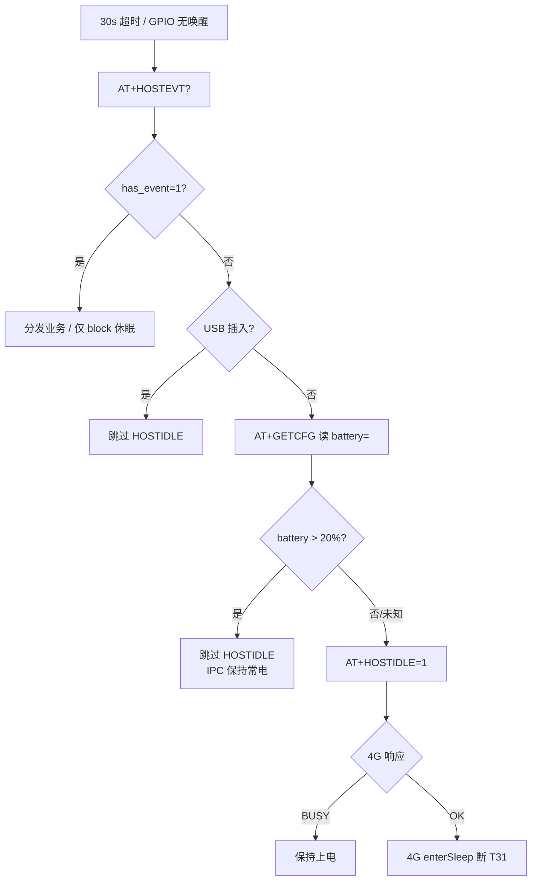

# 低功耗进入策略：电量 20% vs T3x 空闲 HOSTIDLE（30s 轮询）

> **结论**：**不矛盾**，是两条独立通路；默认 **`battery`** 策略下，一直录像（>20%）会 **拒绝** 30s 轮询触发的 HOSTIDLE 断电。  
> **关联**：[WORK_MODE_BATTERY_20PCT.md](WORK_MODE_BATTERY_20PCT.md) · [T3X_HOSTEVT_SLEEP.md](T3X_HOSTEVT_SLEEP.md) · [cat1_hostevt_idle_poll_config.md](../../ipc_device_gb28181/docs/cat1_hostevt_idle_poll_config.md)

**版本**：v1.1 · 2026-06-26

---

## 1. 先分清两个「30 秒」

| 名称 | 配置 | 含义 | 是否「进低功耗」 |
|------|------|------|------------------|
| **HOSTEVT 空闲轮询** | T3x `hostevt_idle_poll_ms=30000`<br>4G `HOST_EVT_CFG.poll_interval_ms=30000` | T3x **每 30s** 查一次有无业务；无业务则发 `AT+HOSTIDLE=1` 请求 4G 断 T3x 电 | **可能**断 T3x（见 §2 通路 B） |
| **rest 下 MQTT 1003 周期** | `LOW_POWER_CFG.rest_mqtt_interval_sec=30` | 已在 **4G rest** 时，约 30s 上报一次状态 | **不是**进 rest 的触发条件 |

用户常说的「30 秒进入低功耗」一般指 **通路 B：空闲轮询 → HOSTIDLE**。

---

## 2. 两条断电通路（可并存、由策略仲裁）

```text
通路 A — 电量 rest（battery_guard）          通路 B — 业务空闲（HOSTIDLE）
────────────────────────────────────        ────────────────────────────────────
ADC ≤20%（+连续确认+最短常电）               T3x 每 30s HOSTEVT? → 无事件
  → enterBatteryRest                           → AT+HOSTIDLE=1
  → onEnterLowPower("battery")                 → t3x_ctrl.enterSleep(host_idle)
  → low_power_mode=1，MQTT 1002                → 通常 low_power_mode 仍为 0*
  → 断 T3x，PIR 可唤醒                         → 仅断 T3x GPIO（PIR 再唤醒）

* HOSTIDLE 路径不调用 onEnterLowPower，4G 侧常电 MQTT 可保持在线。
  电量 rest 是「整机低功耗姿态 + 动态侦测」；HOSTIDLE 是「T3x 先睡一下」。
```

### 2.1 会不会打架？

| 场景 | 通路 A（电量） | 通路 B（30s HOSTIDLE） | 结果 |
|------|----------------|------------------------|------|
| **一直录像，>20%**（默认 `battery`） | 不进 rest | IPC **不发** HOSTIDLE；4G 兜底 **BUSY** | T3x **常电**，全天录 ✅ |
| **一直录像，≤20%** | 进 rest，断 T3x | T3x 已断 / PIR 唤醒后业务结束可 HOSTIDLE | 动态侦测 ✅ |
| **纯动态侦测，>20%**（`hybrid`） | 不进 rest | HOSTIDLE **允许** | 空闲约 30s 后 T3x 断电 ✅ |
| **仅 idle_poll**（关闭电量 rest） | **关闭** | HOSTIDLE 允许 | 只看空闲，不看 20% |

**默认 `battery` 策略下**：>20% 时 IPC **主动跳过** HOSTIDLE，4G 侧 **BUSY 兜底**，**不会**与「一直录像」冲突。

---

## 3. IPC 侧：电量 >20% 禁止 HOSTIDLE（双端防护）

> Cat.1 改为 **电量 20% 驱动 rest** 后，T31 不能再沿用「30s 无 UART 事件 → 必发 HOSTIDLE」的旧逻辑。  
> **产品规则**：电量 **>20%** 时，**无论** `HOSTEVT?` 是否查到事件，**都不要**进入低功耗。

### 3.1 决策流程（T31 `app/cat1/host_event.c`）



```text
runtime_worker 每 hostevt_idle_poll_ms（默认 30s）:
  1. client_wait_wakeup 超时
  2. AT+HOSTEVT? → has_event=1 → 处理业务，结束
  3. has_event=0:
     a. USB 已插入 → 跳过 HOSTIDLE（原有）
     b. AT+GETCFG → 解析 battery=
     c. battery > 20 → 跳过 HOSTIDLE（不发 AT+HOSTIDLE=1）
     d. battery ≤ 20 或未知 → AT+HOSTIDLE=1 → 4G 裁决
```

### 3.2 阈值与代码位置

| 项 | 值 / 文件 |
|----|-----------|
| 阈值宏 | `T3X_BATTERY_ALWAYS_ON_PERCENT` = **20**（`app/cat1/types.h`） |
| 读电量 | `refresh_cat1_battery_from_getcfg()` ← `AT+GETCFG` 字段 `battery=` |
| 跳过休眠 | `cat1_battery_blocks_idle_sleep()` |
| 轮询入口 | `client_host_work_poll_and_dispatch()` |
| 返回值 | **4** = IPC 因电量 >20% 跳过（不发 HOSTIDLE） |

### 3.3 4G 侧兜底（第二道防线）

即使 IPC 误发 `AT+HOSTIDLE=1`，4G 在电量 **>20%** 且 `block_host_idle_above_recover=true` 时仍回：

```text
+HOSTIDLE:BUSY
```

实现：`user/host_uart.lua` → `battery_guard.shouldAllowHostIdleSleep()`。

### 3.4 日志关键字

| 端 | 日志 | 含义 |
|----|------|------|
| **IPC** | `HOSTEVT skip HOSTIDLE (battery NN% > 20%, always-on)` | >20% 本地跳过 |
| **IPC** | `HOSTIDLE busy (pending work or battery always-on)` | 4G 回 BUSY |
| **IPC** | `HOSTIDLE accepted, 4G will power off T3x` | ≤20% 且 4G 允许断电 |
| **4G** | `+HOSTIDLE:BUSY` | 常电拒绝休眠 |

>20% 常电模式下 **不应** 再出现 `HOSTIDLE accepted`。

### 3.5 与「有无 UART 事件」的关系

| 电量 | HOSTEVT 无事件（30s 到期） | 是否进低功耗 |
|------|---------------------------|--------------|
| **>20%** | 是 | **否**（IPC 不发 HOSTIDLE） |
| **≤20%** | 是 | **是**（发 HOSTIDLE=1，动态侦测） |
| 任意 | 有事件 | 否（先处理业务） |

---

## 4. 策略切换（4G `user/config.lua`）

顶部一行切换（烧录生效）：

```lua
local LOW_POWER_ENTER_STRATEGY = "battery"   -- 默认
-- local LOW_POWER_ENTER_STRATEGY = "idle_poll"
-- local LOW_POWER_ENTER_STRATEGY = "hybrid"
```

| 策略 | `guard.enabled` | `block_host_idle_above_recover` | 适用产品 |
|------|-----------------|----------------------------------|----------|
| **`battery`（默认）** | true | **true** | **① 一直录像**：≤20% 动态侦测 rest；>20% 常电 + 拒绝 HOSTIDLE |
| **`hybrid`** | true | **false** | **② 动态侦测**：≤20% 电量 rest；>20% 空闲 30s 可 HOSTIDLE |
| **`idle_poll`** | **false** | false | 旧逻辑：不用电量 20% rest，只靠 HOSTIDLE |

策略在 `config.lua` 末尾 `do ... end` 块自动写入 `BATTERY_CFG.guard` 对应字段。

### 4.1 相关独立配置

| 配置 | 作用 |
|------|------|
| `HOST_EVT_CFG.allow_host_idle_sleep` | `false` 时全局禁用 HOSTIDLE 休眠 |
| `HOST_EVT_CFG.poll_interval_ms` | 4G 侧 HOSTEVTPOLL 默认（毫秒） |
| T3x `hostevt_idle_poll_ms` | T3x 侧轮询间隔（`AT+HOSTEVTPOLL` 可改） |
| `guard.t3x_rest_percent / recover_rest_percent` | 电量 rest 阈值（默认 20%） |
| 防徘徊参数 | 见 [BATTERY_REST_SWITCH_CONDITIONS.md](BATTERY_REST_SWITCH_CONDITIONS.md) |

---

## 5. 默认策略时序（一直录像 + >20%）

```text
T3x 每 30s: HOSTEVT? → 无事件
IPC: AT+GETCFG 读 battery → 若 >20% → 不发 HOSTIDLE=1（IPC 侧常电）
若 ≤20%: AT+HOSTIDLE=1 → 4G enterSleep（动态侦测）
4G 兜底: >20% 时若仍收到 HOSTIDLE=1 → +HOSTIDLE:BUSY
T3x: 保持上电，继续全天录像
```

日志：IPC `HOSTEVT skip HOSTIDLE (battery NN% > 20%, always-on)` · 4G `+HOSTIDLE:BUSY`（兜底）

---

## 6. hybrid / 动态侦测时序（>20%，空闲）

```text
T3x 每 30s: HOSTEVT? → 无事件 → HOSTIDLE=1
4G: shouldAllowHostIdleSleep() == true
4G → T3x: +HOSTIDLE:OK → enterSleep(host_idle)
T3x 断电；PIR 触发 → 4G 唤醒 → 录像 → 再 HOSTIDLE
```

> **注意**：当前 IPC 固件在 **battery > 20%** 时 **一律不发** HOSTIDLE。若 4G 配 **`hybrid`** 且希望在 >20% 仍走空闲断电，需同步改 IPC 阈值策略（默认产品未启用）。

---

## 7. 选型建议

| 产品目标 | 推荐策略 | record_mode |
|----------|----------|-------------|
| 门球/常电录，低电量改动态侦测 | **`battery`（默认）** | `1` |
| 纯 PIR 机，高电量也待机 | **`hybrid`** | `3` |
| 调试 / legacy 仅 HOSTIDLE | **`idle_poll`** | `3` |

---

## 8. 修订记录

| 日期 | 说明 |
|------|------|
| 2026-06-25 | 初版：双通路说明、与 30s 轮询关系、三档策略切换 |
| 2026-06-26 | §3：IPC 侧电量 >20% 跳过 HOSTIDLE 流程、双端日志、与无事件关系 |
