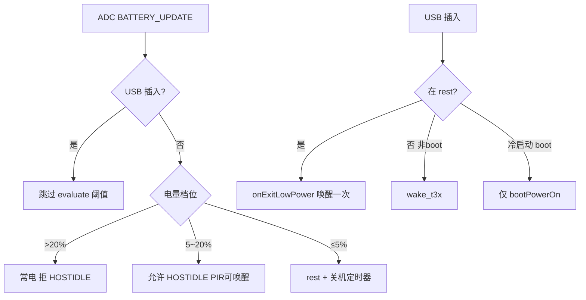

# Lua 模块逻辑分析

> **代码真源**：`user/*.lua`（19）+ `lib/*.lua`（11）= 30 个模块  
> **配置真源**：[`user/config.lua`](../user/config.lua) · 开关 [`user/app_config.lua`](../user/app_config.lua)  
> **启动顺序**：[`CODE_DOC_AUDIT.md`](CODE_DOC_AUDIT.md) §3 · 调用图 [`CALL_GRAPH.md`](CALL_GRAPH.md)

> **专题索引**：[doc/modules/README.md](modules/README.md)

---

```
main.lua
  ├─ cellular_bootstrap / usb_rndis（可选）
  ├─ net_mqtt.bootstrapNetwork()
  └─ app.start(peripheral, net_mqtt, t3x_ctrl)
         ├─ battery_guard / vbat / usb_charge
         ├─ uart_bridge → host_uart（T3x AT）
         ├─ pir_ctrl / peripheral / led_ctrl
         ├─ net_mqtt（云端唯一入口）
         └─ t3x_ctrl（GPIO22 供电 + GPIO29 唤醒）
```

**设计原则**

| 原则 | 实现 |
|------|------|
| 单 MQTT | 仅 `net_mqtt.lua` |
| 单 UART 驱动 | `uart_bridge` → `host_uart` 业务 |
| 配置分层 | `config` 硬件阈值 · `app_config` 开关/事件名 |
| lib 不反向依赖 user | 策略库通过 `_G` / 事件 / 懒 `require` |
| 事件驱动 | `APP_EVENTS` + `sys.publish/subscribe` |

---

## 2. 启动与事件总线

### 2.1 `app.start` 关键顺序

1. `battery_guard.start(hooks)` — 注册低电/USB 回调  
2. `setupUartBridge` → `host_uart.start`  
3. `initPowerStatus` — 读 GPIO27，可能 `onUsbInserted`  
4. `t3x_ctrl.start` → `bootPowerOn`  
5. GPIO / PMD / vbat / usb_charge / MQTT / FOTA

### 2.2 核心事件（`APP_EVENTS`）

| 事件 | 发布方 | 订阅方 / 作用 |
|------|--------|----------------|
| `GPIO_USB_DET_CHANGED` | `usb_charge` | `app` → `applyUsbInsertState` |
| `GPIO_PIR_TRIGGERED` | `pir_ctrl` | `app` → MQTT / 唤醒 T3x |
| `PIR_WAKE_T3X` | `pir_ctrl` | `app` → `wakeT3xForPir` |
| `BATTERY_UPDATE` | `vbat` | `battery_guard.evaluate` |
| `POWER_ENTERED_REST` / `POWER_EXITED_REST` | `app` | 低功耗状态广播 |
| `MQTT_OFFLINE` | `net_mqtt` | `app` → 可选唤醒 T3x |
| `T3X_IPC_ALERT` | `host_uart` | `ipc_supervision` → 1004 |

---

## 3. `user/` 模块

### 3.1 `main.lua` — 固件入口

| 项 | 说明 |
|----|------|
| **职责** | 版本校验、全局 OTA 版本函数、蜂窝/RNDIS 引导、`app.start`、`sys.run()` |
| **导出** | `_G.validateBuildVersion` / `buildIotOtaVersion` / `resolveIotOtaVersion` |
| **逻辑** | `VERSION` 须 `xxx.yyy.zzz`；RNDIS 开启时异步 `open` 后再 `bootstrapNetwork` |
| **依赖** | `config`, `app_config`, `key_config`, `app`, `peripheral`, `net_mqtt`, `t3x_ctrl` |

---

### 3.2 `config.lua` — 硬件与策略配置

| 项 | 说明 |
|----|------|
| **职责** | 写入 `_G.GPIO_IN/OUT`、`BATTERY_CFG`、`MQTT_CFG`、`LOW_POWER_*`、`HOST_*`、`T3X_POLICY_CFG` 等 |
| **逻辑** | `LOW_POWER_ENTER_STRATEGY` 决定 `battery_guard` 的 `enabled` / `block_host_idle_above_recover` |
| **电量三档**（`battery` 策略） | >20% 常电 · 5~20% HOSTIDLE · ≤5% rest+关机 |
| **消费者** |  virtually 全部模块 |

---

### 3.3 `app_config.lua` / `key_config.lua`

| 模块 | 职责 |
|------|------|
| `app_config` | `MODULE_FLAGS` 裁剪可选服务；`APP_EVENTS` 事件名常量 |
| `key_config` | PWR/BOOT 引脚与长按事件名 → `peripheral` 使用 |

---

### 3.4 `app.lua` — 编排中心（~1000 行）

> 专题：[APP_EVENT_BUS.md](modules/APP_EVENT_BUS.md)

| 项 | 说明 |
|----|------|
| **职责** | 依赖注入、事件订阅、低功耗进/出、USB 边沿、PIR→MQTT 桥、T3x 烧录模式 |
| **导出** | `start`, `startMqtt`, `getUartBridge`, `getState`, `setModuleFlag` |

**核心流程**

```
onEnterLowPower(reason)
  → setLowPowerMode(1) → t3x_ctrl.enterSleep → MQTT 1002 → low_power_wakeup.onEnterRest

onExitLowPower(reason)
  → setLowPowerMode(0) → requestT3xWake(force) → low_power_wakeup.onExitRest
  ※ 不再重复调用 time_sync.onT3xWake（requestT3xWake 已含对时）

applyUsbInsertState(inserted, source)
  插入 → battery_guard.onUsbInserted({source}) + notifyT3xUsbHostIdlePolicy
  拔出 → battery_guard.onUsbRemoved（按电量重评估，高电量不进 rest）
```

**PIR 桥**：`PIR_WAKE_T3X` → `noteT3xAwakeForHostIdle` + `requestT3xWake("pir_media")`

---

### 3.5 `battery_guard.lua` — 电量分档策略

| 项 | 说明 |
|----|------|
| **职责** | USB 优先；三档电量；PIR 挂起；4G rest；关机定时器；HOSTIDLE 门禁 |
| **档位** | `normal` (>20%) · `host_idle` (5~20%) · `shutdown` (≤5%) |
| **关键 API** | `evaluate`, `getBatteryTier`, `shouldAllowHostIdleSleep`, `canAcceptHostIdleSleep`, `noteT3xAwakeForHostIdle` |

**evaluate 阶段**（未插 USB）

1. USB → 取消关机，必要时 `onUsbInserted`  
2. `shutdown` 档 → 挂 PIR + `enterBatteryRest` + `scheduleShutdown`  
3. `host_idle` / `normal` → 退出 rest、恢复 PIR，中间档不进 4G rest  

**USB 插入**（`onUsbInserted`）

- 取消关机定时器  
- 若在 rest → `onExitLowPower("usb_insert")`（**唯一**唤醒链）  
- 否则且 `source≠"boot"` → `wake_t3x`（冷启动由 `bootPowerOn` 负责）

`hybrid` 策略保留 ≤`t3x_rest_percent` 进 4G rest 的旧逻辑。

---

### 3.6 `vbat.lua` — 电池 ADC

> 专题：[VBAT_FILTER.md](modules/VBAT_FILTER.md)

| 项 | 说明 |
|----|------|
| **职责** | 定时采样、trim+EMA 滤波、百分比/ mV / 耗电率 |
| **输出** | `BATTERY_UPDATE` 事件 + `APP_RUNTIME.battery_percent/mv` |
| **消费者** | `battery_guard`, `led_ctrl`, MQTT 1003 |

---

### 3.7 `t3x_ctrl.lua` — 协处理器电源

| 项 | 说明 |
|----|------|
| **职责** | GPIO22 上/断电、GPIO29 唤醒脉冲、BOOT/OTA 引脚、优雅 IPC 关机 |
| **休眠** | `enterSleep` → `gracefulPowerOff`（`AT+IPCPOWEROFF`）或 `powerOff`；`sleep_in_progress` 互斥 |
| **唤醒** | `powerOn`/`wake`/`ensurePowered` 前 `waitSleepIdle`，避免与关机竞态 |
| **策略** | `bootPowerOn` 经 `t3x_policy.mayPowerT3x("boot")` |

---

### 3.8 `host_uart.lua` — T3x AT 业务（~4000 行）

| 项 | 说明 |
|----|------|
| **职责** | UART 行协议解析、AT 表驱动、HOSTEVT/PIRSTAT/HOSTIDLE、IPC 查询、USB 策略通知 |
| **唤醒** | `notify_host` → `powerOn` + `pulseMcuInt`（经 `t3x_policy` 门禁） |
| **休眠门禁** | `uart_hostidle` → `battery_guard.shouldAllowHostIdleSleep` / `canAcceptHostIdleSleep` |
| **USB** | `push_usb_host_idle_state` → `+CAT1:USB,n`（仅 UART，不拉电源） |

---

### 3.9 `net_mqtt.lua` — 云端协议（~2400 行）

| 项 | 说明 |
|----|------|
| **职责** | MQTT 连接、200x 下行分发、100x 上行、rest/PIR/OTA/关机通知 |
| **下行** | 表驱动 handler（2002 rest、2010 PIR、2004 OTA…） |
| **上行** | `publishStatus`(1003)、`publishRest`(1002)、`publishPirEvent`(1010/1011) |
| **关机** | `notifyPowerOff` → 尽量连上 MQTT → 1004 off + 1003 → callback `pm.shutdown` |
| **依赖注入** | `ipc_supervision.bind` 注入上行函数 |

---

### 3.10 `pir_ctrl.lua` — PIR 与会话

| 项 | 说明 |
|----|------|
| **职责** | GPIO 中断、冷却、录像会话、云端启停、PIRSTAT 统计 |
| **流程** | `PIR_HW_TRIGGERED` → `onPirTriggered` → 忽略(suspend/rest) / 发布 `PIR_WAKE_T3X` |
| **rest 中** | 动态侦测 rest 允许 PIR；否则 `requestExitRestForPir` 或忽略 |

---

### 3.11 `peripheral.lua` / `led_ctrl.lua`

> 专题：[PERIPHERAL_LED_FLOW.md](modules/PERIPHERAL_LED_FLOW.md)

| 模块 | 职责 |
|------|------|
| `peripheral` | 聚合 PWR/BOOT 长按、coproc_ready、LED 模式；启动 `pir_ctrl.startHw` |
| `led_ctrl` | 蓝/红 LED 模式：开机序列、低电、离线；读 `usb_charge` 充电态 |

---

### 3.12 `ipc_supervision.lua` / `ipc_alert_contract.lua`

> 专题：[IPC_SUPERVISION_FLOW.md](modules/IPC_SUPERVISION_FLOW.md)

| 模块 | 职责 |
|------|------|
| `ipc_alert_contract` | 告警码常量，镜像 C 头文件 |
| `ipc_supervision` | `AT+IPCALERT` → 1004；1011 映射；录像对账；1003 IPCSTAT 刷新调度 |

---

### 3.13 `time_sync.lua` / `sound_prompt.lua` / `fota_svc.lua`

> 专题：[TIME_SYNC_FLOW.md](modules/TIME_SYNC_FLOW.md) · [SOUND_PROMPT_FLOW.md](modules/SOUND_PROMPT_FLOW.md) · [FOTA_SVC_FLOW.md](modules/FOTA_SVC_FLOW.md)

| 模块 | 职责 |
|------|------|
| `time_sync` | SNTP → `AT+TIMESET`；`pushBeforeNotify` 在唤醒前对时 |
| `sound_prompt` | 冷启动/关机 `AT+PLAYSOUND`；等 `+SOUNDACK` |
| `fota_svc` | LuatOS IoT OTA（MQTT 2004 触发） |

---

### 3.14 `net_tcp.lua` — TCP 唤醒桩

| 项 | 说明 |
|----|------|
| **职责** | `LOW_POWER_WAKEUP_CFG.mode=tcp` 时的占位；默认 MQTT 模式不加载 |
| **消费者** | `low_power_wakeup.lua` |

---

## 4. `lib/` 模块

### 4.1 `uart_bridge.lua`

底层 UART：`start/stop/write/sendString`、行/原始 RX 回调。唯一硬件串口入口。

### 4.2 `gpio_util.lua`

`GPIO_IN/OUT` 配置转 `gpio.setup`：pull、边沿、防抖、输出初始化。

### 4.3 `t3x_policy.lua` — T3x 唤醒门禁

```
mayPowerT3x(reason)
  USB 插入 → 允许（mqtt_offline 除外可配）
  low_power_mode=1 → 仅 PIR/WLED/exit_low_power 等白名单
  battery ≤ block_wake_below_percent → 拒绝

requestT3xWake → time_sync.pushBeforeNotifyAsync → host_uart.notify_host
bootPowerOn → t3x_ctrl.powerOn（经 mayPowerT3x("boot")）
```

### 4.4 `usb_policy.lua` / `usb_charge.lua` / `usb_rndis.lua`

| 模块 | 职责 |
|------|------|
| `usb_charge` | GPIO27/CHG_STATE 中断；发布 `GPIO_USB_DET_CHANGED` |
| `usb_policy` | USB 插入时 `blocksHostIdle` / `blocks4gRest` |
| `usb_rndis` | USB 网卡 tethering、IP_READY 刷新 |

### 4.5 `low_power_wakeup.lua`

抽象 rest 期间 TCP/MQTT 行为：`onEnterRest` 关 TCP 通道；`onExitRest` 恢复。模式 `mqtt`（默认）/ `tcp`。

### 4.6 `host_event.lua`

汇总 T3x 待处理业务（wake / pir / record / mqtt）→ `has_event` 供 HOSTIDLE 与 `enterSleep` 门禁。

### 4.7 `cellular_bootstrap.lua`

SIM/APN 探测、`IP_READY` 等待、运营商映射。`main` 与 `net_mqtt` 共用。

### 4.8 `device_id.lua` / `watchdog.lua`

| 模块 | 职责 |
|------|------|
| `device_id` | IMEI / 显示用 deviceNo |
| `watchdog` | 硬件 WDT 初始化与定时喂狗 |

---

## 5. 关键交叉流程

### 5.1 电量 × USB × T31（默认 `battery` 策略）



### 5.2 PIR 录像

```
PIR 中断 → pir_ctrl.onPirTriggered
  → PIR_WAKE_T3X → app.wakeT3xForPir
  → noteT3xAwakeForHostIdle + requestT3xWake
  → host_uart.notify_host → T3x 开始录像
  → AT+RECORD=1 → pir_ctrl 会话 → MQTT 1010/1011
```

### 5.3 低电关机

```
evaluate ≤5% → suspendPir + onEnterLowPower(battery) + scheduleShutdown(3s)
  → notifyPowerOff → MQTT 1004+1003 → pm.shutdown
插 USB → cancelShutdownTimer + onExitLowPower（若已在 rest）
```

---

## 6. 模块依赖矩阵（简表）

| 模块 | 主要 require | 主要被谁调用 |
|------|-------------|-------------|
| `app` | uart_bridge, pir_ctrl, battery_guard, host_uart | `main` |
| `battery_guard` | config, pir_ctrl(lazy) | `app`, host_uart, t3x_policy |
| `host_uart` | uart_bridge, t3x_ctrl(lazy) | `app`, net_mqtt, t3x_policy |
| `net_mqtt` | pir_ctrl, ipc_supervision | `main`, `app`, host_event |
| `t3x_ctrl` | gpio_util, t3x_policy(lazy) | `main`, `app`, host_uart |
| `t3x_policy` | usb_policy, battery_guard(lazy) | `app`, t3x_ctrl, host_uart |
| `pir_ctrl` | gpio_util, net_mqtt(lazy) | `app`, peripheral, net_mqtt |

---

## 7. 裁剪与扩展

- **裁剪**：`app_config.lua` → `MODULE_FLAGS`；见 [CAT1_USER_LIB_SLIM.md](CAT1_USER_LIB_SLIM.md)  
- **电量策略切换**：`LOW_POWER_ENTER_STRATEGY` = `battery` | `hybrid` | `idle_poll`  
- **唤醒通道**：`LOW_POWER_WAKEUP_CFG.mode` = `mqtt` | `tcp`  
- **未实现引用**：`app.lua` 中 `mobile_info` 模块（flag 默认 false）

---

## 8. 相关文档

| 文档 | 内容 |
|------|------|
| [modules/README.md](modules/README.md) | **专题文档索引** |
| [modules/HOST_UART_AT_DISPATCH.md](modules/HOST_UART_AT_DISPATCH.md) | host_uart AT 表与上行应答 |
| [modules/PIR_CTRL_FLOW.md](modules/PIR_CTRL_FLOW.md) | PIR 硬件与会话 |
| [modules/BATTERY_GUARD_TIERS.md](modules/BATTERY_GUARD_TIERS.md) | 电量三档策略 |
| [modules/T3X_POWER_WAKEUP.md](modules/T3X_POWER_WAKEUP.md) | T3x 供电唤醒 |
| [CONFIG.md](CONFIG.md) | 配置字段索引 |
| [CALL_GRAPH.md](CALL_GRAPH.md) | 启动与事件流 |
| [POWER_USB_BATTERY_T3X_LOGIC.md](POWER_USB_BATTERY_T3X_LOGIC.md) | 电量/USB/T3x 决策 |
| [LOW_POWER_ENTER_STRATEGY.md](LOW_POWER_ENTER_STRATEGY.md) | rest vs HOSTIDLE |
| [MQTT_PROTOCOL.md](MQTT_PROTOCOL.md) | 上下行协议 |
| [UART_AT_COMMANDS.md](UART_AT_COMMANDS.md) | AT 命令一览 |

---

**版本**：2026-06-30 · 对齐三档电量 + USB 唤醒去重
