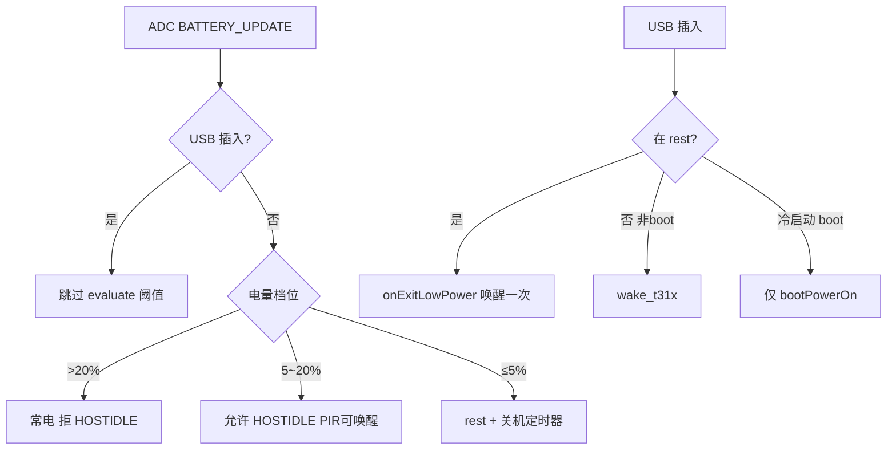

# Lua 模块逻辑分析

> **代码真源**：`user/*.lua`（**58**）+ `lib/*.lua`（**15**）= **73** 个模块（2026-09-03 实测）
> **总行数**：`user/` 13 579 + `lib/` 2 533 = 16 112
> **拆分后治理**：[USER_LIB_FRAMEWORK_OPTIMIZATION_PLAN.md](USER_LIB_FRAMEWORK_OPTIMIZATION_PLAN.md)
> **配置真源**：[`user/config.lua`](../user/config.lua)（+ 10 个 config 片段，见 §1.1）
> **启动顺序**：[`CODE_DOC_AUDIT.md`](CODE_DOC_AUDIT.md) §3 · 调用图 [`CALL_GRAPH.md`](CALL_GRAPH.md)

> **专题索引**：[doc/modules/README.md](modules/README.md) · **API 命名**：[CAT1_API_NAMING.md](CAT1_API_NAMING.md) · **合并/回归**：[PR_MERGE_REGRESSION.md](modules/PR_MERGE_REGRESSION.md)

---

```
main.lua
  ├─ config（编排 10 个 config 片段，全量 _G.X_CFG）
  ├─ cell_boot / usb_rndis（可选，lib/）
  ├─ net_mqtt.bootstrapNet()
  └─ app.start(peripheral, net_mqtt, t31x_ctrl)
         ├─ battery_guard / vbat / usb_charge
         ├─ uart_bridge → host_uart（T31x AT）
         ├─ pir_ctrl / peripheral / led_ctrl
         ├─ net_mqtt（云端唯一入口）
         └─ t31x_ctrl（GPIO22 供电 + GPIO29 唤醒）
```

**设计原则**

| 原则 | 实现 |
|------|------|
| 单 MQTT | 仅 `net_mqtt.lua` |
| 单 UART 驱动 | `lib/uart_bridge` → `user/host_uart` 业务 |
| 配置分层 | `config.lua` 编排 → `features/cellular/gpio_cfg/…` 片段表 → `config_manager` 访问 |
| lib 不反向依赖 user | 策略库通过 `_G` / 事件 / 懒 `require` |
| 事件驱动 | `APP_EVENTS` + `sys.publish/subscribe` |

---

## 1.1 模块树（2026-09-03 实测真源）

> 行数可用 `python tools/debug/_module_tree.py` 刷新。协议 handler **禁止**子模块 `require "host_uart"` / `require "net_mqtt"`。
> 文件都在 `user/` / `lib/` 顶层；文件名即模块名，**无子目录**（旧头注释中的 `config/xxx` 仅表示片段归属）。

### config 配置族（11 文件，全部 `_G.X_CFG` 表）

```
config.lua（26 行编排，按依赖顺序 require 下列片段）
├── features     功能开关宏（FEATURE_CFG，最先加载；RNDIS/低功耗/USB/APP 元信息/运行态种子）
├── cellular     蜂窝 APN 自动/显式 + 搜网复位（CELLULAR_CFG）
├── t31x_burn    t31x 烧录门禁（t31x_BURN_CFG：min_battery/boot_hold/ota_hold）
├── gpio_cfg     GPIO_IN/OUT 引脚 + KEY_CONFIG（勿命名 gpio.lua，与核心库冲突）
├── led_pir      LED/WLED/PIR 冷却与硬件/持久化路径（LED_CFG/WLED_CFG/PIR_CFG…）
├── battery      电量 ADC/滤波/guard 三档 + t31x 唤醒门禁 + 低功耗进入策略（BATTERY_CFG…）
├── host         主机(T31x)侧服务：SOUND/TIME_SYNC/IDENTITY/TFCARD/RECORD/ENCODE/IPC/WAKE
├── net          UART 桥/看门狗/MQTT 客户端/FOTA 地址 + resFotaUrl（UART_CFG/WDT_CFG/MQTT_CFG/FOTA_CFG）
├── flags        MODULE_FLAGS 可选服务裁剪开关
└── events       APP_EVENTS 事件名常量
```

> **注意**：Luatools 不递归扫 config 片段 require，片段须在 `main.lua __LUATOOLS_SCAN_ANCHOR__` 挂名。

### host_uart 族（18 文件，user/）

```
host_uart.lua (692)          ← 锁 / SYS_EVT / state / RX 行分发 / start / bind 编排
├── hif_cmd.lua (382)        ← AT 应答编排（子模块见下，bind 顺序固定）
│   ├── hif_cmd_usb.lua      USBRESET/RNDIS/USBRECOVERY
│   ├── hif_cmd_link.lua     P2P/GB28181/MQTT/SERV
│   ├── hif_cmd_pir.lua      HOSTEVT/PIRSTAT
│   ├── hif_cmd_t31x.lua     RECORD/UPLOAD/IPCSTAT NOTIFY
│   └── hif_cmd_wled.lua     WLED
├── hif_rx.lua (69)          ← URC 行解析编排（hif_cmd 之后 bind）
│   ├── hif_rx_dsl.lua       dsl：云态/TF/录制/IPC 状态行
│   └── hif_rx_media.lua     media：VENC/AUDIO/MIC/FRAMERATE 等编码行
└── hif_ipc.lua (379)        ← IPC query/set 公共路径 + 子模块编排
    ├── hif_ipc_rec.lua      UART 链路恢复 / qryHostStat
    ├── hif_ipc_hostq.lua    RECORD/MIC/SOFTPHOTO query/set
    ├── hif_ipc_cloud.lua    IPC 云状态/GB28181/qryIpcCloudStat
    ├── hif_ipc_power.lua    IPC 上电/关机/ready
    ├── hif_ipc_tffmt.lua    TF format
    └── hif_ipc_encode.lua   编码参数（VENC/AUDIO）
hif_at.lua (87)              ← AT_CMD_TABLE 编译（独立于 hif_cmd，compile(cmd.at)）
```

**主文件 bind 顺序（真源 host_uart.lua）**：`ctx` → `hif_cmd.bind(ctx)`（L466）→ `hif_at.compile(cmd.at)`（L467）→ `hif_rx.bind(ctx)`（L498）→ `hif_ipc.bind(ctx)`（L508）。

### net_mqtt 族（13 文件，user/）

```
net_mqtt.lua (623)           ← mqttTask / pubRaw / notifyPowerOff / 连接态 / DOWNLINK_HANDLERS 汇总
├── mqtt_conn.lua (342)      topic/配置/组网/快照（原 conn 外围已并入）
├── mqtt_uplink.lua (535)    100x 上行 + 1003 interval
│   ├── mqtt_ul_pir.lua      PIR 上行 1010–1012
│   └── mqtt_ul_upload.lua   上传上行 1013
├── mqtt_downlink.lua (191)  2001–2013 下行总线 + 待 t31x 队列
│   ├── mqtt_dl_ctrl.lua     2004 控制（reboot/off/ota/wled）
│   ├── mqtt_dl_dev.lua      2002 rest / 2003 status / 2006 identity
│   ├── mqtt_dl_pir.lua      2010/2011/2012 PIR
│   ├── mqtt_dl_tf.lua       TF 卡查询与格式化
│   └── mqtt_dl_upload.lua   2013 上传视频下行
├── mqtt_dispatch.lua (110)  下行 JSON 分发 + HOSTEVT/USB 钩子
└── mqtt_hproto.lua (473)    2020–2031 host query/set（经 t31x UART）
```

**主文件 bind 顺序（真源 net_mqtt.lua）**：`conn.bind`（L160）→ `mqtt_uplink.bind`（L262）→ `mqtt_downlink.bind`（L266，产出 `DOWNLINK_HANDLERS`）→ `mqtt_dispatch.bind`（L271）。

### 其余 user 模块（16 文件，业务）

| 模块 | 行数 | 职责摘要 |
|------|------|----------|
| `main` | 167 | 入口、VERSION、蜂窝/RNDIS、`app.start`、`sys.run()` |
| `app` | 972 | 事件总线、低功耗/USB/PIR 编排（**冻结不拆**） |
| `pir_ctrl` | 722 | PIR 硬件、录像会话、2010–2012 关联 |
| `battery_guard` | 391 | 电量三档、HOSTIDLE、关机定时器 |
| `t31x_ctrl` | 373 | GPIO22 供电、GPIO29 唤醒、优雅 IPC 关机 |
| `vbat` | 233 | ADC 采样、trim+EMA、百分比/mV |
| `time_sync` | 218 | SNTP → `AT+TIMESET`、唤醒前对时 |
| `fota_svc` | 259 | LuatOS IoT OTA（MQTT 2004 触发） |
| `peripheral` | 178 | PWR/BOOT 长按、coproc_ready、LED 模式、启动 pir_ctrl |
| `ipc_supv` | 190 | `AT+IPCALERT` → 1004/1011、录像对账、1003 IPCSTAT 刷新 |
| `host_event` | 155 | HOSTEVT 待处理汇总（wake/pir/record/mqtt）→ 休眠门禁 |
| `t31x_policy` | 125 | `mayPowerT31x` / `requestT31xWake` 门禁 |
| `t31x_notify` | 87 | 通知辅助：AT 封装、URC 解析、事件上报桥 |
| `lp_wakeup` | 112 | rest 期 TCP/MQTT 行为切换（`onEnterRest/onExitRest`） |
| `sound_prompt` | 131 | 冷启动/关机 `AT+PLAYSOUND` |
| `net_tcp` | 35 | TCP 唤醒桩（默认 MQTT 模式空实现） |

> `t31x_policy` / `t31x_notify` / `host_event` / `lp_wakeup` 位于 **user/**（文档早期曾归 lib/，已修正）。

### lib/ 模块（15 文件，策略/底层/常驻库）

| 文件 | 行数 | 职责 |
|------|------|------|
| `sys.lua` | 394 | LuatOS 协程调度核心（wait/run/publish/subscribe/定时器） |
| `cell_boot.lua` | 373 | 蜂窝引导：SIM/APN、`IP_READY`、运营商映射 |
| `usb_rndis.lua` | 311 | USB 网卡 tethering、IP_READY 刷新 |
| `led_ctrl.lua` | 225 | 蓝/红 LED 模式状态机 |
| `utils.lua` | 196 | JSON/表/字符串通用 helper、`lazyLoad` |
| `runtime_power.lua` | 193 | 工作模式 + USB/充电/电量/在线访问器（`APP_RUNTIME` 唯一入口） |
| `libfota2.lua` | 180 | FOTA 下载引擎（差分协议/断点续传） |
| `usb_charge.lua` | 131 | GPIO27/CHG_STATE 中断 → `GPIO_USB_DET_CHANGED` |
| `uart_bridge.lua` | 109 | 唯一 `uart.setup`；行/原始 RX 回调 |
| `usb_vuart.lua` | 103 | USB 虚拟串口、VCOM、透传 |
| `watchdog.lua` | 94 | 硬件 WDT 初始化与喂狗 |
| `module_loader.lua` | 59 | 懒加载/裁剪/stopAll（`MODULE_FLAGS` 驱动） |
| `config_manager.lua` | 69 | 配置访问（默认值合并、热更新、持久化） |
| `gpio_util.lua` | 59 | `GPIO_IN/OUT` → `gpio.setup` |
| `device_id.lua` | 37 | IMEI / deviceNo |

> 旧名对照：`cellular_bootstrap`→`cell_boot`；`low_power_wakeup`→`user/lp_wakeup`；`usb_policy`/`usb_host_evt` 等已并入 `usb_charge`/config 片段。

---

## 2. 启动与事件总线

### 2.1 `app.start` 关键顺序

1. `battery_guard.start(hooks)` — 注册低电/USB 回调  
2. `setupUartBridge` → `host_uart.start`  
3. `initPowerStatus` — 读 GPIO27，可能 `onUsbInserted`  
4. `t31x_ctrl.start` → `bootPowerOn`  
5. GPIO / PMD / vbat / usb_charge / MQTT / FOTA

> 完整 18 步真源顺序见 [CODE_DOC_AUDIT.md](CODE_DOC_AUDIT.md) §3。

### 2.2 核心事件（`APP_EVENTS`，定义在 config 片段 `events.lua`）

| 事件 | 发布方 | 订阅方 / 作用 |
|------|--------|----------------|
| `GPIO_USB_DET_CHANGED` | `usb_charge` | `app` → `applyUsbPower` |
| `GPIO_PIR_TRIGGERED` | `pir_ctrl` | `app` → MQTT / 唤醒 T31x |
| `PIR_WAKE_T31X` | `pir_ctrl` | `app` → `wakeT31xForPir` |
| `BATTERY_UPDATE` | `vbat` | `battery_guard.evaluate` |
| `POWER_ENTERED_REST` / `POWER_EXITED_REST` | `app` | 低功耗状态广播 |
| `MQTT_OFFLINE` | `net_mqtt` | `app` → 可选唤醒 T31x |
| `T31X_IPC_ALERT` | `host_uart` | `ipc_supv` → 1004 |

---

## 3. `user/` 模块

### 3.1 `main.lua` — 固件入口（167 行）

| 项 | 说明 |
|----|------|
| **职责** | 版本校验、全局 OTA 版本函数、蜂窝/RNDIS 引导、`app.start`、`sys.run()` |
| **导出** | `_G.validateBuildVersion` / `buildIotOtaVersion` / `resolveIotOtaVersion` |
| **逻辑** | `VERSION` 须 `xxx.yyy.zzz`；RNDIS 开启时异步 `open` 后再 `bootstrapNet` |
| **依赖** | `config`, `module_loader`, `app`, `peripheral`, `net_mqtt`, `t31x_ctrl` |

> 注意：`app_config` / `key_config` 已不存在（见下）；`MODULE_FLAGS` 由 config 片段 `flags.lua` 定义。

### 3.2 `config.lua` — 配置编排（26 行）

| 项 | 说明 |
|----|------|
| **职责** | 仅按依赖顺序 `require` 10 个 config 片段，暴露 `_G.X_CFG` 全量配置表 |
| **片段** | `features/cellular/t31x_burn/gpio_cfg/led_pir/battery/host/net/flags/events`（见 §1.1） |
| **访问** | 各模块经 `config_manager`（`cfgm.get`）读取，不直接解构 `_G.X_CFG` |

### 3.3 配置片段要点（拆分自原 config.lua）

| 片段 | 产出 `_G` 表 | 备注 |
|------|--------------|------|
| `features` | `FEATURE_CFG` | **最先加载**；宏开关 RNDIS/LOW_POWER/USB_HOST_EVT 等 |
| `cellular` | `CELLULAR_CFG` | APN `auto`/显式、搜网复位 |
| `t31x_burn` | `t31x_BURN_CFG` | 烧录门禁（min_battery/boot_hold/ota_hold） |
| `gpio_cfg` | `GPIO_IN` / `GPIO_OUT` / `KEY_CONFIG` | 7 路输入 + 输出；勿命名 `gpio.lua` |
| `led_pir` | `LED_CFG`/`WLED_CFG`/`PIR_CFG`/`APP_PERSIST_CFG` | 依赖 `GPIO_IN` |
| `battery` | `BATTERY_CFG`/`LOW_POWER_*` | `LOW_POWER_ENTER_STRATEGY`=`battery` |
| `host` | `SOUND_CFG`/`TIME_SYNC_CFG`/`IDENTITY_CFG`/`TFCARD_CFG`/…/`HOST_WAKE_CFG` | T31x 侧服务 |
| `net` | `UART_CFG`/`WDT_CFG`/`MQTT_CFG`/`FOTA_CFG` | + 全局 `resFotaUrl` |
| `flags` | `MODULE_FLAGS` | 服务裁剪 |
| `events` | `APP_EVENTS` | 事件名常量 |

### 3.4 `app.lua` — 编排中心（972 行）

> 专题：[APP_EVENT_BUS.md](modules/APP_EVENT_BUS.md)

| 项 | 说明 |
|----|------|
| **职责** | 依赖注入、事件订阅、低功耗进/出、USB 边沿、PIR→MQTT 桥、T31x 烧录模式 |
| **导出** | `start`, `startMqtt`, `uartBridge`, `getState`, `setModuleFlag` |

**核心流程**

```
onEnterLowPower(reason)
  → setLowPowerMode(1) → t31x_ctrl.enterSleep → MQTT 1002 → lp_wakeup.onEnterRest

onExitLowPower(reason)
  → setLowPowerMode(0) → requestT31xWake(force) → lp_wakeup.onExitRest
  ※ requestT31xWake 已含 time_sync.pushBeforeNotify 对时，勿重复调用

applyUsbPower(inserted, source)
  插入 → battery_guard.onUsbInserted({source}) + notifyUsbIdle
  拔出 → battery_guard.onUsbRemoved（按电量重评估，高电量不进 rest）
```

**PIR 桥**：`PIR_WAKE_T31X` → `ntfHostIdle` + `requestT31xWake("pir_media")`

### 3.5 `battery_guard.lua` — 电量分档策略（391 行）

| 项 | 说明 |
|----|------|
| **职责** | USB 优先；三档电量；PIR 挂起；4G rest；关机定时器；HOSTIDLE 门禁 |
| **档位** | `normal` (>20%) · `host_idle` (5~20%) · `shutdown` (≤5%) |
| **关键 API** | `evaluate`, `getBatteryTier`, `shdHostSleep`, `canHostSleep`, `ntfHostIdle` |

**evaluate 阶段**（未插 USB）

1. USB → 取消关机，必要时 `onUsbInserted`  
2. `shutdown` 档 → 挂 PIR + `enterBatteryRest` + `scheduleShutdown`  
3. `host_idle` / `normal` → 退出 rest、恢复 PIR，中间档不进 4G rest  

**USB 插入**（`onUsbInserted`）

- 取消关机定时器  
- 若在 rest → `onExitLowPower("usb_insert")`（**唯一**唤醒链）  
- 否则且 `source≠"boot"` → `wake_t31x`（冷启动由 `bootPowerOn` 负责）

### 3.6 `vbat.lua` — 电池 ADC（233 行）

> 专题：[VBAT_FILTER.md](modules/VBAT_FILTER.md)

| 项 | 说明 |
|----|------|
| **职责** | 定时采样、trim+EMA 滤波、百分比/mV/耗电率 |
| **输出** | `BATTERY_UPDATE` 事件 + `APP_RUNTIME.battery_percent/mv` |
| **消费者** | `battery_guard`, `led_ctrl`, MQTT 1003 |

### 3.7 `t31x_ctrl.lua` — 协处理器电源（373 行）

| 项 | 说明 |
|----|------|
| **职责** | GPIO22 上/断电、GPIO29 唤醒脉冲、BOOT/OTA 引脚、优雅 IPC 关机 |
| **休眠** | `enterSleep` → `gracefulPowerOff`（`AT+IPCPOWEROFF`）或 `powerOff`；`sleep_in_progress` 互斥 |
| **唤醒** | `powerOn`/`wake`/`ensurePowered` 前 `waitSleepIdle`，避免与关机竞态 |
| **策略** | `bootPowerOn` 经 `t31x_policy.mayPowerT31x("boot")` |

### 3.8 `host_uart` 族 — T31x AT（主文件 692 行 + 17 子模块）

> 专题：[HOST_UART_AT_DISPATCH.md](modules/HOST_UART_AT_DISPATCH.md)（含 bind 顺序、AT/URC 对照、hif_* 精简说明）  
> API：[CAT1_API_NAMING.md](CAT1_API_NAMING.md) §2.1  
> 静态回归：`python tools/debug/_protocol_regression_check.py`

| 项 | 说明 |
|----|------|
| **唤醒** | `ntfHost(sid, evt)` → `ensPowOn` + `pulseMcuInt`（`mayPowerT31x`） |
| **首 AT** | `onFirstHostAt` → `HOST_UART_FIRST_AT` → `qryIpcCloudStat` / `mergeTfCloud` |
| **休眠门禁** | `AT+HOSTIDLE` → `battery_guard.shouldHostSleep` / `canHostSleep` |
| **USB** | `pushUsbIdle` → `+CAT1:USB,n` |

### 3.9 `net_mqtt` 族 — 云端协议（主文件 623 行 + 12 子模块）

> 专题：[NET_MQTT_DOWNLINK_DISPATCH.md](modules/NET_MQTT_DOWNLINK_DISPATCH.md) · 对外仍只 `require "net_mqtt"`  
> 静态回归：`python tools/debug/_net_mqtt_regression_check.py`

| 项 | 说明 |
|----|------|
| **连接** | `mqttTask` 留主文件；`conack` → `subDownlink` + `startStatReporter` |
| **下行** | `DOWNLINK_HANDLERS`（2002 rest、2010 PIR、2004 OTA…，由 `mqtt_downlink` 族产出） |
| **上行** | `pubStatus`(1003)、`pubRest`(1002)、`pubPirEvent`(1010/1011)（`mqtt_uplink` 族） |
| **关机** | `notifyPowerOff` → 尽量连上 MQTT → 1004 off + 1003 → `pm.shutdown` |
| **约束** | `IP_LOSE` 回调参数用 `ipAdapter`；连接外围用 `mqtt_conn.*`，勿用局部名 `adapter` |

### 3.10 `pir_ctrl.lua` — PIR 与会话（722 行）

| 项 | 说明 |
|----|------|
| **职责** | GPIO 中断、冷却、录像会话、云端启停、PIRSTAT 统计 |
| **流程** | `PIR_HW_TRIGGERED` → `onPirTriggered` → 忽略(suspend/rest) / 发布 `PIR_WAKE_T31X` |
| **rest 中** | 动态侦测 rest 允许 PIR；否则 `requestExitRestForPir` 或忽略 |

### 3.11 `peripheral.lua` / `lib/led_ctrl.lua`

> 专题：[PERIPHERAL_LED_FLOW.md](modules/PERIPHERAL_LED_FLOW.md)

| 模块 | 职责 |
|------|------|
| `peripheral` | 聚合 PWR/BOOT 长按、coproc_ready、LED 模式；启动 `pir_ctrl.startHw` |
| `led_ctrl`（lib/） | 蓝/红 LED 模式：开机序列、低电、离线；读 `usb_charge` 充电态 |

### 3.12 `ipc_supv.lua` — IPC 监管（190 行）

> 专题：[IPC_SUPERVISION_FLOW.md](modules/IPC_SUPERVISION_FLOW.md)

| 项 | 说明 |
|----|------|
| **职责** | `AT+IPCALERT` → 1004；1011 映射；录像对账；1003 IPCSTAT 刷新调度 |
| **历史命名** | 旧称 `ipc_supervision.lua`（8-31 前）/ `ipc_alert_contract.lua` 已合并，真源为 `ipc_supv.lua` |

### 3.13 `time_sync.lua` / `sound_prompt.lua` / `fota_svc.lua`

> 专题：[TIME_SYNC_FLOW.md](modules/TIME_SYNC_FLOW.md) · [SOUND_PROMPT_FLOW.md](modules/SOUND_PROMPT_FLOW.md) · [FOTA_SVC_FLOW.md](modules/FOTA_SVC_FLOW.md)

| 模块 | 职责 |
|------|------|
| `time_sync` | SNTP → `AT+TIMESET`；`pushBeforeNotify` 在唤醒前对时 |
| `sound_prompt` | 冷启动/关机 `AT+PLAYSOUND`；等 `+SOUNDACK` |
| `fota_svc` | LuatOS IoT OTA（MQTT 2004 触发，libfota2 下载引擎） |

### 3.14 `net_tcp.lua` / `lp_wakeup.lua` — 唤醒通道

> 专题：[LOW_POWER_WAKEUP.md](modules/LOW_POWER_WAKEUP.md)

| 模块 | 职责 |
|------|------|
| `net_tcp` | TCP 模式占位（`LOW_POWER_WAKEUP_CFG.mode=="tcp"` 才有行为；默认 MQTT 模式空实现） |
| `lp_wakeup` | rest 期间 `onEnterRest`/`onExitRest` 钩子；抽象 mqtt/tcp 通道（旧称 `low_power_wakeup.lua`） |

---

## 4. `lib/` 模块专题

> 底层驱动专题：[LIB_UART_GPIO.md](modules/LIB_UART_GPIO.md) · USB：[USB_CHARGE_POLICY.md](modules/USB_CHARGE_POLICY.md) · 唤醒：[LOW_POWER_WAKEUP.md](modules/LOW_POWER_WAKEUP.md)

### 4.1 `uart_bridge.lua`（109 行）

> 见 [LIB_UART_GPIO.md](modules/LIB_UART_GPIO.md) §2

底层 UART：`start/stop/write/sendString`、行/原始 RX 回调。唯一硬件串口入口。

### 4.2 `gpio_util.lua`（59 行）

> 见 [LIB_UART_GPIO.md](modules/LIB_UART_GPIO.md) §3

`GPIO_IN/OUT` 配置转 `gpio.setup`：pull、边沿、防抖、输出初始化。

### 4.3 `t31x_policy.lua` / `t31x_notify.lua`（user/，125/87 行）

> 专题：[T31X_POLICY_GATE.md](modules/T31X_POLICY_GATE.md) · 硬件休眠：[T31X_POWER_WAKEUP.md](modules/T31X_POWER_WAKEUP.md)

```
mayPowerT31x(reason)         （t31x_policy）
  USB 插入 → 允许（mqtt_offline 除外可配）
  low_power_mode=1 → 仅 PIR/WLED/exit_low_power 等白名单
  battery ≤ block_wake_below_percent → 拒绝

requestT31xWake → time_sync.pushBeforeNotifyAsync → host_uart.ntfHost
bootPowerOn → t31x_ctrl.powerOn（经 mayPowerT31x("boot")）
```

### 4.4 `usb_charge.lua` / `usb_rndis.lua` / `usb_vuart.lua`（lib/）

> 专题：[USB_CHARGE_POLICY.md](modules/USB_CHARGE_POLICY.md)

| 模块 | 职责 |
|------|------|
| `usb_charge` | GPIO27/CHG_STATE 中断；发布 `GPIO_USB_DET_CHANGED` |
| `usb_rndis` | USB 网卡 tethering、IP_READY 刷新（见 [USB_RNDIS_FLOW.md](modules/USB_RNDIS_FLOW.md)） |
| `usb_vuart` | USB 虚拟串口、VCOM、透传（见 [USB_RNDIS_FLOW.md](modules/USB_RNDIS_FLOW.md)） |

> `usb_policy` 旧文件已并入 `usb_charge` 与 config 片段，无独立模块。

### 4.5 `lp_wakeup.lua`（user/，112 行）

> 专题：[LOW_POWER_WAKEUP.md](modules/LOW_POWER_WAKEUP.md)

抽象 rest 期间 TCP/MQTT 行为：`onEnterRest` 关 TCP 通道；`onExitRest` 恢复。模式 `mqtt`（默认）/ `tcp`。

### 4.6 `host_event.lua`（user/，155 行）

> 专题：[HOST_EVENT_PENDING.md](modules/HOST_EVENT_PENDING.md)

汇总 T31x 待处理业务（wake / pir / record / mqtt）→ `has_event` 供 HOSTIDLE 与 `enterSleep` 门禁。

### 4.7 `cell_boot.lua`（lib/，373 行）

> 专题：[CELLULAR_BOOTSTRAP.md](modules/CELLULAR_BOOTSTRAP.md)

SIM/APN 探测、`IP_READY` 等待、运营商映射。`main` 与 `net_mqtt` 共用（旧称 `cellular_bootstrap.lua`）。

### 4.8 `device_id.lua` / `watchdog.lua`（lib/，37/94 行）

> 专题：[LIB_RUNTIME_UTILS.md](modules/LIB_RUNTIME_UTILS.md)

| 模块 | 职责 |
|------|------|
| `device_id` | IMEI / 显示用 deviceNo |
| `watchdog` | 硬件 WDT 初始化与定时喂狗 |

### 4.9 `runtime_power.lua` / `config_manager.lua` / `module_loader.lua` / `sys.lua` / `libfota2.lua` / `utils.lua`（lib/ 常驻库）

| 模块 | 行数 | 职责 |
|------|------|------|
| `sys` | 394 | LuatOS 调度核心（勿动） |
| `runtime_power` | 193 | `APP_RUNTIME` 嵌套表**唯一读写入口**（访问器收口） |
| `config_manager` | 69 | `cfgm.get/merge/set` 配置访问 |
| `module_loader` | 59 | `load/opt/start/stopAll/enabled`（`MODULE_FLAGS` 裁剪） |
| `libfota2` | 180 | 差分 OTA 下载引擎（勿动） |
| `utils` | 196 | JSON/表/字符串 helper、`lazyLoad` |

---

## 5. 关键交叉流程

### 5.1 电量 × USB × T31（默认 `battery` 策略）


```mermaid
flowchart TD
    A[ADC BATTERY_UPDATE] --> B{USB 插入?}
    B -->|是| C[跳过 evaluate 阈值]
    B -->|否| D{电量档位}
    D -->|>20%| E[常电 拒 HOSTIDLE]
    D -->|5~20%| F[允许 HOSTIDLE PIR可唤醒]
    D -->|≤5%| G[rest + 关机定时器]
    H[USB 插入] --> I{在 rest?}
    I -->|是| J[onExitLowPower 唤醒一次]
    I -->|否 非boot| K[wake_t31x]
    I -->|冷启动 boot| L[仅 bootPowerOn]
```

### 5.2 PIR 录像

```
PIR 中断 → pir_ctrl.onPirTriggered
  → PIR_WAKE_T31X → app.wakeT31xForPir
  → ntfHostIdle + requestT31xWake
  → host_uart.ntfHost → T31x 开始录像
  → AT+RECORD=1 → pir_ctrl 会话 → MQTT 1010/1011
```

### 5.3 低电关机

```
evaluate ≤5% → suspendPir + onEnterLowPower(battery) + scheduleShutdown(3s)
  → notifyPowerOff → MQTT 1004+1003 → pm.shutdown
插 USB → cancelShutdownTimer + onExitLowPower（若已在 rest）
```

---

## 6. 模块依赖矩阵（简表）

| 模块 | 主要 require | 主要被谁调用 |
|------|-------------|-------------|
| `app` | config, uart_bridge, pir_ctrl, battery_guard, host_uart, t31x_policy | `main` |
| `battery_guard` | config, config_manager, pir_ctrl(lazy) | `app`, host_uart, t31x_policy |
| `host_uart` | config, module_loader, uart_bridge, t31x_ctrl(lazy), hif_cmd/hif_at/hif_rx/hif_ipc | `app`, net_mqtt, t31x_policy, ipc_supv |
| `net_mqtt` | config, mqtt_conn/uplink/downlink/dispatch, pir_ctrl, ipc_supv | `main`, `app`, host_event |
| `t31x_ctrl` | config, gpio_util, t31x_policy(lazy) | `main`, `app`, host_uart |
| `t31x_policy` | config, module_loader, usb/电池态 | `app`, t31x_ctrl, host_uart |
| `pir_ctrl` | config, gpio_util, net_mqtt(lazy), host_uart(lazy) | `app`, peripheral, net_mqtt |

---

## 7. 裁剪与扩展

- **裁剪**：config 片段 `flags.lua` → `MODULE_FLAGS`；见 [CAT1_USER_LIB_SLIM.md](CAT1_USER_LIB_SLIM.md)  
- **电量策略切换**：config 片段 `battery.lua` → `LOW_POWER_ENTER_STRATEGY` = `battery` | `hybrid` | `idle_poll`  
- **唤醒通道**：config 片段 `features.lua` → `LOW_POWER_WAKEUP_CFG.mode` = `mqtt` | `tcp`  
- **未实现引用**：无（原 `mobile_info` 引用已随 config 拆分清理）

---

## 8. 相关文档

| 文档 | 内容 |
|------|------|
| [modules/README.md](modules/README.md) | **专题文档索引 + 子模块索引表** |
| [modules/HOST_UART_AT_DISPATCH.md](modules/HOST_UART_AT_DISPATCH.md) | host_uart AT 表与上行应答 |
| [modules/PIR_CTRL_FLOW.md](modules/PIR_CTRL_FLOW.md) | PIR 硬件与会话 |
| [modules/BATTERY_GUARD_TIERS.md](modules/BATTERY_GUARD_TIERS.md) | 电量三档策略 |
| [modules/T31X_POWER_WAKEUP.md](modules/T31X_POWER_WAKEUP.md) | T31x 供电唤醒 |
| [CONFIG.md](CONFIG.md) | 配置字段索引 |
| [CALL_GRAPH.md](CALL_GRAPH.md) | 启动与事件流 |
| [POWER_USB_BATTERY_T31X_LOGIC.md](POWER_USB_BATTERY_T31X_LOGIC.md) | 电量/USB/T31x 决策 |
| [LOW_POWER_ENTER_STRATEGY.md](LOW_POWER_ENTER_STRATEGY.md) | rest vs HOSTIDLE |
| [MQTT_PROTOCOL.md](MQTT_PROTOCOL.md) | 上下行协议 |
| [MQTT_ALL_CMD_FLOW_TEST.md](MQTT_ALL_CMD_FLOW_TEST.md) | 全指令流程与实机结果 |
| [UART_AT_COMMANDS.md](UART_AT_COMMANDS.md) | AT 命令一览 |

---

**版本**：2026-09-03 · 对齐实测真源（user 58 + lib 15 = 73）；`module_tree.py` 可刷新行数
