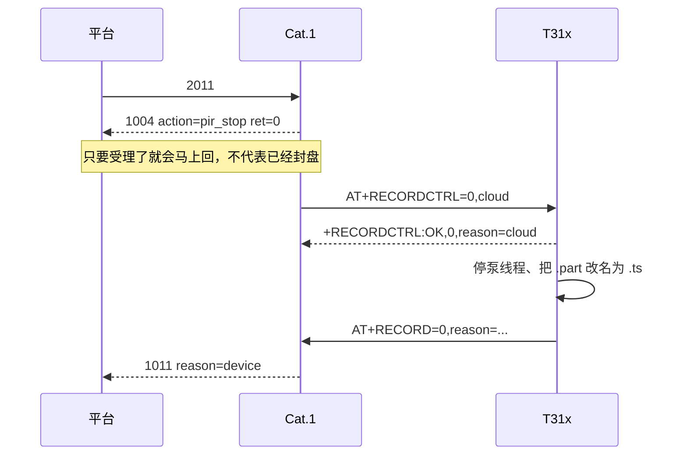

# 2011 停录：两层录像、复位、1004 / 1011 怎么读

> **样机 IMEI**：`862323084068124`  
> **目的**：把「平台发 2011 → 设备停 TF 写盘」拆成能对照日志的步骤。  
> **专题协议**：[mqtt_2011_1011_flow.md](mqtt_2011_1011_flow.md) · [MQTT_CLOUD_REMOTE_CTRL_FLOW.md](MQTT_CLOUD_REMOTE_CTRL_FLOW.md) · [T3X_RECORD_MQTT_FLOW.md](T3X_RECORD_MQTT_FLOW.md)

---

## 0. 先记住三件事

1. **板子上有两颗芯片**，MQTT 只打到 4G；T31x 从不直接收 2011。
2. **「正在录像」有两层**，1010 里两个字段，不要混。
3. **2011 正常会来两条上行**：先 **1004**（受理），再 **1011**（停完）。只看到 1004 不等于 TF 已经封盘。

```text
平台 MQTT
    │  只和 4G 说话
    ▼
Air780EHM（Cat.1 / 4G）     ← 解析 2011，回 1004 / 1011
    │  Host UART（模组 17/18 脚 ↔ T31x UART1）
    ▼
T31x IPC                    ← 真正往 TF 卡写 .ts
```

COM7 是 T31x 的 **调试口**（UART0），和上面这条 Host AT **不是同一根线**。在 COM7 上看不到 `+RECORDCTRL`。  
Host AT 的 TX/RX 写在 T31 上：**`/tmp/ipc/cat1_uart.log`**（`tail -f /tmp/ipc/cat1_uart.log`）。

---

## 1. 两层「正在录像」

| 层 | 谁维护 | 1010 / 1003 字段 | 含义 |
|----|--------|------------------|------|
| **PIR / 平台会话** | Cat.1 `pir_ctrl` | **`recording`** | 4G 认为「这一段事件录」还开着（PIR 或 2012 开的） |
| **TF 全天写盘** | T31x `record_*` | **`recordingT3x`** | IPC 正在往卡上写 `ch0_开始.ts.part` |

现场常见：`record_mode=1` 开机就全天写盘 → **`recordingT3x=1`**。  
这时若没有 PIR 会话，旧脚本只看 `recording`，会误报 `not_recording`。现行逻辑：没有 PIR 会话也会对 T31x 发停录。

TF 上的文件：

| 文件 | 含义 |
|------|------|
| `ch0_YYYYMMDDHHMMSS.ts.part` | **正在写**，检索/回放应跳过 |
| `ch0_开始_结束.ts` | **已封口**，停录成功的标志 |

---

## 2. 平台发 2011 之后，正确顺序

下行（Publish `/panshi/device/{IMEI}/`）：

```json
{"dataType":"2011","messageId":"stop-001"}
```

上行都在 `/panshi/app/{IMEI}/event`：



怎么读结果：

| 你看到的 | 含义 |
|----------|------|
| **马上 1004 `ret=0`** | Cat.1 受理了停录 |
| **1004 `ret=-1` `timeout`** | Cat.1 在等 T31x 的 `+RECORDCTRL`，超时了（旧脚本 8 秒） |
| **1004 `ret=-1` `not_recording`** | 两层都没在录 |
| **随后 1011** | 停录这件事对平台结案 |
| **1010 `recordingT3x=0` 且卡上无 `.part`** | T31x 真正停写并封盘 |
| **只有 1004、没有 1011** | 可能已停盘，但 4G 没把 1011 发出去（见 §6） |

`message` 常见值：

| 1004 `message` | 含义 |
|----------------|------|
| `ok` | 当时有 **PIR 会话**，先结束会话再去停 T31x |
| `t3x_stop` / `t3x_stopped` | 没有 PIR 会话，停的是 **T31x 全天写盘** |

工具里不要用会先命中 `2011pre` 的 `--send 2011`（`dataType` 相同，id 却在 extra 里）。按命令 **id=`2011`** 发。

---

## 3. 为什么 `2004 reboot` 等于给 T31x 冷启动

原理图 `ps01masch260318.pdf`：

- T31x 的 0.8V / 1.8V / 3.3V DCDC **EN** 都接到 **`CPU_PWR_EN`**
- `CPU_PWR_EN` 接到 Air780 **Pin19 / GPIO22**
- Cat.1 `pm.reboot()` 时 GPIO 掉默认电平 → **T31x 整板掉电**
- 4G 起来后再拉高 GPIO22 → T31x 重新上电

所以 **2004 reboot 不是「只重启 4G」**，T31x 是冷启动，不是 AT 软复位。  
COM7 会重新 `login`，`ipc` 会换 PID。全天录会重新建一个 `.part`。

Host AT（停录用）和 COM7（调试用）仍然是两条串口。

---

## 4. 复位后 2011 曾经失败的原因

当时链路已经通：2007 能查到卡，2010q 显示 `recordingT3x=1`。  
2011 却变成 **1004 `ret=-1 timeout`，没有 1011**，卡上 `.part` 写了一小段就停涨。

根因叠了三层：

```text
T31x 写盘泵线程卡在 fwrite/fsync（TF 慢或线程已死）
        │
        ▼
record_stop 要 pthread_join 泵线程（最长约 15 秒）
再抢同一把 ch_ctx->mutex 去做 fsync 封盘
        │
        ▼
Cat.1 旧逻辑：先等 +RECORDCTRL，默认只等 8 秒，再回 1004
        │
        ▼
8 秒内 T31x 回不了包 → 平台只看到 timeout
若锁永远拿不到 → Host UART 一直堵死，连 +RECORDCTRL 都没有
```

`.part` 停涨但 `recordingT3x` 仍为 1：T31x **以为还在录**，泵其实已经不写了。

---

## 5. 两边各改了什么

### 5.1 Cat.1 脚本 `001.000.011`（本仓库 `user/`，样机当时还是 `001.000.010`）

- 停录等待从 **8 秒改为 22 秒**（`HOST_RECORD_CFG.record_stop_timeout_ms`）
- **先回 1004**，再等 `AT+RECORDCTRL`（平台不会被 UART 拖死）
- T31x 停成功或查询已空闲后补 **1011**
- 解析兼容 `+RECORDCTRL:OK,0`（可以不带 reason）

刷脚本：设备进 BOOT 后 `python tools/cat1_flash.py flash-script`。  
用 2008 看 `scriptVersion` 是否为 `001.000.011`。

### 5.2 T31x `ipc`（编译机 `192.168.1.8` … `/ipc_device_ini`，设备 `/system/nfs/ipc`）

- **先回** `+RECORDCTRL:OK,0,reason=...`，再做 `record_stop`
- 停录锁最多等 **2 秒**；超时则强制 `running=0`，避免 Host UART 死等
- 云端停录封盘 **不再 fsync**（避免 TF 再卡住）
- `running` 已经是 0 但磁盘上还有 `.part` 时，**仍然改名封口**（避免第二次 stop 直接返回、文件永远是 `.part`）

推送：`python tools/t31x/t31x_lrz_push.py --restart`（COM7，约 10 分钟）。  
推完必须确认 **新 PID 的 `/proc/PID/exe` 指向 `/system/nfs/ipc`**，不能是 `(deleted)`。旧进程占着已删文件时，killall 可能杀不掉，需要 `kill -9`。

---

## 6. 实机对照（2026-08-17）

新 ipc 起来之后发 2011：

| 时刻 | 现象 |
|------|------|
| 13:39:11 | 2011 → **1004 `pir_stop ret=0 message=ok`**（当时有 PIR 会话） |
| 13:39:11 | 卡上文件封成 `ch0_20260817133846_20260817133911.ts` |
| 13:39:17 | PIR `media_sync`，4G 又认为在录 |
| 13:39:37 | 2010q：**`recording=0` 且 `recordingT3x=0`**，无 `.part` |

结论（当时）：

- **T31x 停录 + 封盘已经成功。**
- **1011 没来**：样机 Cat.1 仍是 `001.000.010`。有 PIR 会话时它把 1011 交给「等 T31x `AT+RECORD=0` + 15 秒兜底」。几秒后 PIR 又拉起会话，兜底被取消。

### 6.1 刷 `001.000.011` 后再测（同日 13:54）

免 BOOT 烧脚本区后，2008：`scriptVersion=001.000.011`。

| 时刻 | 现象 |
|------|------|
| 13:54:52 | 2010q：`recording=1` 且 `recordingT3x=1` |
| 13:54:52 | 2011 → **1004 `pir_stop ret=0 message=t3x_stop`**（当时没有 PIR 会话，停的是 T31x 全天写盘） |
| 13:54:52 | **1011** `reason=device source=4g`，`messageId` 与 2011 相同 |
| 13:54:52 | 立刻再 2010q：两层仍可能是 1（T31x **先 ACK 再封盘**，状态还没刷完） |
| 13:55:39 | 2010q：**`recording=0` 且 `recordingT3x=0`** |

结论：Cat.1 `011` + 新 ipc 后，2011 会立刻 1004+1011，不再 timeout；停录是否完成以 **数秒后的 `recordingT3x`** 为准。

---

## 7. 建议怎么测

1. 2008：确认脚本版（目标 `001.000.011`）。
2. 2007：`tfPresent=1`。
3. 2010q：看 `recording` / `recordingT3x`。
4. 按 **id=`2011`** 发停录（加 `--danger`），等 1004；再等最多约 20 秒看 1011。
5. 再 2010q：希望 `recordingT3x=0`。
6. COM7：`ls /mnt/sdcard/media/vi0/当天/`，不应再有正在涨的 `.part`。

测复位闭环时：2004 reboot → 等 1001 → 2007 / 2010q → 再 2011。  
不要用 `--run-all` 里会先发 `2011pre` 的路径。不要随手 2009 格式化、2004 off。

PIR 很勤时，2011 刚停、几秒后又会 `detected` / `retrigger`。看停录成不成功，以 **`recordingT3x` 和 `.ts` 封口** 为准，不要只看瞬间的 `recording=1`。

---

## 8. 和旧文档的关系

| 文档 | 读什么 |
|------|--------|
| 本文 | 两层录像、复位掉电、超时原因、1004/1011 怎么判、联调结论 |
| [mqtt_2011_1011_flow.md](mqtt_2011_1011_flow.md) | 2011/1011 字段与 PIR 会话代码路径 |
| [MQTT_CLOUD_REMOTE_CTRL_FLOW.md](MQTT_CLOUD_REMOTE_CTRL_FLOW.md) | `AT+RECORDCTRL` 与 2011/2012 |
| [T3X_RECORD_MQTT_FLOW.md](T3X_RECORD_MQTT_FLOW.md) | 术语：停的是 TF 本地写盘，不是「云端录像」 |
