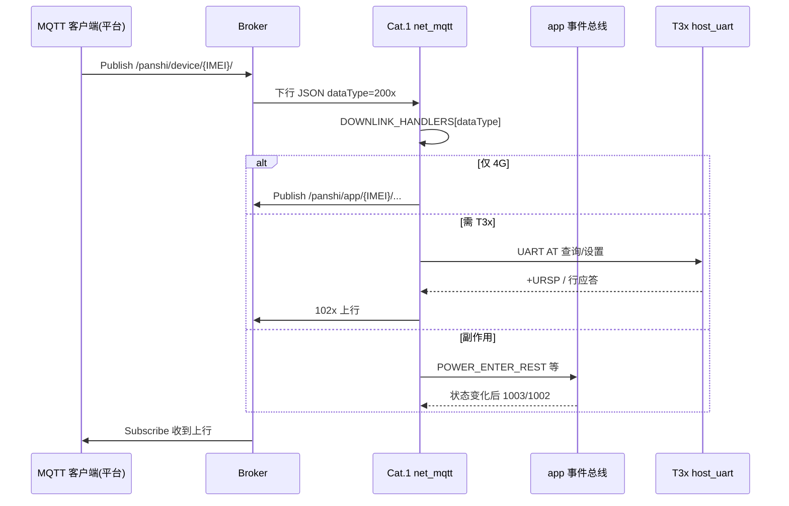

# MQTT 客户端端到端联调指南

> **用途**：用 MQTTX / MQTT.fx / `mosquitto_pub` 从**平台侧**向 Broker 下发 JSON，验证 **Broker → Cat.1 →（可选 T3x）→ 上行应答** 全链路。  
> **下行字段全集**：[MQTT_DOWNLINK.md](MQTT_DOWNLINK.md) · **抄录单行 JSON**：[MQTT_DOWNLINK_862323084068124.txt](MQTT_DOWNLINK_862323084068124.txt)  
> **代码分发**：[modules/NET_MQTT_DOWNLINK_DISPATCH.md](modules/NET_MQTT_DOWNLINK_DISPATCH.md) · **实机勾选表**：[modules/PR_MERGE_REGRESSION.md](modules/PR_MERGE_REGRESSION.md) §4.3

将下文 `{IMEI}` 替换为设备 IMEI（`mobile.imei()` / 1003 `deviceNo`），示例：`862323084068124`。

---

## 1. 链路总览



| 角色 | MQTT ClientId | Publish 主题 | Subscribe 主题 |
|------|---------------|--------------|----------------|
| **Cat.1 设备** | `{IMEI}`（与 IMEI 相同） | `/panshi/app/{IMEI}/…` | `/panshi/device/{IMEI}/` |
| **平台测试客户端** | `platform-test-001` 等（**勿与 IMEI 相同**） | `/panshi/device/{IMEI}/` | `/panshi/app/{IMEI}/#` |

> 两个连接使用**相同 ClientId** 会互踢；测试端必须用不同 ClientId。

---

## 2. Broker 连接参数

真源：[`user/config.lua`](../user/config.lua) `MQTT_CFG`（T3x 可通过 `AT+MQTTCFG` 覆盖，联调前用 2003 确认设备实际连的 Broker）。

| 项 | 默认值 |
|----|--------|
| Host | `112.86.146.218` |
| Port | `2123` |
| SSL | 关闭 |
| Username | `fptop1` |
| Password | `fptop1.com2025@#$&` |
| 设备 ClientId | `{IMEI}` |
| QoS | 建议 **1**（上下行） |

---

## 3. MQTTX / MQTT.fx 配置步骤

### 3.1 新建「平台测试」连接

1. ClientId：`platform-test-{你的名字}`  
2. 填 Broker / 用户名 / 密码，**不要**填设备 IMEI 作 ClientId  
3. 连接成功后先 **Subscribe**（见下），再 **Publish** 下行  

### 3.2 Subscribe（收设备上行）

| 字段 | 值 |
|------|-----|
| Topic | `/panshi/app/{IMEI}/#` |
| QoS | 1 |

可只看状态：Subscribe `/panshi/app/{IMEI}/status`。

### 3.3 Publish（发平台下行）

| 字段 | 值 |
|------|-----|
| Topic | `/panshi/device/{IMEI}/` |
| QoS | 1 |
| Payload | UTF-8 JSON **单行**，必须含 `"dataType"` |

**常见错误**：把查询/控制 Publish 到 `/panshi/app/...` — `app` 是设备**上报**路径，平台只 Subscribe，不往 `app` Publish。

### 3.4 命令行（mosquitto）

```bash
# 环境变量
export IMEI=862323084068124
export BROKER=112.86.146.218
export PORT=2123
export USER=fptop1
export PASS='fptop1.com2025@#$&'

# 订阅上行（另开终端）
mosquitto_sub -h "$BROKER" -p "$PORT" -u "$USER" -P "$PASS" \
  -i "platform-test-cli" -q 1 \
  -t "/panshi/app/${IMEI}/#" -v

# 下发状态查询
mosquitto_pub -h "$BROKER" -p "$PORT" -u "$USER" -P "$PASS" \
  -i "platform-test-cli" -q 1 \
  -t "/panshi/device/${IMEI}/" \
  -m '{"dataType":"2003","messageId":"test-001"}'
```

---

## 4. 冒烟测试（建议顺序）

每步：Publish 下行 → 在 Subscribe 窗口看上行 → 对照「预期」列。

| 步骤 | 下行 Publish | 预期上行 | 备注 |
|------|--------------|----------|------|
| **S0** | （仅上电） | conack 后 `1001` 或 rest 下 `1002`+`1003` | 无需下发 |
| **S1** | `{"dataType":"2003"}` | `1003` @ `.../status` | 确认在线、`remainPower`、`lowPowerMode` |
| **S2** | `{"dataType":"2001"}` | `1001` @ `.../wakeup` | rest 下也会答 1001，**不代表已出 rest** |
| **S3** | `{"dataType":"2005"}` | `1005` @ `.../sim` | IMEI/ICCID/CSQ |
| **S3a** | `{"dataType":"2008"}` | `1008` @ `.../version` | 固件版本，秒回 |
| **S4** | `{"dataType":"2004","action":"wled_query"}` | `1004` @ `.../event`，`reply:1` | 需 T3x 或缓存 |
| **S5** | `{"dataType":"2010","action":"query"}` | `1010` @ `.../pir` | 4G 侧 PIR 状态 |
| **S6** | `{"dataType":"2020"}` | `1020` @ `.../encode` | **需 T3x 在线** |
| **S7** | `{"dataType":"2002","lowPowerMode":"exit"}` | 随后 `1003` 中 `lowPowerMode`→常电；或 `1002` exit | USB 插入时 enter 无效 |

### 4.1 读 `1003` 关键字段

```json
{
  "deviceNo": "862323084068124",
  "dataType": "1003",
  "remainPower": "85",
  "batteryMv": "3850",
  "lowPowerMode": "normal",
  "usbInserted": 0,
  "charging": 0,
  "interval": 30,
  "ipcReady": 1,
  "timeSynced": 1
}
```

| 字段 | 含义 |
|------|------|
| `lowPowerMode` | `normal` / `rest`（与 2002、电量策略相关） |
| `remainPower` / `batteryMv` | ADC 滤波后电量 |
| `usbInserted` / `charging` | GPIO27 / 充电态 |
| `interval` | 周期上报间隔（秒），2003 可改 |
| `ipcReady` / `recordingT3x` 等 | IPC 扩展（见 IPC 专题） |

设备还会按 `interval`（默认 30s）**主动** Publish `1003`，不必每次手动 2003。

---

## 5. 分场景测试包

### 5.1 控制与生命周期（2004）

**Publish** → `/panshi/device/{IMEI}/`

```json
{"dataType":"2004","action":"reboot","messageId":"ctl-001"}
```

```json
{"dataType":"2004","action":"off","messageId":"ctl-002"}
```

```json
{"dataType":"2004","action":"wled_query","messageId":"ctl-003"}
```

```json
{"dataType":"2004","action":"wled_on","messageId":"ctl-004"}
```

```json
{"dataType":"2004","action":"wled_off","messageId":"ctl-005"}
```

```json
{"dataType":"2004","action":"ota","version":"001.000.004","messageId":"ctl-006"}
```

| action | 上行 | 副作用 |
|--------|------|--------|
| `reboot` | `1004` `reply:1` `ret:0` | 设备重启 |
| `off` | `1004` ok | 关机 |
| `wled_query` / `wled_on` / `wled_off` | `1004` 含 `wled` 字段 | 可能唤醒 T3x |
| `ota` | `1004` `ota_accepted`；后续 `stage` | FOTA 下载，成功重启 |

`version` 须 `xxx.yyy.zzz` 格式（见 `main.lua` `validateBuildVersion`）。

### 5.2 低功耗 rest（2002）

```json
{"dataType":"2002","lowPowerMode":"enter","messageId":"lp-001"}
```

```json
{"dataType":"2002","lowPowerMode":"exit","messageId":"lp-002"}
```

| 条件 | enter 行为 |
|------|------------|
| **USB 已插入** | **静默忽略**（无 1002），见 `usb_policy.blocks4gRest` |
| 常电 + 允许低功耗 | `POWER_ENTER_REST` → T3x sleep → 上行 `1002` + `1003` |

退出 rest 后看 `1003.lowPowerMode` 是否回到 `normal`；T3x 应被唤醒一次（USB 场景有去重逻辑，见电量专题）。

### 5.3 状态与周期（2003）

```json
{"dataType":"2003","messageId":"st-001"}
```

```json
{"dataType":"2003","interval":60,"messageId":"st-002"}
```

应答 `1003` 带 `"ret":0,"message":"ok"` 且 `interval` 变为 60；之后周期上报间隔改变。

### 5.4 PIR / 录像（2010–2012）

```json
{"dataType":"2010","action":"query","messageId":"pir-001"}
```

```json
{"dataType":"2010","action":"video","uploadMode":"auto","quality":"high","videoMaxDurationSec":60,"messageId":"pir-002"}
```

```json
{"dataType":"2012","action":"video","uploadMode":"auto","quality":"high","messageId":"pir-003"}
```

```json
{"dataType":"2011","messageId":"pir-004"}
```

| 下行 | 上行 | 说明 |
|------|------|------|
| 2010 query | 1010 | `pirStatus` 等 |
| 2010 config | 1010 `config_ok` | 写 `pir_ctrl` 策略 |
| 2012 | 1012 @ event + 可能唤醒 T3x | 云端开录 |
| 2011 | 1011 @ event | 云端停录 |

### 5.5 T3x 查询/设置（2020–2031）

**T3x 休眠时**：下行仍被接受，入 `pendingHostQueue`，唤醒 T3x 后自动 drain 再发 102x（等待可能 5–15s）。

查询编码：

```json
{"dataType":"2020","messageId":"enc-001"}
```

设置编码（字段见 [REMOTE_ENCODE_CONFIG.md](REMOTE_ENCODE_CONFIG.md)）：

```json
{"dataType":"2021","videoEncode":"h264","messageId":"enc-002"}
```

| 下行 | 上行主题 suffix | 需 T3x |
|------|-----------------|--------|
| 2022 / 2023 | `record` | 是 |
| 2024 / 2025 | `framerate` | 是 |
| 2026 / 2027 | `personDetect` | 是 |
| 2028 / 2029 | `mic` | 是 |
| 2030 / 2031 | `softPhoto` | 是 |

查询模板：

```json
{"dataType":"2022","messageId":"q-2022"}
```

```json
{"dataType":"2024","messageId":"q-2024"}
```

```json
{"dataType":"2026","messageId":"q-2026"}
```

### 5.6 设备标识 / 存储（2006–2009）

```json
{"dataType":"2006","messageId":"id-001"}
```

```json
{"dataType":"2007","messageId":"tf-001"}
```

```json
{"dataType":"2009","messageId":"tfmt-001"}
```

上行：`1006` @ `identity`，`1007` @ `tfcard`，格式化进度见 OTA/TF 专题文档。

---

## 6. 上行主题速查

| dataType | 主题 suffix | 典型触发 |
|----------|-------------|----------|
| 1001 | `wakeup` | 2001、conack 常电 |
| 1002 | `rest` | 2002 enter/exit 成功后 |
| 1003 | `status` | 2003、周期、插 USB |
| 1004 | `event` | 2004 应答、OTA stage、ipc_alert |
| 1005 | `sim` | 2005 |
| 1006 | `identity` | 2006 |
| 1007 | `tfcard` | 2007 |
| 1010 | `pir` | 2010、PIR 检测 |
| 1011 / 1012 | `event` | 停录/开录 |
| 1020–1031 | 见 [MQTT_DOWNLINK.md §2](MQTT_DOWNLINK.md#2-200x--100x-对照) | 2020–2031 |

**1004 区分**：`"reply":1` 为下行应答；含 `"stage"` 为 OTA 进度；`action":"ipc_alert"` 为 T3x 告警。

---

## 7. 与电量/USB 策略联调

联调 [BATTERY_GUARD_TIERS.md](modules/BATTERY_GUARD_TIERS.md) / [USB_CHARGE_POLICY.md](modules/USB_CHARGE_POLICY.md) 时，用 **2003** 观察：

| 操作 | 观察 `1003` |
|------|-------------|
| 插 USB | `usbInserted:1`；再发 `2002 enter` 应**无** rest |
| 拔 USB（高电量） | 不一定立即 `lowPowerMode:rest` |
| 电量 ≤5% | `remainPower` 低；rest + 可能关机 |
| 5~20% PIR 后 | T3x 唤醒；30s 内 HOSTIDLE 行为（UART 侧） |

---

## 8. 故障排查

| 现象 | 可能原因 | 处理 |
|------|----------|------|
| Publish 后无任何上行 | Topic 写成 `/panshi/app/...` | 下行必须用 `device` |
| Publish 后无任何上行 | 下行 Topic 无尾斜杠 | 设备已订阅 `/panshi/device/{IMEI}/#`，两种均可；仍无响应查日志 `mqtt_rx` |
| Publish 后无应答但有 `mqtt_rx` | recv 回调内 publish 失败（旧固件） | 升级含 `mqtt_pub` 队列发布的 `net_mqtt` |
| 设备频繁掉线 | 测试 ClientId = IMEI | 改掉测试端 ClientId |
| JSON 无响应 | 缺 `dataType` 或非法 JSON | 查设备日志 `json_decode_error` / `no_data_type` |
| `unknown_data_type` | 未实现的 200x | 查 [NET_MQTT_DOWNLINK_DISPATCH](modules/NET_MQTT_DOWNLINK_DISPATCH.md) 表 |
| 2002 enter 无反应 | USB 插入 | 看 `1003.usbInserted` |
| 202x 很久才回 | T3x 休眠 | 等唤醒 drain；或先 `2002 exit` / PIR 唤醒 |
| 202x 无响应 | T3x 未上电 / UART 忙 | 查 T3x 供电、host_uart 日志 |
| 有 1001 但仍 rest | 2001 仅查询唤醒应答 | 以 `1003.lowPowerMode` 为准 |
| 收不到周期 1003 | 未 conack / interval 过大 | 等 30s 或改 `2003 interval` |

设备侧日志 TAG：`net_mqtt`（`mqtt_rx`、`downlink_200x`、`publish_1003_status`）。

---

## 9. 测试记录模板

```text
日期：
IMEI：{IMEI}
测试客户端 ClientId：
Broker：112.86.146.218:2123

[ ] S1 2003 → 1003
[ ] S2 2001 → 1001
[ ] S4 2004 wled_query → 1004
[ ] S6 2020 → 1020（T3x 在线）
[ ] 2002 enter/exit + 1003.lowPowerMode
[ ] 2012 → 1012 / 2011 → 1011
[ ] USB 插入时 2002 enter 被拒绝

备注：
```

完整回归勾选见 [PR_MERGE_REGRESSION.md §4](modules/PR_MERGE_REGRESSION.md#4-实机回归清单)。

---

## 10. 相关文档

| 文档 | 内容 |
|------|------|
| [MQTT_DOWNLINK.md](MQTT_DOWNLINK.md) | 每条 200x 字段说明与示例 |
| [MQTT_PROTOCOL.md](MQTT_PROTOCOL.md) | 协议总规范 |
| [MQTT_CLOUD_REMOTE_CTRL_FLOW.md](MQTT_CLOUD_REMOTE_CTRL_FLOW.md) | 远程控制时序 |
| [modules/NET_MQTT_DOWNLINK_DISPATCH.md](modules/NET_MQTT_DOWNLINK_DISPATCH.md) | 代码分发表 |
| [modules/APP_EVENT_BUS.md](modules/APP_EVENT_BUS.md) | 2002 触发的 app 事件 |

---

**文档版本**：2026-06-30 · 与 `user/net_mqtt.lua` / `MQTT_CFG` 同步
