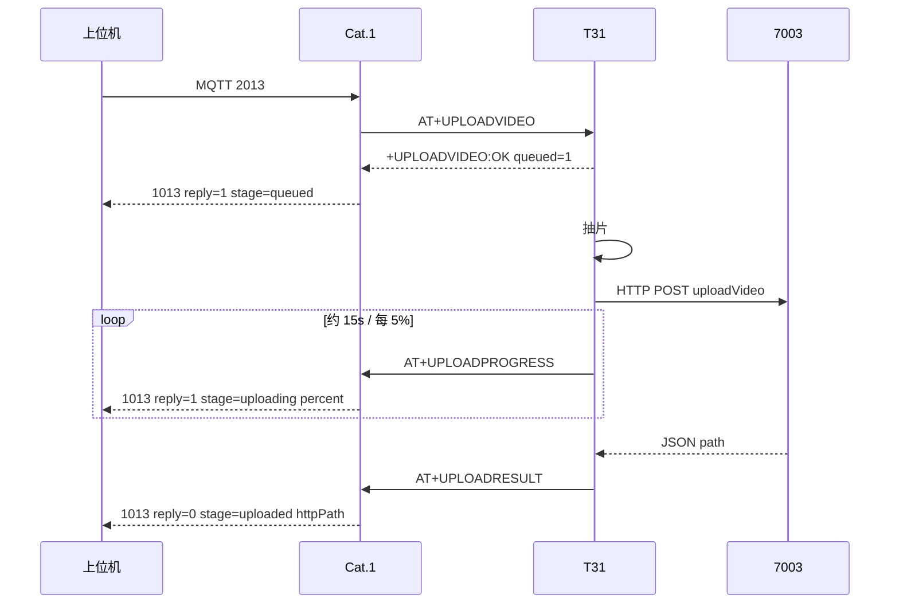

# 回放上传闭环：下发 → 开始 → 进度 → 完成

> **日期**：2026-08-21  
> **范围**：平台 / 上位机 · Cat.1 · T31 IPC · HTTP 7003  
> **对照**：信令字段见 [MQTT_2013_1013_UPLOAD_VIDEO.md](MQTT_2013_1013_UPLOAD_VIDEO.md)；抽片与人形见 [MQTT_CLIP_UPLOAD_DETECT_PLAYBACK.md](MQTT_CLIP_UPLOAD_DETECT_PLAYBACK.md)；串口表见 [UART_AT_COMMANDS.md](UART_AT_COMMANDS.md)

MQTT **不传文件**。文件由 T31 HTTP 传到 `http://112.86.146.218:7003/admin/api/v1/uploadVideo`。本页描述 **信令闭环**：平台能看见「已下发 / 已开始 / 上传中百分比 / 完成或失败」。

---

## 1. 三端角色

| 端 | 职责 |
|----|------|
| **上位机 / 后台** | 下行 **2013**；订阅 `/panshi/app/{IMEI}/event` 上的 **1013**；按 `messageId` 把受理、进度、完成串成一条任务 |
| **Cat.1** | 2013 → `AT+UPLOADVIDEO`；T31 入队后立刻发 1013 `stage=queued`；解析 `AT+UPLOADPROGRESS` / `AT+UPLOADRESULT` 再转 1013 |
| **T31 IPC** | 抽片、HTTP 上传；HTTP 过程发 `AT+UPLOADPROGRESS`；结束发 `AT+UPLOADRESULT` |

上位机：

| 工具 | 入口 |
|------|------|
| Python（全功能） | `tools/mqtt_tools_gui.bat --tab playback` |
| Java（回放闭环） | `tools/mqtt_tools_gui_java.bat`（需 JDK 11+） |

---

## 2. 总流程

```text
平台 / GUI
  └─ MQTT 2013  dataType=2013  videoType=2  beginTs/endTs  messageId=play-…
        │  主题 /panshi/device/{IMEI}/
        ▼
Cat.1  dispatchDl2013
  └─ UART  AT+UPLOADVIDEO=1,2,<start>,<end>,<maxSec>,<messageId>
        │
        ▼
T31  clip_upload_request 入队
  └─ 应答  +UPLOADVIDEO:OK,queued=1
        │
        ▼
Cat.1 立刻 MQTT 1013
  └─ reply=1  stage=queued     ← 【开始 / 已排队】还没开始 HTTP
        │
        ▼
T31 抽 I 帧 → HTTP POST 7003
  ├─ UART  AT+UPLOADPROGRESS=pct=0,stage=start
  ├─ UART  AT+UPLOADPROGRESS=pct=N,stage=uploading     （约 15s 或每 5%）
  └─ UART  AT+UPLOADPROGRESS=pct=100,stage=waiting_resp  （body 已发完，等 7003 JSON）
        │  Cat.1 先回 +UPLOADPROGRESS:ok，再 MQTT
        ▼
Cat.1 MQTT 1013
  └─ reply=1  stage=uploading|waiting_resp|start
       percent / sentBytes / totalBytes           ← 【上传中 / 进度】
        │
        ▼
T31 HTTP 结束
  └─ UART  AT+UPLOADRESULT=ret=0|−1,...,msg=uploaded|upload_fail|…
        │
        ▼
Cat.1 MQTT 1013
  └─ reply=0  stage=uploaded|fail  + fileName / httpPath   ← 【完成】
```

主题：上行一律 `/panshi/app/{IMEI}/event`，`dataType=1013`。  
**同一任务**的 queued / 进度 / 完成共用 2013 的 **`messageId`**。



---

## 3. 各阶段 MQTT 1013

### 3.1 下发 2013

主题：`/panshi/device/{IMEI}/`

```json
{
  "dataType": "2013",
  "messageId": "play-1787298685-4ab8",
  "action": "upload_video",
  "needUpload": 1,
  "reason": "cloud",
  "videoType": 2,
  "beginTs": 1787296950,
  "endTs": 1787297250,
  "beginTime": "2026-08-21 15:22:30",
  "endTime": "2026-08-21 15:27:30"
}
```

- 单条最长 **600 秒**；更长由上位机拆多条 2013。
- **必须带 `beginTs`/`endTs`**（本机 Unix 秒）。

### 3.2 开始 — `reply=1` `stage=queued`

Cat.1 收到 `+UPLOADVIDEO:OK` 后**立刻**发，**不经过** `AT+UPLOADRESULT`。  
只表示 T31 **已入队**，不是文件已到 7003。

```json
{
  "dataType": "1013",
  "reply": 1,
  "stage": "queued",
  "messageId": "play-1787298685-4ab8",
  "ret": 0,
  "message": "ok",
  "needUpload": 1,
  "action": "upload_video",
  "videoType": 2
}
```

| `ret` / `message` | 含义 |
|-------------------|------|
| `0` / `ok` | 已排队，进入闭环等待进度/完成 |
| `0` / `cancelled` | `needUpload=0` |
| `-1` / `t3x_not_ready` | T31 未就绪，**不会**抽片 |

旧固件可能没有 `stage` 字段：`reply=1` 且无 `percent` 即本档。

### 3.3 上传中 / 进度 — `reply=1` `stage=uploading|start|waiting_resp`

T31 HTTP 回调 → `AT+UPLOADPROGRESS` → Cat.1 立刻 ACK，再发 1013。  
**不要**把这类包当成完成（`reply` 仍是 `1`）。

```json
{
  "dataType": "1013",
  "reply": 1,
  "stage": "uploading",
  "percent": 58,
  "sentBytes": 16777216,
  "totalBytes": 28871327,
  "messageId": "play-1787298685-4ab8",
  "ret": 0,
  "message": "uploading",
  "needUpload": 1,
  "action": "upload_video",
  "videoType": 2,
  "fileName": "34020000001310267610-20260821-1787298684193.ts"
}
```

| `stage` | 何时 | GUI |
|---------|------|-----|
| `start` | HTTP 即将开始，`percent` 多为 0 | 进度条 0%，已离开 queued |
| `uploading` | 正在发 body | 刷 `percent` |
| `waiting_resp` | 字节已发完，等 7003 回 JSON | 进度 100%，**仍未完成** |

上报节奏：约 **15 秒** 一条，或 **每增加 5%** 一条。Cat.1 先回 `+UPLOADPROGRESS:ok`，避免拖死 T31 的 curl。

旧固件 **没有** 本档：GUI 会一直停在 queued，直到 `reply=0`（弱网大文件可能数分钟～几十分钟）。

### 3.4 完成 — `reply=0` `stage=uploaded|fail`

```json
{
  "dataType": "1013",
  "reply": 0,
  "stage": "uploaded",
  "messageId": "play-1787298685-4ab8",
  "ret": 0,
  "message": "uploaded",
  "needUpload": 1,
  "action": "upload_video",
  "reason": "cloud",
  "source": "t3x",
  "videoType": 2,
  "fileName": "34020000001310267610-20260821-1787298684193.ts",
  "httpPath": "/apps/video/playback/....ts",
  "uploadTs": "1787298684193"
}
```

| `stage` | `ret` | `message` | 含义 |
|---------|-------|-----------|------|
| `uploaded` | `0` | `uploaded` | HTTP 成功，用 `httpPath` |
| `fail` | `-1` | `upload_fail` | HTTP 失败且重试用尽 |
| `fail` | `-1` | `extract_fail` | TF 无重叠录像 / 抽片失败 |
| `fail` | `-1` | `file_missing` | 本地 `.ts` 已不在 |

HTTP **中途重试**（未耗尽）**不发** `AT+UPLOADRESULT`，也没有新的 `reply=0`。进度可能停一会再继续 `uploading`。

---

## 4. 串口（T31 ↔ Cat.1）

### 4.1 平台任务入队（Cat.1 → T31）

```
AT+UPLOADVIDEO=1,2,1787296950,1787297250,300,play-1787298685-4ab8
+UPLOADVIDEO:OK,need=1,type=2,start=...,end=...,queued=1
OK
```

### 4.2 进度（T31 → Cat.1）

```
AT+UPLOADPROGRESS=pct=58,sent=16777216,total=28871327,type=2,msgId=play-1787298685-4ab8,file=3402....ts,stage=uploading
+UPLOADPROGRESS:ok,pct=58
```

| 字段 | 说明 |
|------|------|
| `pct` | 0～100 |
| `sent` / `total` | 已发 / 总字节 |
| `type` | `1` 侦测 · `2` 回放 |
| `msgId` | 与 2013 `messageId` 相同；人形多为 `person` |
| `file` | 上传文件名 |
| `stage` | `start` / `uploading` / `waiting_resp` |

### 4.3 完成（T31 → Cat.1）

```
AT+UPLOADRESULT=ret=0,type=2,start=...,end=...,uploadTs=...,file=...,httpPath=...,msgId=...,reason=cloud,msg=uploaded
+UPLOADRESULT:ok,ret=0
```

代码：

| 方向 | 实现 |
|------|------|
| T31 进度 | `clip_http_progress` → `ipc_outbound_upload_progress` |
| T31 完成 | `clip_notify_uart` → `ipc_outbound_upload_result` |
| Cat.1 进度 | `uart_uploadprogress_notify` → `sys.publish("CLIP_UPLOAD_PROGRESS")` → `publishUploadVideoProgress` |
| Cat.1 完成 | `uart_uploadresult_notify` → `publishUploadVideoComplete` |
| Cat.1 受理 | `+UPLOADVIDEO:OK` → `publishUploadVideoReply`（`stage=queued`） |

---

## 5. 上位机怎么跟闭环

### 5.1 判定顺序（按同一 `messageId`）

```text
发 2013
  → 20s 内 1013 reply=1 且 stage 为空或 queued     → 开始
  → 期间 1013 reply=1 且带 percent / stage=uploading → 刷进度条
  → 1013 reply=0  stage=uploaded  ret=0             → 成功
  → 1013 reply=0  stage=fail      ret=-1            → 失败
  → 3600s 仍无 reply=0                              → 超时（可稍后列 7003）
```

不要用 **180 秒** 当完成超时：约 30MB 弱网常见数分钟；body 发完后 7003 转码还可能再等一两分钟。

### 5.2 Python

`tools/mqtt_tools_gui.bat --tab playback`

- 回放页进度条：`queued` → `uploading N%` → `waiting_resp` → `uploaded`
- 日志：「受理 ok」→「上传中 xx%」→「上传完成 / 失败」
- 完成等待 **3600s**

改完 GUI 源码后须**重启**窗口。

### 5.3 Java

`tools/mqtt_tools_gui_java.bat`  
源码：`tools/gui/mqtt-java/`  
Broker / IMEI 读 `tools/gui/mqtt/profiles.json`（与 Python 同一份）。  
本机需 **JDK 11+**（`java`/`javac` 在 PATH）。首次运行会拉 Paho / Gson 到 `lib/`。

Java 工具专注闭环：连接、1003 横幅、下发 2013、进度条、1013 日志。全协议页仍用 Python。

---

## 6. 人形（type=1）：文件名 + 时间一起上报

人形 **不下发 2013**。入队成功后 T31 立刻：

```
AT+UPLOADNEED=1,reason=person,type=1,start=...,end=...,alarmTs=...,uploadTs=...,file=....ts,msgId=person-{uploadTs}
```

Cat.1 转 1013：

| 字段 | 给后台 |
|------|--------|
| `alarmTime` / `alarmTs` | 人形报警时刻 |
| `beginTime`~`endTime` | 抽片窗（默认 ±15s） |
| `fileName` | 即将/已经 HTTP 的文件名 |
| `messageId` | `person-{uploadTs}`，进度和 `reply=0` 沿用 |
| `httpPath` | **只在 `reply=0`** 完成包里才有 |

HTTP 过程同样 `AT+UPLOADPROGRESS`。完成 `AT+UPLOADRESULT` → 1013 `reply=0` 带同一 `fileName` + `httpPath`。

旧包无 `fileName` 时，后台只能等 `reply=0`。

---

## 7. HTTP 与弱网

| 项 | 约定 |
|----|------|
| URL | **仅** `http://112.86.146.218:7003/admin/api/v1/uploadVideo`（不换 IP） |
| type | AES-256-ECB 后 Base64，明文 `1`/`2` |
| 总超时 | 按文件大小估算，最短 180s，最长 3600s |
| 卡住判定 | 连续约 **240s** 无流量才失败（发完等 7003 回包也算这段） |

USB 占电脑时 T31 常出不了公网：抽片成功、HTTP `Couldn't connect to server`。信令仍可能已 `queued`，最终 `reply=0 ret=-1`。拔 USB、走 4G 再传。

---

## 8. 固件要求

进度闭环必须 **T31 新固件 + Cat.1 新脚本一起上**。只更新界面，旧板仍只有 queued，然后干等到 `reply=0`。

| 组件 | 能力 |
|------|------|
| T31 `t31x_ipc` | `AT+UPLOADPROGRESS` + `AT+UPLOADRESULT`；产物 `ipc_device_ini/t31x_ipc` |
| Cat.1 | `host_uart.lua` 解析进度；`net_mqtt.lua` `publishUploadVideoProgress`；受理带 `stage=queued` |
| 上位机 | Python 进度条 / Java 闭环工具 |

T31 流程日志：

```sh
grep UPLOAD /tmp/ipc/clip_upload.log
# uart AT+UPLOADPROGRESS
# uart AT+UPLOADRESULT
```

Cat.1 烧脚本：`python tools/cat1_flash.py flash-script --wait 90`

---

## 9. 排查

| 现象 | 原因 |
|------|------|
| 20s 无 `reply=1` | IMEI 不对、MQTT 未连、T31 未就绪 |
| 只有 queued，从无 percent | T31 未烧带 `UPLOADPROGRESS` 的固件，或 Cat.1 脚本未更新 |
| 进度到 100% 很久无 `reply=0` | 7003 还在处理，或 `waiting_resp` 后服务器不回包；看 T31 `http progress` / curl timeout |
| `uart skip no session` | 没有绑定的 Cat.1 会话，进度和完成都发不出 MQTT |
| GUI 停在「180s 未到」 | 旧 Python 窗口，重启 `mqtt_tools_gui.bat` |
