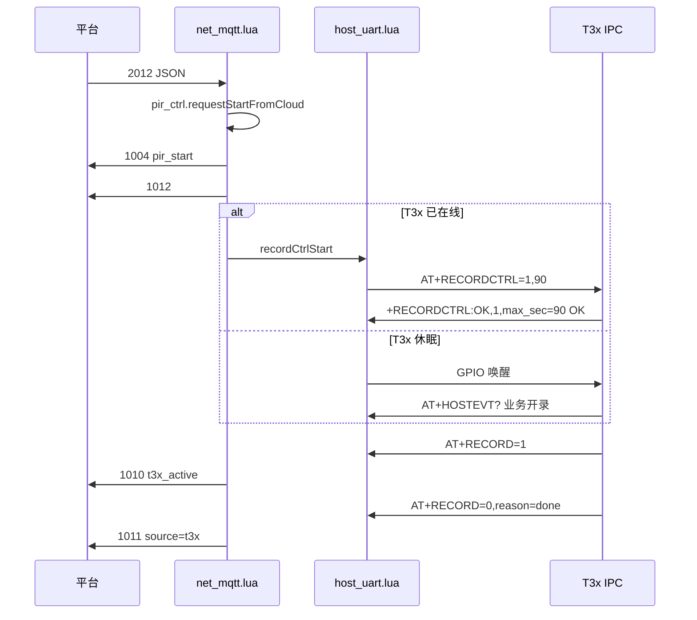

# MQTT 远程控制：帧率 / 录像 / 人形检测（Cat.1 → UART → T3x）

> **工程**：780EHM_PJ（Air780EHM + T3x）  
> **代码真源**：`user/net_mqtt.lua` · `user/host_uart.lua` · T3x `uart_host_cmd.c` / `cloud_remote_ctrl.c`  
> **关联**：[MQTT_PROTOCOL.md](MQTT_PROTOCOL.md) · [UART_AT_COMMANDS.md](UART_AT_COMMANDS.md) · [T3X_RECORD_MQTT_FLOW.md](T3X_RECORD_MQTT_FLOW.md) · [REMOTE_ENCODE_CONFIG.md](REMOTE_ENCODE_CONFIG.md)

---

## 1. 架构

```text
平台 MQTT  /panshi/device/{IMEI}/
    │
    ▼
user/net_mqtt.lua          ← 解析 dataType，组应答 JSON
    │
    ▼
user/host_uart.lua         ← 唤醒 T3x、发 UART AT、等 +XXX 应答
    │
    ▼ UART 115200
T3x uart_host_cmd.c
    │
    ▼
cloud_remote_ctrl.c      ← SetFramerate / media_record_* / person_detect
    │
    ▼ 上行（T3x→4G 原有）
AT+RECORD=1/0  →  net_mqtt →  /panshi/app/{IMEI}/event  (1010/1011)
```

T3x **不直连 MQTT**；平台只与 Cat.1 通信。

---

## 2. 三条控制总览

| 业务 | MQTT 下行 | MQTT 上行 | 主题后缀 | 4G→T3x AT |
|------|-----------|-----------|----------|-----------|
| **帧率查询** | **2024** | **1024** | `framerate` | `AT+FRAMERATE?` |
| **帧率设置** | **2025** | **1025** | `framerate` | `AT+FRAMERATE=cam,stream,fps` |
| **开录** | **2012** | 1004 + **1012** + 1010 | `event` / `pir` | 唤醒 + `AT+RECORDCTRL=1,max_sec`（在线时） |
| **停录** | **2011** | 1004 + **1011** | `event` | `AT+RECORDCTRL=0,cloud`（在线时） |
| **人形查询** | **2026** | **1026** | `personDetect` | `AT+PERSONDET?` |
| **人形开关** | **2027** | **1027** | `personDetect` | `AT+PERSONDET=0\|1` |

> **帧率完整编码**仍可用 **2020/2021**（`AT+VENC?` / `AT+VENCSET`），见 [REMOTE_ENCODE_CONFIG.md](REMOTE_ENCODE_CONFIG.md)。**2024/2025** 只改帧率，载荷更短。  
> **录像**：T3x **休眠**时走 GPIO 唤醒 + `AT+HOSTEVT?`；**已在线**时 2011/2012 成功后额外发 `AT+RECORDCTRL` 加快开停。

---

## 3. 帧率（2024 / 2025）

### 3.1 下行 2024 — 查询

**Publish** → `/panshi/device/{IMEI}/`

```json
{"dataType":"2024","messageId":"fps-q-001","camera":0,"stream":0}
```

| 字段 | 说明 |
|------|------|
| `camera` | 可选，0～3 |
| `stream` | 可选，0 主码流 / 1 子码流 |
| 省略 cam/stream | 返回所有已启用码流 |

**Subscribe** → `/panshi/app/{IMEI}/framerate`

```json
{
  "deviceNo": "862323084068124",
  "dataType": "1024",
  "reply": 1,
  "messageId": "fps-q-001",
  "ret": 0,
  "message": "ok",
  "body": {
    "streams": [
      {"camera": 0, "stream": 0, "framerate": 20}
    ]
  },
  "time": "2026-06-26 12:00:00"
}
```

**4G 内部**：`handleDownlink2024` → `host_uart.queryHostFramerate()` → `AT+FRAMERATE?` 或 `AT+FRAMERATE?0,0`。

### 3.2 下行 2025 — 设置

```json
{"dataType":"2025","messageId":"fps-s-001","camera":0,"stream":0,"framerate":20}
```

**上行 1025**：`ret=0`，`body` 含 `camera` / `stream` / `framerate`。

**T3x**：`SetFramerate()` 热更新 + `save_framerate()` 写 `syscfg.ini`（无需整包 VENCSET 重启，除非改分辨率等）。

### 3.3 UART 帧率 AT

| 命令 | 方向 | 成功应答 |
|------|------|----------|
| `AT+FRAMERATE?` | 4G→T3x | 多行 `+FRAMERATE:<cam>,<stream>,<fps>` + `+FRAMERATE:END` + `OK` |
| `AT+FRAMERATE?0,0` | 4G→T3x | 指定 cam/stream |
| `AT+FRAMERATE=0,0,20` | 4G→T3x | `+FRAMERATE:OK,0,0,20` + `OK` |

**参数**：`fps` 范围 **1～60**；`cam` 0～3；`stream` 0/1。

---

## 4. 录像启停（2011 / 2012）

### 4.1 开录 2012

**下行**：

```json
{
  "dataType": "2012",
  "messageId": "rec-s-001",
  "action": "video",
  "videoMaxDurationSec": 90
}
```

**Cat.1 流程**（`net_mqtt.handleDownlink2012`）：

```text
1. pir_ctrl.requestStartFromCloud()
      → session.recording=1，定时器，MQTT 1004 pir_start + 1012
2. app.onPirMediaAction → GPIO 唤醒 T3x（若断电）
3. T3x: AT+HOSTEVT? → media_dispatch_wake_event → TF MP4
4. 若 isT3xHostReady():
      host_uart.recordCtrlStart({ max_sec=90 })
      → AT+RECORDCTRL=1,90
5. T3x 写盘: AT+RECORD=1 → 4G → MQTT 1010 t3x_active
6. 结束: AT+RECORD=0 → MQTT 1011 source=t3x
```

### 4.2 停录 2011

**下行**：

```json
{"dataType":"2011","messageId":"rec-x-001"}
```

```text
1. pir_ctrl.requestStopFromCloud() → 1004 pir_stop
2. 若 T3x 在线: AT+RECORDCTRL=0,cloud
3. T3x 停写盘 → AT+RECORD=0 → 1011
```

### 4.3 UART 录像 AT

| 命令 | 方向 | 说明 |
|------|------|------|
| `AT+RECORDCTRL=1,<max_sec>` | 4G→T3x | 直连开录；默认 max_sec=60 |
| `AT+RECORDCTRL=0,<reason>` | 4G→T3x | 直连停录；reason 默认 `cloud` |
| `AT+RECORD?` | 4G→T3x | 查 T3x 写盘状态 `running/active/ch/reason` |
| `AT+RECORD=1` | T3x→4G | 首 I 帧已写盘（原有） |
| `AT+RECORD=0,reason=*` | T3x→4G | 停录通知（原有） |

**成功应答**：

```text
+RECORDCTRL:OK,1,max_sec=90
OK

+RECORDCTRL:OK,0,reason=cloud
OK
```

---

## 5. 人形检测（2026 / 2027）

需 T3x 编译 **`WITH_PERSON_DETECT`**。

### 5.1 查询 2026

```json
{"dataType":"2026","messageId":"pd-q-001"}
```

**上行** `/panshi/app/{IMEI}/personDetect`：

```json
{
  "dataType": "1026",
  "reply": 1,
  "messageId": "pd-q-001",
  "ret": 0,
  "enable": 1,
  "message": "ok"
}
```

### 5.2 设置 2027

```json
{"dataType":"2027","messageId":"pd-s-001","enable":0}
```

**上行 1027**：`ret=0`，`enable` 回显。

### 5.3 UART 人形 AT

| 命令 | 应答 |
|------|------|
| `AT+PERSONDET?` | `+PERSONDET:0` 或 `+PERSONDET:1` + `OK` |
| `AT+PERSONDET=1` | `+PERSONDET:OK,1` + `OK` |
| `AT+PERSONDET=0` | `+PERSONDET:OK,0` + `OK` |

**运行时**：T3x 写 `[person_detect] enable` 到 ini；IVS 线程读 `person_detect.enable`。**关闭**立即停检；**开启**若启动时未 init IVS 需重启 T3x 才完整启用。

---

## 6. 时序图（2012 + RECORDCTRL）



---

## 7. 代码索引

| 层级 | 780EHM_PJ | T3x IPC |
|------|-----------|---------|
| MQTT 入/出 | `user/net_mqtt.lua` | — |
| UART 转发 | `user/host_uart.lua` | — |
| AT 解析 | — | `app/cat1/uart_host_cmd.c` |
| 业务落地 | — | `app/cat1/cloud_remote_ctrl.c` |
| 录像媒体 | `user/pir_ctrl.lua` | `app/cat1/media_ops.c` |
| IVS 人形 | — | `media_plat/t31x/video_interface.c` |

**net_mqtt 处理器**：`handleDownlink2024/2025/2026/2027`；2011/2012 内嵌 `recordCtrlStop/Start`。

**host_uart API**：`queryHostFramerate` · `setHostFramerate` · `recordCtrlStart` · `recordCtrlStop` · `queryHostPersonDetect` · `setHostPersonDetect`。

---

## 8. 联调（mosquitto）

```bash
IMEI=862323084068314
B=/panshi/device/${IMEI}/
SUB=/panshi/app/${IMEI}/#

# 订阅全部上行
mosquitto_sub -h <broker> -t "$SUB" -v

# 设帧率 20fps
mosquitto_pub -h <broker> -t "$B" \
  -m '{"dataType":"2025","camera":0,"stream":0,"framerate":20,"messageId":"t1"}'

# 查帧率
mosquitto_pub -h <broker> -t "$B" \
  -m '{"dataType":"2024","camera":0,"stream":0,"messageId":"t2"}'

# 开录 60s
mosquitto_pub -h <broker> -t "$B" \
  -m '{"dataType":"2012","messageId":"t3","videoMaxDurationSec":60}'

# 停录
mosquitto_pub -h <broker> -t "$B" \
  -m '{"dataType":"2011","messageId":"t4"}'

# 关人形
mosquitto_pub -h <broker> -t "$B" \
  -m '{"dataType":"2027","enable":0,"messageId":"t5"}'
```

---

**版本**：v1.0 · 2026-06-26 · 与 `user/net_mqtt.lua` / `user/host_uart.lua` / T3x `cloud_remote_ctrl.c` 同步
