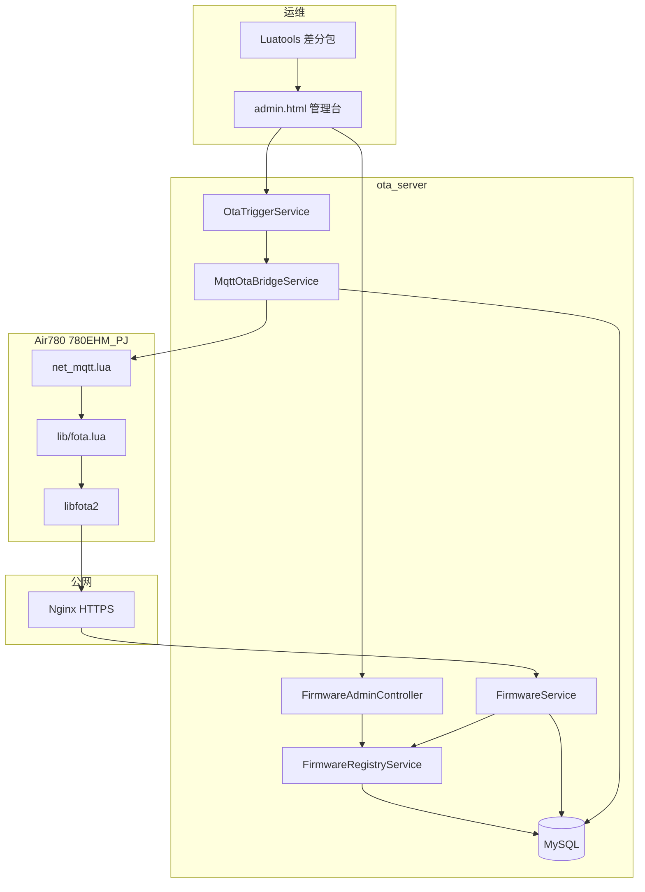
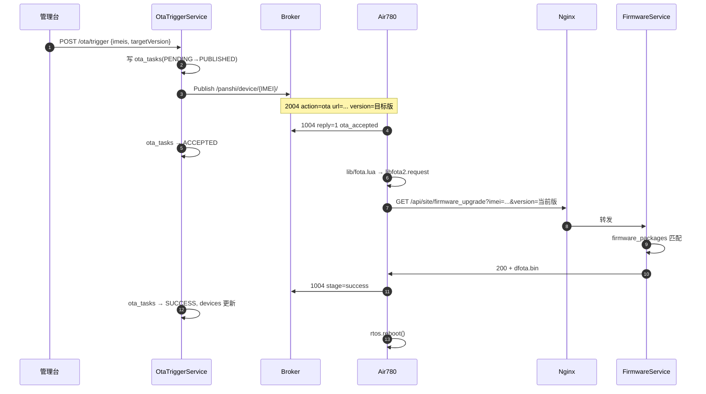

# OTA 完整流程与代码完整性说明

本文是 **780EHM_PJ 自建 OTA** 的端到端流程文档，并附带 `ota_server` 代码完整性检查结果。

| 文档 | 用途 |
|------|------|
| 本文 | **全流程** + 代码模块对照 + 完整性清单 |
| [OTA_PROTOCOL.md](OTA_PROTOCOL.md) | HTTP/MQTT 协议细节 |
| [OTA_SERVER.md](OTA_SERVER.md) | 固件对接（不改 lua） |
| [ota_server/README.md](../ota_server/README.md) | 部署手册 |

---

## 1. 系统全景



**三条链路：**

| # | 链路 | 协议 |
|---|------|------|
| 1 | 管理台上传固件 / 触发 OTA | HTTP REST + Web |
| 2 | 通知设备升级 | MQTT 2004 |
| 3 | 下载差分包 | HTTP GET（libfota2） |
| 4 | 上报进度 | MQTT 1004 |

---

## 2. 流程 A：创建固件（合宙 IoT 风格）

对应合宙 IoT 平台「创建固件」界面。

### 2.1 运维步骤

```
Luatools 制作 dfota 差分包
    ↓
打开 admin.html → 创建固件
    ↓
填写：固件名、目标版本、源版本、允许升级、升级全部/指定 IMEI
    ↓
POST /admin/api/firmware-packages/upload
    ↓
bin 存入 firmware/，元数据写入 firmware_packages + firmware_device_assignments
```

### 2.2 字段对照

| 合宙 IoT 界面 | ota_server 字段 | 必填 |
|--------------|-----------------|------|
| 固件名 | `firmware_name` | 是 |
| 版本号 | `version`（目标） | 是 |
| dfota 源版本 | `source_version` | dfota 建议填 |
| core 版本号 | `core_version` | 否（默认 0） |
| 允许升级 | `allow_upgrade` | 是 |
| 升级全部设备 | `upgrade_all` | 是 |
| 指定设备 | `firmware_device_assignments` | upgrade_all=否 时填 IMEI |
| 项目 key | `ota_projects.project_key` | 否 |
| 备注 | `remark` | 否 |

### 2.3 代码路径

| 步骤 | 类 / 文件 |
|------|-----------|
| HTTP 入口 | `FirmwareAdminController.uploadPackage()` |
| 校验 + 存文件 | `FirmwareRegistryService.createFromUpload()` |
| 写 IMEI 列表 | `FirmwareRegistryService.replaceAssignments()` |
| 存盘 | `FirmwareCatalogService.resolveFirmwareFile()` |

---

## 3. 流程 B：MQTT 触发 OTA（推荐）

### 3.1 时序



### 3.2 MQTT 2004 载荷（ota_server 自动生成）

```json
{
  "dataType": "2004",
  "action": "ota",
  "url": "https://你的域名/api/site/firmware_upgrade?",
  "version": "2034.001.003",
  "timeout": 300000,
  "full_url": 0,
  "messageId": "ota-srv-a1b2c3d4"
}
```

### 3.3 固件侧（不改 lua）

| 步骤 | 文件 | 行为 |
|------|------|------|
| 收 2004 | `user/net_mqtt.lua` | 解析 action=ota |
| 事件 | `user/app.lua` | `DEVICE_OTA_REQUEST` |
| 构建 opts | `lib/fota.lua` `buildIotOpts()` | **有 url → 直接用** |
| 下载 | `lib/libfota2.lua` | HTTP GET，自动拼 imei/version |
| 上报 | `lib/fota.lua` `fota_cb()` | MQTT 1004 stage |

---

## 4. 流程 C：HTTP 拉包决策（设备请求时）

设备 libfota2 发起：

```http
GET /api/site/firmware_upgrade?imei=862323084068124&firmware_name=PANSHI_CAT1_LuatOS-SoC_Air780EHM&version=2034.001.002
```

### 4.1 决策树（FirmwareService.evaluate）

```
START
  ├─ allowed-imeis 白名单？不在 → 403
  ├─ 无 version 参数？ → 404
  ├─ ① firmware_packages 匹配？
  │     firmware_name 相同
  │     allow_upgrade = true, enabled = true
  │     source_version == 当前 version（或空）
  │     version > 当前 version
  │     upgrade_all 或 IMEI 在 assignments
  │     → 200 + bin
  ├─ 存在匹配固件但 IMEI 未授权？ → 403
  ├─ ② manifest.json 匹配？ → 200 + bin
  └─ ③ latest-version fallback？ → 200 或 404
END
```

### 4.2 HTTP 响应

| 状态 | 含义 |
|------|------|
| 200 | 返回差分包，设备重启升级 |
| 403 | IMEI 不在白名单 / 未指定设备 |
| 404 | 已最新 / 无匹配差分包 |

---

## 5. 流程 D：MQTT 1004 状态回传

| 设备上报 | ota_tasks 状态 | devices 更新 |
|----------|----------------|--------------|
| `reply:1, message:ota_accepted` | ACCEPTED | ota_status=PENDING |
| `stage:starting` | IN_PROGRESS | — |
| `stage:success` | SUCCESS | current_version=目标版 |
| `ret:-1` / `stage:failed` | FAILED | ota_status=FAILED |

代码：`OtaTriggerService.handleMqttUplink()` ← `MqttOtaBridgeService.messageArrived()`

---

## 6. 数据库表

| 表 | 用途 | 实体 |
|----|------|------|
| `ota_projects` | 项目 / project_key | `OtaProject` |
| `firmware_packages` | 固件元数据（合宙 IoT 风格） | `FirmwarePackage` |
| `firmware_device_assignments` | 指定设备 IMEI | `FirmwareDeviceAssignment` |
| `devices` | 设备台账（自动维护） | `Device` |
| `ota_tasks` | MQTT 触发任务 | `OtaTask` |

DDL：`ota_server/deploy/sql/schema.sql`（含 v2 表）

---

## 7. API 完整性清单

### 7.1 设备 OTA（无 Token）

| 方法 | 路径 | 实现 | 状态 |
|------|------|------|------|
| GET | `/api/site/firmware_upgrade` | `LuatOtaController` | ✅ |
| GET | `/luat/update` | `LuatOtaController` | ✅ |
| GET | `/firmware/{filename}` | `LuatOtaController` | ✅ |
| GET | `/health` | `LuatOtaController` | ✅ |

### 7.2 管理 API（Header: X-Admin-Token）

| 方法 | 路径 | 实现 | 状态 |
|------|------|------|------|
| GET | `/admin/api/status` | `AdminController` | ✅ |
| GET/POST | `/admin/api/projects` | `FirmwareAdminController` | ✅ |
| GET | `/admin/api/firmware-packages` | `FirmwareAdminController` | ✅ |
| POST | `/admin/api/firmware-packages/upload` | `FirmwareAdminController` | ✅ |
| PUT | `/admin/api/firmware-packages/{id}` | `FirmwareAdminController` | ✅ |
| PUT | `/admin/api/firmware-packages/{id}/devices` | `FirmwareAdminController` | ✅ |
| DELETE | `/admin/api/firmware-packages/{id}` | `FirmwareAdminController` | ✅ |
| POST | `/admin/api/firmware/upload` | `AdminController`（manifest legacy） | ✅ |
| GET/PUT | `/admin/api/manifest` | `AdminController` | ✅ |
| GET/POST/DELETE | `/admin/api/devices` | `DeviceAdminController` | ✅ |
| POST | `/admin/api/ota/trigger` | `DeviceAdminController` | ✅ |
| POST | `/admin/api/ota/trigger/outdated` | `DeviceAdminController` | ✅ |
| GET | `/admin/api/ota/tasks` | `DeviceAdminController` | ✅ |
| GET | `/admin/api/mqtt/status` | `DeviceAdminController` | ✅ |
| GET | `/admin/api/logs` | `AdminController` | ✅ |

### 7.3 管理台页面

| 功能 | admin.html | 状态 |
|------|------------|------|
| 创建固件（IoT 风格） | 表单 + uploadPackage() | ✅ |
| 固件列表 | firmwarePackages 表格 | ✅ |
| manifest legacy 上传 | upload() | ✅ |
| MQTT 触发 OTA | triggerOta() | ✅ |
| 设备 / 任务 / 日志 | refreshAll() | ✅ |

---

## 8. 代码模块完整性

### 8.1 Java 包结构（main 源文件 35 个）

```
com.luat.ota
├── OtaServerApplication.java          ✅ 启动入口
├── config/                            ✅ 7 文件（Properties/MQTT/Auth/DataInit）
├── controller/                        ✅ 4 控制器
├── dto/                               ✅ OtaTriggerRequest
├── entity/                            ✅ 7 实体
├── model/                             ✅ manifest JSON 模型
├── repository/                        ✅ 5 Repository
├── service/                           ✅ 7 Service
└── util/                              ✅ LuatVersionUtil
```

### 8.2 核心服务依赖

| 服务 | 依赖 | 状态 |
|------|------|------|
| `FirmwareService` | Registry + Catalog + Audit + Device | ✅ |
| `FirmwareRegistryService` | Package/Assignment/Project Repo + Catalog | ✅ |
| `OtaTriggerService` | MQTT Bridge + Device + Task Repo | ✅（@Lazy 解循环依赖） |
| `MqttOtaBridgeService` | OtaTriggerService（回调） | ✅ 条件装配 enabled=true |
| `FirmwareCatalogService` | manifest.json + DeviceService | ✅ |

### 8.3 部署组件

| 组件 | 文件 | 状态 |
|------|------|------|
| Docker Compose | `docker-compose.yml` | ✅ mysql + ota-server + nginx |
| Nginx HTTPS | `deploy/nginx/ota.conf` | ✅ |
| SQL 初始化 | `deploy/sql/schema.sql` | ✅ 含 v2 表 |
| 增量迁移 | `deploy/sql/migration_v2.sql` | ✅ 旧库升级用 |
| 默认项目 seed | `DataInitializer` + SQL | ✅ PRODUCT_KEY |

### 8.4 单元测试

| 测试 | 覆盖 | 状态 |
|------|------|------|
| `LuatVersionUtilTest` | 版本比较 | ✅ |
| `FirmwareCatalogServiceTest` | manifest 匹配 | ✅ |
| `MqttOtaBridgeServiceTest` | Topic 解析 IMEI | ✅ |
| `FirmwareRegistryServiceTest` | 固件库匹配/拒绝 | ✅ 本次新增 |

---

## 9. 已知限制与后续可选增强

| 项 | 现状 | 说明 |
|----|------|------|
| HTTPS 模块端 | Nginx 终结 TLS | libfota2 原生 HTTP；生产必须 Nginx |
| 合宙 IoT 动态差分 | 预置 dfota 文件 | 非云端实时差分 |
| OTA 触发前固件校验 | 未强制 | 触发时不检查 DB 是否有对应包，依赖 HTTP 阶段匹配 |
| 项目 CRUD | 仅 list/create | 无 edit/delete API（可后续加） |
| MQTT TLS | 配置 ssl=false | 可按 Broker 要求扩展 |

---

## 10. 端到端验收清单

- [ ] `docker compose up -d` 三容器正常
- [ ] `curl https://域名/health` → `ok`
- [ ] admin.html 创建固件（固件名 + 源/目标版本 + IMEI）
- [ ] `curl -k "https://域名/luat/update?imei=...&firmware_name=...&version=当前版"` → 200 + bin
- [ ] 管理台 MQTT `connected: true`
- [ ] 管理台触发 OTA → 设备 `1004 ota_accepted`
- [ ] 设备 `1004 stage=success` → 重启后版本更新
- [ ] **固件 lua 未修改**，`FOTA_CFG.server_mode = "iot"`

---

## 11. 相关文档索引

- [OTA_PROTOCOL.md](OTA_PROTOCOL.md) — 协议字段详解
- [OTA_SERVER.md](OTA_SERVER.md) — 固件兼容说明
- [MQTT_DOWNLINK.md](MQTT_DOWNLINK.md) §6.6 — 2004 自建 url
- [ota_server/README.md](../ota_server/README.md) — 部署
- [ota_server/deploy/nginx/README.md](../ota_server/deploy/nginx/README.md) — HTTPS
