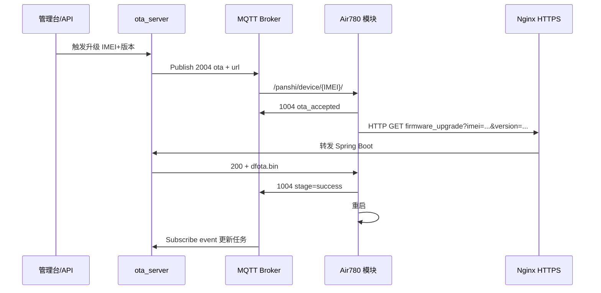

# OTA 升级功能与协议分析

本文描述 [`ota_server/`](../ota_server/) 的固件升级能力与协议，并对照 780EHM_PJ 固件侧实现。

相关文档：

- **完整流程与代码完整性**：[OTA_FLOW.md](OTA_FLOW.md) ← 推荐先看
- 部署手册：[ota_server/README.md](../ota_server/README.md)
- 固件对接（不改 lua）：[OTA_SERVER.md](OTA_SERVER.md)
- MQTT 2004/1004：[MQTT_DOWNLINK.md](MQTT_DOWNLINK.md) §6.3 / §6.6

---

## 1. 总体架构

`ota_server` 不是单独一套私有协议，而是 **合宙 libfota2 HTTP OTA** + **780EHM_PJ MQTT 2004/1004** 的组合。

分为两层：

| 层次 | 协议 | 作用 |
|------|------|------|
| **控制面** | MQTT JSON `2004` | 通知设备：去哪个 URL 升级、目标版本是多少 |
| **数据面** | HTTP GET | 设备用 libfota2 下载差分包 `.bin` |
| **状态反馈** | MQTT JSON `1004` | 设备上报受理 / 进度 / 成功 / 失败 |
| **运维管理** | HTTP REST + Web | 上传固件、查设备、手动触发 |



**固件无需改 lua**：MQTT 2004 带 `url` 时，现有 `lib/fota.lua` 直接交给 `libfota2`（[MQTT_DOWNLINK.md](MQTT_DOWNLINK.md) §6.6）。

---

## 2. HTTP OTA 协议（libfota2 兼容）

设备**真正下载固件**使用 HTTP，规则与合宙官方第三方服务器一致。

### 2.1 接口

| 路径 | 说明 |
|------|------|
| `GET /api/site/firmware_upgrade` | 与合宙 IoT 默认路径一致 |
| `GET /luat/update` | 社区常用别名 |
| `GET /firmware/{filename}` | 直链（MQTT `full_url=1` 时用） |
| `GET /health` | 健康检查 |

实现：`ota_server/.../LuatOtaController.java`

### 2.2 请求（设备 → 服务器）

- 方法：**GET**
- Query 由 **libfota2 自动拼接**（url 不以 `###` 开头、`full_url=0` 时）

| 参数 | 来源 | 示例 |
|------|------|------|
| `imei` | 模块 IMEI | `862323084068124` |
| `firmware_name` | `PROJECT_LuatOS-SoC_BSP` | `PANSHI_CAT1_LuatOS-SoC_Air780EHM` |
| `version` | **设备当前版本**（IoT 格式） | `2034.001.002` |
| `project_key` | 合宙 key（自建可忽略） | — |

示例：

```http
GET /api/site/firmware_upgrade?imei=862323084068124&firmware_name=PANSHI_CAT1_LuatOS-SoC_Air780EHM&version=2034.001.002 HTTP/1.1
Host: ota.example.com
```

固件侧（`lib/fota.lua` + `lib/libfota2.lua`）：

| `full_url` | 行为 |
|------------|------|
| `0`（默认） | url 末尾带 `?`，libfota2 再拼 `imei`、`firmware_name`、`version` |
| `1` | url 前加 `###`，不再拼参，直接 GET 完整地址 |

### 2.3 响应（服务器 → 设备）

| HTTP 状态 | 含义 | libfota2 回调 ret |
|-----------|------|-------------------|
| **200** | 有升级，body = 差分包二进制 | `0`（成功，重启） |
| **206** | 分段下载 | `0` |
| **≥ 300**（默认 404） | 无升级 / 已最新 | `3` |
| **403** | IMEI 不在白名单 | — |
| **404** | 差分包不存在 / 源版本不匹配 | `3` |

升级时响应头：

- `Content-Type: application/octet-stream`
- `X-Ota-Target-Version`：目标版本
- `X-Ota-Release-Id`：manifest 条目 ID

### 2.4 服务器决策逻辑

实现：`FirmwareService.evaluate()`，**优先级从高到低**：

```
① MySQL firmware_packages（合宙 IoT 风格，推荐）
   - firmware_name 匹配
   - allow_upgrade = true
   - source_version == 设备当前 version（dfota；空则不限）
   - version > 当前 version
   - upgrade_all = true，或 IMEI 在 firmware_device_assignments
   → 200 + file_name 对应 bin

② firmware/manifest.json（legacy 差分包清单）

③ application.yml latest-version + legacy 文件名规则
   → 200 或 404
```

**合宙 IoT 平台字段对照**（`firmware_packages` 表）：

| 合宙 IoT | ota_server 字段 |
|----------|-----------------|
| 固件名 | `firmware_name` |
| 版本号 | `version`（目标版本） |
| core 版本号 | `core_version` |
| 允许升级 | `allow_upgrade` |
| 升级全部设备 | `upgrade_all` |
| 指定设备 | `firmware_device_assignments.imei` |
| 项目 key | `ota_projects.project_key` |
| 备注 | `remark` |

---

## 3. MQTT 协议（触发与状态）

与 [MQTT_PROTOCOL.md](MQTT_PROTOCOL.md) / [MQTT_DOWNLINK.md](MQTT_DOWNLINK.md) 一致。`ota_server` 作 MQTT 桥接，**不改变**设备协议。

### 3.1 下行：OTA 服务器 → 设备（2004）

| 项 | 值 |
|----|-----|
| Topic | `/panshi/device/{IMEI}/` |
| 实现 | `OtaTriggerService` → `MqttOtaBridgeService.publishDownlink()` |

Payload 示例：

```json
{
  "dataType": "2004",
  "action": "ota",
  "url": "https://ota.example.com/api/site/firmware_upgrade?",
  "version": "2034.001.003",
  "timeout": 300000,
  "full_url": 0,
  "messageId": "ota-srv-a1b2c3d4"
}
```

| 字段 | 说明 |
|------|------|
| `url` | libfota2 HTTP 基址，须公网 HTTPS |
| `version` | **目标** IoT 版本 |
| `full_url` | `0` 自动拼参；`1` 直链 |
| `messageId` | 关联 MySQL `ota_tasks` |

### 3.2 上行：设备 → OTA 服务器（1004）

| 项 | 值 |
|----|-----|
| Topic | `/panshi/app/{IMEI}/event` |
| 订阅 | `MqttOtaBridgeService` |

| 阶段 | 典型字段 | 服务器处理 |
|------|----------|------------|
| 受理 | `reply:1`, `message:"ota_accepted"` | 任务 → ACCEPTED |
| 进行中 | `stage:"starting"` 等 | 任务 → IN_PROGRESS |
| 成功 | `stage:"success"` | 任务 → SUCCESS，更新 devices |
| 失败 | `ret:-1` 或 `stage:"failed"` | 任务 → FAILED |

---

## 4. 固件侧完整流程（780EHM_PJ）

```
① MQTT 2004（带 url）→ net_mqtt.lua
② DEVICE_OTA_REQUEST → lib/fota.lua buildIotOpts()
   - 有 data.url → 直接用（full_url=0 不加 ###）
③ libfota2.request()
   - 对 url 追加 imei、firmware_name、version（当前版本）
④ HTTP GET → ota_server
⑤ 200 + dfota.bin → /update.bin
⑥ fota_cb(ret=0) → MQTT 1004 stage=success
⑦ rtos.reboot()
```

libfota2 回调码（`lib/fota.lua` fota_cb）：

| ret | 含义 |
|-----|------|
| 0 | 下载成功，重启 |
| 1 | 连接失败 |
| 2 | URL 错误 |
| 3 | HTTP ≥300 / 无新版本 |
| 4 | 接收错误 |
| 5 | 版本号格式错误 |

---

## 5. ota_server 内部模块

| 模块 | 文件 | 职责 |
|------|------|------|
| HTTP 入口 | `LuatOtaController` | OTA GET 接口 |
| 升级决策 | `FirmwareService` | 版本判断、返回 bin |
| **固件库** | `FirmwareRegistryService` | MySQL 固件包（合宙 IoT 风格） |
| 差分包清单 | `FirmwareCatalogService` | `firmware/manifest.json` legacy |
| MQTT 桥 | `MqttOtaBridgeService` | 订阅 event、Publish 2004 |
| 触发任务 | `OtaTriggerService` | 管理台/API、解析 1004 |
| 设备台账 | `DeviceService` + MySQL | `devices` / `ota_tasks` |
| 审计 | `OtaAuditService` | `logs/ota-audit.jsonl` |

### manifest.json 示例

```json
{
  "releases": [{
    "id": "001002-to-001003",
    "firmwareName": "PANSHI_CAT1_LuatOS-SoC_Air780EHM",
    "sourceVersion": "2034.001.002",
    "targetVersion": "2034.001.003",
    "file": "dfota_001002_to_001003.bin",
    "enabled": true
  }],
  "deviceTargets": {
    "862323084068124": "2034.001.003"
  }
}
```

---

## 6. 版本号约定

| 位置 | 格式 | 示例 |
|------|------|------|
| `user/main.lua` `VERSION` | 脚本版 `XXX.YYY.ZZZ` | `001.000.002` |
| HTTP `version` 参数 | IoT 版（**当前版本**） | `2034.001.002` |
| MQTT 2004 `version` | IoT 版（**目标版本**） | `2034.001.003` |
| manifest `sourceVersion` | 必须与 HTTP 当前 version 一致 | `2034.001.002` |

---

## 7. 使用方式对比

| 方式 | 谁发 MQTT 2004 | 改固件 lua | 说明 |
|------|----------------|------------|------|
| **A. ota_server 管理台** | 服务器自动 | 否 | 推荐，带任务跟踪 |
| **B. MQTT 平台手动** | 人工/业务平台 | 否 | 同 §6.6 JSON |
| **C. curl 测 HTTP** | 无 | 否 | 验证差分包 |
| 合宙 IoT 云 | 2004 **不带 url** | 否 | 走 product_key，与自建并存 |

---

## 8. 小结

| 协议 | 标准来源 | ota_server 角色 |
|------|----------|-----------------|
| HTTP OTA | 合宙 libfota2 第三方服务器 | 托管 dfota、manifest 匹配 |
| MQTT 2004/1004 | 780EHM_PJ panshi 协议 | 触发升级、跟踪状态 |

兼容要点：**MQTT 2004 带 `url` + `full_url=0`** → 现有固件即可工作，无需修改 `lib/fota.lua`。
