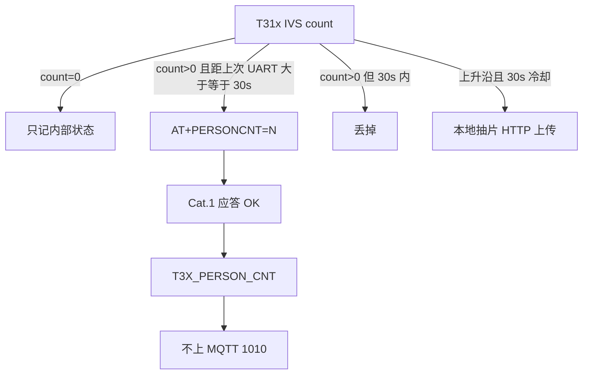

# 人形「有人」上报：T31x UART → Cat.1 → MQTT

> **样机 IMEI**：`862323084068124`  
> **结论**：只在 **有人** 时走 `AT+PERSONCNT`；**Cat.1 不再把人数转到 MQTT 后台**。UART 对 IVS 1/0 抖动做 **30s 限流**。**T31 一旦上电，PIR 不触发、不上报**，检测以 IVS 人形为主。抽片上传仍在 T31x 本地完成。  
> **代码**：T31x `host_at.c` · `host_runtime.c` · `person_detect_pir_sync.c` · Cat.1 `pir_ctrl.lua` · `host_uart.lua` · `app.lua`  
> **关联**：[WORK_MODE_PERSON_DETECT_PIR.md](WORK_MODE_PERSON_DETECT_PIR.md) · [video_upload_server/README.md](../video_upload_server/README.md)

**版本**：v1.3 · 2026-08-17 · Cat.1 脚本 `001.000.017`（人数仍不上 MQTT）  
**检测软件**：双击 [`../tools/gui/01_流程检测.bat`](../tools/gui/01_流程检测.bat) 或 `python tools/gui/flow_monitor/flow_monitor_gui.py --start`

Host AT 不在 COM7。看 T31→4G：`/tmp/ipc/cat1_uart.log`。

---

## 1. 为什么改

2026-08-17 实机：人站在镜头前约 2 分钟。

| 现象 | 数量 |
|------|------|
| IVS 日志 `person detect: count=1/0` | 连续抖动 |
| `AT+PERSONCNT=1` | **144 次**，全是有人 |
| `AT+PERSONCNT=0` | **0 次** |
| `PERSONCNT skipped (debounce)` | **0 次** |
| MQTT 1010 `person_update` | 与 UART 同步刷屏 |
| 报警 TS 上传腾讯云 `:7003` | 2 段（抽片侧已有 30s 冷却，正常） |

旧逻辑号称「有人才报」，但 IVS 在 1↔0 之间抖时，每次 **0→1 都当上升沿且不限流**，Cat.1 又 **每条都发 MQTT**。客户端订 `/panshi/app/{IMEI}/#` 就会一直刷「有人」，也不会收到「无人」。

产品要的是：

1. **只有有人才上报**（无人不上 UART、不上「无人」MQTT）。
2. **不要把人数刷到 MQTT 后台**。
3. T31x→Cat.1 的 `AT+PERSONCNT` **不要太频繁**。

人形报警视频仍由 T31x 抽片后 HTTP 上传，见下文 §4。

---

## 2. 现行目标流程

```text
T31x IVS 人数
  │
  ├─ count == 0          只更新内部状态，不发 UART
  │
  ├─ count > 0
  │     距上次成功发送 AT+PERSONCNT < 30s  → 丢掉（含 0→1 抖动）
  │     否则 → AT+PERSONCNT=N
  │
  ▼
Cat.1 host_uart
  回 +PERSONCNT:ok,count=N
  发事件 T3X_PERSON_CNT
  │
  ▼
app.lua
  **不再** publishPirToMqtt(person_update)
  MQTT 后台看不到 1010 人数刷屏

并行（不走 MQTT）：
  IVS 上升沿 + 全天录 + 30s 冷却
    → clip_upload 抽 ±15s TS
    → POST http://43.136.55.143:7003/admin/api/v1/uploadVideo
```



---

## 3. 改前 / 改后

| 环节 | 改前 | 改后 |
|------|------|------|
| 无人 `count=0` | 不发 UART（已是） | 不变 |
| 有人 `0→1` | **必发**，不限流 | 距上次发送 **≥30s** 才发 |
| 有人且人数未变 | 不发 | 不变 |
| 有人且 1s 内 1↔2 | 限流 1s | 并入 **30s** |
| Cat.1 收到 PERSONCNT | 立刻 MQTT **1010** `pirStatus=person_update` | **不发 MQTT** |
| 周期 1003 | 只有 `personDetectEnabled/Available`，没有「当前有人」 | 不变 |
| 抽片上传 | IVS 上升沿，全天冷却 30s | 不变 |

MQTT 客户端若仍订 `…/pir`，**不应再因站在镜头前刷 1010 人数**。  
PIR 的 1010 `detected` **仅在 T31 断电值守时**允许一次叫醒；T31 已启动则 PIR 静音。

### 3.5 T31 启动后 PIR 必须静音

硬规则：`t3x_ctrl.powered_on`（GPIO22 已上电）→ Cat.1 PIR **不触发业务、不上 MQTT 1010 `detected`**。检测只认 T31 IVS。

| T31 电源 | 模式 | PIR GPIO30 | MQTT 1010 detected | 谁在检 |
|----------|------|------------|--------------------|--------|
| 开 | `person_detect` | 丢掉 `t31_on` | 否 | IVS |
| 开 | `pir_watch`（刚被叫醒） | 丢掉 `t31_on` | 否 | IVS |
| 关 | `pir_watch` | 允许，唤醒 T31 | 是（仅这一次） | PIR 只负责叫醒 |

Cat.1：`pir_ctrl.onHwInterrupt` 在硬件中断里就看 `powered_on`，不吃冷却、不发 `PIR_HW_TRIGGERED`。  
T31x：`workmode != pir_watch` 时 GPIO 唤醒不派发 `PIRSTAT` 媒体，日志 `skip PIR/GPIO wake dispatch, IVS primary`。

---

## 4. 和抽片上传的关系

| 路径 | 触发 | 冷却 | 是否经过 Cat.1 MQTT |
|------|------|------|---------------------|
| `AT+PERSONCNT` | 人数变化且有人 | **30s**（本次） | 否（本次起） |
| `clip_upload_on_person` | 全天录 + IVS 上升沿 | 已有 `PERSON_ALLDAY_ALARM_DEBOUNCE_SEC=30` | 否，T31 直接 HTTP |

两路独立。停 MQTT 人数上报 **不影响** 腾讯云 `uploadVideo`。

实机已验证（改 UART/MQTT 之前）：

- `34020000001310989442-20260817-1786952551070-….ts` 0.82MB
- `34020000001310989442-20260817-1786952620952-….ts` 0.87MB  
均 `POST :7003` 第一次 200。

---

## 5. 代码位置

### 5.1 T31x `ipc_outbound_person_count_notify`

文件：`app/host/host_at.c`

- `count <= 0`：更新 `g_last_person_count`，return，不发串口。
- `prev == count`：已是同一有人数，不发。
- `(now - g_last_person_cnt_ms) < 30000`：**包括 0→1**，skip 并打 `PERSONCNT skipped (debounce)`。
- 否则 `AT+PERSONCNT=%d`。

调用点：`person_detect_pir_sync.c` 里 IVS 回调，`g_last_uart_count` 变化才会进 notify；真正限流在 `host_at.c`。

### 5.2 Cat.1

| 文件 | 行为 |
|------|------|
| `user/host_uart.lua` `uart_person_cnt_notify` | 解析 `AT+PERSONCNT=`，事件 `T3X_PERSON_CNT`，回 `+PERSONCNT:ok` |
| `user/app.lua` | **不再**对人数调 `publishPirToMqtt` |
| `user/pir_ctrl.lua` | `powered_on` → `t31_on`，不 MQTT、不唤醒 |
| `user/net_mqtt.lua` | PIR `detected` 仅 T31 断电值守时仍可用 |

### 5.3 T31x 启动后跳过 PIR 唤醒

`host_runtime.c`：`workmode != pir_watch` 时 GPIO 唤醒只清 HOSTEVT，不 `PIRSTAT` 派发。全天录路径 `person_detect_pir_sync.c` 只走 IVS。

主题（历史，人数上报已停）：`/panshi/app/{IMEI}/pir`，`dataType=1010`。

---

## 6. 怎么验

1. 订 MQTT `/panshi/app/862323084068124/#`，人站镜头前 1 分钟：  
   **不应**再刷 1010 `person_update`。  
   可以仍有 1003 周期状态（无 `personCount`）。
2. `grep AT+PERSONCNT= /tmp/ipc/cat1_uart.log`：有人期间大约 **≥30s 一条** `=1`，没有 `=0`。
3. `grep 'PERSONCNT skipped' /tmp/ipc/app.log`：抖动时应出现 skip。
4. 腾讯云 `incoming/dynamic/`：上升沿后仍可能有新 TS（30s 冷却），与 MQTT 无关。
5. T31 常电时走 PIR：Cat.1 日志 `hw_ignored t31_on`，MQTT **没有** 1010 `detected`。

刷 Cat.1 `001.000.014` 后人数不上 MQTT，且 T31 在电 PIR 静音。T31x 需再推一版才会打 `skip PIR/GPIO wake dispatch`。

---

## 7. 在哪里可以看出「有人」

人数**不上 MQTT**，平台订阅 `/panshi/app/{IMEI}/#` **看不到**「当前有人」字段。要看有人，只看 UART / 检测软件 / T31 日志。

| 看哪里 | 看到什么才算有人 | 不要当成有人 |
|--------|------------------|--------------|
| 检测软件左侧 **「五、人形 IVS」→「有人 AT+PERSONCNT≥1」** | 绿色「符合」，次数 = 真正发出的 `AT+PERSONCNT=N` | 右侧指令统计若把 DROP 算进去会虚高 |
| 检测软件 **「UART 会话」** | `AT+PERSONCNT=1`（通知）+ `+PERSONCNT:ok,count=1`（应答） | `限流 / skipped / DROP` |
| 检测软件 **「重要事件」** | 「有人 AT+PERSONCNT≥1」 | 「T31 30s 限流生效（未发 UART）」 |
| T31 `/tmp/ipc/cat1_uart.log` | `[TX] AT+PERSONCNT=1` | `[HOST] PERSONCNT skipped (debounce)` |
| MQTT 1010 | **没有** `pirStatus=person_update` | 周期 1003 只有开关，没有人数 |
| MQTT 1013 | 那是 **2013 抽片信令** 或 `UPLOADNEED`，不是「有人」人数 | 不要和 PERSONCNT 混读 |

```text
镜头前有人
    │
    ├─ IVS count 抖动（每秒多次 1↔0）     → 只打 PERSONCNT skipped，不出串口
    │
    └─ 距上次成功发送 ≥30s
           → AT+PERSONCNT=1          ← 这才是「有人」UART
           → Cat.1 +PERSONCNT:ok
           → 检测软件左侧 +1
           → MQTT 不发人数
```

底栏读法（改后的检测软件）：

- **有人发出 AT+PERSONCNT ×N**：真正出串口的条数（规范应 ≥30s 一条）。
- **限流丢弃 ×M**：IVS 抖动被丢掉，**属正常**，不是 UART 过密。

---

## 8. 指令统计「次数很多 / 过密」怎么读

2026-08-17 晚实机（检测会话 `tools/_logs/20260817_215740`，约 21:57–22:16，人在镜头前走动）：

| 统计项 | 条数 | 含义 | 要不要再限流 |
|--------|------|------|----------------|
| `AT+PERSONCNT=1` 通知 | **18** | 真正 UART，间隔约 **30～70s** | **不用**，已符合 ≥30s |
| `PERSONCNT skipped` | **133** | T31 内部丢掉，没出串口 | 固件 UART 已限流；**skip 日志改为每 30s 窗口最多一条**，避免 app.log 刷屏 |
| Cat.1 `+PERSONCNT:ok` | 18 | 与通知配对 | — |
| `AT+HOSTEVT?` | ~37 查询 | 约 30s 空闲轮询 | 正常心跳 |
| `AT+GB28181?` | ~12 查询 | 约 1 分钟 | 正常 |
| `AT+RECORD=0/1` | overlay 周期 | 全天写盘**并未停**，却用 RECORD 通知 overlay 起止 | **要收**：全天 overlay 不应发 RECORD 开关 |
| `AT+UPLOADNEED` | 与 overlay 同量级 | 通知 4G 发 1013（抽片），不是人数 | Cat.1 侧 30s 节流（`001.000.017`） |

旧检测软件把 `skipped` 解析成 `cmd=PERSONCNT, result=DROP`，再按 30s 规范去量 **丢弃间隔**，于是：

- 次数 ≈ 发出 + 丢弃（例如 18+133≈截图里的 142）
- 速率 0.33/s、规范「过密」
- 左侧「30s 限流」有时出现「间隔 0.0s」——那是监视把多行历史/丢弃挤在同一秒读入

**固件人数 UART 没有过密。** 过密是读数把内部丢弃当成了串口会话。检测软件已拆成「发出」和「限流丢弃」两行。

---

## 9. 全天人形完整协商（与人数并行）

```text
IVS 有人（全天录已在写盘）
  │
  ├─ PERSONCNT          30s 一条 UART，Cat.1 应答，不上 MQTT
  ├─ overlay .alarm     T31 本地叠录窗口（默认 60s），不停全天切片
  ├─ clip_upload        抽 [now-15s, now+15s] HTTP → 7003（USB 占电脑时无 eth0，失败为预期）
  └─ AT+UPLOADNEED      通知 4G 发 1013（信令，不传文件）

不要用：
  AT+RECORD=1,reason=allday_person
  AT+RECORD=0,reason=allday_person_done
  → 全天写盘没停，Cat.1 却可能当成真停录（1011/录像状态抖动）
```

平台按时间抽片走 **2013 → AT+UPLOADVIDEO → 1013**，与「镜头前有人」独立。见 [MQTT_2013_1013_UPLOAD_VIDEO.md](MQTT_2013_1013_UPLOAD_VIDEO.md)。

---

## 10. 检测软件用法

```text
python tools/gui/flow_monitor/flow_monitor_gui.py --start
```

- 勾选「监视 T31 COM7」。Host AT **不在 COM7**，软件是登录后读 `/tmp/ipc/cat1_uart.log`（从**日志尾**跟新行，不回放历史）。
- 打开时若 COM7 **没有 `#`**（常见于上次 ZMODEM 推 ipc 的 `lrz` 没退出，输入被吞，人手要 Ctrl+D 才能断开）：软件会自动发取消传输 → Ctrl+C → Ctrl+D，并在左侧「T31 COM7」和 UART 提示里说明；恢复后继续监视。已有 `#` 时**不会**发 Ctrl+D，以免把 shell 登出。
- COM7 约 5s 拉一次新行，`pidof` 约 15s 一次，避免把调试壳当协议刷屏。
- 看有人：左侧第五节 + UART 会话里的 `AT+PERSONCNT=1`。
- 看限流是否在干活：重要事件「T31 30s 限流生效（未发 UART）」或指令统计「限流丢弃」。
- HTTP 7003：电脑占 USB（`usbNetdev=0`）时「连不上」为预期，与人数 UART 无关。
- `app.log` 只跟 `PERSONCNT skipped` / `clip_upload` / `HOSTIDLE` 等行，不把 IVS 刷屏算进指令统计。
- 不发 2011 / 2002 enter / 2004。

