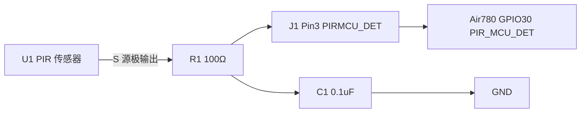
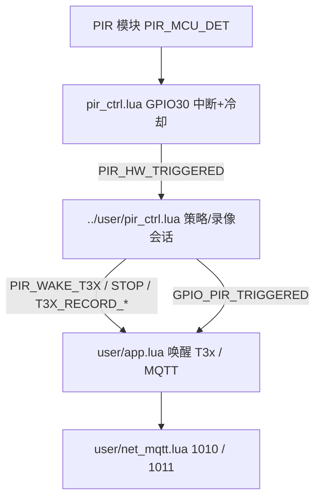
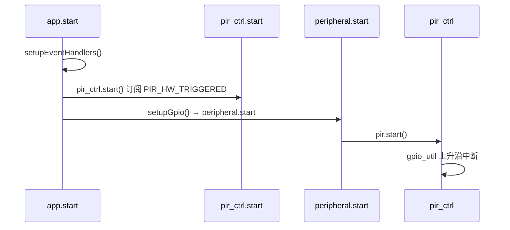
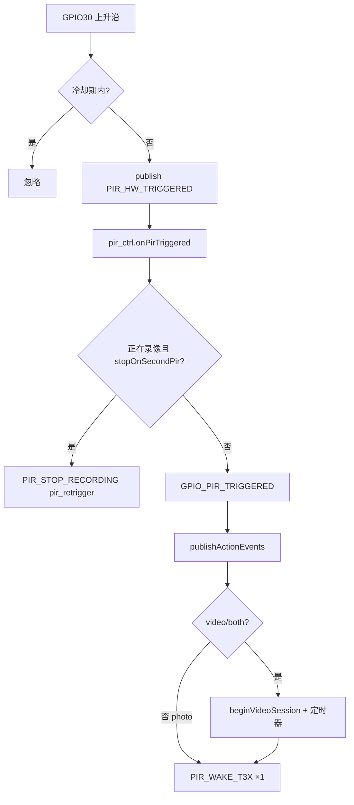

# 人体检测（PIR）— GPIO30 / PIR_MCU_DET

本文说明 **Air780EHM** 侧 PIR 硬件引脚、中断检测、业务联动与 **MQTT 1010** 上报流程。云端策略与 JSON 字段见 [`PIR_PROTOCOL.md`](PIR_PROTOCOL.md)。

> 一次 PIR → **`APP_PIR_WAKE_T3X`** 一次唤醒；`both` 由 T3x 同周期先拍后录。见 [T3X_RECORD_MQTT_FLOW.md](T3X_RECORD_MQTT_FLOW.md)。

---

## 1. 硬件与引脚

| 项目 | 值 |
|------|-----|
| 原理图网络名 | **PIR_MCU_DET** |
| 模组引脚 | **GPIO30**（Air780EHM 引脚表 Pin **31**） |
| 固件配置 | `user/config.lua` → `GPIO_IN.pir_det` / `PIR_CFG`（pin=30） |
| 方向 | 数字 **输入**（MCU 只读，不驱动 PIR 传感器供电） |

PIR 传感器输出经子板 **FPC J1 Pin3（PIRMCU_DET）** 接到模组 **GPIO30**；检测到人体时输出 **高电平脉冲**，固件配置为 **上升沿** 触发。触发间隔由 **`config.lua` → `cooldown_ms`** 软件节流（子板无 BISS0001 类延时芯片），见 [`PIR_TRIGGER_INTERVAL.md`](PIR_TRIGGER_INTERVAL.md)。

### 1.1 PIR 子板原理图（FPC-10P / J1）

子板通过 **FPC-10P05BC（J1）** 与主板相连，与本工程相关的信号如下。



| J1 引脚 | 网络名 | 说明 |
|---------|--------|------|
| 1 | GND | 地 |
| 2 | — | **MK1 麦克风**，经 C2/C3 滤波后送主控（与 PIR 无关） |
| **3** | **PIRMCU_DET** | **PIR 检测输出 → 主板 `PIR_MCU_DET` → 模组 GPIO30** |
| 4 | **BATSTAT_LED** | 子板电池状态灯 → 主板 **BAT_STAT_LED** → **Air780 GPIO21**（`led_ctrl`） |
| 5 | NETSTAT_LED | 网络状态灯（子板；模组侧网络状态另见 USB/NET 设计） |
| 6 | 3V3 | 子板逻辑电源 |
| 8 | CHGRED | 充电红灯（子板双色 LED，由充电逻辑驱动） |
| 9 | CHGBLUE | 充电蓝灯 |
| 10 | USB5V-IN | 5V 输入（充电/灯板电源） |

**U1 PIR（3 脚，开关型/晶体管输出结构）**

| U1 脚 | 网络 | 说明 |
|-------|------|------|
| D | PIR_3V3 | 传感器供电侧 |
| **S** | → **R1（100Ω）** → **PIRMCU_DET** | 有动静时输出有效电平到 MCU |
| G | GND | 地 |
| — | **C1（0.1µF）** 对地 | 与 R1 构成简单 RC，抑制毛刺 |

**与固件对应关系**

| 原理图 | 主板 / 模组 | 固件 |
|--------|-------------|------|
| PIRMCU_DET | PIR_MCU_DET → **GPIO30** | `PIR_CFG` / `GPIO_IN.pir_det`，`pir_ctrl` |
| BATSTAT_LED | **BAT_STAT_LED → GPIO21** | `GPIO_OUT.bat_stat_led`，`led_ctrl` |

**要点（结合原理图的分析）**

1. **无硬件“多久触发一次”定时器**：子板上未见 BISS0001、可调电阻等延时电路；PIR 模块自身可能反复输出脉冲，**间隔由固件 `cooldown_ms`（当前默认 3s）决定**。
2. **有效电平**：输出经上拉/下拉与 `PIR_CFG.pull = pulldown`、`active_level = 1` 一致时，**高电平** 表示触发；与 `trigger_mode = rising` 匹配。
3. **防抖**：硬件有 **C1 + R1**；软件另有 **`debounce_ms = 100`**，二者叠加。
4. **麦克风 MK1**：走 J1 Pin2，属音频子系统，不参与 PIR 流程。
5. **BAT_STAT_LED**：子板 J1 Pin4 经主板接到 **Air780 GPIO21**，固件用 `led_ctrl` 按 `APP_RUNTIME.battery_percent` 控灯（高电量蓝常亮等）。子板 CHGRED/CHGBLUE 为 **5V 充电灯**，由充电硬件驱动，非 GPIO21。

---

## 2. 软件分层



| 层 | 文件 | 职责 |
|----|------|------|
| 硬件参数 | `config.lua` | `PIR_CFG`（含 pin、cooldown 等） |
| 业务策略 | `pir_ctrl.lua` | `pirMediaConfig`、`pirRecordPolicy` |
| 硬件 | `pir_ctrl.lua` | GPIO30 中断、防抖、冷却，发布 `PIR_HW_TRIGGERED` |
| 聚合 | `peripheral.lua` | `pir.start()` |
| 业务 | `pir_ctrl.lua` | 拍照/录像策略、录像定时、二次触发停录 |
| 编排 | `app.lua` | 订阅事件 → `publishWakeup`、T3x 唤醒、`publishPirDetect` |
| 云端 | `net_mqtt.lua` | 下行 2010/2011，上行 1010/1011 |

---

## 3. GPIO30 检测参数（`config.lua` → `PIR_CFG`，`pir_ctrl.lua` 读取）

| 参数 | 默认值 | 说明 |
|------|--------|------|
| 引脚 | `PIR_CFG.pin`（30） | 与 `GPIO_IN.pir_det` / `PIR_MCU_DET` 一致 |
| `trigger_mode` | `rising` | 上升沿 = 检测到人体 |
| `pull` | `pulldown` | 无触发时拉低 |
| `debounce_ms` | `100` | 中断防抖（ms） |
| `cooldown_ms` | `PIR_COOLDOWN_MS.frequent`（3s） | 冷却期内忽略重复触发；详见 [`PIR_TRIGGER_INTERVAL.md`](PIR_TRIGGER_INTERVAL.md) |
| `active_level` | `1` | 中断电平为此值才触发 |

修改 `user/config.lua` 中 `PIR_CFG` 即可，无需在 `app` / `peripheral` 传参。

---

## 3.1 触发间隔（多久触发一次）

**当前默认：约每 3 秒最多 1 次**有效触发（`PIR_CFG.cooldown_ms = PIR_COOLDOWN_MS.frequent`）。

| 项目 | 说明 |
|------|------|
| 配置位置 | `config.lua` → `PIR_COOLDOWN_MS.*`、`PIR_CFG.cooldown_ms` |
| 实现 | `pir_ctrl.lua` 软件冷却，冷却期内 GPIO 上升沿忽略 |
| 完整分析 | **[`PIR_TRIGGER_INTERVAL.md`](PIR_TRIGGER_INTERVAL.md)**（行业参考、现场日志、选型建议） |

快速改档示例：

```lua
cooldown_ms = _G.PIR_COOLDOWN_MS.standard,   -- 15s 标准档
```

---

## 4. 启动顺序

须在 **PIR 硬件中断注册之前** 启动 `pir_ctrl`，以便订阅硬件事件。



对应 `app.lua`：

1. `setupEventHandlers()` 内 **`pir_ctrl.start()`**（最先）
2. `setupGpio()` → `peripheral.start()` → `pir.start()`
3. `peripheral` → `pir.start()`

模块开关：`app_config.lua` → `MODULE_FLAGS.gpio = true`（PIR 随 GPIO 外设包启动）。

---

## 5. 检测到人体后的流程

### 5.1 硬件 → 业务



### 5.2 `app.lua` 联动

| 事件 | 动作 |
|------|------|
| `GPIO_PIR_TRIGGERED` | `net.publishPirDetect()` → 上行 **1010** `detected` |
| `PIR_WAKE_T3X` | `uploadMode=auto` 时 **1001** + `requestT3xWake()`（photo/video/both 各仅一次） |
| `T3X_RECORD_ACTIVE` | **1010** `t3x_active`（T3x `AT+RECORD=1`） |
| `T3X_RECORD_STOP` | **1011** `source=t3x` |
| `PIR_STOP_RECORDING` | **1011** `source=4g`；可选 `requestT3xWake(pir_stop)` |

默认媒体策略（`pir_ctrl.lua` → `pirMediaConfig`）：

| 字段 | 默认 |
|------|------|
| `action` | `video` |
| `uploadMode` | `auto` |
| `quality` | `high` |

可由云端 **2010** 修改，详见 `PIR_PROTOCOL.md`。

---

## 6. MQTT 上报

### 6.1 硬件触发 — 1010

主题：`/panshi/app/{imei}/pir`

```json
{
  "deviceNo": "862323084068124",
  "dataType": "1010",
  "status": "1",
  "pirStatus": "detected",
  "recording": 0,
  "action": "video",
  "uploadMode": "auto",
  "quality": "high",
  "time": "2026-05-19 12:00:00"
}
```

| pirStatus | 含义 |
|-----------|------|
| `detected` | 正常人体触发 |
| `retrigger` | 录像中二次 PIR（将停录） |
| `query` | 云端 2010 查询应答 |

### 6.2 停录 — 1011

录像结束（定时 / 二次 PIR / 云端 2011）时上行 `event` 主题，见 `PIR_PROTOCOL.md`。

---

## 7. 应用事件

| 事件（`APP_EVENTS`） | 发布者 | 说明 |
|----------------------|--------|------|
| `PIR_HW_TRIGGERED` | `pir_ctrl` | GPIO30 有效触发（过冷却） |
| `GPIO_PIR_TRIGGERED` | `pir_ctrl` | 业务层确认触发（含 action 等） |
| `PIR_WAKE_T3X` | `pir_ctrl` | 一次 PIR 一次唤醒 T3x（含 photo/video/both） |
| `T3X_RECORD_ACTIVE` / `T3X_RECORD_STOP` | `host_uart` | T3x `AT+RECORD=` → MQTT 1010/1011 |
| `PIR_STOP_RECORDING` | `pir_ctrl` | Luat 侧停止录像会话 |
| `PIR_TIMER_EXPIRED` | `pir_ctrl` | max_sec 到期 → `timer` 停录 |

---

## 8. 调试

| 现象 | 建议 |
|------|------|
| 无人也频繁触发 | 查 PIR 模块灵敏度/遮挡；加大 `debounce` 或 `cooldown` |
| 有人无反应 | 万用表看 **PIR_MCU_DET** 是否有高脉冲；确认 `PIR_CFG.pin=30` |
| 有日志无 1010 | `MODULE_FLAGS.mqtt`、`APP_RUNTIME.online_status`、是否订阅到 `GPIO_PIR_TRIGGERED` |
| 只拍照不唤醒 | 检查 `uploadMode` 是否为 `manual` |

日志 TAG：`pir`（硬件）、`pir_ctrl`、`app`、`net`。

---

## 9. 相关文档

- [`T3X_CAT1_GPIO.md`](../T3X_CAT1_GPIO.md) §2.9 — 原理图网络名  
- [`PIR_PROTOCOL.md`](PIR_PROTOCOL.md) — 2010 / 2011 / 1010 / 1011  
- [`MQTT_DOWNLINK.md`](MQTT_DOWNLINK.md) §8 — 下行 PIR 配置示例  
- [`CONFIG.md`](CONFIG.md) — 配置分层  
- [`config.lua`](config.lua) — `PIR_CFG`  
- [`pir_ctrl.lua`](pir_ctrl.lua) — 媒体/录像默认策略  
- [`PIR_TRIGGER_INTERVAL.md`](PIR_TRIGGER_INTERVAL.md) — **触发间隔分析（可视门铃参考）**  
