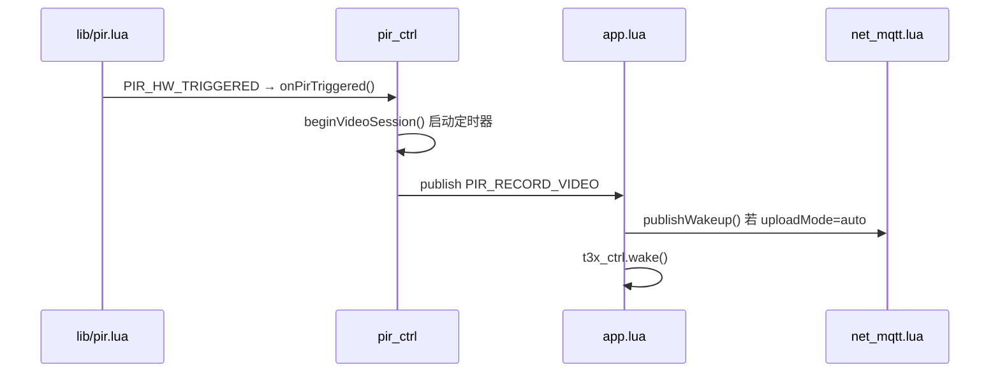
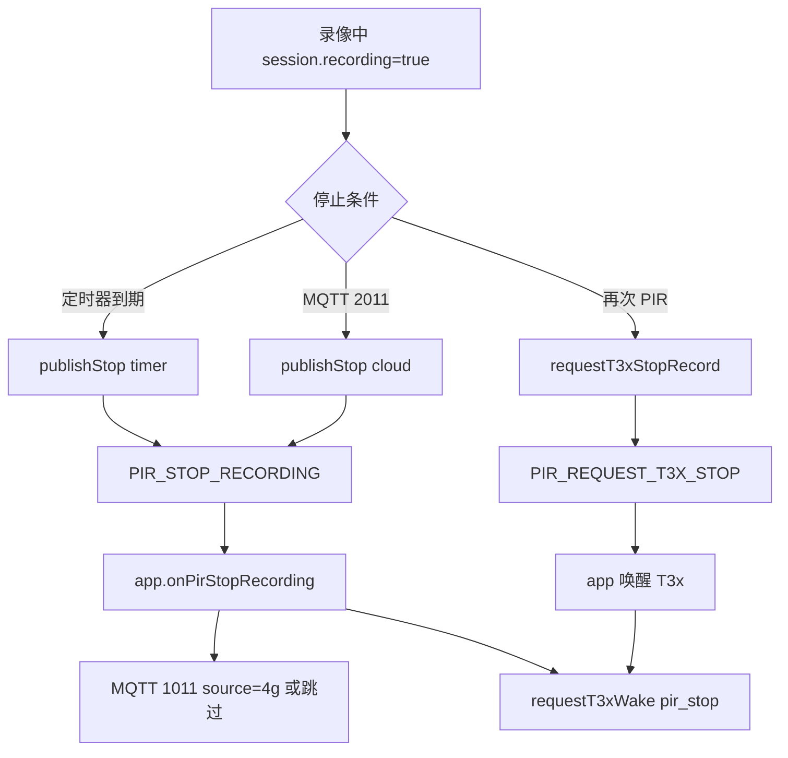

# PIR 媒体与录像停止协议

> 适用工程：780EHM_PJ（方案1：`lib/pir.lua` → `pir_ctrl.lua` → `app.lua` / `net_mqtt.lua`）  
> 更新日期：2026-05-18

---

## 1. 概述

PIR 人体感应触发后，设备根据 `pirMediaConfig` 决定拍照/录像，并通过 **LuatOS 事件总线**（`APP_EVENTS`）通知应用层。  
当处于 **录像会话** 时，满足下列任一 **停止条件** 即发布 `PIR_STOP_RECORDING`，并可经 MQTT 上报 `dataType=1011`。

---

## 2. 配置项

### 2.1 媒体配置 `pirMediaConfig`（`pir_ctrl.lua` 默认 / 云端 2010 覆盖）

| 字段 | 类型 | 取值 | 说明 |
|------|------|------|------|
| `action` | string | `photo` / `video` / `both` | 触发后的媒体动作 |
| `uploadMode` | string | `auto` / `manual` | `auto` 时应用层自动 MQTT wakeup |
| `quality` | string | `high` / `low` | 画质档位（下发 t3x 时使用） |

### 2.2 硬件触发间隔 `PIR_CFG.cooldown_ms`（`config.lua`）

| 字段 | 默认 | 说明 |
|------|------|------|
| `cooldown_ms` | `PIR_COOLDOWN_MS.frequent`（**3s**） | 两次有效触发最小间隔；档位见 `config.lua` |

默认约 **每 5 秒最多 1 次** `PIR_HW_TRIGGERED`。档位与行业参考、现场日志分析见 **[`PIR_TRIGGER_INTERVAL.md`](PIR_TRIGGER_INTERVAL.md)**。

### 2.3 录像停止策略 `pirRecordPolicy`（`pir_ctrl.lua` 默认 / 云端 2010 扩展字段）

| 字段 | 类型 | 默认 | 说明 |
|------|------|------|------|
| `maxDurationSec` | number | `60` | **条件1：定时停止**。录像开始后最长秒数（1～3600），到时 `reason=timer` |
| `stopOnSecondPir` | bool/0/1 | `true` | **条件2：二次 PIR**。录像中再次触发 PIR 则 `reason=pir_retrigger`，且**不再**启动新的拍照/录像 |
| `stopOnCloud` | bool/0/1 | `true` | **条件3：云端命令**。是否响应下行 `2011` |

---

## 3. 内部事件（`APP_EVENTS`）

| 事件名 | 常量 | 发布时机 | 订阅方 |
|--------|------|----------|--------|
| PIR 硬件中断 | `PIR_HW_TRIGGERED` | `lib/pir` 有效边沿 | `pir_ctrl` |
| PIR 业务触发 | `GPIO_PIR_TRIGGERED` | `pir_ctrl.onPirTriggered` | `app` → MQTT **1010** |
| 唤醒 T3x（photo/video/both） | `PIR_WAKE_T3X` | 一次 PIR 业务 | `app` → wakeup + `requestT3xWake` |
| **停止录像（timer/cloud）** | `PIR_STOP_RECORDING` | 4G 清会话 | `app` → 1011 `source=4g` 或唤醒 T3x |
| **请求 T3x 停录（二次 PIR）** | `PIR_REQUEST_T3X_STOP` | `pir_retrigger` | `app` → 唤醒；1011 仅 `source=t3x` |
| T3x 抓拍完成 | `T3X_SNAPSHOT_DONE` | `AT+SNAPSHOT=` | `app` → 1010 `snapshot_saved` |

### 3.1 `PIR_STOP_RECORDING` 载荷

```text
sys.publish(APP_EVENTS.PIR_STOP_RECORDING, reason, uploadMode, quality)
```

| 参数 | 说明 |
|------|------|
| `reason` | 停止原因，见下表 |
| `uploadMode` | 本次录像会话的 uploadMode |
| `quality` | 本次录像会话的 quality |

### 3.2 停止原因 `reason`

| 值 | 条件 | 实现位置 |
|----|------|----------|
| `timer` | 达到 `maxDurationSec` | `pir_ctrl` 内定时器 |
| `pir_retrigger` | 录像中第二次 PIR（且 `stopOnSecondPir=true`） | `pir_ctrl.onPirTriggered` |
| `cloud` | 云端下发 `dataType=2011` | `net_mqtt.lua` → `requestStopFromCloud()` |
| `manual` | 本地调用 `pir_ctrl.requestStopManual()` | 预留 AT/调试 |
| `done` | T3x 正常录完（`source=t3x` 的 1011） | `host_uart` → `publishT3xRecordStop` |
| `time_sync` / `disk_full` / … | T3x 开录/写盘失败（`source=t3x`） | 同上，reason 与 T3x 一致 |

---

## 4. 流程说明

### 4.1 开始录像



### 4.2 停止录像（三种条件）



### 4.3 二次 PIR 行为（`stopOnSecondPir=true`）

1. 第一次 PIR：`PIR_WAKE_T3X` 一次唤醒；T3x 按 `PIRSTAT action=` 执行（`both` 先拍后录）。  
2. 录像未结束前第二次 PIR：`requestT3xStopRecord(pir_retrigger)` → `PIR_REQUEST_T3X_STOP` 唤醒 T3x（**保持** `recording=1`）；`GPIO_PIR_TRIGGERED(retrigger)`；**不**发 4G 侧 1011。  
3. PIR 冷却期（`lib/pir.lua` 默认 5s）过后，可再次全新触发。

---

## 5. MQTT 协议（PIR 相关）

> 通用连接、主题、200x↔100x 见 **[MQTT_PROTOCOL.md](./MQTT_PROTOCOL.md)**。本节 PIR：**2010↔1010**、**2011↔1011**。

### 5.1 下行：PIR 策略 / 查询 `dataType=2010` → 上行 `1010`

**方向**：平台 → 设备；硬件触发或 `query` 时设备 → 平台 **1010**

**配置示例**：

```json
{
  "dataType": "2010",
  "action": "video",
  "uploadMode": "auto",
  "quality": "high",
  "videoMaxDurationSec": 90,
  "stopOnSecondPir": 1,
  "stopOnCloud": 1
}
```

| 字段 | 必填 | 说明 |
|------|------|------|
| `action` | 否 | 同 `pirMediaConfig.action` |
| `uploadMode` | 否 | 同 `pirMediaConfig.uploadMode` |
| `quality` | 否 | 同 `pirMediaConfig.quality` |
| `videoMaxDurationSec` | 否 | 最长录像秒数，别名 `maxDurationSec` |
| `stopOnSecondPir` | 否 | `1`/`0` 或 `true`/`false` |
| `stopOnCloud` | 否 | 是否允许 2011 停止 |

未出现的字段保持设备当前值（合并更新）。

**状态查询**（立即应答 1010）：

```json
{ "dataType": "2010", "action": "query" }
```

### 5.2 上行：PIR 检测状态 `dataType=1010`

**方向**：设备 → 平台  

**触发**：PIR 硬件边沿；或下行 2010 `action=query`  

**主题**：`/panshi/app/{deviceNo}/pir`  

**示例**：

```json
{
  "deviceNo": "868123456789012",
  "dataType": "1010",
  "status": "1",
  "pirStatus": "detected",
  "recording": 0,
  "action": "video",
  "uploadMode": "auto",
  "quality": "high",
  "time": "2026-05-19 15:00:00"
}
```

| pirStatus | 说明 |
|-----------|------|
| `detected` | 正常触发 |
| `retrigger` | 录像中二次 PIR |
| `query` | 应答 2010 查询 |

### 5.3 下行：停止录像 `dataType=2011`

**方向**：平台 → 设备  

**示例**：

```json
{
  "dataType": "2011",
  "messageId": "cmd-20260518-001"
}
```

**设备行为**：

- 若当前正在录像且 `stopOnCloud=true` → 发布 `PIR_STOP_RECORDING(cloud)`  
- 若未在录像 → 忽略（无事件）

### 5.4 上行：录像已停止 `dataType=1011`

**方向**：设备 → 平台  

**触发**：`app` 订阅到 `PIR_STOP_RECORDING` 后调用 `net.publishPirRecordStop()`  

**主题**：`/panshi/app/{deviceNo}/event`  

**示例**：

```json
{
  "deviceNo": "868123456789012",
  "dataType": "1011",
  "reason": "timer",
  "uploadMode": "auto",
  "quality": "high",
  "time": "2026-05-18 14:30:00"
}
```

| 字段 | 说明 |
|------|------|
| `reason` | `timer` / `pir_retrigger` / `cloud` / `manual`；T3x 侧另含 `done` / `time_sync` / `disk_full` 等 |
| `source` | `4g`（4G 会话结束）或 `t3x`（T3x `AT+RECORD=0`） |
| `uploadMode` | 停止时会话的上传模式 |
| `quality` | 停止时会话的画质 |

### 5.4 与其它上行类型

`1001` / `1002` / `1003` 定义见 **MQTT_PROTOCOL.md**；本节 **1011** 为 PIR 录像停止专用。

---

## 6. 代码映射

| 能力 | 模块 | 函数 |
|------|------|------|
| PIR 中断 | `lib/pir.lua` | `onInterrupt` → `APP_PIR_HW_TRIGGERED` → `pir_ctrl.onPirTriggered` |
| 会话/定时/停止发布 | `pir_ctrl.lua` | `beginVideoSession` / `publishStopRecording` |
| 业务响应 | `app.lua` | `setupEventHandlers` 内 PIR 订阅 |
| 云端 2010/2011 | `net_mqtt.lua` | `pir_ctrl.setMediaConfig` / `setRecordPolicy` / `requestStopFromCloud` |
| 上行 1011 | `net_mqtt.lua` | `publishPirRecordStop` / `publishT3xRecordStop` |
| T3x 写盘确认 1010 | `net_mqtt.lua` | `publishPirRecordActive` |
| T3x AT+RECORD | `host_uart.lua` | `uart_record_notify` → `APP_T3X_RECORD_*` |
| 硬件触发 | `config.lua` | `PIR_CFG` |
| 默认策略 | `pir_ctrl.lua` | `pirMediaConfig` / `pirRecordPolicy` |

---

## 7. 调试建议

```lua
-- 查看 PIR 会话与策略
local cfg = require "pir_ctrl"
log.info("pir", json.encode(cfg.getState()))

-- 手动停止录像（reason=manual）
require "pir_ctrl".requestStopManual()
```

实机验证清单：

- [ ] `action=video`，默认 60s 后收到 `1011` 且 `reason=timer`（或 T3x 先到 `source=t3x,reason=done`）
- [ ] 首个 I 帧后收到 **1010** `pirStatus=t3x_active, active=1`
- [ ] T3x 失败时收到 **1011** `source=t3x`（如 `time_sync`、`no_iframe`）
- [ ] 录像中再次挥手，收到 `reason=pir_retrigger`，且无第二次 `PIR_RECORD_VIDEO`
- [ ] 平台发 `2011`，收到 `reason=cloud`
- [ ] `stopOnSecondPir=0` 时，录像中二次 PIR 不停止（仍受定时器约束）
- [ ] `host_uart.queryHostRecord()` 在写盘期间返回 `running=1,active=1`

详见 [T3X_RECORD_MQTT_FLOW.md](T3X_RECORD_MQTT_FLOW.md)。

---

## 8. 扩展说明

- `PIR_STOP_RECORDING` 仅表示 **应用层录像会话结束**；T3x 侧具体停录指令需由 t3x 固件协议对接（当前 `app` 在停止时发送 `pulseWakeup` 作唤醒/同步脉冲）。  
- 若平台需 ACK，可在后续增加 `3011` 应答类型，与 `2011` 的 `messageId` 关联。
