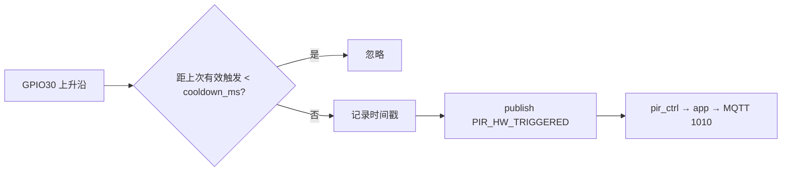

# PIR 触发间隔分析（可视门铃参考）

> 本文说明：**多久触发一次**、行业常见取值、本工程实现与现场日志。  
> 配置真源：`user/config.lua`（`PIR_COOLDOWN_MS`、`PIR_CFG.cooldown_ms`）  
> 配置索引：[`CONFIG.md`](CONFIG.md)  
> 硬件流程：[`PIR_HARDWARE.md`](PIR_HARDWARE.md) · 协议：[`PIR_PROTOCOL.md`](PIR_PROTOCOL.md)  
> T31 经 UART 读冷却丢弃次数：`AT+PIRSTAT?`（`cnt_hw_ignore_cooldown`），见 [`T31_4G_AT_INTERACTION.md`](T31_4G_AT_INTERACTION.md)

---

## 1. 结论（本工程）

| 问题 | 答案 |
|------|------|
| **当前默认多久触发一次？** | 约 **3 秒** 最多 1 次有效业务触发（`PIR_COOLDOWN_MS.frequent = 3000`） |
| **由谁决定？** | `config.lua` → `PIR_CFG.cooldown_ms`，`lib/pir.lua` 软件冷却 |
| **日志里怎么看？** | `I/user.pir 已启动 30 cooldown 5000`；每次有效：`I/user.pir 触发 30` |
| **与录像时长关系？** | **无关**。`pirRecordPolicy.maxDurationSec`（默认 60s）是单次录像上限，不是触发间隔 |

有人持续在门前时，PIR 模块可能更频繁地输出脉冲，但固件在 `cooldown_ms` 内**丢弃**多余上升沿，因此 MQTT **1010**、拍照/唤醒不会比冷却时间更密。

**硬件说明**：PIR 子板（FPC J1 → U1）无独立延时 IC，**`PIRMCU_DET` 直送 GPIO30**；间隔只能由软件配置，见 [`PIR_HARDWARE.md`](PIR_HARDWARE.md) §1.1 原理图分析。

---

## 2. 可视门铃行业常见间隔（参考）

市面可视门铃/猫眼对「两次报警/抓拍」的间隔**无统一国标**，App 里多叫 **侦测间隔 / 报警间隔 / 触发间隔**，常见档位如下（仅供选型参考）：

| 档位 | 典型间隔 | 特点 |
|------|----------|------|
| 灵敏 / 频繁 | **5～10 s** | 少漏报；推送、4G 流量、功耗更高 |
| 标准 | **15～30 s** | 多数产品默认附近；平衡误报与打扰 |
| 省电 / 低打扰 | **30～60 s** | 电池类门铃、减少重复通知 |
| 云端合并 | 最长 **2～5 min** | 同一事件只推一条（策略层，非 PIR 硬件） |

说明：

- 上表指 **通知/业务触发节流**，不是单次录像文件的总时长。
- 单次录像长度常见 **15～60 s**（与本工程 `maxDurationSec = 60` 一致）。
- 各品牌（Ring、Nest、萤石、小米等）具体数值不同，以 App 可选档为准。

---

## 3. 本工程配置（`config.lua`）

```lua
_G.PIR_COOLDOWN_MS = {
    frequent = 3 * 1000,    -- 约 3s（当前默认）
    normal = 10 * 1000,
    standard = 15 * 1000,
    economy = 30 * 1000,
}

_G.PIR_CFG = {
    ...
    cooldown_ms = _G.PIR_COOLDOWN_MS.frequent,  -- 改这一行选用档位
}
```

| 键 | 毫秒 | 适用场景 |
|------|------|----------|
| `PIR_COOLDOWN_MS.frequent` | 3000 | **当前默认**；门口要尽量少漏人 |
| `PIR_COOLDOWN_MS.normal` | 10000 | 较灵敏门铃 |
| `PIR_COOLDOWN_MS.standard` | 15000 | 接近市面「标准」档 |
| `PIR_COOLDOWN_MS.economy` | 30000 | 少推送、省电、少 MQTT |

修改后重新烧录，日志应显示：`I/user.pir 已启动 30 cooldown <新毫秒数>`。

### 3.1 与 `debounce` 的区别

| 参数 | 默认 | 作用 |
|------|------|------|
| `debounce` | 100 ms | GPIO **抖动滤波**，消除毛刺 |
| `cooldown_ms` | 10000 ms | **业务节流**，决定多久允许下一次 `PIR_HW_TRIGGERED` |

不要把 `debounce` 当成 10 秒触发周期；10 秒间隔**只由 `cooldown_ms` 决定**。

---

## 4. 固件实现（`lib/pir.lua`）



- 冷却起点：**上一次成功发布** `PIR_HW_TRIGGERED` 的时刻（`os.time()*1000`）。
- 冷却期内中断仍可能进回调，但**直接 return**，无日志「触发」。

---

## 5. 现场实测日志（2026-05-20）

配置：`cooldown_ms = 10000`，有人持续触发 PIR。

| 次序 | 时间 | 事件 | 与上次间隔 |
|------|------|------|------------|
| 启动 | 03:45:50.799 | `I/user.pir 已启动 30 cooldown 10000` | — |
| 1 | 03:46:47.033 | `I/user.pir 触发 30` | — |
|  |  | → `pir_ctrl PIR 业务处理` → `app PIR GPIO` → `net 发布 PIR 检测(1010)` |  |
| 2 | 03:46:58.724 | `I/user.pir 触发 30` | **≈ 11.7 s** |
| 3 | 03:47:09.501 | `I/user.pir 触发 30` | **≈ 10.8 s** |

**分析：**

- 实测间隔 **10.8～11.7 s**，略大于配置的 10 s，属正常。
- 原因：冷却从固件认定「有效触发」时刻起算；PIR 模块输出高电平的时刻与 GPIO 边沿不完全对齐。
- 若间隔 **远小于** 10 s，检查是否改过 `cooldown_ms` 或未烧录最新 `config.lua`。

---

## 6. 选型建议

| 目标 | 建议 `cooldown_ms` |
|------|-------------------|
| 恢复此前现场日志间隔 | `PIR_COOLDOWN_MS.normal`（10s） |
| **当前固件默认** | `PIR_COOLDOWN_MS.frequent`（3s） |
| 更接近常见「标准」门铃 | `PIR_COOLDOWN_MS.standard`（15s） |
| 电池/4G 省流量 | `PIR_COOLDOWN_MS.economy`（30s） |
| 门口不能漏报 | `PIR_COOLDOWN_MS.frequent`（3s） |

缩短间隔会增加：`1010` 上报、`1001` 唤醒、t3x 拍照次数与功耗。  
录像中若再次触发且 `stopOnSecondPir = true`，会走停录逻辑而非新一段录像，见 [`PIR_PROTOCOL.md`](PIR_PROTOCOL.md)。

---

## 7. 相关文档

- [`PIR_HARDWARE.md`](PIR_HARDWARE.md) — GPIO30、启动顺序、事件流  
- [`PIR_PROTOCOL.md`](PIR_PROTOCOL.md) — 2010/2011、1010/1011  
- [`CONFIG.md`](CONFIG.md) — 配置分层  
- [`config.lua`](config.lua) — `PIR_COOLDOWN_MS`、`PIR_CFG`

**文档版本**：2026-05-20
