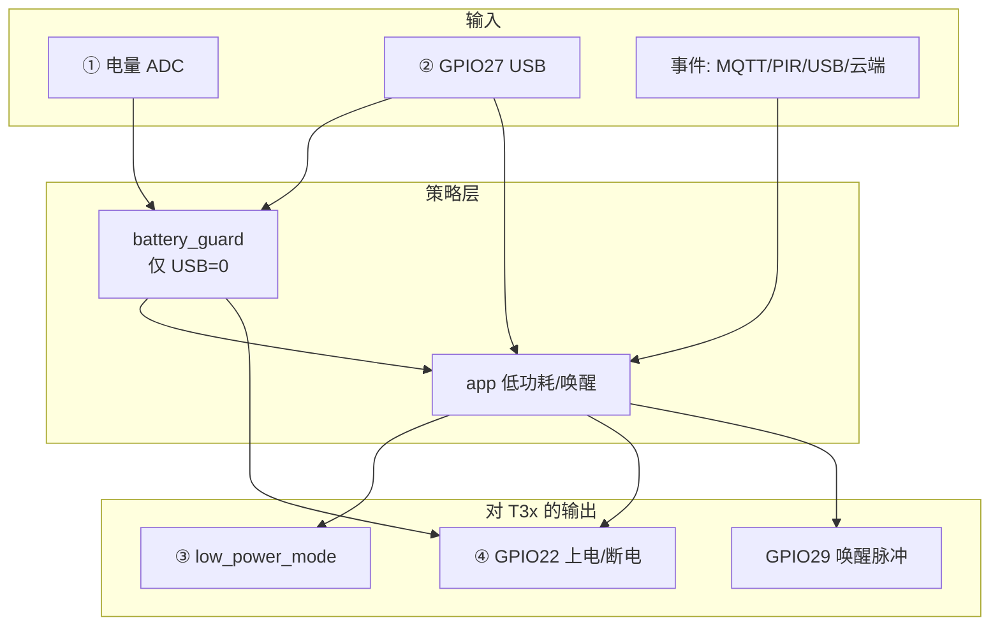
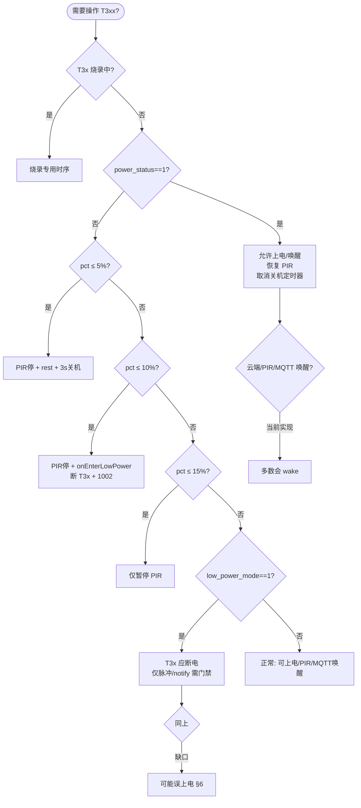

# 电量 · USB · 低功耗 · T3x 启动 — 逻辑关系总览

> 解决「低电量 / 低电量+USB / 上电默认 USB / 何时启动 T3xx」混在一起不好理解的问题。  
> 代码真源：[`user/app.lua`](../user/app.lua)、[`user/battery_guard.lua`](../user/battery_guard.lua)、[`user/t3x_ctrl.lua`](../user/t3x_ctrl.lua)、[`lib/usb_charge.lua`](../lib/usb_charge.lua)、[`user/config.lua`](../user/config.lua)  
> 延伸阅读：[LOW_BATTERY_AND_LOW_POWER.md](LOW_BATTERY_AND_LOW_POWER.md)、[CHARGE_BATTERY.md](CHARGE_BATTERY.md)

---

## 1. 先分清四个独立维度

固件里 **没有单一「模式」**，而是四个量组合决定行为：

| 维度 | 变量/标志 | 谁更新 | 含义 |
|------|-----------|--------|------|
| **① 电量** | `APP_RUNTIME.battery_percent` | `vbat` 每 10s | ADC 百分比，与 USB **无直接关系** |
| **② USB 座** | `APP_RUNTIME.power_status` | GPIO27 / `usb_charge` | `1`=外壳 USB 插入，`0`=未插 |
| **③ 业务低功耗** | `APP_RUNTIME.low_power_mode` | `app.setLowPowerMode` | `1`=rest（MQTT 1003），`0`=normal |
| **④ T3x 供电** | `t3x_ctrl` 内部 `isPoweredOn` | GPIO22 高/低 | **硬件上** T3x 是否有电（与 ③ 可能不一致） |



**易混点**：

- `lowPowerMode: "rest"`（1003）≠ T3x 一定断电（可能 flag=1 但 GPIO22 仍高）。
- 插 USB **不会** 立刻把 `remainPower` 拉高，只 **取消** 低电量断 T3xx/关机策略。
- 模组 **红灯闪** 只看电量，**不看** USB。

---

## 2. 优先级（谁说了算）

从高到低：

| 优先级 | 条件 | 对 T3x / 电量保护 |
|--------|------|-------------------|
| **P0** | T3x 烧录模式 `T3X_BURN_MODE_ACTIVE` | 暂停 `battery_guard`；专用心跳/供电时序 |
| **P1** | **USB 插入** `power_status==1` | `battery_guard` **整段跳过**；插入时 **wake T3xx**、恢复 PIR、取消 ≤5% 关机 |
| **P2** | 未插 USB + **电量** | ≤15% 停 PIR；≤10% 进低功耗+断 T3xx；≤5% 延时关机 |
| **P3** | **业务低功耗**（USB 拔出 / MQTT 2002 / AT） | `onEnterLowPower` → 断 T3x + 1002（与电量可叠加） |
| **P4** | **业务唤醒**（PIR / MQTT 离线 / notify_host 等） | 可能 **上电+脉冲**（**当前未统一检查** ③/①，见 §6） |

**口诀**：**USB 插入 > 电量保护 > 一般低功耗标志；但「唤醒源」可能绕过前两条。**

---

## 3. 上电启动时序（默认 `MODULE_FLAGS`）

默认：`charge=true`、`battery_guard=true`、`mqtt=true`、`t3x` 相关=true。

```text
main.lua
  → cellular_bootstrap.start()     -- SIM/APN
  → net.bootstrapNetwork()       -- 等 IP
  → app.start()
       → t3x_ctrl.start()
            → powerOn()           ★ ① 先给 T3x 上电（无条件）
       → battery_guard.start()    -- 500ms 后 evaluate(当前电量)
       → … MQTT / PIR / 串口 …
       → initPowerStatus()        -- 读 GPIO27
            若 USB=0 且 charge=true：
                 ★ ② 不做任何事（T3x 保持 ① 的上电状态）
            若 USB=0 且 charge=false 且 mqtt=true：
                 setLowPowerMode(1) + enterSleep()（仅断 T3x，未必发 1002）
            若 USB=0 且 charge=false 且无 mqtt：
                 onEnterLowPower()（完整低功耗+1002）
            若 USB=1：
                 ★ ③ 不进入上述分支；T3x 保持上电
```

### 3.1 「默认插入 USB」启动

| 步骤 | 行为 |
|------|------|
| `t3x_ctrl.start()` | **T3x 上电** |
| `initPowerStatus()` | `power_status=1`，**不**自动 `enterSleep` |
| `battery_guard.evaluate` | 见 USB → **return**，不按电量断 T3x |
| 结果 | **T3x 一直运行**（除非后续云端 2002 enter、烧录、手动断电） |

### 3.2 「默认未插 USB」启动（常见出货态）

| 步骤 | 行为 |
|------|------|
| `t3x_ctrl.start()` | **T3x 先上电** |
| `initPowerStatus()` | **不**因无 USB 立刻休眠（`charge=true` 时） |
| 首次 `BATTERY_UPDATE` / `battery_guard` | 若电量 ≤10% → `onEnterLowPower` → **断 T3xx**；≤15% 仅停 PIR |
| 结果 | 上电瞬间 T3x 会亮一下，**几百毫秒～数秒内**可能被电量保护关掉 |

### 3.3 与「用户以为的开机默认」的差异

| 用户预期 | 当前实现 |
|----------|----------|
| 无 USB 出厂即 T3x 休眠 | 需 `charge=false` 走 `initPowerStatus` 的 `enterSleep`，或等 `battery_guard` ≤10% |
| 有 USB 才允许 T3x 跑 | 插 USB 后 **`battery_guard` 不拦**；但 **`t3x_ctrl.start()` 无 USB 也会先上电** |
| 低电量绝不启 T3x | 仅 **未插 USB** 时由 `battery_guard` 保证；**插 USB 低电仍会 wake/保持上电** |

---

## 4. 运行期：组合状态表

### 4.1 T3x 是否上电（GPIO22）

| USB | 电量(未插USB) | low_power_mode | T3x 典型状态 | 主要来源 |
|-----|---------------|----------------|--------------|----------|
| 1 | 任意 | 0 | **上电** | USB 忽略电量；`onUsbInserted` / `wake` |
| 1 | 任意 | 1 | **上电**（插入后会 exit） | `onUsbInserted` → `onExitLowPower` |
| 0 | >10% | 0 | **上电** | 正常业务 / `t3x_ctrl.start` 遗留 |
| 0 | >10% | 1 | **断电** | `enterSleep` |
| 0 | ≤10% | 1 | **断电** | `battery_guard` → `onEnterLowPower` |
| 0 | ≤10% | 0 | **可能上电** | 仅停 PIR，**未必**断 T3x（10%<电量≤15%） |
| 0 | ≤5% | 任意 | **断电** + 3s 后整机关机 | `battery_guard`（USB 插入可取消关机） |

### 4.2 PIR / MQTT / 4G

| USB | 电量 | PIR | 4G/MQTT | 说明 |
|-----|------|-----|---------|------|
| 0 | ≤15% | **暂停** | 常电 | 低电仍可联网上报 1003 |
| 0 | ≤10% | 暂停 | 常电 + 1002 rest | T3x 断，模组不断网 |
| 1 | 低电 | **恢复** | 常电 | 不因低电停 PIR |
| 任意 | 任意 | — | MQTT 离线可 `notify_host` | **可能违背 rest**（见 §6） |

### 4.3 MQTT 1003 字段怎么读

| 字段 | 低电未插 USB | 低电已插 USB |
|------|--------------|--------------|
| `powerStatus` | `"0"` | `"1"` |
| `remainPower` | 低（如 `"12"`） | 仍低，充电后逐渐升高 |
| `lowPowerMode` | 常 `"rest"`（若已进低功耗） | 插入后多为 `"normal"`（若已 `onExitLowPower`） |

---

## 5. 各模块职责（一张表）

| 模块 | 只管什么 | 不管什么 |
|------|----------|----------|
| **`vbat`** | 采样 → `battery_percent` | T3x、USB、MQTT |
| **`usb_charge`** | GPIO27 → 发布 `GPIO_USB_DET_CHANGED` | 电量、T3x |
| **`battery_guard`** | 未插 USB 时按电量：PIR/休眠/关机 | 插 USB 后 **全部不评估** |
| **`app.applyUsbInsertState`** | USB 边沿 → `power_status`、调 `battery_guard` 或 `onExitLowPower` | 电量阈值 |
| **`app.onEnterLowPower`** | `low_power_mode=1`、断 T3x、1002、关 TCP | 是否低电（任何来源都可触发） |
| **`app.onExitLowPower`** | `low_power_mode=0`、wake T3x、恢复 TCP 等 | USB 必须插入（通常由 USB 路径调用） |
| **`t3x_ctrl.start`** | **无条件 `powerOn`** | USB/电量 |
| **`t3x_ctrl.enterSleep`** | GPIO22 断电 | `low_power_mode` 标志 |
| **`t3x_ctrl.wake`** | 上电 + GPIO29 脉冲 | 低功耗/电量门禁 |
| **`host_uart.notify_host`** | 若无电则 `powerOn` + 脉冲 | **未检查** rest/低电 |
| **`net_mqtt` 2002** | 发布 `POWER_ENTER/EXIT_REST` | T3x 引脚 |

---

## 6. 当前「乱」的根源（已知缺口）

| # | 现象 | 原因 |
|---|------|------|
| 1 | 无 USB 上电 T3x 闪一下再灭 | `t3x_ctrl.start()` **总是** `powerOn`，`battery_guard` 晚 500ms 才断 |
| 2 | `rest` 但 T3x 仍重启 | `onMqttOffline` / `notify_host` **不检查** `low_power_mode` 与低电 |
| ~~3~~ | ~~`charge=true` 无 USB 不 `enterSleep`~~ | ✅ v1.4 已修：仅看 USB 插入，无 USB 即 `boot_no_usb` |
| 4 | 电量 12% 边界抖 | `recover_rest_percent=12` 与 `t3x_rest_percent=10` 迟滞过窄 |
| 5 | 插 USB 低电仍红闪 | 设计如此：灯看 ADC，保护看 USB |
| 6 | USB 拔出 + 高电量也进 rest | `applyUsbInsertState(false)` 在 `low_power_mode==0` 时调 `onEnterLowPower`（与电量无关） |

---

## 7. 建议如何处理（产品 + 固件）

### 7.1 先定产品规则（推荐写成需求表）

| 编号 | 规则建议 | 对应实现要点 |
|------|----------|--------------|
| R1 | **未插 USB + 电量 ≤ X%**：禁止 T3x 上电/唤醒 | 统一门禁函数 `mayPowerT3x()` |
| R2 | **插 USB**：允许 T3x（即使低电），便于充电/调试 | 保持 `battery_guard` USB 优先 |
| R3 | **上电无 USB**：不要先亮 T3x 再灭 | `t3x_ctrl.start()` 改为按 R1 决定是否 `powerOn` |
| R4 | **业务 rest**：MQTT 离线/PIR **不得** 拉起 T3x | `sendWakePulse` / `notify_host` 内检查 |
| R5 | **电量恢复**：加大迟滞，如 ≤10% 休眠、≥20% 才恢复 | 改 `BATTERY_CFG.guard` |
| R6 | **出厂默认**：无 USB 即 T3x 休眠 | ✅ v1.4 `initPowerStatus` 已实现 |

### 7.2 固件改造落点（若排期开发）

```text
新增 app/t3x_policy.lua（或 lib/t3x_policy.lua）
  mayPowerT3x(reason)  → 综合 USB + 电量 + low_power_mode + 烧录
  requestT3xWake(reason)
  requestT3xSleep(reason)

改造调用点：
  t3x_ctrl.start          → mayPowerT3x("boot")
  host_uart.notify_host   → requestT3xWake
  onMqttOffline           → rest/低电时 no-op
  battery_guard           → 仅负责阈值，最终调 requestT3xSleep
  onEnterLowPower         → requestT3xSleep
  onExitLowPower          → requestT3xWake
```

### 7.3 仅调配置、不改代码时

| 目标 | 配置 |
|------|------|
| 更早断 T3x | `t3x_rest_percent = 15`（与停 PIR 对齐） |
| 减少 10↔13% 抖动 | `recover_rest_percent = 20` |
| 插 USB 也执行电量保护（不推荐量产） | `ignore_when_usb_inserted = false` |
| 关闭电量保护 | `MODULE_FLAGS.battery_guard = false` |

---

## 8. 决策流程图（维护用）



---

## 9. 日志快速对照

| 日志 | 含义 |
|------|------|
| `T3x 控制模块启动` + `T3x上电` | 启动必上电一次 |
| `USB_DET GPIO27 插入/未插入` | `initPowerStatus` |
| `USB 插入，忽略低电量限制` | `battery_guard.onUsbInserted` |
| `电量 xx% ≤ 休眠阈值` | ≤10% 电量休眠 |
| `进入低功耗` + `t3x 已断电` | `onEnterLowPower` / `enterSleep` |
| `退出低功耗` + `唤醒设备` | `onExitLowPower` / `wake` |
| `MQTT离线` + `T3x 唤醒` | 可能 rest 下误唤醒 |
| `[ALIVE] USB=0 lowPwr=1 bat=12%` | 未插 USB、rest、低电 |

---

## 10. 文档索引

| 主题 | 文档 |
|------|------|
| 低电量 vs 低功耗、§9 T3x 重启、§10 低电+USB | [LOW_BATTERY_AND_LOW_POWER.md](LOW_BATTERY_AND_LOW_POWER.md) |
| 充电/ADC/1003 | [CHARGE_BATTERY.md](CHARGE_BATTERY.md) |
| GPIO27 / USB | [T3X_CAT1_GPIO.md](T3X_CAT1_GPIO.md) |
| 唤醒脉冲 / HOSTEVT | [T3X_HOSTEVT_PROTOCOL.md](T3X_HOSTEVT_PROTOCOL.md) |
| 配置项 | [CONFIG.md](CONFIG.md) → `BATTERY_CFG.guard` |

---

## 11. 版本说明

| 版本 | 说明 |
|------|------|
| v1_20260529 | 梳理当前 `user`/`lib` 实现；标注 §6 缺口与 §7 建议，**非**已全部修复 |

若按 §7.2 实现统一 `mayPowerT3x()`，应在本节更新「已修复」列表并改代码注释指向本文档。
