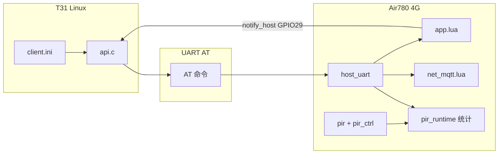
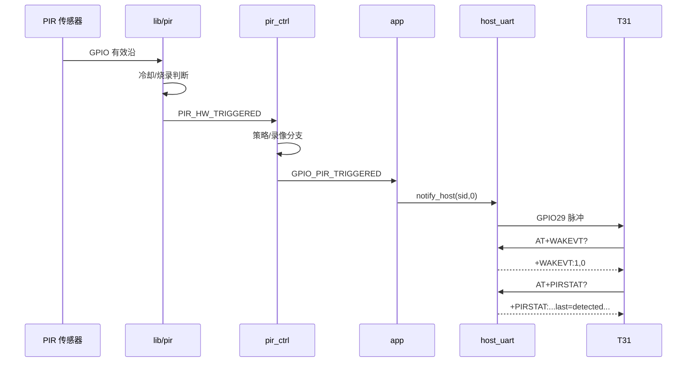

# T31 Linux ↔ Air780 4G：AT 交互与 PIR 状态查询

> 先读框架简图：[T31_4G_FRAMEWORK.md](T31_4G_FRAMEWORK.md)  
> **AT 规范（MQTT + TCP）**：[T31_CAT1_AT_COMMAND_SPEC.md](T31_CAT1_AT_COMMAND_SPEC.md)  
> 物理：UART（默认 115200 8N1，`\r\n` 行协议）  
> 4G 实现：`user/host_uart.lua`  
> T31 实现：`t31_linux/api.c`  
> 唤醒 GPIO：见 [T31_WAKE_PROTOCOL.md](T31_WAKE_PROTOCOL.md)

---

## 1. 总体架构



**分工原则**

| 侧 | 职责 |
|----|------|
| **T31** | TCP 业务通道参数、MQTT Broker、查询 4G 运行态/PIR 统计、收到 GPIO 脉冲后读 `WAKEVT` |
| **4G** | 蜂窝/MQTT、PIR 硬件与策略、录像会话、冷却节流、**保存 PIR 判断计数**、主动 GPIO 唤醒 T31 |

---

## 2. AT 命令全表（T31 → 4G）

### 2.1 初始化 / 握手（bootstrap）

| 顺序 | 命令 | 4G 行为 | 典型响应 |
|------|------|---------|----------|
| 1 | `AT` | 存活检测 | `OK` |
| 2 | `ATI` / `AT+CGMR` | 返回版本串 | `+CGMR:780EHM_1.0.0` `OK` |
| 3 | `AT+RIL=0` | 关闭 modem AT 透传 | `+RIL:0` `OK` |
| 4 | `AT+SERVCREATE=...` | 保存 TCP 通道 10 段参数到 `state.channel` | `+SERVCREATE:1,OK` `OK` |
| 5 | `AT+MQTTCFG=host;port;ssl;user;pass;cid` | 覆盖 `_G.MQTT_CFG`，重启 MQTT | `+MQTTCFG:OK` `OK` |
| 6 | `AT+GETCFG?` | 读运行快照 | `+GETCFG:version=...,online=...` `OK` |

> `SERVCREATE` 与 MQTT 独立：前者为 T31 侧 TCP 长连接模板（当前 4G 脚本主要存配置）；MQTT 由 `net_mqtt.lua` 连接 Broker。

### 2.2 查询（可随时发）

| 命令 | 响应前缀 | 内容 |
|------|----------|------|
| `AT+GETCFG?` | `+GETCFG:` | `version,online,power,lowpower,battery,vbat,interval,devicemodel` |
| `AT+WAKEVT?` | `+WAKEVT:` | `sid,evt`（读后清除 pending，见 §4） |
| `AT+PIRSTAT?` | `+PIRSTAT:` | PIR 策略 + 计数 + 最近一次事件（§5） |
| `AT+PIRCLR` | `+PIRCLR:` | 清零 PIR 统计计数（不清配置） |

T31 API：`client_get_runtime_config`、`client_query_wakeup`、`client_get_pir_stat`。

### 2.3 配置 / 控制

| 命令 | 作用 |
|------|------|
| `AT+SETCFG=interval,<秒>` | 低功耗上报间隔 |
| `AT+SETCFG=devicemodel,<文本>` | 设备型号字符串 |
| `AT+SETCFG=hexrpt,1` | 串口原始数据 `+RXHEX` 回显 |
| `AT+LOWPOWER=ENTER` / `EXIT` | 进入/退出低功耗（app 回调） |
| `AT+REBOOT` / `AT+POWEROFF` | 重启 / 关机 |
| `AT+OTA` / `AT+OTACHECK` | 触发 FOTA |
| `AT+RIL=1` | modem AT 透传（调试用） |
| `AT+SERVCLOSE=<sid>` | 关闭通道记录 |
| `AT+SENDSTR=` / `AT+SENDHEX=` | 向 UART 对端发数据 |

### 2.4 简写行（非 AT）

| 行 | 作用 |
|----|------|
| `HEX:<hex>` | 二进制下发 |
| `STR:<text>` | 文本下发 |

---

## 3. 4G → T31：GPIO 唤醒 + WAKEVT

4G 调用 `host_uart.notify_host(sid, evt)` → GPIO29 低脉冲 → T31 `PB27` 下降沿。

### 3.1 evt 定义（`host_uart.EVT`）

| evt | 含义 | 典型触发源 |
|-----|------|------------|
| 0 | 有业务数据 / 一般唤醒 | PIR 拍照/录像、TCP 命中 `wake_hex`（设计位） |
| 1 | TCP 连接失败 | 业务通道异常（预留） |
| 2 | 登录/注册失败 | **MQTT 离线**（`app` `sendWakePulse(2)`） |
| 3 | 注册超时 | 登录超时（预留） |

T31 流程：`gpio` 中断 → `AT+WAKEVT?` → `client_handle_event` → 业务回调或重建 `SERVCREATE` + `MQTTCFG`。

**注意**：`WAKEVT` 为 **单次 pending**，查询后清除；与 PIR 统计（累加计数）不同。

---

## 4. PIR 在 4G 上的分层与「各种情况」

PIR 判断**可以且应当保存在 4G**（传感器接在 Cat.1 GPIO30）。T31 通过 `AT+PIRSTAT?` 读取，无需在 T31 再实现一套冷却/录像状态机。

### 4.1 各分支判定与 4G 侧持久化

**结论：PIR 各分支的「是否触发 / 为何忽略」应保存在 4G**（RAM 计数 + 当前会话快照），T31 用 `AT+PIRSTAT?` 读取，不必在 T31 复刻冷却与录像状态机。

| 阶段 | 条件 | 4G 动作 | `last=` | 累加计数 |
|------|------|---------|---------|----------|
| 硬件 | T31 烧录模式 | 忽略中断 | `ignore_burn` | `cnt_hw_ignore_burn` |
| 硬件 | 非 `active_level` 沿 | 忽略 | — | `cnt_hw_ignore_level` |
| 硬件 | `cooldown_ms` 内 | 忽略 | `ignore_cooldown` | `cnt_hw_ignore_cooldown` |
| 硬件 | 通过 | 发布 `PIR_HW_TRIGGERED` | `hw_accept` | `cnt_hw_accept` |
| 业务 | `pir_ctrl.suspended` | 忽略 | `ignore_suspend` | `cnt_biz_ignore_suspend` |
| 业务 | 录像中 + `stopOnSecondPir` | 停录 + 上报 retrigger | `retrigger` | `cnt_biz_retrigger`, `cnt_stop_retrigger` |
| 业务 | 正常检测 | 拍照/录像 + 唤醒 T31 | `detected` | `cnt_biz_detected`, `cnt_biz_photo`/`cnt_biz_video` |
| 业务 | 进入烧录挂起 | `suspend()` | `suspend` | （停录计 `cnt_stop_manual`） |
| 停录 | 定时 / 二次 PIR / 云端 / 手动 | `publishStopRecording` | `stop_<reason>` | `cnt_stop_*` |

每次 GPIO 中断先 `cnt_hw_irq++`（含被忽略的边沿）。

### 4.2 处理流水线

```text
GPIO30 中断 (lib/pir.lua)
  ├─ T31 烧录模式 active        → cnt_hw_ignore_burn, last=ignore_burn
  ├─ 非有效电平                 → cnt_hw_ignore_level
  ├─ cooldown_ms 内             → cnt_hw_ignore_cooldown, last=ignore_cooldown
  └─ 有效触发                   → cnt_hw_accept → APP_PIR_HW_TRIGGERED
        ↓
pir_ctrl.onPirTriggered
  ├─ suspended (T31 烧录等)     → cnt_biz_ignore_suspend, last=ignore_suspend
  ├─ 录像中且 stopOnSecondPir   → cnt_biz_retrigger, 停录, last=retrigger
  └─ 正常检测                   → cnt_biz_detected, last=detected
        ├─ action=photo/both    → cnt_biz_photo, 唤醒 T31(evt=0), MQTT 1010
        └─ action=video/both    → cnt_biz_video, 录像会话, 唤醒 T31
录像停止
  ├─ timer / retrigger / cloud / manual → 对应 cnt_stop_*, last=stop_<reason>
```

### 4.3 与 MQTT 的关系

| 通道 | 用途 |
|------|------|
| **UART `AT+PIRSTAT?`** | T31 本地策略、UI、日志、与 evt 无关的**累积统计** |
| **MQTT 2010/1010** | 云端改 `pirMediaConfig` / `pirRecordPolicy`、远程查状态 |
| **MQTT 2011/1011** | 云端停录 |

云端改配置后，统计仍保留；`AT+PIRCLR` 仅清计数。

### 4.4 配置真源

| 配置 | 文件 | AT/MQTT 是否可改 |
|------|------|------------------|
| `cooldown_ms`、引脚 | `config.lua` `PIR_CFG` | 否（需烧录） |
| `action/upload/quality` | `pirMediaConfig` | MQTT 2010 |
| `maxDurationSec/stopOnSecondPir/stopOnCloud` | `pirRecordPolicy` | MQTT 2010 |

`AT+PIRSTAT?` 响应中含当前 **media + policy 快照** 与各 **cnt_*** 计数。

---

## 5. `AT+PIRSTAT?` 响应字段

示例：

```text
AT+PIRSTAT?

+PIRSTAT:suspended=0,recording=1,hw_started=1,pin=30,cooldown_ms=3000,action=both,upload=auto,quality=high,max_sec=60,stop_second=1,stop_cloud=1,cnt_hw_irq=42,cnt_hw_ignore_level=10,cnt_hw_ignore_cooldown=25,cnt_hw_ignore_burn=0,cnt_hw_accept=7,cnt_biz_ignore_suspend=0,cnt_biz_detected=5,cnt_biz_retrigger=1,cnt_biz_photo=5,cnt_biz_video=5,cnt_stop_timer=2,cnt_stop_retrigger=1,cnt_stop_cloud=0,cnt_stop_manual=0,last=retrigger,last_ts=1716000000,rec_elapsed=12,last_stop=timer
OK
```

| 字段 | 说明 |
|------|------|
| `suspended` | 1=烧录等场景已 `pir_ctrl.suspend` |
| `recording` | 1=录像会话中 |
| `hw_started` | PIR 驱动已启动 |
| `burn_mode` | 1=`T31_BURN_MODE_ACTIVE` |
| `lowpower` / `online` | 与 `GETCFG` 同源运行时 |
| `pin` / `cooldown_ms` | 硬件配置 |
| `cooldown_left_ms` | 距下次可触发剩余毫秒 |
| `pending_wake` / `pending_sid` / `pending_evt` | 尚未被 `WAKEVT?` 读走的唤醒（与 §3 一致） |
| `action` / `upload` / `quality` | 当前媒体策略 |
| `max_sec` / `stop_second` / `stop_cloud` | 录像策略 |
| `cnt_hw_*` | 硬件层计数 |
| `cnt_biz_*` | 业务层计数 |
| `cnt_stop_*` | 停录原因计数 |
| `last` / `last_ts` | 最近一次事件名 / Unix 秒 |
| `rec_elapsed` | 录像已进行秒数（仅 recording=1） |
| `last_stop` | 上次停录原因 |

清计数：`AT+PIRCLR` → `+PIRCLR:OK`。

实现：`user/pir_runtime.lua`（统计）+ `lib/pir.lua` / `user/pir_ctrl.lua`（埋点）+ `host_uart`（AT）。

---

## 6. T31 侧调用示例

```c
char resp[2048];
if (client_get_pir_stat(client, resp, sizeof(resp)) == 0) {
    /* 解析 +PIRSTAT:... 中 cnt_biz_detected、last= 等 */
}
```

唤醒后建议顺序：

1. `AT+WAKEVT?` — 知悉本次为何唤醒  
2. `AT+PIRSTAT?` — 读 PIR 累积态（尤其 evt=0 且为 PIR 业务时）  
3. `AT+GETCFG?` — 电量/在线/低功耗  

异常恢复（evt 1/2/3）：`SERVCLOSE` → `SERVCREATE` → `MQTTCFG` → 可选 `PIRSTAT?` 确认 4G 仍在录像/挂起。

---

## 7. 时序：PIR 触发到 T31 被唤醒



---

## 8. 代码索引

| 模块 | 路径 | 职责 |
|------|------|------|
| AT 分发 | `user/host_uart.lua` | `AT+PIRSTAT?` / `AT+PIRCLR`、WAKEVT pending 拼入 PIRSTAT |
| 统计 | `user/pir_runtime.lua` | 计数、`buildAtBody()` |
| 硬件 | `lib/pir.lua` | GPIO、冷却、`cnt_hw_*` |
| 业务 | `user/pir_ctrl.lua` | 策略、录像、`cnt_biz_*` / `cnt_stop_*` |
| T31 API | `t31_linux/api.c` | `client_get_pir_stat()` |
| 示例 | `t31_linux/main.c` | 初始化与每次唤醒后 `log_pir_stat()` |

---

## 9. 未通过 UART 暴露的能力

仍仅走 **MQTT** 或 **本地事件**：

- 云端下发 2010/2011 改配置/停录  
- `publishWakeup` / 1010 / 1011 上报  
- 电池 1003、FOTA 2004 等  

若 T31 需「远程改 PIR 冷却 3s→30s」，需扩展 `AT+SETCFG=pir_cooldown,<ms>`（当前未实现，仍改 `config.lua` 烧录）。

---

## 10. 相关文档

| 文档 | 内容 |
|------|------|
| [UART_PROTOCOL.md](UART_PROTOCOL.md) | AT 简表 |
| [HOST_MQTT_UART.md](HOST_MQTT_UART.md) | MQTTCFG |
| [T31_WAKE_PROTOCOL.md](T31_WAKE_PROTOCOL.md) | GPIO 唤醒 |
| [PIR_HARDWARE.md](PIR_HARDWARE.md) | 硬件 |
| [PIR_TRIGGER_INTERVAL.md](PIR_TRIGGER_INTERVAL.md) | 冷却间隔 |
| [PIR_PROTOCOL.md](PIR_PROTOCOL.md) | MQTT 2010/1010 |
