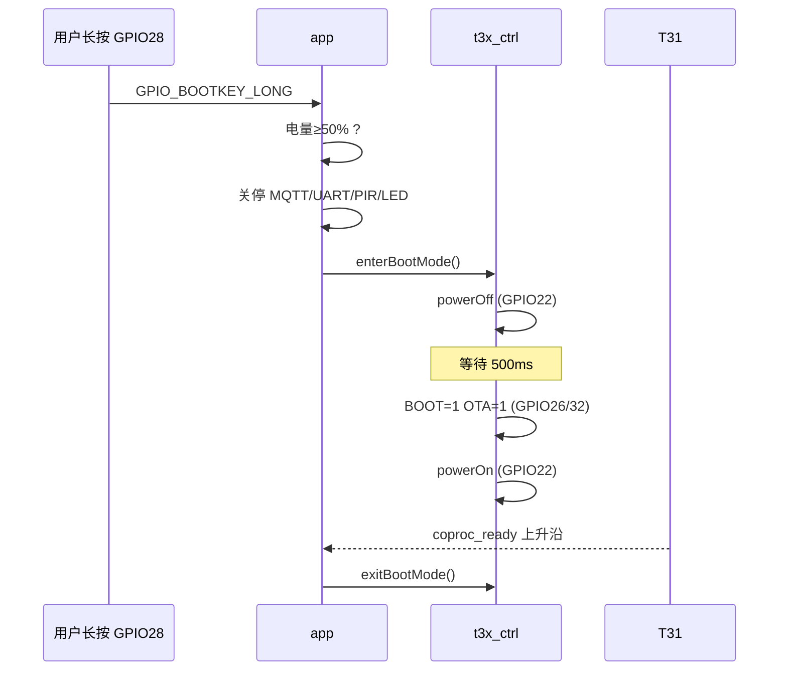

# T31 烧录模式（GPIO28 BOOT 键长按）

> 硬件：子板/主板 **T31_BOOT**（模组 **GPIO26**）、**T3X_OTA**（**GPIO32**）、电源/唤醒 **GPIO22**。  
> 触发：**GPIO28** `boot_key` 长按（`key_config` 默认 2s）→ `GPIO_BOOTKEY_LONG` → `app.tryEnterT31BurnMode`。  
> 配置：[`../user/config.lua`](../user/config.lua) → `_G.T31_BURN_CFG`

---

## 1. 进入前必须满足的条件

| 条件 | 默认 | 说明 |
|------|------|------|
| **电量 ≥ 50%** | `min_battery_percent = 50` | 读 `APP_RUNTIME.battery_percent` 或 `bat_adc.getPercent()`；未知则拒绝 |
| **未已在 BOOT** | — | `in_boot_mode == false`；若上次未收到 `coproc_ready` 仍为 true，见下条 |
| **允许重复进入 BOOT** | `allow_repeat_enter_boot = true` | 已为 BOOT 时仍可再次 `enterBootMode`（默认开） |
| **条件轮询** | `burn_check_retry_count = 2` | 首次不满足时再判断 **2** 次，共最多 **3** 次；间隔 `burn_check_retry_interval_ms` |
| **按键** | GPIO28 长按 | 短按仅打日志，不进入烧录 |

可选扩展（当前未强制，可按现场加在 `checkT31BurnPreconditions`）：

| 条件 | 建议 |
|------|------|
| USB 供电 | 烧录耗时较长时建议插 USB，避免电池掉电 |
| 未在 OTA | `fota` 进行中应拒绝 |
| PIR 录像中 | 固件会先 `pir_ctrl.suspend()` 并停录 |

不满足时：**红灯闪 3 次**（`peripheral.runLedPattern("blink_red")`），日志 `T31 烧录条件不满足`。

---

## 2. 进入烧录前自动关停的功能

按 `app.shutdownServicesForT31Burn()` 顺序（进入时立即置位 `_G.T31_BURN_MODE_ACTIVE` 与 `heartbeat_paused`）：

| 序号 | 功能 | 模块 | 动作 | `T31_BURN_CFG` 开关 |
|------|------|------|------|---------------------|
| 1 | **PIR 业务** | `pir_ctrl` | `suspend()`：忽略新触发；若在录像则 `MANUAL` 停录 | `suspend_pir` |
| 2 | **4G / MQTT** | `net` | `stop()`：发 1002 休眠（若已连）→ 关 autoreconn → 结束 MQTT 任务 | `stop_mqtt` |
| 3 | **蜂窝入网后续** | `app` | `startMqtt()` 在烧录标志下不再启动 | （随 MQTT） |
| 4 | **UART 业务串口** | `uart_bridge` | `stop()` 关闭 UART1，避免与烧录/USB 冲突 | `stop_uart` |
| 5 | **PIR→拍照/唤醒** | `app` | `onPirMediaAction` 在烧录标志下直接 return | （随 PIR） |
| 6 | **心跳日志** | `app` | 10s `[ALIVE]` 暂停（定时器入口先判断烧录标志） | `stop_heartbeat` |
| 7 | **模组 LED 灯效** | `led_ctrl` | `turnOffLed()` | `turn_off_led` |
| 8 | **T31 硬件时序** | `t3x_ctrl` | `enterBootMode()`：断电 → 拉 BOOT/OTA → 再上电 | 始终执行 |

### 2.1 烧录期间仍运行但已降噪/无业务影响

| 功能 | 模块 | 烧录期间行为 |
|------|------|----------------|
| 电量采样 | `bat_adc` | **继续**采样并打 `bat_adc`/`电量` 日志，便于观察烧录时电量是否下跌 |
| USB 插入检测 | `usb_charge` | **保留**，便于 USB 供电/插入状态 |
| 基站信息 | `mobile_info` | 周期任务**跳过**采集与打印（`_G.T31_BURN_MODE_ACTIVE`） |
| PIR 硬件 | `lib/pir` | 中断回调**直接 return**，不再 `触发` 日志、不再 `publish` PIR_HW |
| PIR 业务（若仍有旧固件日志） | `pir_ctrl` | 应只见 `PIR 已挂起，忽略硬件触发` |
| SNTP | `sntp_sync` | 未停，占用低 |
| FOTA 监听 | `fota` | 仍订阅；MQTT 已停则不会下发 OTA |
| RNDIS | `usb_rndis` | 未停；若与 USB 烧录冲突可后续加 `stop` |
| 模组看门狗 | `watchdog` | **保持运行**，避免烧录长任务导致模组复位 |
| 按键 | `lib/key` | **保留**；烧录结束靠 `coproc_ready` 退出 BOOT |

### 2.2 蜂窝射频说明

`net.stop()` 会断开 **MQTT**，但 **蜂窝注册/数据业务** 未必立即关闭（未调用 flymode/关机）。日志中 `mobileInfo` 停打后，射频可能仍保持注册（`ip=10.x` 仍存在）。若现场要求射频静默，可后续在 `shutdownServicesForT31Burn` 中增加 `mobile.flymode(0,true)` 等（需实机验证固件 API）。

---

## 3. 烧录时序（`t3x_ctrl.enterBootMode`）



原理图要求（约 5s 按键）：`T31_BOOT` + `USB_DEBUG_EN` + `CPU_PWR_EN` 置高；本工程由 **GPIO26/32/22** 与 `t3x_ctrl` 时序等效实现，以 PCB 为准。

**`t3x_ctrl` 日志顺序（正常）**：

1. `进入 BOOT 模式`
2. `t3x 断电`
3. （约 500ms）`BOOT/OTA 电平已设置 boot 26 ota 32`
4. `t3x 上电 pin 22`（**不应**再出现 `pin nil`）

---

## 4. 烧录结束恢复

| 事件 | 行为 |
|------|------|
| `GPIO_COPROC_READY` 上升沿 | `t3x_ctrl.exitBootMode()`；`pir_ctrl.resume()`；清除 `T31_BURN_MODE_ACTIVE` |
| MQTT / UART | **不自动重启**；需重新上电或后续在 `app` 中增加恢复函数 |

**说明**：进入烧录后若长时间**没有** `协处理器就绪` / `退出 BOOT 模式`，通常表示 **T31 尚未拉高就绪脚** 或 **PC 端尚未完成 USB 烧录连接**，属于硬件/烧录工具阶段，**不代表** 780 侧 `enterBootMode` 失败。

---

## 5. 实机日志解读（2026-05-21 验证）

以下摘录说明「软件烧录准备」已成功时的典型串口输出。

### 5.1 烧录前：正常 PIR 业务（可忽略）

```text
I/user.pir 触发 30
I/user.pir_ctrl PIR 业务处理 photo auto high
I/user.net 发布 PIR 检测(1010) ...
I/user.net 发布唤醒(1001): ...
I/user.t3x_ctrl 唤醒脉冲 pin 22 ms 120
```

长按 BOOT **之前** 的 PIR 触发属正常业务，与烧录流程无关。

### 5.2 条件检查日志（每次长按都会打印）

不满足时会**自动重试**（默认再判 2 次，间隔 800ms），并打印**通过/失败计数**与综合结论。

```text
I/user.app ========== T31 烧录条件轮询 ========== 最多 3 次 失败间隔 800 ms 额外重试 2 次
I/user.app ---------- T31 烧录条件检查 第 1 / 3 次 ----------
...
I/user.app 累计统计 已执行 1 次 通过 0 次 失败 1 次
I/user.app 条件未满足，800 ms 后进行第 2 / 3 次判断
I/user.app ---------- T31 烧录条件检查 第 2 / 3 次 ----------
...
I/user.app ========== T31 烧录条件综合 ========== 实际执行 3 次 通过计数 1 失败计数 2 最终结果 通过
```

单次检查开头：

```text
I/user.app ---------- T31 烧录条件检查 ----------
I/user.app T31烧录配置 min_battery 50 % require_battery_valid true allow_repeat_enter_boot true
I/user.app T31烧录条件 电量 通过 100% >= 50%
I/user.app T31烧录条件 未在BOOT模式 失败 ...   ← 或 通过(allow_repeat)
I/user.app T31烧录条件 t3x状态 in_boot_mode true powered_on ...
I/user.app ---------- T31 烧录条件: 拒绝 ---------- 已在 BOOT 模式
```

若出现 **`已在 BOOT 模式`**：上次已进入 BOOT 但未收到 **`协处理器就绪`**，`isInBootMode` 一直为 true。默认 **`allow_repeat_enter_boot=true`** 时会改为**通过**并再次执行 `enterBootMode`；若仍拒绝，将 `allow_repeat_enter_boot` 设为 `true` 或复位模组。

### 5.3 长按 GPIO28：进入烧录（成功判据）

| 日志关键字 | 含义 |
|------------|------|
| `BOOT键长按` | GPIO28 长按已识别 |
| `T31 烧录模式（GPIO28 长按）` | 进入 `tryEnterT31BurnMode` |
| `T31 烧录条件: 全部通过` | 各项条件通过 |
| `电量 OK 100 %`（或 ≥50%） | 电量条件通过 |
| `关停业务：准备 T31 烧录` | 开始关停 |
| `pir_ctrl 已挂起` | PIR 业务已停 |
| `停止 MQTT` / `发布休眠(1002)` / `MQTT 已停止` | 4G 上报已停 |
| `进入 BOOT 模式` → `t3x 断电` | 时序开始 |
| `BOOT/OTA 电平已设置 boot 26 ota 32` | GPIO26/32 已配置 |
| `t3x 上电 pin 22` | GPIO22 上电 |
| `T31 烧录时序已启动，等待协处理器就绪` | 软件侧完成，等 T31/PC |

此后 `[ALIVE]` 中 `mqtt=未启` 表示 MQTT 未再连接，**符合预期**。

### 5.4 烧录期间：允许 / 不允许出现的日志

| 日志 | 判定 |
|------|------|
| `pir_ctrl PIR 已挂起，忽略硬件触发` | **正常**（业务已拦截） |
| `mqtt=未启`（若仍有 ALIVE，旧固件） | MQTT 已停；新固件应**不再打** `[ALIVE]` |
| `bat_adc` / `电量 100%` | **正常**（故意保留监控） |
| `mobileInfo radio ...` | 新固件烧录期间应**不再出现** |
| `pir 触发` / `pir 触发0` | 新固件应**不再出现** |
| `协处理器就绪` / `退出 BOOT 模式` | T31 就绪后**应有**；若无则见 §6 |

### 5.4 结论（该次实机）

- **780 模组侧**：电量检查、MQTT/PIR/UART 关停、`t3x_ctrl` BOOT 时序 **均已按设计执行**。  
- **待完成**：PC 端 USB 烧录工具识别 T31、`GPIO_COPROC_READY` 上升沿。

---

## 6. 烧录后操作建议与排查

### 6.1 推荐操作

1. 长按 GPIO28 进入烧录后，用 **USB** 连接 T31 烧录口（见原理图 `USB_DEBUG` / USB 切换）。  
2. 在 PC 打开烧录工具，确认是否识别设备。  
3. 烧录完成或放弃后，**复位 Air780 模组** 以恢复 MQTT/串口/PIR（当前固件不自动 `startMqtt()`）。

### 6.2 若无 `协处理器就绪`

| 排查项 | 说明 |
|--------|------|
| T31 是否上电 | 日志应有 `t3x 上电 pin 22` |
| GPIO26/32 电平 | 应与 `config` 中 `on_level` 一致 |
| USB 切换/烧录线 | 原理图 Sheet7：长按 K4 + USB 路径 |
| 就绪脚 `coproc_ready` | 配置见 `GPIO_IN.coproc_ready`，上升沿触发 `exitBootMode` |
| 仅软件成功、PC 无设备 | 属硬件/USB 问题，非 Lua 流程错误 |

### 6.3 常见问题

| 现象 | 原因 | 处理 |
|------|------|------|
| `pin nil` 上电日志 | 旧版 `t3x.lua` 使用了未定义变量 `powerPin` | 使用 `t3x_ctrl.lua`，应显示 `pin 22` |
| 红灯闪 3 次 | 电量 &lt; 50% 或电量未知 | 等待 `bat_adc` 采样或插 USB 充电 |
| `已在 BOOT 模式` | 上次进 BOOT 未 `exitBootMode` | 默认 `allow_repeat_enter_boot=true` 可重复进入；或复位 |
| 烧录后无 MQTT | 设计如此，`net.stop()` 后未自动重连 | 复位或后续加恢复逻辑 |

---

## 7. 配置示例

```lua
_G.T31_BURN_CFG = {
    min_battery_percent = 50,
    require_battery_valid = true,
    allow_repeat_enter_boot = true,
    burn_check_retry_count = 2,
    burn_check_retry_interval_ms = 800,
    stop_mqtt = true,
    stop_uart = true,
    suspend_pir = true,
    stop_heartbeat = true,
    turn_off_led = true,
    publish_rest_before_stop = true,  -- 由 net.stop() 在已连接时发 1002
}
```

---

## 8. 相关文档

- 按键：[`KEY_GPIO.md`](KEY_GPIO.md)  
- 协处理器 GPIO：[`T31_CAT1_GPIO.md`](T31_CAT1_GPIO.md)  
- 启动顺序：[`CALL_GRAPH.md`](CALL_GRAPH.md)
