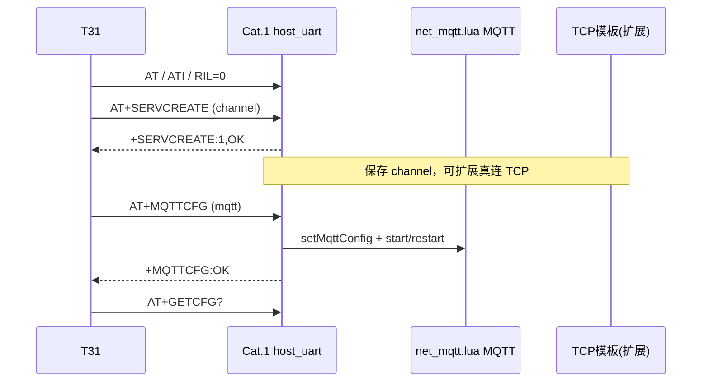

# T31 → Cat.1 4G：AT 命令规范

> **真源**：T31 侧 `t31_linux/api.c` · 4G 侧 `user/host_uart.lua`  
> **配置**：`t31_linux/client.ini` — `[channel]`（TCP）与 `[mqtt]`（MQTT）**独立两节**  
> 框架：[T31_4G_FRAMEWORK.md](T31_4G_FRAMEWORK.md) · 详表：[T31_4G_AT_INTERACTION.md](T31_4G_AT_INTERACTION.md)

---

## 1. 设计原则

| 原则 | 说明 |
|------|------|
| **双链路分离** | **MQTT**（云 Broker）与 **TCP 通道**（低功耗/长连接业务服）各用一条 AT，互不混字段 |
| **T31 统一下发** | 连接参数写在 `client.ini`，由 T31 `bootstrap` / 异常恢复时下发 4G |
| **4G 执行** | MQTT → `net_mqtt.lua`；TCP → `net_tcp.lua` 真连接/登录/心跳/wake_hex |
| **查询分离** | 运行态 `GETCFG`、PIR `PIRSTAT`、唤醒 `WAKEVT` 与配置下发命令分开 |

```text
client.ini
  [channel]  ──AT+SERVCREATE──► 4G  TCP 通道模板（sid, ip, port, 登录/心跳/唤醒 hex…）
  [mqtt]     ──AT+MQTTCFG────► 4G  MQTT Broker（host, port, ssl, 账号…）
```

---

## 2. 命令分类总表

### 2.1 握手（每次上电 bootstrap 前段）

| 序号 | T31 发送 | 4G 响应 | 作用 |
|------|----------|---------|------|
| 1 | `AT` | `OK` | 链路存活 |
| 2 | `ATI` | `+CGMR:…` `OK` | 固件/版本 |
| 3 | `AT+RIL=0` | `+RIL:0` `OK` | 关闭 modem AT 透传 |

### 2.2 链路配置（**核心：MQTT + TCP 兼容**）

| 命令 | 配置节 | 分隔符 | 成功响应 | 4G 行为 |
|------|--------|--------|----------|---------|
| **`AT+SERVCREATE=…`** | `[channel]` | **逗号 `,`**（10 段） | `+SERVCREATE:<sid>,OK` `OK` | `net_tcp.applyChannel`：TCP 连接、登录、心跳、wake_hex→GPIO |
| **`AT+MQTTCFG=…`** | `[mqtt]` | **分号 `;`**（6 段） | `+MQTTCFG:OK` `OK` | `net.setMqttConfig` + 重启 MQTT |

**bootstrap 顺序（固定）**：

```text
AT → ATI → AT+RIL=0 → AT+SERVCREATE → AT+MQTTCFG → AT+GETCFG?
```

**异常恢复（evt=1/2/3）**：

```text
AT+SERVCLOSE=<sid> → AT+SERVCREATE → AT+MQTTCFG
```

### 2.3 查询（运行中任意时刻）

| 命令 | 响应前缀 | 用途 |
|------|----------|------|
| `AT+GETCFG?` | `+GETCFG:` | 4G 在线/电量/低功耗等 |
| `AT+WAKEVT?` | `+WAKEVT:` | 本次 GPIO 唤醒 sid,evt（读后清 pending） |
| `AT+PIRSTAT?` | `+PIRSTAT:` | PIR 策略与计数 |
| `AT+PIRCLR` | `+PIRCLR:` | 清零 PIR 计数 |

### 2.4 控制与其它

| 命令 | 用途 |
|------|------|
| `AT+SERVCLOSE=<sid>` | 关闭 TCP 通道记录 |
| `AT+LOWPOWER=ENTER` / `EXIT` | 4G 低功耗 |
| `AT+REBOOT` / `AT+POWEROFF` | 重启 / 关机 |
| `AT+OTA` / `AT+OTACHECK` | FOTA |
| `AT+SETCFG=…` | 间隔、型号、hex 回显等 |
| `AT+SENDSTR=` / `AT+SENDHEX=` | 经 UART 发数据 |
| `AT+RIL=1` | 调试：modem 透传 |

---

## 3. `AT+SERVCREATE` — TCP / 低功耗业务通道

与 **MQTT 无关**，描述 T31 侧或 4G 侧要维护的 **TCP 长连接模板**（登录包、心跳、命中唤醒 hex 等）。

### 3.1 格式

```text
AT+SERVCREATE=<sid>,<ip>,<port>,<login_hex>,<login_rsp_hex>,<heartbeat_hex>,<heartbeat_sec>,<wake_hex>,<critical_flag>,<run_type>
```

| 段 | ini 键 | 类型 | 说明 |
|----|--------|------|------|
| 1 | `sid` | int | 通道号，默认 1 |
| 2 | `server_ip` | string | TCP 服务器 IP/域名 |
| 3 | `server_port` | int | TCP 端口 |
| 4 | `login_hex` | hex 串 | 登录请求（十六进制字符） |
| 5 | `login_rsp_hex` | hex 串 | 登录成功应答匹配 |
| 6 | `heartbeat_hex` | hex 串 | 心跳包 |
| 7 | `heartbeat_sec` | int | 心跳间隔（秒） |
| 8 | `wake_hex` | hex 串 | 收到含此 pattern 的数据则唤醒 T31 |
| 9 | `critical_flag` | 0/1 | 关键通道标志 |
| 10 | `run_type` | int | 运行类型（产品扩展） |

### 3.2 示例

```ini
[channel]
sid=1
server_ip=192.168.1.10
server_port=8000
login_hex=313233
login_rsp_hex=313233
heartbeat_hex=313233
heartbeat_sec=60
wake_hex=AA55
critical_flag=1
run_type=0
```

```text
AT+SERVCREATE=1,192.168.1.10,8000,313233,313233,313233,60,AA55,1,0
+SERVCREATE:1,OK
OK
```

### 3.3 T31 API

```c
client_push_tcp_channel(client);   /* 发 SERVCREATE */
client_close_service(client, sid); /* 发 SERVCLOSE */
```

---

## 4. `AT+MQTTCFG` — MQTT Broker

与 **SERVCREATE 独立**，只负责 **蜂窝 MQTT 云连接**。

### 4.1 格式

```text
AT+MQTTCFG=<host>;<port>;<ssl>;<username>;<password>;<client_id>
```

| 段 | ini 键 | 说明 |
|----|--------|------|
| 1 | `mqtt_host` | Broker 地址 |
| 2 | `mqtt_port` | 端口 |
| 3 | `mqtt_ssl` | `0` 明文 / `1` TLS |
| 4 | `mqtt_username` | 用户名 |
| 5 | `mqtt_password` | 密码（**勿含 `;`**） |
| 6 | `mqtt_client_id` | 空则 4G 用 IMEI |

### 4.2 示例

```ini
[mqtt]
mqtt_host=112.86.146.218
mqtt_port=2123
mqtt_ssl=0
mqtt_username=fptop1
mqtt_password=your_password
mqtt_client_id=
```

```text
AT+MQTTCFG=112.86.146.218;2123;0;fptop1;your_password;
+MQTTCFG:OK
OK
```

### 4.3 T31 API

```c
client_push_mqtt_config(client);
```

4G：`net.setMqttConfig` → 已连则 `restart()`。

---

## 5. MQTT 与 TCP 如何并存

| 维度 | TCP（SERVCREATE） | MQTT（MQTTCFG） |
|------|-------------------|-----------------|
| 配置节 | `[channel]` | `[mqtt]` |
| 分隔符 | `,` | `;` |
| 典型用途 | 私有 TCP 长连接、低功耗唤醒包 | 云平台 2010/1010、OTA、状态 |
| 4G 存储 | `host_uart.state.channel` | `_G.MQTT_CFG` + `net_mqtt.lua` |
| 失败 evt | 1（TCP 连接失败，预留） | 2（MQTT 离线 → GPIO 唤醒 T31） |
| 恢复 | 重建 SERVCREATE + MQTTCFG | 同左 |

**不要**把 MQTT host/port 写进 SERVCREATE 的 10 段，也 **不要**把 login_hex 写进 MQTTCFG。

---

## 6. `client.ini` 完整模板

```ini
uart_dev=/dev/ttyS1
baudrate=115200
wake_gpio=59
read_timeout_ms=2000
wake_wait_timeout_ms=-1

# ── TCP 低功耗 / 业务长连接（AT+SERVCREATE）──
[channel]
sid=1
server_ip=192.168.1.10
server_port=8000
login_hex=313233
login_rsp_hex=313233
heartbeat_hex=313233
heartbeat_sec=60
wake_hex=AA55
critical_flag=1
run_type=0

# ── MQTT 云 Broker（AT+MQTTCFG）──
[mqtt]
mqtt_host=112.86.146.218
mqtt_port=2123
mqtt_ssl=0
mqtt_username=fptop1
mqtt_password=your_password
mqtt_client_id=
```

---

## 7. 时序（规范流程）



---

## 8. 实现索引

| 层 | 文件 |
|----|------|
| T31 组包/下发 | `t31_linux/api.c` — `client_push_tcp_channel`, `client_push_mqtt_config`, `bootstrap` |
| T31 配置读取 | `t31_linux/config.c` — `[channel]` / `mqtt_*` |
| 4G AT 解析 | `user/host_uart.lua` — `uart_servcreate`, `uart_mqttcfg` |
| 4G TCP 执行 | `user/net_tcp.lua` — 与 T31 `client_push_tcp_channel` 对应 |
| 4G MQTT | `user/app.lua`, `user/net_mqtt.lua` |

---

## 10. T31 与 4G 逻辑对照（必须一致）

| T31 动作 | AT | 4G 模块 | 4G 行为 |
|----------|-----|---------|---------|
| `client_push_tcp_channel` | `AT+SERVCREATE` | `host_uart` → `net_tcp.applyChannel` | 起 TCP 任务：连 server_ip:port → 发 login_hex → 等 login_rsp_hex |
| `client_close_service` | `AT+SERVCLOSE` | `net_tcp.closeChannel` | 断链、清 channel |
| TCP 连不上 | — | `net_tcp` | `notify_host(sid, **1**)` |
| 登录失败 | — | `net_tcp` | `notify_host(sid, **2**)` |
| 登录超时 | — | `net_tcp` | `notify_host(sid, **3**)` |
| 收到含 wake_hex 数据 | — | `net_tcp` | `notify_host(sid, **0**)` |
| `client_push_mqtt_config` | `AT+MQTTCFG` | `app.on_mqtt_cfg` → `net` | 更新 Broker 并重连 MQTT |
| MQTT 离线 | — | `app.onMqttOffline` | `notify_host(**, 2**)` |
| 唤醒后读原因 | `AT+WAKEVT?` | `host_uart` pending | 返回 sid,evt |
| 读 PIR | `AT+PIRSTAT?` | `pir_runtime` | 计数与策略 |
| 低功耗 | `AT+LOWPOWER=ENTER` | `app` | 停 MQTT 上报、**关闭 TCP** |
| 退出低功耗 | `AT+LOWPOWER=EXIT` | `app` | 恢复 t3x、**按 NET_TCP_CHANNEL 重建 TCP** |

`GETCFG` 追加：`tcp_sid`、`tcp_on`（已连接）、`tcp_login`（已登录）。

---

## 9. 扩展约定

- 新增链路类型应 **新 AT 前缀**（如 `AT+XXXCFG=`），勿扩 SERVCREATE 段数。  
- 密码/hex 中避免使用命令分隔符（`,` / `;`）。  
- 查询类命令统一 `AT+XXX?`，配置类 `AT+XXX=`，成功 `+XXX:OK` 或带 sid 的 `+XXX:<sid>,OK`。
