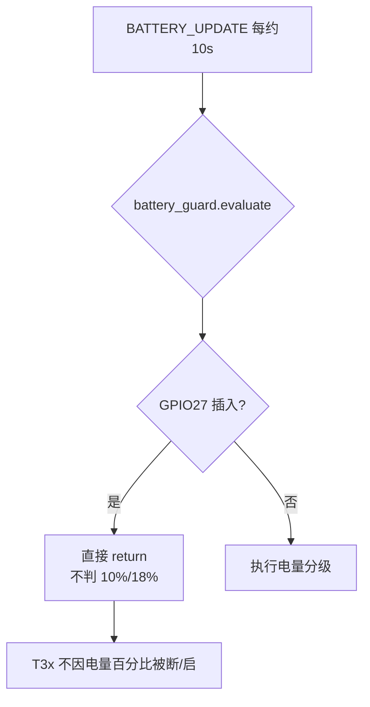
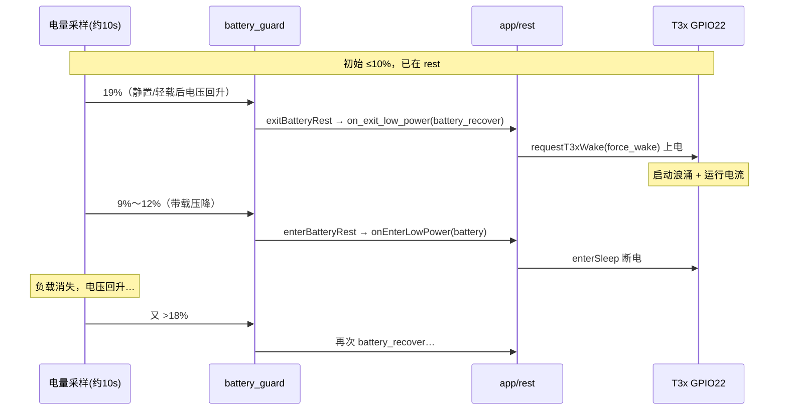

# USB、低电量与 T3x 启停循环分析

> **只读分析文档**（描述当前固件行为，不涉及改代码建议实现）  
> 代码：`user/battery_guard.lua` · `lib/t3x_policy.lua` · `user/app.lua` · `user/config.lua`  
> 关联：[LOW_BATTERY_AND_LOW_POWER.md](LOW_BATTERY_AND_LOW_POWER.md) · [POWER_USB_BATTERY_T3X_LOGIC.md](POWER_USB_BATTERY_T3X_LOGIC.md) · [CONFIG.md](CONFIG.md)  
> **20% 阈值防徘徊实现**（本仓库当前固件）：[BATTERY_20PCT_DYNAMIC_DETECT_FLOW.md](BATTERY_20PCT_DYNAMIC_DETECT_FLOW.md) §8

**版本**：v1.0 · 2026-06-10（阈值说明以 v1.0 为准；20% 产品见上链文档）

---

## 1. 问题背景

常见担心：

1. 电量低于某阈值，但 **USB 已插入**，是否应让 T3x **不要**启动？
2. USB **充电**过程中电量慢慢升高，超过某阈值后 T3x **又开始**启动；
3. T3x 启动后**自身耗电**，端电压再次下降，电量百分比回落；
4. 是否会出现 **T3x 反复上电 / 断电** 的循环？

下文按 **780EHM_PJ 当前固件** 的真实逻辑说明（T3x = 协处理器，GPIO22 供电）。

---

## 2. 核心结论（先看这个）

| 问题 | 当前默认固件结论 |
|------|------------------|
| USB 插入 + 低电量，能否不让 T3x 启动？ | **不能**。插 USB 会**忽略**低电量保护，**允许并保持/恢复** T3x。 |
| 充电抬升后 T3x 再启动？ | **未插 USB**：电量 **>18%** 会 `battery_recover` 拉起 T3x；**已插 USB**：不靠这条电量线，插上座子就可能已允许运行。 |
| 启动后耗电 → 电压降 → 再启动循环？ | **USB 一直插入（默认配置）**：`battery_guard` **不会因百分比**反复断/启 T3x，电量环**基本不会发生**。 |
| | **未插 USB**（或关闭 USB 忽略低电）：在 **10%～18%** 边界 + T3x **带载压降** 下，**存在启停循环风险**。 |

---

## 3. 当前设计：USB 插入 ≠ 「低电禁止 T3x」

插 USB（GPIO27 / `APP_RUNTIME.power_status=1`）时，策略是 **「有外部电，优先让 T3x 跑」**，与低电量保护 **脱钩**。

| 模块 | USB 插入时行为 |
|------|----------------|
| `battery_guard.evaluate()` | 检测到 USB 后 **直接 return**，不执行 ≤10% / ≤15% 等阈值判断 |
| `battery_guard.onUsbInserted()` | 清除 `rest_by_battery`；必要时 `on_exit_low_power("usb_insert")` **拉起 T3x** |
| `t3x_policy.mayPowerT3x()` | `isUsbInserted()` 为真 → **一律 return true**（低电也不拦） |

文档 [LOW_BATTERY_AND_LOW_POWER.md](LOW_BATTERY_AND_LOW_POWER.md) 一句话：

> **插 USB（GPIO27）** → 当作「有外部电」，低电量保护暂停，尽量让 T3x 保持/恢复运行。

因此：**不是**「USB 插着但电量低就不启动 T3x」，而是 **相反**——只要座子插上，即使 `remainPower` 只有 5%，策略上仍 **允许** T3x 上电。

---

## 4. 默认电量阈值（仅 **未插 USB** 时生效）

配置真源：`user/config.lua` → `BATTERY_CFG.guard`

| 配置键 | 默认 | 动作 |
|--------|------|------|
| `t3x_rest_percent` | **≤10%** | `enterBatteryRest` → `onEnterLowPower("battery")` → 断 T3x GPIO22 + MQTT 1002 |
| `recover_rest_percent` | **>18%** | 若曾因电量进 rest → `exitBatteryRest` → `on_exit_low_power("battery_recover")` → **拉起 T3x** |
| `pir_suspend_percent` | ≤15% | 仅 `suspendPir()`，**不断** T3x |
| `pir_resume_percent` | >20% | `resumePir()` |
| `shutdown_percent` | ≤5% | rest + 约 3s 后 `pm.shutdown()` |
| `ignore_when_usb_inserted` | **true** | 插 USB 时 **跳过** 上表全部分级 |
| `t3x_policy.block_wake_below_percent` | ≤15% | 未插 USB 时 `mayPowerT3x` 拒绝唤醒（不断电，但不拉 T3x） |

**迟滞区 10%～18%**：进入电量 rest 后，须涨到 **>18%** 才 `battery_recover`；在 11%～17% 不会因百分比 alone 反复横跳。

门禁优先级（[LOW_BATTERY_AND_LOW_POWER.md](LOW_BATTERY_AND_LOW_POWER.md)）：

```text
烧录 > USB 座插入 > 电量(未插USB) > rest 门禁 > 平常唤醒
```

---

## 5. 三种场景下的启停行为

### 5.1 场景 A：USB **一直插着**（默认 `ignore_when_usb_inserted=true`）



每次 `BATTERY_UPDATE`（约 10s）→ `battery_guard.onBatteryUpdate` → `evaluate()`：

```text
isUsbInserted() == true  →  cancelShutdownTimer()
                        →  若曾在 rest/停 PIR 则 onUsbInserted()
                        →  return（不跑 ≤10% / >18% 逻辑）
```

同时 `mayPowerT3x()` 在 USB 下 **不因 ≤15%** 拒绝。

**现象**：

- `remainPower` 可仍很低（8%、12%），但 `usbInserted=1`，T3x **持续允许运行**；
- 充电抬升 SOC 时，T3x 未必是「涨到某阈值才首次启动」——插上座子时常已 `usb_insert` 退出 rest。

**若仍见 T3x 反复上下电**，更可能来自：

- IPC `HOSTIDLE` / `enterSleep`（USB 插入时会互斥，见 [T3X_USB_HOSTIDLE.md](T3X_USB_HOSTIDLE.md)）；
- `AT+USBRESET` / USB 重枚举；
- 烧录模式；
- 云端 MQTT 2002 / 拔插 GPIO27 抖动；

而 **不是** `battery_guard` 的 10%/18% 环。

---

### 5.2 场景 B：**未插 USB**，靠电池回升（最易出现循环）



**三个放大因素**：

1. **百分比来自端电压映射（ADC）**，不是库仑计；T3x 一起电流增大，采样可从 19% 瞬时跌到 ≤10%，不代表电芯真实 SOC 骤降。
2. **恢复 18% vs 休眠 10%** 虽有 8% 迟滞，**带载瞬间跌落**可一次跨过整个区间（[POWER_USB_BATTERY_T3X_LOGIC.md](POWER_USB_BATTERY_T3X_LOGIC.md) §6 曾记「边界抖」）。
3. **进出 rest 不对称**：进 rest 断 GPIO22；出 rest `force_wake` 真上电 → 每次恢复都引入一波电流，易触发下一轮「假低电」。

---

### 5.3 场景 C：`ignore_when_usb_inserted=false`（量产不推荐）

若配置为 **插 USB 也执行电量保护**，则用户担心的逻辑 **才会成立**：

- ≤10% → 进 rest / 断 T3x；
- 充电抬到 >18% → `battery_recover` 启动 T3x；
- T3x 耗电 > 充电能力 → 电压再跌 ≤10% → 再断；

在 **充电电流 < T3x 运行电流**（慢充、老化电池）时，理论上可 **长时间循环**。

配置见 [CONFIG.md](CONFIG.md) `BATTERY_CFG.guard.ignore_when_usb_inserted`。

---

## 6. USB 座 vs 充电状态（易混淆）

| 信号 | 引脚 | 含义 | 用于电量保护 / T3x 门禁 |
|------|------|------|-------------------------|
| **USB_DET** | GPIO27 | 外壳 USB **座子**是否插入 | **是** → `power_status`、`isUsbInserted()` |
| **CHG_STATE** | GPIO17 | 是否处于充电 | **否**（指示灯、MQTT 1003 等） |

可能出现：日志里 `CHG_STATE=充电`，但 `USB_DET` 判为拔出，策略走 **未插 USB** 电量线；或座子插入但 `remainPower` 仍很低——**插电不等于 ADC 百分比立刻升高**。

---

## 7. 日志对照（如何判断是否在「电量环」）

| 日志关键字 | 含义 |
|------------|------|
| `进入低功耗 battery` | 电量 ≤20%（连续确认），断 T3x |
| `退出低功耗 battery_recover` | 电量 >20% 退出 rest；含误进 rest 纠正 |
| `USB插入，忽略低电量限制` | 插上座子，电量环被掐断 |
| `t3x_policy 跳过唤醒` + `battery<=20%` | 未插 USB，低电门禁 |
| ~~`进入低功耗 usb_remove`~~ | ~~已废弃~~：高电量拔座不再无条件 rest |

**典型电量振荡**：`battery_recover` 与 `进入低功耗 battery` **交替出现**，间隔约 **10s** 量级（`BATTERY_CFG.sample_interval_ms`）或略长（含 IPC 关机时序）。

---

## 8. 与 MQTT 1003 字段的关系

| 字段 | 含义 | 注意 |
|------|------|------|
| `remainPower` | ADC 映射电量 % | 与 USB **无关**；插电后仍可能很低 |
| `usbInserted` | USB 座是否插入 | 1=GPIO27 插入 |
| `lowPowerMode` | rest / normal | **业务休眠**；**≤20% 才应因电量进 rest** |
| 异常组合 | `remainPower=62` + `usbInserted=0` + `lowPowerMode=rest` | 旧固件 `usb_remove` 误进；新固件 `tryExitMismatchedRest` 纠正 |

云端若只看 `remainPower` 低而以为 T3x 应断电，可能与设备侧「插 USB 仍允许 T3x」不一致。

---

## 9. 代码路径速查

| 能力 | 文件 | 关键函数 |
|------|------|----------|
| 电量分级 | `user/battery_guard.lua` | `evaluate` / `onUsbInserted` / `onUsbRemoved` |
| T3x 门禁 | `lib/t3x_policy.lua` | `mayPowerT3x` / `bootPowerOn` / `requestT3xWake` |
| USB 拔插 | `user/app.lua` | `applyUsbInsertState` → `exitRestIfNeededAfterUsbInsert` / `enterRestIfNeededAfterUsbRemove` |
| 进/出 rest | `user/app.lua` | `onEnterLowPower` / `onExitLowPower` |
| T3x 引脚 | `user/t3x_ctrl.lua` | `powerOn` / `enterSleep` |

USB 插入时 `battery_guard.evaluate()` 在检测到 USB 后提前 return；`mayPowerT3x()` 在 `isUsbInserted()` 为真时直接允许上电/唤醒。

---

## 10. 产品侧防循环思路（评审用，非本仓库实现承诺）

| 编号 | 思路 | 说明 |
|------|------|------|
| P1 | 加大迟滞 | 如 ≤10% 睡、≥25% 才醒（`recover_rest_percent`） |
| P2 | 连续 N 次采样 | 连续 2～3 次 >18% 才 `battery_recover` |
| P3 | 最小 ON 时间 | T3x 上电后 N 分钟内不因单次低采样再断 |
| P4 | mV + % 双条件 | 用 `battery_mv` 与 `battery_percent` 同时判断 |
| P5 | 充电电流门控 | CHG_STATE 且充电电流足够时才允许 `battery_recover` |
| P6 | 插 USB 也限 T3x | `ignore_when_usb_inserted=false`（需配合 P1～P5，否则易循环） |

仅调配置、不改代码时见 [POWER_USB_BATTERY_T3X_LOGIC.md](POWER_USB_BATTERY_T3X_LOGIC.md) §7.3：

- 更早断 T3x：`t3x_rest_percent = 15`
- 减抖：`recover_rest_percent = 20` 或更高
- 插 USB 也走电量保护：`ignore_when_usb_inserted = false`（**不推荐量产默认**）

---

## 11. 相关文档

| 文档 | 说明 |
|------|------|
| [LOW_BATTERY_AND_LOW_POWER.md](LOW_BATTERY_AND_LOW_POWER.md) | 场景流程图、进/出 rest 表 |
| [POWER_USB_BATTERY_T3X_LOGIC.md](POWER_USB_BATTERY_T3X_LOGIC.md) | 架构、已知缺口 §6、配置 §7.3 |
| [CONFIG.md](CONFIG.md) | `BATTERY_CFG.guard` 字段 |
| [T3X_USB_HOSTIDLE.md](T3X_USB_HOSTIDLE.md) | 插 USB 时 IPC/4G 低功耗互斥 |
| [CHARGE_BATTERY.md](CHARGE_BATTERY.md) | 充电与 ADC 采样 |

---

**维护**：行为变更时请同步更新本文 §2 结论表与 [LOW_BATTERY_AND_LOW_POWER.md](LOW_BATTERY_AND_LOW_POWER.md) 场景章节。
