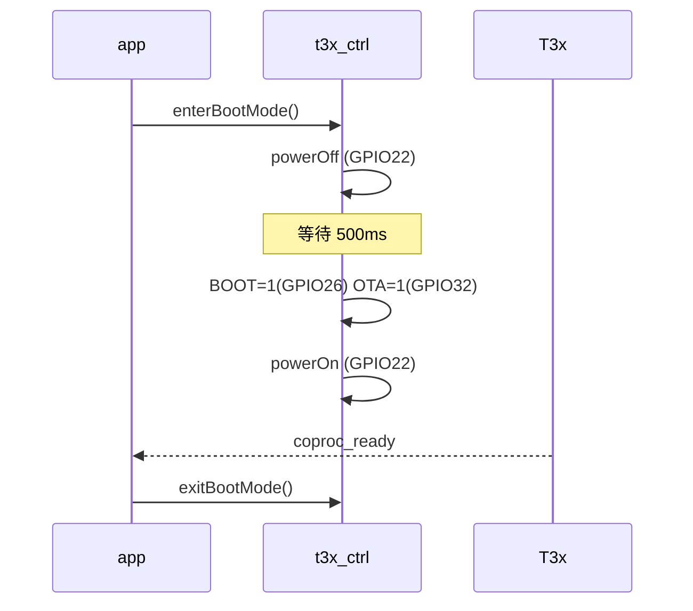

# T3x 烧录模式（GPIO28 BOOT 键长按）

> 硬件（`ps01masch260318.pdf` Sheet7）：  
> - **T3x_BOOT** → Luat **GPIO26** = 模组 **Pin25**（丝印 `CAN_TXD`）  
> - **USB_DEBUG_EN** → **GPIO32**（Pin33）  
> - **CPU_PWR_EN** → **GPIO22**（Pin19）  
> **注意**：`config.lua` 里 `pin` 是 **Luat GPIO 号**，不是模组物理 Pin 号（Pin25≠26，Pin26 为 `PWM4`）。  
> 触发：**GPIO28** `boot_key` 长按 → `app.tryEnterT3xBurnMode`。  
> 配置：[`../user/config.lua`](../user/config.lua) → `_G.T3X_BURN_CFG`  
> 全量 GPIO 对照：[CONFIG.md](CONFIG.md#air780-gpio-编号对照configlua) · [T3X_CAT1_GPIO.md §1.1](T3X_CAT1_GPIO.md#11-780ehm_pj-固件-gpio-对照configlua-真源)

---

## 1. 进入前必须满足的条件

| 条件 | 默认 | 说明 |
|------|------|------|
| **电量 ≥ 20%** | `min_battery_percent = 20` | 读 `APP_RUNTIME.battery_percent` 或 `vbat.getPercent()`；未知则拒绝 |
| **未已在 BOOT** | — | `in_boot_mode == false`；若上次未收到 `coproc_ready` 仍为 true，见下条 |
| **允许重复进入 BOOT** | `allow_repeat_enter_boot = true` | 已为 BOOT 时仍可再次 `enterBootMode`（默认开） |
| **条件轮询** | `burn_check_retry_count = 2` | 首次不满足时再判断 **2** 次，共最多 **3** 次；间隔 `burn_check_retry_interval_ms` |
| **按键** | GPIO28 长按 | 短按仅打日志，不进入烧录 |

不满足时：**红灯闪 3 次**，日志 `T3x 烧录条件不满足`。

---

## 2. 进入烧录前自动关停的功能

按 `app.shutdownServicesForT3xBurn()` 顺序（进入时立即置位 `_G.T3X_BURN_MODE_ACTIVE` 与 `heartbeat_paused`）：

| 序号 | 功能 | 模块 | 动作 |
|------|------|------|------|
| 1 | PIR 业务 | `pir_ctrl` | `suspend()` |
| 2 | MQTT | `net` | `stop()` |
| 3 | UART | `uart_bridge` | `stop()` |
| 4 | RNDIS | `usb_rndis` | `disable()`（飞行模式→禁 USB 以太网→退飞行模式） |
| 5 | 心跳/LED | `app` / `led_ctrl` | 暂停 / 关灯 |
| 6 | T3x 时序 | `t3x_ctrl` | `enterBootMode()` |

---

## 3. 烧录时序（`t3x_ctrl.enterBootMode`）

原理图：进烧录需 **`T3x_BOOT` + `USB_DEBUG_EN` + `CPU_PWR_EN`** 置高；固件用 **GPIO26 + GPIO32 + GPIO22** 等效。

**日志顺序（正常）**：

1. `进入 BOOT 模式`
2. `T3x 断电`
3. （约 500ms）`BOOT/OTA 电平已设置 boot 26 ota 32`
4. `T3x 上电 pin 22`

### 3.1 GPIO 分工

| Luat GPIO | 模组 Pin | 丝印 | `config` 键 | 原理图网络 |
|-----------|----------|------|-------------|------------|
| **26** | **25** | **CAN_TXD** | `t3x_boot` | **T3x_BOOT** |
| **32** | 33 | GPIO32 | `t3x_ota` | **USB_DEBUG_EN** |
| **22** | 19 | GPIO22 | `t3x_pwr_wake` | **CPU_PWR_EN** |
| 28 | 78 | GPIO28 | `boot_key`（输入） | 长按触发烧录流程 |

### 3.2 `USB_DEBUG_EN` / `T3x_BOOT` 电平（烧录 vs 正常）

`config.lua`：`t3x_boot`、`t3x_ota` 均为 `init_level=0`（上电低）、`on_level=1`（烧录高）。

| 状态 | USB_DEBUG_EN GPIO32 | T3x_BOOT GPIO26 |
|------|---------------------|-----------------|
| 正常开机 / IPC 运行 | **低** | **低** |
| 进入烧录 `enterBootMode` | **高** | **高** |
| 退出烧录 `exitBootMode` | **低** | **低** |

与 `AT+USBRESET` 的 GPIO32 **300ms 脉冲**不同：脉冲结束后回到**低**，且 **不拉高 GPIO26**。

---

## 4. 烧录结束恢复

| 事件 | 行为 |
|------|------|
| `GPIO_COPROC_READY` 上升沿 | `exitBootMode()`：GPIO26/32 拉低 |
| MQTT / UART | **不自动重启** |

---

## 5. 排查

| 现象 | 检查 |
|------|------|
| 烧录工具认不到设备 | GPIO26/32/22 电平；USB 线接对切换口 |
| 日志 `boot 26 ota 32` | 正常 |
| 勿把 Pin25 写成 Pin26 | Pin26 为 PWM4，与 T3x_BOOT 无关 |
