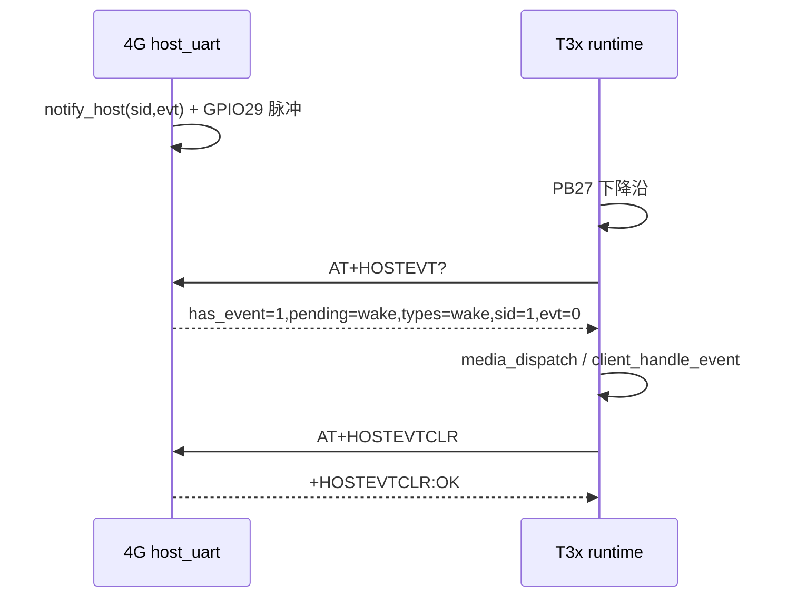
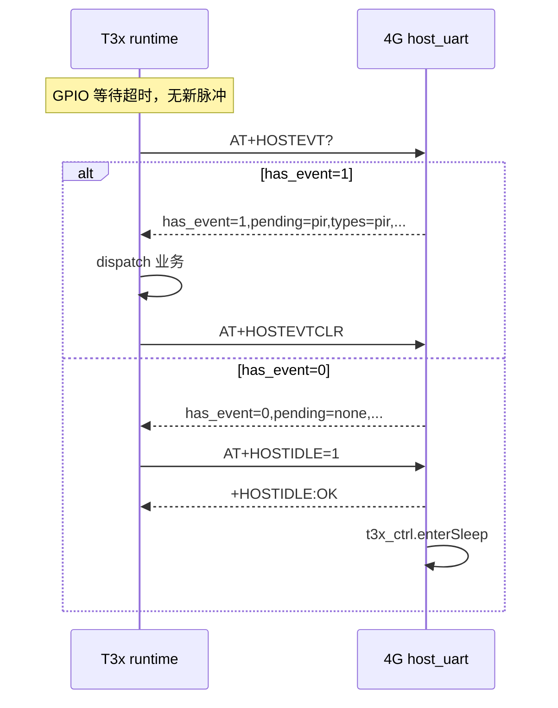

# T3x 休眠前事件查询（HOSTEVT 五条 AT）

> T3x 与 4G 协处理器之间，**事件汇总、消费、休眠、轮询间隔**统一由下列五条 AT 完成。  
> 汇总逻辑集中在 `lib/host_event.lua`，不维护平行状态机。  
> 双端开关：`WITH_T3X_HOSTEVT_SLEEP`（T3x）↔ `HOST_EVT_ENABLE`（4G）。

**版本**：v1.6 · 2026-06-14

---

## 1. 五条 AT 语义

| AT | 响应 / 行为 | 说明 |
|----|-------------|------|
| **`AT+HOSTEVT?`** | `+HOSTEVT:has_event,pending,types,sid,evt` + **media 字段** | **查询**待处理业务 + T3x 媒体分发参数；**仅读，不清除** |
| **`AT+HOSTEVTCLR`** | `+HOSTEVTCLR:OK` | **清除**可消费标记：GPIO pending + PIR `last/last_ts` |
| **`AT+HOSTIDLE=1`** | `+HOSTIDLE:OK` / `BUSY` / `ERROR` | `has_event=0` 时 T3x 请求 4G 对 T3x `enterSleep` |
| **`AT+HOSTIDLE?`** | `+HOSTIDLE:lowpower=%d` | 查询 4G 侧 `low_power_mode` 标志 |
| **`AT+HOSTEVTPOLL?`** | `+HOSTEVTPOLL:<ms>` | 查询 T3x 空闲轮询 `HOSTEVT?` 间隔（**毫秒**） |
| **`AT+HOSTEVTPOLL=<ms>`** | `+HOSTEVTPOLL:OK` / `ERROR` | 设置轮询间隔；持久化 `/host_evt_poll_cfg.json` |

### 1.1 `AT+HOSTEVT?` 响应格式

字段为 `key=value`，逗号分隔：

```
+HOSTEVT:has_event=1,pending=wake,types=wake,pir,sid=1,evt=0,recording=0,action=both,max_sec=60,last_stop=none OK
```

| 字段 | 类型 | 含义 |
|------|------|------|
| `has_event` | 0/1 | 是否存在待处理业务（休眠/断电门禁） |
| `pending` | string | 主事件类型：`wake` / `pir` / `record` / `mqtt` / `none` |
| `types` | string | 全部命中类型，逗号分隔，如 `wake,pir` |
| `sid` | int | 唤醒通道号（GPIO pending 时有效） |
| `evt` | int | 唤醒原因码；无事件时为 `-1` |
| `recording` | 0/1 | pir_ctrl 录像会话（二次 PIR 停录判断） |
| `action` | string | `photo` / `video` / `both` / `devinfo` |
| `max_sec` | int | 录像最长秒数 |
| `last_stop` | string | 云端/定时停录请求（`none` / `cloud` / …） |

media 字段与 `AT+PIRSTAT?` 中 `pir_ctrl.buildAtBody()` **同源**；T3x `media_dispatch_wake_event` **优先读 HOSTEVT**，失败回退 PIRSTAT。

无待处理：

```
+HOSTEVT:has_event=0,pending=none,types=,sid=0,evt=-1,recording=0,action=video,max_sec=60,last_stop=none OK
```

### 1.1.1 `AT+HOSTEVTPOLL`（v1.6）

T3x 在 **GPIO 等待超时、空闲休眠轮询** 时，按本间隔周期性发 `AT+HOSTEVT?`（此前 T3x 侧硬编码约 1s；现由 4G 侧配置下发）。

```text
T3x → 4G: AT+HOSTEVTPOLL?
4G → T3x: +HOSTEVTPOLL:30000 OK

T3x → 4G: AT+HOSTEVTPOLL=30000
4G → T3x: +HOSTEVTPOLL:OK OK
```

| 项 | 说明 |
|----|------|
| 单位 | **毫秒**（`30000` = 30 秒） |
| 默认 | `HOST_EVT_CFG.poll_interval_ms = 30000` |
| 范围 | `poll_interval_min_ms`～`poll_interval_max_ms`（默认 1000～300000） |
| 持久化 | `/host_evt_poll_cfg.json`（`APP_PERSIST_CFG.host_evt_poll`） |
| 别名 | `AT+SETCFG=hostevt_poll,<毫秒>` |
| MQTT | `2004` `action=hostevt_poll_query` / `hostevt_poll` + `hostEvtPollMs` → `1004` |
| T3x 侧 | 须在 `host_event.c` 读 `HOSTEVTPOLL?` 并应用间隔（4G 仅存储与应答） |

与 **`2003 interval`**（MQTT 1003 周期，**秒**）无关。

### 1.1.2 mqtt 类 pending（v1.5）

| 来源 | 行为 |
|------|------|
| `net_mqtt.hasPendingHostWork()` | 2006/2007 在 T3x 休眠时入队；云端 2011 停录待 T3x 同步 |
| `types_mask` bit3 | `config.lua` 默认 `0x0F` 含 mqtt |
| T3x 空闲轮询 | `pending=mqtt` **仅 block 休眠**，不触发 `media_dispatch`（4G `drainPendingHostWork` 在 T3x 就绪后处理） |

### 1.2 `AT+HOSTEVTCLR` 清除范围

| 清除对象 | 实现 | 说明 |
|----------|------|------|
| GPIO 唤醒 pending | `host_uart.clear_pending_wake()` | `notify_host()` 写入、尚未消费的 `sid/evt` |
| PIR 可消费标记 | `pir_ctrl.clearConsumableMarkers()` | `last=none`、`last_ts=0` |
| **不清除** | `cnt_*` 累加计数 | 与 `AT+PIRCLR` 区分；统计仍走 `AT+PIRSTAT?` |

### 1.3 `AT+HOSTIDLE=1` 判定与响应

1. 内部调用与 `AT+HOSTEVT?` 同源的 `build_hostevt_body()`
2. `has_event=1` → `+HOSTIDLE:BUSY`（拒绝断电）
3. `has_event=0` → 异步 `t3x_ctrl.enterSleep({ reason="host_idle" })` → `+HOSTIDLE:OK`

其它响应：

| 响应 | 条件 |
|------|------|
| `+HOSTIDLE:NOT_SUPPORTED` | `HOST_EVT_ENABLE=0` |
| `+HOSTIDLE:DISABLED` | `HOST_EVT_CFG.allow_host_idle_sleep=false` |
| `+HOSTIDLE:USB` | USB 已插入（`HOST_USB_CFG`）；T3x 不得发 `HOSTIDLE=1` |
| `+HOSTIDLE:ERROR` | `t3x_ctrl` 不可用 |

### 1.4 `AT+HOSTIDLE?`

```
+HOSTIDLE:lowpower=0,usb=1,host_idle_allow=0 OK
```

| 字段 | 含义 |
|------|------|
| `lowpower` | `APP_RUNTIME.low_power_mode`（0=常电，1=rest） |
| `usb` | 1=USB 座插入（GPIO27） |
| `host_idle_allow` | 0=T3x 不应发 `HOSTIDLE=1`；1=允许 |

USB 策略详见 [T3X_LOW_POWER.md §2.1](T3X_LOW_POWER.md)。

---

## 2. 与 PIRSTAT / PIRCLR 的分工

### 2.1 「精简」与「宽表」是什么意思？

二者用**同一份底层数据**（`pir_ctrl.buildAtBody()` + `host_event.summarize()`），做成两种不同**宽度**的串口应答：

| 说法 | 对应 AT | 含义 |
|------|---------|------|
| **精简** | `AT+HOSTEVT?` | 只返回 T3x **做决策**需要的字段：有没有待办、什么类型、怎么拍/录 |
| **宽表** | `AT+PIRSTAT?` | 在精简信息之外，再附带 **PIR 统计、冷却、策略快照** 等运维字段 |

因此 **`has_event`（HOSTEVT）与 `has_work`（PIRSTAT 末尾）结论一致**，不是两套状态机；宽表只是在同一份汇总结果上多贴了诊断数据。

```text
pir_ctrl.buildAtBody()  +  getHostEvtPending()  +  host_event.summarize()
                              │
              ┌───────────────┴───────────────┐
              ▼                               ▼
       AT+HOSTEVT?（精简）              AT+PIRSTAT?（宽表）
       T3x 休眠/唤醒/媒体              运维排障、串口一条看全
```

**类比**：`HOSTEVT?` 像仪表盘上的「要不要干活、干什么」；`PIRSTAT?` 像同一块表再加上里程表、故障计数、冷却计时——**开车看精简就够，修车才需要宽表**。

### 2.2 应答示例

**精简 — `AT+HOSTEVT?`（T3x 主路径）**

```text
+HOSTEVT:has_event=1,pending=wake,types=wake,sid=1,evt=0,recording=0,action=both,max_sec=60,last_stop=none OK
```

| 字段组 | 作用 |
|--------|------|
| `has_event` / `pending` / `types` / `sid` / `evt` | 有无待办、主类型、能否休眠、唤醒参数 |
| `recording` / `action` / `max_sec` / `last_stop` | 媒体分发：拍/录/停录（v1.5 起由 HOSTEVT 携带，与 PIRSTAT 同源） |

**宽表 — `AT+PIRSTAT?`（运维/调试）**

```text
+PIRSTAT:suspended=0,recording=0,hw_started=1,cooldown_ms=3000,cooldown_left_ms=0,
action=both,max_sec=60,last=detected,last_ts=1717654321,
cnt_hw_irq=42,cnt_hw_ignore_cooldown=15,cnt_biz_detected=8,cnt_biz_retrigger=2,
cnt_stop_timer=1,...,pending_wake=1,pending_sid=1,pending_evt=0,
has_work=1,work_types=wake,work_pending=wake,work_sid=1,work_evt=0 OK
```

宽表**多出来**、HOSTEVT 默认**不带**的字段类型：

| 类型 | 示例字段 | 用途 |
|------|----------|------|
| 累积计数 | `cnt_hw_irq`、`cnt_biz_detected`、`cnt_stop_cloud` | 分析触发/忽略/停录次数 |
| 冷却/硬件 | `cooldown_ms`、`cooldown_left_ms`、`hw_started` | 判断是否在冷却、硬件是否就绪 |
| 运行态 | `suspended`、`lowpower`、`online`、`rec_elapsed` | 策略与环境快照 |
| 重复决策 | `has_work`、`work_types`（行末） | 与 HOSTEVT 同源，方便串口只打一条 PIRSTAT 也能看到「有没有事」 |

### 2.3 职责对照表

| AT | 形态 | 职责 | 与 HOSTEVT 关系 |
|----|------|------|-----------------|
| `AT+HOSTEVT?` | **精简** | 汇总 wake/pir/record/mqtt → `has_event` + media | T3x **休眠/唤醒/媒体**唯一主入口 |
| `AT+HOSTEVTCLR` | — | 清除 GPIO pending + PIR 可消费 `last/last_ts` | 业务处理成功后**必须**调用 |
| `AT+PIRSTAT?` | **宽表** | PIR 策略、冷却、**cnt_* 累加计数**、`recording`、`last` | 诊断/运维；媒体失败时可作 PIRSTAT **回退** |
| `AT+PIRCLR` | — | 清零全部 `cnt_*` + `last` | **运维统计清零**；业务消费走 HOSTEVTCLR |

### 2.4 是否会重复？能否合成？

**查询侧**

| 问题 | 结论 |
|------|------|
| `has_work` 与 `has_event` 重复吗？ | **语义重复**（同源 `summarize()`），主路径只认 HOSTEVT |
| `cnt_*` 与 HOSTEVT 重复吗？ | **不重复**，仅宽表有 |
| 能否废弃 `PIRSTAT?`？ | **决策上可以**（v1.5 已如此）；**运维上不建议**直接删掉，除非 HOSTEVT 增加扩展查询（如 `AT+HOSTEVT?diag=1`） |

**清除侧**

| | `HOSTEVTCLR` | `PIRCLR` |
|---|--------------|----------|
| GPIO `pending_wake` | ✅ 清 | ❌ 不清 |
| `last` / `last_ts` | ✅ 清 | ✅ 清 |
| `cnt_*` 累加计数 | ❌ **故意不清** | ✅ 全清 |

**`PIRCLR` 不应并入默认 `HOSTEVTCLR`**：每次唤醒消费事件若顺带清零统计，将无法分析冷却与误触发。可选演进：`AT+HOSTEVTCLR=stats` 作为 PIRCLR 别名（运维显式调用）。

### 2.5 T3x 实际调用（v1.5）

| 场景 | 使用的 AT |
|------|-----------|
| 空闲休眠轮询 | 按 `HOSTEVTPOLL` 间隔 → `HOSTEVT?` → `HOSTIDLE=1` |
| GPIO 唤醒 | `HOSTEVT?`（仅 `wake` 类型 dispatch） |
| 拍照/录像 | `HOSTEVT?` media 字段（失败回退 `PIRSTAT?`） |
| 唤醒后调试日志 | 可选 `PIRSTAT?`（仅日志，不参与分支） |

4G 侧休眠门禁亦走 `build_hostevt_body()` / `buildHostEvtBody()`，**不以 PIRSTAT 做决策**。

### 2.6 数据流简图

```text
                    pir_ctrl + host_event（单一真源）
                                      │
          ┌───────────────────────────┼───────────────────────────┐
          ▼                           ▼                           ▼
   AT+HOSTEVT?（精简）          AT+PIRSTAT?（宽表）            4G enterSleep
   T3x 主路径                   cnt_* / 冷却 / has_work       buildHostEvtBody
          │                           │
          ▼                           ▼
   AT+HOSTEVTCLR                 AT+PIRCLR
   业务消费（每轮唤醒）           统计清零（运维手动）
```

---


## 3. 事件汇总（`host_event.summarize`）

由 `HOST_EVT_CFG.types_mask` 控制参与汇总的类型：

| 位 | 类型 | 判定来源 |
|----|------|----------|
| 0x01 | **wake** | `host_uart` pending（GPIO `notify_host` 后未 CLR） |
| 0x02 | **pir** | `last` ∈ `detected`/`retrigger`/`hw_accept` 且 `last_ts` 未过期（默认 120s） |
| 0x04 | **record** | `recording=1` |
| 0x08 | **mqtt** | `net_mqtt.hasPendingHostWork()`（`types_mask=0x0F` 已启用，v1.5） |

### 3.1 `record` 与空闲轮询（v1.4）

`pir_ctrl.session.recording=1` 时 `HOSTEVT` 会出现 `pending=record`、`types=record`：

| 行为 | 说明 |
|------|------|
| **阻塞休眠** | `has_event=1` → `AT+HOSTIDLE=1` 返回 `BUSY` |
| **不 dispatch** | T3x 空闲轮询**不得**调 `media_dispatch`（否则会误停录） |
| **消费** | 停录由二次 PIR / timer / `AT+RECORD=0` 等既有路径处理 |

T3x：`host_work_skip_idle_dispatch()`；4G：`host_event.isDispatchable()`。

`has_event=1` 当且仅当 `types` 非空。

---

## 4. 主流程

### 4.1 GPIO 唤醒路径



### 4.2 空闲超时 → 休眠路径



### 4.3 4G 主动 `enterSleep`

`battery_guard` / `app.onEnterLowPower` 等路径在断电前调用 `host_uart.buildHostEvtBody()`：

- `has_event=1` → 跳过 T3x 断电（`shouldBlockT3xSleep`）
- `has_event=0` → 正常 `powerOff()`

---

## 5. 双端开关

| 侧 | 配置项 | 默认 |
|----|--------|------|
| 4G | `config.lua` → `HOST_EVT_ENABLE=1` | 开 |
| 4G | `HOST_EVT_CFG.types_mask` | `0x0F` |
| 4G | `HOST_EVT_CFG.allow_host_idle_sleep` | `true` |
| 4G | `HOST_EVT_CFG.block_t3x_sleep_when_pending` | `true` |
| T3x | `build/config.mk` → `WITH_T3X_HOSTEVT_SLEEP=yes` | 开 |
| T3x | `syscfg [cat1] hostevt_sleep_enable=1` | 开 |

`HOST_EVT_ENABLE=0`：`AT+HOSTIDLE` → `NOT_SUPPORTED`；`AT+HOSTEVT?` 仍应答但 `has_event=0`。

---

## 6. 代码位置

### 4G

| 模块 | 文件 | 函数 |
|------|------|------|
| AT 注册 | `user/host_uart.lua` | `uart_hostevt_query`、`uart_hostevt_clr`、`uart_hostidle` |
| 响应拼装 | `user/host_uart.lua` | `build_hostevt_body()`、`buildHostEvtBody()` |
| 事件汇总 | `lib/host_event.lua` | `summarize()`、`shouldBlockT3xSleep()` |
| PIR 可消费标记 | `pir_ctrl.lua` | `clearConsumableMarkers()` |
| 休眠门禁 | `user/t3x_ctrl.lua` | `enterSleep()` |

### T3x

| 模块 | 文件 | 函数 |
|------|------|------|
| GPIO 唤醒读事件 | `app/cat1/api.c` | `query_host_evt()` → `AT+HOSTEVT?` |
| 清除事件 | `app/cat1/api.c` | `client_clear_host_evt()` → `AT+HOSTEVTCLR` |
| 休眠轮询 | `app/cat1/host_event.c` | `client_host_work_poll_and_dispatch()` |
| 业务线程 | `app/cat1/runtime.c` | GPIO 唤醒 / 超时轮询 |

---

## 7. 实现演进说明

早期实现将 `AT+WAKEVT?`（`sid,evt` 读后清除）与 `AT+HOSTEVT?`（集中事件）拆成两套；后统一为 **HOSTEVT 四条 AT**，并修正下列缺口：

| 项目 | 旧行为 | 现行为 |
|------|--------|--------|
| `AT+HOSTEVT?` 格式 | `+HOSTEVT:sid,evt` | `+HOSTEVT:has_event,pending,types,sid,evt` |
| `AT+HOSTEVTCLR` | 仅清 GPIO pending | 另清 PIR `last/last_ts` |
| 休眠查询入口 | `AT+PIRSTAT?` 的 `has_work` | `AT+HOSTEVT?` 的 `has_event` |
| T3x 清除 | `AT+PIRCLR` | `AT+HOSTEVTCLR` |
| 查询与清除 | 查询时自动清除 | **查询与 CLR 分离**，处理后显式 CLR |

---

## 8. 实机验证清单

- [ ] `AT+HOSTEVT?` 返回 `has_event,pending,types,sid,evt` 五字段
- [ ] GPIO `notify_host` 后 `has_event=1`、`pending=wake`
- [ ] PIR 触发后 `types` 含 `pir`（`last` 在有效期内）
- [ ] 业务处理完 `AT+HOSTEVTCLR` 后 `has_event=0`
- [ ] 业务 dispatch **失败**时不发 CLR，下次轮询可重试
- [ ] GPIO 脉冲仅 `pending/types` 含 **wake** 时走 runtime dispatch；纯 pir 留给休眠轮询
- [ ] `HOSTEVTCLR` 后 `cnt_*` 计数**不变**（`PIRSTAT` 对照）
- [ ] `has_event=0` 时 `AT+HOSTIDLE=1` → T3x 断电
- [ ] `has_event=1` 时 `AT+HOSTIDLE=1` → `+HOSTIDLE:BUSY`
- [ ] `AT+HOSTIDLE?` 与 MQTT `1003.lowPowerMode` 一致
- [ ] 4G 主动 `enterSleep` 在 `has_event=1` 时不断 T3x 电

---

## 9. 相关文档

| 文档 | 说明 |
|------|------|
| [T3X_HOSTEVT_PROTOCOL.md](T3X_HOSTEVT_PROTOCOL.md) | GPIO29→PB27 脉冲时序 |
| [T3X_IPC_4G_INTERACTION.md](T3X_IPC_4G_INTERACTION.md) | T3x↔4G 端到端流程与优化记录 |
| [T3X_LOW_POWER.md](T3X_LOW_POWER.md) | rest / MQTT 1002/1003 |
| [UART_AT_COMMANDS.md](UART_AT_COMMANDS.md) | 全量 AT 清单 |
| [PIR_COOLDOWN_AND_COUNT.md](PIR_COOLDOWN_AND_COUNT.md) | PIR 计数 vs HOSTEVT 消费 |
