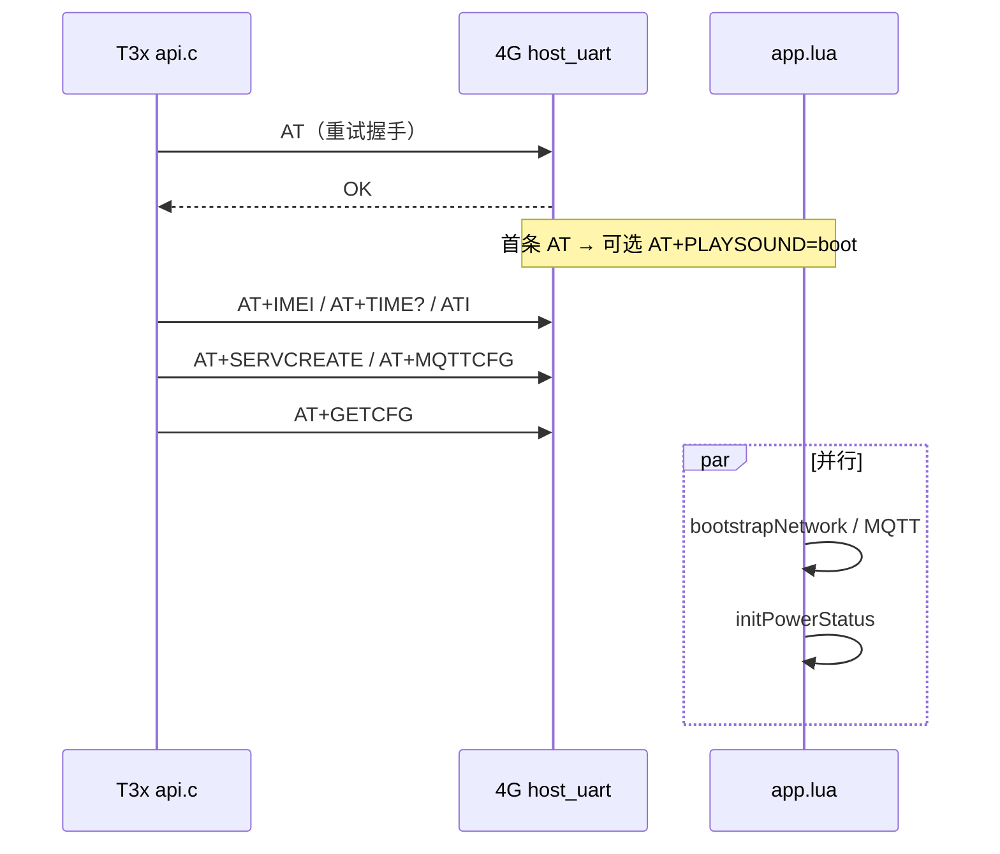
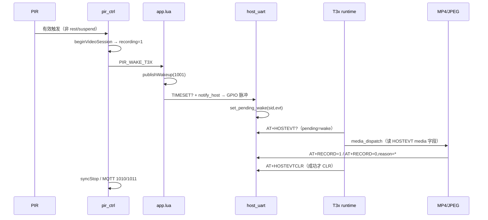
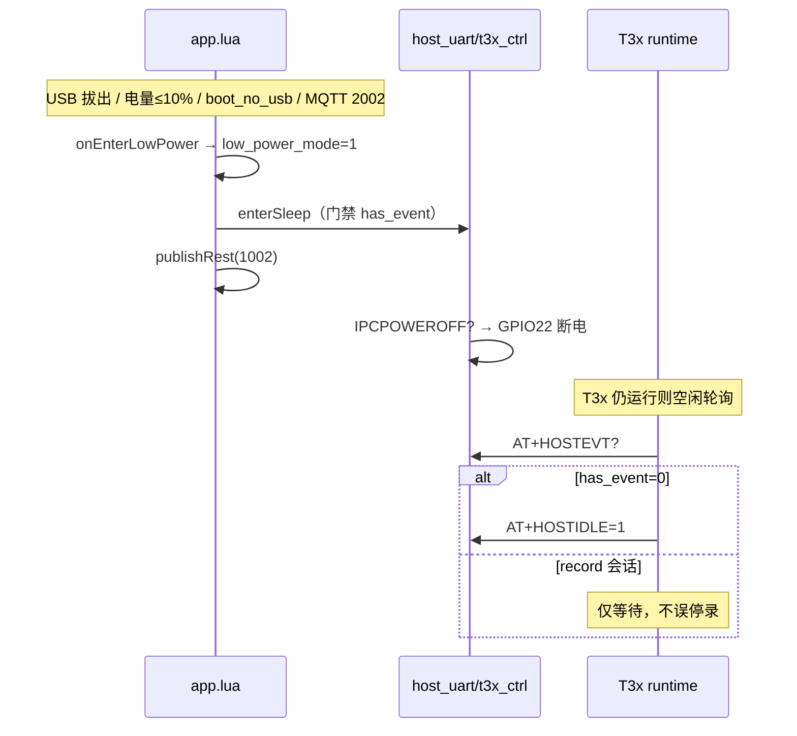

# T3x ↔ 4G Cat.1 交互总览

> T3x 主程序（`app/cat1/`）与 Air780 固件（`user/` + `lib/`）的端到端协作说明。  
> 相关专篇：[T3X_HOSTEVT_SLEEP.md](T3X_HOSTEVT_SLEEP.md)、[T3X_LOW_POWER.md](T3X_LOW_POWER.md)、[T3X_RECORD_MQTT_FLOW.md](T3X_RECORD_MQTT_FLOW.md)

**版本**：v1.5 · 2026-06-06

---

## 1. 系统分层

```text
┌─────────────────────────────────────────────────────────────────┐
│                        云平台 MQTT                               │
└────────────────────────────┬────────────────────────────────────┘
                             │
┌────────────────────────────▼────────────────────────────────────┐
│  4G  app.lua / pir_ctrl / net_mqtt / battery_guard              │
│      host_uart.lua ←→ uart_bridge (115200)                      │
│      t3x_ctrl (GPIO22 供电, GPIO29 唤醒脉冲)                     │
└────────────────────────────┬────────────────────────────────────┘
         GPIO29 脉冲          │  AT 双向
┌────────────────────────────▼────────────────────────────────────┐
│  T3x  serial.c / api.c / runtime.c / uart_host_cmd.c           │
│        media_ops / cat1_module (JPEG/MP4)                       │
└─────────────────────────────────────────────────────────────────┘
```

| 通道 | 方向 | 典型内容 |
|------|------|----------|
| UART AT | T3x→4G | `HOSTEVT?` `PIRSTAT?` `RECORD=` `MQTTCFG` … |
| UART AT | 4G→T3x | `TIMESET` `PLAYSOUND` `IPCPOWEROFF` `+CAT1:MQTT` … |
| GPIO | 4G→T3x | 低脉冲 → PB27 下降沿 |
| MQTT | 4G↔云 | 1001/1002/1003、1010/1011 |

**编译真源**：T3x → `ipc_device_gb28181/app/cat1/`；4G → `/mnt/share/user/`、`/mnt/share/lib/`。

---

## 2. 上电与 Bootstrap



| 步骤 | T3x 侧 | 4G 侧 |
|------|--------|-------|
| 握手 | `bootstrap_ping` | `uart_at_cmd` |
| 身份 | `AT+IMEI` → 缓存 GB28181 | `IPCINFO` 查询 |
| 校时 | `AT+TIME?` → `settimeofday` | SNTP → `AT+TIMESET` |
| 链路 | `SERVCREATE` + `MQTTCFG` | `net_tcp` / `net_mqtt` |
| 无 USB 冷启动 | — | `onEnterLowPower("boot_no_usb")`（**与 charge 模块无关**） |

---

## 3. PIR → 拍照/录像（常电）



| 分支 | T3x `media_dispatch` | 4G |
|------|----------------------|-----|
| `action=photo` | JPEG 抓拍 | 1010 |
| `action=video/both` | MP4 开录 | 1010 + `t3x_active` |
| `recording=1`（二次 PIR） | `record_stop(pir_retrigger)` | `requestT3xStopRecord` |
| `action=devinfo` | `client_report_devinfo` | MQTT 2006 |

---

## 4. HOSTEVT 四条 AT（休眠 / 事件）

详见 [T3X_HOSTEVT_SLEEP.md](T3X_HOSTEVT_SLEEP.md)。

### 4.1 路径分工

| 路径 | 触发 | 行为 |
|------|------|------|
| **GPIO 唤醒** | PB27 下降沿 | `HOSTEVT?` 仅 `wake` 类型 → dispatch → 成功才 `CLR` |
| **空闲轮询** | GPIO 超时 1s | `HOSTEVT?` → `wake`/`pir` dispatch；**`record` 仅阻塞不休眠** |
| **请求休眠** | `has_event=0` | `HOSTIDLE=1` → `enterSleep` |

### 4.2 `record` 类型语义（v1.4）

4G `pir_ctrl.session.recording=1` 时 `HOSTEVT` 含 `types=record`、`pending=record`：

- **阻塞** `AT+HOSTIDLE=1`（仍在录像会话中）
- **不触发** T3x 空闲轮询 `media_dispatch`（避免误走 `recording=1` 停录分支）

实现：`host_event.c` `host_work_skip_idle_dispatch()`；4G `host_event.isDispatchable()`。

### 4.3 失败重试（v1.3+）

dispatch 失败（校时/存储等）→ **不** `HOSTEVTCLR` → 下轮轮询重试。

---

## 5. 低功耗 / rest



| 入口 | reason | MQTT |
|------|--------|------|
| 冷启动无 USB | `boot_no_usb` | conack 补 1002+1003 |
| USB 拔出 | `usb_remove` | 1002 |
| 电量 ≤10% | `battery` | 1002 |
| 平台 2002 | `mqtt_2002` | — |
| MQTT 重连 | — | 1002+1003（不发 1001） |

**rest 下 PIR**：`pir_ctrl` 忽略触发，`cnt_biz_ignore_rest++`，不 `notify_host`。

### 5.1 USB 插入 ↔ 低功耗互斥（780EHM_PJ，已实现）

GPIO27 **USB 插入**时，4G 与 T3x **互斥**低功耗指令（详见 [T3X_USB_HOSTIDLE.md](T3X_USB_HOSTIDLE.md)）：

| USB | 4G 模块 | T3x |
|-----|---------|------------|
| **插入** | 不进 rest；拒绝 `HOSTIDLE=1` → `+HOSTIDLE:USB` | 收 `+CAT1:USB,1` → **停止**发 `HOSTIDLE=1`（仍可做 `HOSTEVT?` 业务） |
| **拔出** | 发 `+CAT1:USB,0`；可 `onEnterLowPower(usb_remove)` | 清除阻塞；`has_event=0` 时可再 `HOSTIDLE=1` |

配置：`user/config.lua` → `HOST_USB_CFG`（`block_4g_rest_when_usb` / `notify_t3x_usb_state`）。

---

## 6. 双端开关对照

| 能力 | T3x `build/config.mk` | 4G `config.lua` |
|------|----------------------|-----------------|
| Cat.1 模块 | `WITH_CAT1=yes` | — |
| GPIO 唤醒线程 | `CAT1_WAKE_ENABLE=yes` | — |
| 低功耗 | `WITH_T3X_LOW_POWER=yes` | `LOW_POWER_ENABLE=1` |
| HOSTEVT 休眠 | `WITH_T3X_HOSTEVT_SLEEP=yes` | `HOST_EVT_ENABLE=1` |
| 优雅关机 | `WITH_T3X_LOW_POWER=yes` | `graceful_ipc=true` |

---

## 7. 代码地图

### 4G

| 模块 | 文件 |
|------|------|
| 主流程 | `user/app.lua` |
| PIR 策略 | `user/pir_ctrl.lua` |
| AT 分发 | `user/host_uart.lua` |
| 事件汇总 | `lib/host_event.lua` |
| MQTT | `user/net_mqtt.lua` |
| 电量/USB | `user/battery_guard.lua` |
| T3x 电源 | `user/t3x_ctrl.lua` |

### T3x

| 模块 | 文件 |
|------|------|
| 集成入口 | `app/cat1/cat1_module.c` |
| Bootstrap / AT | `app/cat1/api.c` |
| 唤醒线程 | `app/cat1/runtime.c` |
| 休眠轮询 | `app/cat1/host_event.c` |
| 媒体分发 | `app/cat1/media_ops.c` |
| 4G→T3x Host AT | `app/cat1/uart_host_cmd.c` |
| 串口 | `app/cat1/serial.c` |

---

## 8. 优化记录（v1.3 → v1.5）

| 版本 | 项 | 说明 |
|------|-----|------|
| v1.3 | HOSTEVT 统一 | 替代 WAKEVT；查询/CLR 分离 |
| v1.3 | 失败不 CLR | dispatch 失败保留 pending |
| v1.3 | GPIO 仅 wake | 非 wake 类型不交 GPIO 路径 dispatch |
| v1.4 | record 不误 dispatch | 录像会话只 block 休眠，空闲轮询不停录 |
| v1.4 | boot_no_usb | 无 USB 即 rest，不依赖 `MODULE_FLAGS.charge` |
| **v1.5** | **HOSTEVT media 字段** | `recording/action/max_sec/last_stop`；`media_ops` 主读 HOSTEVT |
| **v1.5** | **MQTT pending** | `hasPendingHostWork` + 2006/2007 队列；`types_mask=0x0F` |
| **v1.5** | **+CAT1:MQTT** | T3x 驱动 NET_STAT_LED（`notify_t3x_net_led`） |
| **v1.5** | **2011 云端停录** | `requestT3xStopRecord` 唤醒 T3x 同步停录 |

### 待办

| 优先级 | 项 |
|--------|-----|
| P2 | 抓拍自动上传 JPEG |
| P2 | `app/cat1` 与 `780EHM_PJ/cat1_host` 单份真源 |

---

## 9. 实机验证清单

- [ ] 无 USB 冷启动 → T3x rest（charge 模块开启时亦如此）
- [ ] PIR 录像跑满 `max_sec`，期间**无**误报 `PIR retrigger/stop path`
- [ ] 录像中 `AT+HOSTIDLE=1` → `BUSY`；结束后可 `OK`
- [ ] 拍照/录像失败 → 日志 `keep pending`，下轮重试
- [ ] rest 下 PIR 不唤醒；插入 USB 退 rest
- [ ] MQTT 重连 rest 仅 1002+1003

### 9.1 自动化日志检查（录像 + 休眠）

脚本：`scripts/cat1_record_sleep_log_check.sh`（IPC 仓同名：`tests/cat1_record_sleep_log_check.sh`）

```bash
# T3x 侧（syscfg 打开 uart_log 后）
./tests/cat1_record_sleep_log_check.sh /tmp/cat1_uart.log

# T3x + 4G 串口日志合并
./tests/cat1_record_sleep_log_check.sh /tmp/cat1_uart.log /path/to/4g_uart.log

# 严格：窗内必须有 block sleep 或 HOSTIDLE BUSY
./tests/cat1_record_sleep_log_check.sh --strict /tmp/cat1_uart.log

# 管道
cat /tmp/cat1_uart.log | ./tests/cat1_record_sleep_log_check.sh -
```

**退出码**：`0` 通过，`1` 失败（窗内误停录或录像中 HOSTIDLE OK），`2` 用法错误。

**窗内 FAIL 条件**：`PIR retrigger/stop path`；`HOSTIDLE accepted` / `+HOSTIDLE:OK`（无前置 BUSY）。

---

## 10. 相关文档

| 文档 | 说明 |
|------|------|
| [T3X_IPC_CAT1_COMM_COMPLETENESS.md](T3X_IPC_CAT1_COMM_COMPLETENESS.md) | **T3x↔4G 通讯完善度分析**（双向 AT、时序闭环、缺口） |
| [T3X_USB_HOSTIDLE.md](T3X_USB_HOSTIDLE.md) | **USB 插入 ↔ T3x/4G 低功耗互斥**（780EHM_PJ） |
| [T3X_HOSTEVT_SLEEP.md](T3X_HOSTEVT_SLEEP.md) | HOSTEVT 四条 AT |
| [T3X_HOSTEVT_PROTOCOL.md](T3X_HOSTEVT_PROTOCOL.md) | GPIO 脉冲时序 |
| [T3X_LOW_POWER.md](T3X_LOW_POWER.md) | rest / MQTT 100x |
| [T3X_RECORD_MQTT_FLOW.md](T3X_RECORD_MQTT_FLOW.md) | 录像 MQTT 1010/1011 |
| T3x [ipc_780EHM_PJ_interaction_analysis.md](../../ipc_device_gb28181/docs/ipc_780EHM_PJ_interaction_analysis.md) | T3x 侧索引 |
