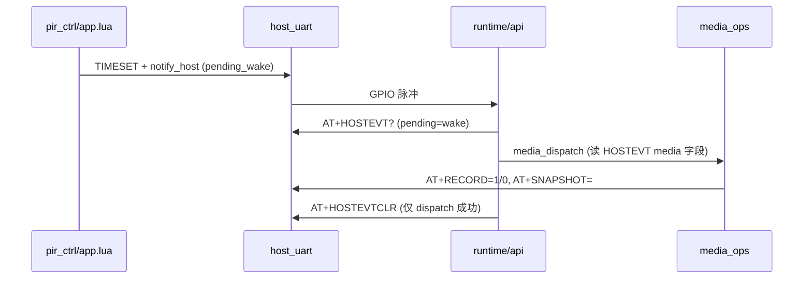
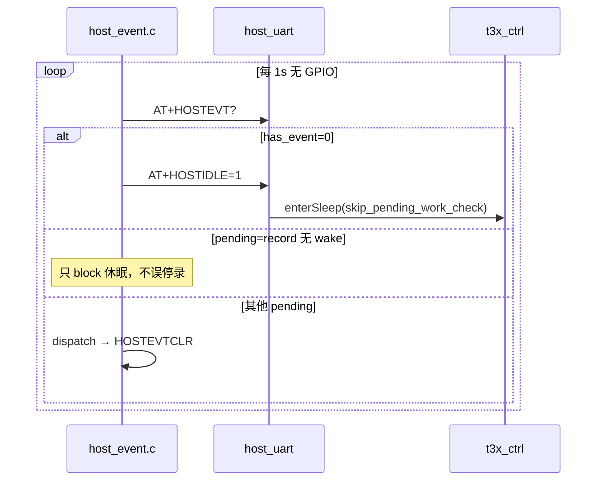

# T3x App ↔ Cat.1 Lua 通讯完善度分析

> T3x 主程序（`app/cat1/`）与 Air780 固件（`user/` + `lib/`）双向 UART AT 通讯的完整性评估。  
> 关联：[T3X_IPC_4G_INTERACTION.md](T3X_IPC_4G_INTERACTION.md)、[T3X_HOSTEVT_SLEEP.md](T3X_HOSTEVT_SLEEP.md)、[UART_AT_COMMANDS.md](UART_AT_COMMANDS.md)

**版本**：v1.5 · 2026-06-06

---

## 0. USB 插入与 T3x 休眠互斥（780EHM_PJ）

| USB | 4G | T3x |
|-----|-----|-----|
| **插入** | 不进 rest；`HOSTIDLE=1` → `+HOSTIDLE:USB` | `+CAT1:USB,1` → 停止 `HOSTIDLE` 轮询 |
| **拔出** | `+CAT1:USB,0`；可 `onEnterLowPower(usb_remove)` | `has_event=0` 时可发 `HOSTIDLE=1` |

配置：`HOST_USB_CFG`（`config.lua`）。完整时序：[T3X_LOW_POWER.md §2.1](T3X_LOW_POWER.md)。

---

## 1. 结论摘要

| 维度 | 评估 |
|------|------|
| **主链路（PIR 唤醒、录像/抓拍、低功耗休眠、Bootstrap、MQTT 状态上报）** | ✅ **完善** |
| **HOSTEVT 休眠决策（四条 AT）** | ✅ **完善**（v1.3–v1.5） |
| **媒体分发** | ✅ **v1.5** 优先 `HOSTEVT?` media 字段，PIRSTAT 仅回退 |
| **MQTT 类 pending** | ✅ **v1.5** `hasPendingHostWork` + 下行队列 + `types_mask=0x0F` |
| **`+CAT1:MQTT` 网络灯** | ✅ **v1.5** IPC `uart_host_cmd` + `gpio_net_stat_set_cat1_mqtt` |

**一句话**：原「部分完善 / 待补」项已在 v1.5 落地；`AT+LOWPOWER` 仍由 4G 内部使用、T3x 走 `HOSTIDLE`（设计如此，非缺口）。

---

## 2. 通讯架构

```text
云平台 MQTT
     │
4G  Lua: app.lua / pir_ctrl / net_mqtt / host_uart.lua
     │  uart_bridge (115200)
     │  t3x_ctrl: GPIO 供电 + GPIO29 唤醒脉冲
     ▼
T3x: serial.c → api.c (T3x→4G) + uart_host_cmd.c (4G→T3x)
     runtime.c / host_event.c / media_ops.c
```

| 通道 | 机制 | 互斥 / 拆包 |
|------|------|-------------|
| T3x→4G | `serial_request` + `client_request` | `tx_lock` 仅保护写；等待应答时不持锁，避免 Host 行死锁 |
| 4G→T3x | `uart_bridge.sendString` 发 AT；`host_process_line` 解析 T3x 应答 | 首条 AT 触发 `HOST_UART_FIRST_AT` / 开机铃 |
| GPIO | `notify_host` → `set_pending_wake` + `pulseMcuInt` | T3x `gpio_wait_event` 后再 `AT+HOSTEVT?` 校验 |

**代码真源**：

| 侧 | 路径 |
|----|------|
| IPC 编译 | `ipc_device_gb28181/app/cat1/` |
| 4G 烧录 | `/mnt/share/user/`、`/mnt/share/lib/` |

---

## 3. 双向 AT 对照表

### 3.1 T3x → 4G（`api.c` 发，`host_uart.lua` 收）

| AT | 4G 处理 | 完善度 |
|----|---------|--------|
| `AT` / `ATI` / `AT+GETCFG?` | Bootstrap 握手、配置快照 | ✅ |
| `AT+IMEI` / `AT+TIME?` | 身份、校时 | ✅ |
| `AT+SERVCREATE` / `MQTTCFG` / `SERVCLOSE` | TCP/MQTT 通道 | ✅ |
| `AT+HOSTEVT?` / `HOSTEVTCLR` | 休眠/唤醒事件汇总与消费 | ✅ v1.4 主路径 |
| `AT+HOSTIDLE=1` / `HOSTIDLE?` | 无事件时 `enterSleep`；有事件 `BUSY` | ✅ |
| `AT+PIRSTAT?` / `PIRCLR` | PIR 统计 + `has_work` 扩展 | ✅（诊断/媒体仍依赖） |
| `AT+RECORD=1/0` / `SNAPSHOT=` | 录像/抓拍状态同步 → MQTT | ✅ |
| `AT+MQTTPUB` | 4G 代发 MQTT | ✅ |
| `AT+RIL` / `SENDSTR` / `SENDHEX` | 透传/调试 | ✅ |

### 3.2 4G → T3x（`host_uart.lua` 发，`uart_host_cmd.c` 收）

| AT / URSP | T3x 处理 | 完善度 |
|-----------|----------|--------|
| `AT+TIMESET=` | `time_sync_apply_unix` | ✅ |
| `AT+PLAYSOUND=` | 开机铃/提示音 | ✅ |
| `AT+IPCPOWEROFF` | 低功耗断电流程 | ✅（需 `WITH_T3X_LOW_POWER`） |
| `AT+IPCSTATUS?` | 运行状态字符串 | ✅ |
| `AT+RECORD?` / `TFCARD?` | 4G 主动查 T3x 写盘/卡 | ✅（双格式解析在 Lua 侧） |
| `AT+GB28181?` / `IPCINFO?` / `IMEI?` | 身份回读 | ✅ |
| `AT+WLED` / `IRLED` | 灯控（可选） | ✅ |
| `+CAT1:MQTT,0/1` | 网络灯通知 | ✅ `uart_host_cmd` → `GpioNetStatSetCat1Mqtt`（覆盖本地 ping 检测） |

### 3.3 `AT+RECORD` 双格式（有意区分）

| 方向 | 格式 | 用途 |
|------|------|------|
| T3x → 4G 上报 | `+RECORD:1,active=1` / `+RECORD:0,reason=*` | 4G 会话状态、MQTT 触发 |
| 4G → T3x 查询 | `+RECORD:running=,active=,ch=,reason=` | `queryHostRecord()` 查真实写盘 |

`host_uart.lua` 的 `parse_record_line()` 已兼容两种格式。详见 [T3X_RECORD_MQTT_FLOW.md](T3X_RECORD_MQTT_FLOW.md)。

---

## 4. 核心时序闭环

### 4.1 PIR 唤醒 → 拍照/录像



| 规则 | 实现位置 | 说明 |
|------|----------|------|
| GPIO 仅消费 wake | `api.c` `hostevt_body_has_wake` | `pending/types` 无 wake 时不 dispatch |
| 成功才 CLR | `runtime.c` / `host_event.c` | 查询/分发失败保留 pending 重试 |
| 媒体参数来源 | `media_ops.c` | **优先** `AT+HOSTEVT?` 的 `action/recording/max_sec/last_stop`；失败回退 PIRSTAT |

### 4.2 空闲休眠（HOSTEVT 四条 AT）



| 规则 | T3x 侧 | 4G 侧 |
|------|--------|-------|
| record/mqtt 仅 block 休眠 | `host_work_skip_idle_dispatch()` | `host_event.isDispatchable()` |
| HOSTIDLE 双重校验 | 发 `HOSTIDLE=1` 前已查 `has_event=0` | `uart_hostidle` 再查 `build_hostevt_body()` |
| 跳过重复 pending 检查 | — | `enterSleep({ skip_pending_work_check=true })` |

### 4.3 Bootstrap

| 步骤 | T3x | 4G |
|------|-----|-----|
| 握手 | `bootstrap_ping` 发 `AT` | `uart_at_cmd` 回 `OK` |
| 开机铃 | 等 `AT+PLAYSOUND=boot` | 首条 AT 后可选下发 |
| 防死锁 | `serial_notify_host_ack_for_at_ping` 补 `OK` | — |
| 无 USB rest | — | `initPowerStatus` → `boot_no_usb`（v1.4，与 charge 模块无关） |

---

## 5. 完善度分项（v1.5）

### 5.1 ✅ 已完善

1. **HOSTEVT 休眠 + 媒体**：`HOSTEVT?` 含 `recording/action/max_sec/last_stop`；T3x `media_dispatch` 主读 HOSTEVT。
2. **MQTT pending**：`hasPendingHostWork()`（2006/2007 队列 + 云端停录）；`types_mask=0x0F`；T3x `pending=mqtt` 仅 block 休眠。
3. **`+CAT1:MQTT`**：`LED_CFG.notify_t3x_net_led=true` 时驱动 T3x NET_STAT_LED（Cat.1 MQTT 在线态覆盖）。
4. **录像/抓拍/串口/Bootstrap**：同 v1.4。

### 5.2 v1.5 代码变更摘要

| 侧 | 文件 | 变更 |
|----|------|------|
| 4G | `host_uart.lua` | `build_hostevt_body` 追加 media 字段；导出 `buildHostEvtBody()` |
| 4G | `net_mqtt.lua` | `hasPendingHostWork`、下行队列、`drainPendingHostWork` |
| 4G | `pir_ctrl.lua` | `requestStopFromCloud` → `requestT3xStopRecord`（唤醒 T3x 停录） |
| 4G | `host_event.lua` | `isDispatchable` 跳过 mqtt |
| 4G | `config.lua` | `types_mask=0x0F` |
| T3x | `media_ops.c` | 优先 HOSTEVT，回退 PIRSTAT |
| T3x | `host_event.c` | 解析 media 字段；mqtt 空闲轮询 skip |
| T3x | `uart_host_cmd.c` | 处理 `+CAT1:MQTT,n` |
| T3x | `gpio_ctrl_interface.c` | `gpio_net_stat_set_cat1_mqtt` |

### 5.3 仍须注意（非缺口）

| 项 | 说明 |
|----|------|
| 双端 HOSTEVT 开关 | 须同时对齐 `WITH_T3X_HOSTEVT_SLEEP` ↔ `HOST_EVT_ENABLE` |
| PIRSTAT 回退路径 | HOSTEVT 查询失败时仍读 PIRSTAT，运维日志可能见 `fallback PIRSTAT` |
| `AT+LOWPOWER` | 4G 内部 API；T3x 休眠统一 `HOSTIDLE=1` |
| 空闲轮询 `pending=pir` | 无 GPIO 时最多 ~1s 延迟 dispatch（可接受） |

---

## 6. 双端开关对照

| 能力 | IPC `build/config.mk` | 4G `config.lua` |
|------|----------------------|-----------------|
| Cat.1 模块 | `WITH_CAT1=yes` | — |
| GPIO 唤醒线程 | `CAT1_WAKE_ENABLE=yes` | — |
| 低功耗 | `WITH_T3X_LOW_POWER=yes` | `LOW_POWER_ENABLE=1` |
| HOSTEVT 休眠 | `WITH_T3X_HOSTEVT_SLEEP=yes` | `HOST_EVT_ENABLE=1` |
| HOSTEVT types | — | `types_mask=0x0F`（含 mqtt） |
| Cat.1 网络灯 | `WITH_NET_STAT_LED` | `LED_CFG.notify_t3x_net_led`（可选） |

**必须双端同时开启**，否则 T3x 发 `HOSTIDLE=1` 可能收到 `NOT_SUPPORTED`，或 4G 侧 `enterSleep` 与 T3x 轮询不同步。

---

## 7. 代码地图（通讯相关）

### 4G

| 模块 | 文件 | 职责 |
|------|------|------|
| AT 分发 | `user/host_uart.lua` | T3x 入站 AT、HOSTEVT/PIRSTAT/RECORD |
| 事件汇总 | `lib/host_event.lua` | `summarize` / `isDispatchable` |
| 唤醒脉冲 | `user/t3x_ctrl.lua` | `notify_host` / `enterSleep` |
| PIR 策略 | `user/pir_ctrl.lua` | 录像会话、`syncStopFromT3x` |
| MQTT pending | `user/net_mqtt.lua` | `hasPendingHostWork()` / 下行队列 |

### T3x

| 模块 | 文件 | 职责 |
|------|------|------|
| Bootstrap / AT 客户端 | `app/cat1/api.c` | T3x→4G 全部 `client_request` |
| 串口 | `app/cat1/serial.c` | `serial_request`、Host 行拆包 |
| 4G→T3x Host AT | `app/cat1/uart_host_cmd.c` | `TIMESET` / `PLAYSOUND` / `RECORD?` 等 |
| 唤醒线程 | `app/cat1/runtime.c` | GPIO + 空闲轮询 |
| 休眠轮询 | `app/cat1/host_event.c` | `HOSTEVT?` / `HOSTIDLE=1` |
| 媒体分发 | `app/cat1/media_ops.c` | HOSTEVT media → 拍照/录像 |
| 网络灯 URSP | `app/cat1/uart_host_cmd.c` | `+CAT1:MQTT` → NET_STAT_LED |
| 状态上报 | `app/cat1/record_notify.c` | `AT+RECORD=` / `AT+SNAPSHOT=` |

---

## 8. 实机验证

### 8.1 手工清单

- [ ] PIR 唤醒后 `HOSTEVT?` 含 `pending=wake`，dispatch 成功后 `HOSTEVTCLR`
- [ ] 录像 60s 期间**无**误报 `PIR retrigger/stop path`（空闲轮询）
- [ ] 录像中 `AT+HOSTIDLE=1` → `+HOSTIDLE:BUSY`；结束后可 `+HOSTIDLE:OK`
- [ ] dispatch 失败日志含 `keep pending`，下轮重试
- [ ] 抓拍后 T3x `SNAPSHOT notify sent`；4G MQTT 1010 `snapshot_saved`

### 8.2 自动化日志检查

脚本：`scripts/cat1_record_sleep_log_check.sh`（IPC 仓：`tests/cat1_record_sleep_log_check.sh`）

```bash
# T3x 侧（syscfg 打开 uart_log 后）
./tests/cat1_record_sleep_log_check.sh /tmp/cat1_uart.log

# T3x + 4G 串口日志合并
./tests/cat1_record_sleep_log_check.sh /tmp/cat1_uart.log /path/to/4g_uart.log

# 严格：窗内必须有 block sleep 或 HOSTIDLE BUSY
./tests/cat1_record_sleep_log_check.sh --strict /tmp/cat1_uart.log
```

**退出码**：`0` 通过，`1` 失败，`2` 用法错误。

**窗内 FAIL**：`PIR retrigger/stop path`；`HOSTIDLE accepted` / `+HOSTIDLE:OK`（录像窗内无前置 BUSY）。

**窗内 PASS 信号**（hostevt_sleep 开启时）：`HOSTEVT record session active, block sleep only` 或 `HOSTIDLE busy`。

---

## 9. 验证补充（v1.5）

- [ ] 唤醒后日志 `media dispatch via HOSTEVT action=...`（非 fallback PIRSTAT）
- [ ] T3x 休眠时平台发 2006/2007 → 4G 日志 `HOST 下行入队`；T3x 上电后 `HOST 下行出队`
- [ ] `notify_t3x_net_led=true` 时 MQTT 断连 → T3x 收到 `+CAT1:MQTT,0`，NET_STAT 闪烁

---

## 10. 相关文档

| 文档 | 说明 |
|------|------|
| [T3X_IPC_4G_INTERACTION.md](T3X_IPC_4G_INTERACTION.md) | 端到端总览、rest、优化记录 |
| [T3X_HOSTEVT_SLEEP.md](T3X_HOSTEVT_SLEEP.md) | HOSTEVT 四条 AT；**§2 精简 vs 宽表**（HOSTEVT / PIRSTAT 分工） |
| [T3X_HOSTEVT_PROTOCOL.md](T3X_HOSTEVT_PROTOCOL.md) | GPIO 脉冲时序 |
| [UART_AT_COMMANDS.md](UART_AT_COMMANDS.md) | AT 全表与 RECORD 双格式 |
| [T3X_RECORD_MQTT_FLOW.md](T3X_RECORD_MQTT_FLOW.md) | 录像 MQTT 1010/1011 |
