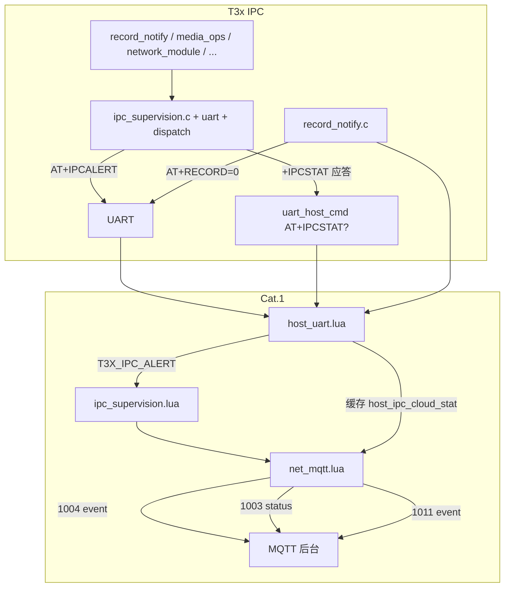
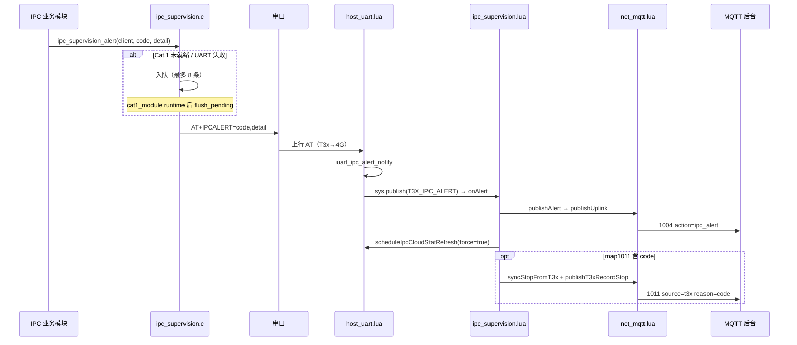
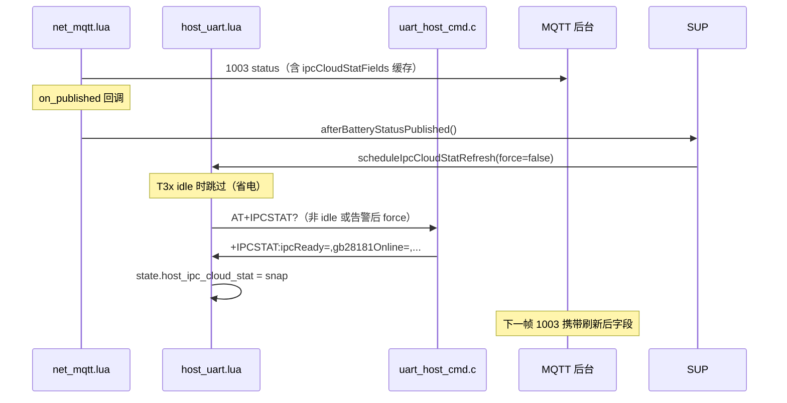

# Cat.1 ↔ IPC 联合异常监督机制

> **读者**：固件 / 联调 / 平台  
> **工程**：780EHM_PJ（Cat.1 Lua）+ T3x IPC（`ipc_device_gb28181`）  
> **关联**：[T3X_IPC_CLOUD_EXCEPTION_REPORT.md](./T3X_IPC_CLOUD_EXCEPTION_REPORT.md) · [T3X_IPC_EXCEPTION_MQTT_UPLINK.md](./T3X_IPC_EXCEPTION_MQTT_UPLINK.md) · [T3X_IPC_SUPERVISION_MODULE.md](./T3X_IPC_SUPERVISION_MODULE.md) · [MQTT_PROTOCOL.md](./MQTT_PROTOCOL.md)  
> **更新**：2026-06-26（监督模块化 + 缺口补强）

---

## 1. 结论：机制是否完善？

**对 PIR/录像/串口协作主链路而言，已基本可用**；**对全设备运维而言，属于「三层模型已落地 + 若干已知缺口」**，不能视为 100% 闭环。

| 维度 | 完善度 | 说明 |
| --- | --- | --- |
| **结果型**（录失败 reason → 1011） | ★★★★☆ | `AT+RECORD=0` 路径成熟；`no_person` 已改 IPCALERT + 1011 |
| **状态型**（1003 IPCSTAT） | ★★★★☆ | 9 个扩展字段 + 周期刷新；T3x 休眠时 IPCSTAT 可能不拉 |
| **事件型**（1004 ipc_alert） | ★★★★☆ | 14 个 alertCode + **待发队列**（Cat.1 未就绪时缓存，runtime 后 flush） |
| **状态漂移对账**（§4.3） | ★★★★☆ | `ipc_supervision_uart` 重试 + `ipc_supervision_dispatch` + `reconcileHostRecordSession` |
| **GB28181 并行** | ★★★☆☆ | SIP 报警 + MQTT `gb28181Online` 镜像；后台需双链 |
| **存储/系统级** | ★★☆☆☆ | TF 仅启动 pending alert；无 crash/watchdog 远程上报 |
| **远控边缘** | ★★★☆☆ | `runtimeApply` 已补；WLED ack 时序仍是 gap |

**一句话**：联合监督的**骨架已齐**（检测 → UART → Cat.1 → MQTT 三层），**业务主路径可联调**；剩余主要是存储运行期细粒度、进程级异常、平台侧告警生命周期设计。

---

## 2. 监督架构（三层模型）

```text
┌─────────────────────────────────────────────────────────────┐
│ ① 检测层（T3x IPC）                                          │
│    各模块发现异常 → ipc_supervision_alert() / record_notify() │
│    或 AT+RECORD=0,reason=…（结果型，不经 IPCALERT）           │
├─────────────────────────────────────────────────────────────┤
│ ② 传输层（UART Host AT）                                     │
│    AT+IPCALERT=code[,detail]     事件型告警                  │
│    AT+RECORD=0,reason=…          录像结果 / 会话结束          │
│    AT+IPCSTAT? → +IPCSTAT:…      状态型（4G 周期/告警后查询） │
│    AT+RECORD?                    4G 对账 T3x 真实写盘        │
├─────────────────────────────────────────────────────────────┤
│ ③ 上报层（Cat.1 Lua → MQTT）                                 │
│    host_uart 解析 → ipc_supervision.onAlert → net_mqtt      │
│    → 1004 ipc_alert / 1011 / 1003 / 102x                    │
└─────────────────────────────────────────────────────────────┘
```

### 2.1 三类上报与恢复

| 类型 | 通道 | 含义 | 设备恢复后 |
| --- | --- | --- | --- |
| **状态型** | **1003** `/status` | 当前 IPC/链路健康快照 | **下一条 1003** 字段自动更新（周期 ≤30s 或 USB/电量触发） |
| **事件型** | **1004** `/event` `action=ipc_alert` | 刚发生一次的异常 | **无 cleared 报文**；用最新 1003 判当前是否正常 |
| **结果型** | **1010/1011** `/event` | 录像会话开始/结束及 reason | 1011 后会话结束；1003 `recordingT3x=0` |

**平台原则**：告警入库看 **1004**；**当前是否正常** 以 **最新 1003** 为准，勿等待「恢复事件」。详见 [T3X_IPC_EXCEPTION_MQTT_UPLINK.md §5](./T3X_IPC_EXCEPTION_MQTT_UPLINK.md)。

---

## 3. 端到端流程

### 3.1 总览（Mermaid）



### 3.2 事件型告警（IPCALERT）时序



### 3.3 状态型监督（IPCSTAT → 1003）时序



### 3.4 状态漂移对账（§4.3）

```text
触发条件
  ├─ 每帧 1003 发布后：若 4G session.recording=1 → scheduleRecordReconcile()
  ├─ ipc_alert：uart_notify_fail / dispatch_failed / usb_recovery_fail / gb28181_register_fail
  └─ T3x AT+RECORD=0 → syncStopFromT3x + 1011
  └─ ipc_alert 后：scheduleIpcCloudStatRefresh(force=true) 拉 IPCSTAT

对账逻辑（host_uart.reconcileHostRecordSession）
  1. pir_ctrl.isRecording() == true
  2. queryHostRecord() → +RECORD:running=,active=,...
  3. 若 T3x 已停 → syncStopFromT3x + T3X_RECORD_STOP → 1011
```

### 3.5 录像结果型（不经 IPCALERT 的路径）

```text
MP4 写盘失败 / 正常停录
  → cat1_module ipc_rec_event_cb
  → record_notify client_record_notify(0, reason)
  → AT+RECORD=0,reason=disk_full|time_sync|done|...
  → host_uart uart_record_notify
  → T3X_RECORD_STOP → net_mqtt publishT3xRecordStop → 1011 source=t3x
```

---

## 4. 涉及源码文件（按层次）

### 4.1 核心枢纽（必看）

| 文件（IPC 仓库路径） | 角色 |
| --- | --- |
| `app/cat1/ipc_supervision.c` | **统一出口**：`ipc_supervision_alert()`、待发队列、`build_stat()`、TF pending flush |
| `app/cat1/ipc_alert_contract.h` | 14 个 `IPC_ALERT_*` 契约真源 |
| `app/cat1/ipc_supervision_uart.c` | UART 通知 **3 次重试** |
| `app/cat1/ipc_supervision_dispatch.c` | media/HOSTEVT **2 次分发重试** |
| `app/cat1/ipc_cloud_report.h` | 兼容宏别名（勿新增逻辑） |
| `app/cat1/uart_host_cmd.c` | T3x Host AT：`IPCSTAT?` / `RECORD?` / `TIMESET` / … |
| `app/cat1/record_notify.c` | `AT+RECORD/SNAPSHOT/…`；失败 `uart_notify_fail` |
| `app/cat1/api.c` | `client_request` / 校时告警 |

### 4.2 唤醒 / 分发 / 运行时

| 文件 | 触发场景 |
| --- | --- |
| `app/cat1/runtime.c` | GPIO 唤醒；`ipc_supervision_dispatch_wake_media` |
| `app/cat1/host_event.c` | 休眠 HOSTEVT；`ipc_supervision_dispatch_host_work` |
| `app/cat1/media_ops.c` | HOSTEVT/PIRSTAT 3 次重试；`hostevt_read_fail`；`snapshot_failed` / `defer_record_failed` |
| `app/cat1/cat1_module.c` | Cat.1 init/shutdown；抓拍校时失败；`flush_pending` |

### 4.3 业务域检测点

| 文件 | 异常类型 |
| --- | --- |
| `app/cat1/person_detect_pir_sync.c` | defer / `no_person`；defer 开录失败；`person_detect_ivs_*` |
| `app/cat1/cloud_remote_ctrl.c` | RECORDCTRL → `recordctrl_fail`；`+PERSONDET:enable,available=` |
| `app/cat1/encode_remote.c` | VENCSET `runtimeApply` |
| `app/network/network_module.c` | `gb28181_register_fail` |
| `app/cat1/cat1_usb_reenum.c` | `usb_recovery_fail` + `AT+USBRECOVERY=EXHAUSTED` |
| `app/cat1/time_sync.c` | `settimeofday`（由 api / uart_host_cmd 调用侧告警） |
| `main.c` | `ipc_cloud_report_note_tf_mount_fail()` |
| `media_plat/t31x/video_interface.c` | IVS 启停 → `person_detect_ivs_set_runtime_ready()` |

### 4.4 Cat.1 Lua（MQTT 侧）

| 文件（真源 `/mnt/share/user/`） | 角色 |
| --- | --- |
| `ipc_supervision.lua` | `publishAlert` / `onAlert` / `ipcCloudStatFields` / 对账与 IPCSTAT 调度 |
| `ipc_alert_contract.lua` | alertCode + `map1011` / `reconcile` 策略表 |
| `host_uart.lua` | 解析 `IPCALERT` / `IPCSTAT` / `RECORD`；`reconcileHostRecordSession()` |
| `net_mqtt.lua` | MQTT 传输；`ipc_sup.bind()`；`publishIpcAlert` 薄封装 |
| `app.lua` | `T3X_IPC_ALERT` → `ipc_supervision.onAlert()` |
| `vbat.lua` + `config.lua` | 电池 ADC；`mv_calibration` 实测校准 |

IPC 仓库镜像：`docs/4g_lua/user/`（与 `/mnt/share/user/` 同步）

### 4.5 构建

| 文件 | 说明 |
| --- | --- |
| `Makefile` | 编入 `ipc_supervision.c` / `ipc_supervision_uart.c` / `ipc_supervision_dispatch.c` |

---

## 5. IPC_ALERT 事件码与调用点

> **完整行号速查表**（含公共链路、map1011、按文件反查、rg 命令）→ [T3X_IPC_ALERT_CODE_INDEX.md](./T3X_IPC_ALERT_CODE_INDEX.md)

| alertCode | 契约 `ipc_alert_contract.h` | 主要 IPC 调用 | →1011 |
| --- | --- | --- | --- |
| `tf_mount_fail` | ✓ | `main.c` note → `ipc_supervision_flush_pending` | 否 |
| `uart_notify_fail` | ✓ | `record_notify.c`（经 `ipc_supervision_uart`） | 否 |
| `snapshot_failed` | ✓ | `cat1_module.c` · `media_ops.c` | 是 |
| `gb28181_register_fail` | ✓ | `network_module.c` | 否 |
| `defer_record_failed` | ✓ | `media_ops.c` · `person_detect_pir_sync.c` | 是 |
| `hostevt_read_fail` | ✓ | `media_ops.c` | 否 |
| `no_person` | ✓ | `record_notify.c` | 是 |
| `dispatch_failed` | ✓ | `ipc_supervision_dispatch.c` | 否 |
| `runtime_wakeup_fail` | ✓ | `runtime.c` | 否 |
| `time_sync_fail` | ✓ | `api.c` · `uart_host_cmd.c` | 是 |
| `time_invalid` | ✓ | `api.c` | 是 |
| `usb_recovery_fail` | ✓ | `cat1_usb_reenum.c` | 否 |
| `recordctrl_fail` | ✓ | `cloud_remote_ctrl.c`；4G `net_mqtt.lua` | 是 |
| `ipcpoweroff_busy` | ✓ | `uart_host_cmd.c` | 否 |
| `encode_runtime_fail` | Cat.1 `ipc_alert_contract.lua` | `net_mqtt.lua` | 否 |

统一发送：`ipc_supervision.c` `ipc_supervision_alert()` → Cat.1 `host_uart.lua` → `ipc_supervision.lua` `publishAlert`。

---

## 6. 1003 IPCSTAT 字段来源

T3x `ipc_supervision_build_stat()` 填充，4G `AT+IPCSTAT?` 拉取后并入 **1003**：

| 字段 | 数据来源 |
| --- | --- |
| `ipcReady` | `ipc_power_off_status_string() == "ready"`；Cat.1 启用且未运行时置 0 |
| `cat1Link` | `cat1_module_is_running()` |
| `gb28181Online` | `gb28181dev_is_registered()` |
| `tfPresent` | `statvfs("/mnt/sdcard")` |
| `personDetectEnabled` | `syscfg person_detect.enable` |
| `personDetectAvailable` | `person_detect_ivs_runtime_ready()` |
| `timeSynced` | `time_sync_is_valid(time_sync_now())` |
| `recordingT3x` | `record_get_runtime_status()` running/active |

**刷新节奏**：

- 每帧 1003 `on_published` → `scheduleIpcCloudStatRefresh(false)`（T3x **idle** 时跳过，省电）
- **1004 ipc_alert 后** → `scheduleIpcCloudStatRefresh(true)` 强制拉取

---

## 7. 缺口状态（2026-06 更新）

| 缺口 | 状态 | 说明 |
| --- | --- | --- |
| **1004 无 cleared** | 设计如此 | 后台用「告警表 + 最新 1003」 |
| **T3x 休眠 IPCSTAT 滞后** | **部分缓解** | 周期 1003 仍 skip idle；**告警后 force 刷新** |
| **IPCALERT UART 失败** | **已补强** | `ipc_supervision` 待发队列（8 条）+ `flush_pending` |
| **TF 运行期 mount** | 仍缺口 | 仅启动 bootstrap `tf_mount_fail` pending；运行中拔卡靠 1011 |
| **TF bootstrap** | **已实现** | `main.c` note + flush → **1004** |
| **磁盘空间预警** | 仍缺口 | 写满时 GB + 1011；未达阈值无 MQTT |
| **RTNL/DHCP** | 仍缺口 | 本地 NET 日志；对照 1003 `usbNetdev` |
| **IPC 崩溃** | 仍缺口 | 无远程 crash 上报 |
| **WLED ack 时序** | 仍缺口 | 1004 先 ack 后执行 |
| **GB28181 细节** | 设计如此 | MQTT 仅 `gb28181Online`；报警在 SIP |
| **电池电压偏差** | **已校准** | `config.lua` `mv_calibration = 3812/3608`（见 §10） |
| **无 MP4 自动上云** | 产品缺口 | 平台按路径/GB28181 二次取图 |

---

## 8. 联调检查清单

1. **订阅**：`/panshi/app/{imei}/status` + `/panshi/app/{imei}/event`
2. **制造异常**：拔 TF、SIP 断线、未校时开录、UART 通知失败场景
3. **确认上行**：**1004** `ipc_alert` 和/或 **1011** `reason`
4. **修复环境**后等待 ≤1 个 **1003** 周期，核对 `ipcReady` / `gb28181Online` / `timeSynced` 等回正
5. **录像漂移**：4G 仍在录但 T3x 已停 → 应在对账后出现 **1011** + `recordingT3x=0`
6. **双链**：同一时刻对照 GB28181 `alarm/list` 与 MQTT

---

## 9. 相关文档

| 文档 | 内容 |
| --- | --- |
| [T3X_IPC_SUPERVISION_MODULE.md](./T3X_IPC_SUPERVISION_MODULE.md) | **模块化架构**、两侧对称、API、迁移对照 |
| [T3X_IPC_ALERT_CONTRACT.md](./T3X_IPC_ALERT_CONTRACT.md) | alertCode 契约表 + map1011/reconcile |
| [T3X_IPC_CLOUD_EXCEPTION_REPORT.md](./T3X_IPC_CLOUD_EXCEPTION_REPORT.md) | 异常分类、§4.x 修复表 |
| [T3X_IPC_EXCEPTION_MQTT_UPLINK.md](./T3X_IPC_EXCEPTION_MQTT_UPLINK.md) | 后台 dataType/JSON、恢复态 |
| [T3X_IPC_ALERT_CODE_INDEX.md](./T3X_IPC_ALERT_CODE_INDEX.md) | alertCode 源码行号速查 |
| [UART_AT_COMMANDS.md](./UART_AT_COMMANDS.md) | IPCSTAT / IPCALERT / RECORD? AT 格式 |
| [T3X_RECORD_MQTT_FLOW.md](./T3X_RECORD_MQTT_FLOW.md) | 1010/1011 录像时序 |

---

## 10. Cat.1 电池电压校准

**现象**：ADC 换算显示约 **3608 mV**，万用表实测电芯约 **3812 mV**（偏差约 +5.6%）。

**处理**（`user/config.lua` + `user/vbat.lua`）：

```lua
-- config.lua BATTERY_CFG.adc
mv_scale = 3326 / 1131,           -- 分压理论比
mv_calibration = 3812 / 3608,     -- 板级实测校准系数
```

`vbat.lua` `resolveMvScale()` 在 `mv_scale` 或分压计算后乘以 `mv_calibration`。  
校准后 **1003** `batteryMv`、**GETCFG** `vbat`、低电量策略使用同一电芯电压。

重新标定：用万用表读电芯电压 `V_true`，看日志 `battery_adc` 模块换算值 `V_adc`，设 `mv_calibration = V_true / V_adc`。

### 10.1 电压/百分比抖动（滤波）

**现象**：`battery_mv` 在 4095～4254 mV 间跳变，导致 `battery_percent` 在 91% 与 100% 间切换（`v_max_mv=4200` 阈值敏感）。

**处理**（`BATTERY_CFG.filter`，`vbat.lua` build `v4-filter`）：

1. 每 10s 周期内 **11 次** ADC 采样，去掉最大/最小各 2 个后取均值  
2. **EMA** 平滑电芯 mV，`mv_max_step=35` 限制单周期跳变  
3. 已为 **100%** 时，mV 高于 **4120** 保持 100%（`percent_hyst_high_mv`）  
4. 百分比单周期最多变化 **2%**（`percent_max_step`）

仍抖动时可减小 `ema_alpha`（如 `0.25`）或增大 `percent_hyst_high_mv`（如 `4100`）。

---

*IPC 仓库镜像：`ipc_device_gb28181/docs/t3x_ipc_cat1_supervision.md`*
