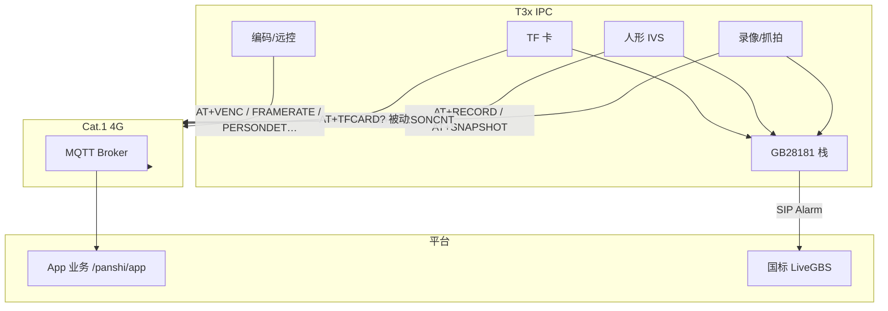
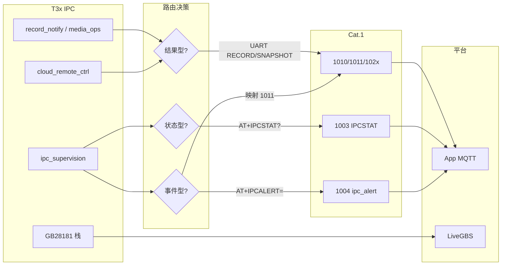

# T3x IPC 联网异常上报分析

> **工程**：780EHM_PJ（Cat.1）+ T3x IPC（`ipc_device_gb28181`）  
> **目的**：梳理 IPC 联网进程可能产生的异常，以及哪些已上报服务器、哪些仍仅本地日志。  
> **关联**：[MQTT_PROTOCOL.md](./MQTT_PROTOCOL.md) · [T3X_RECORD_MQTT_FLOW.md](./T3X_RECORD_MQTT_FLOW.md) · [MQTT_CLOUD_REMOTE_CTRL_FLOW.md](./MQTT_CLOUD_REMOTE_CTRL_FLOW.md) · **[T3X_IPC_EXCEPTION_MQTT_UPLINK.md](./T3X_IPC_EXCEPTION_MQTT_UPLINK.md)** · **[T3X_IPC_CAT1_SUPERVISION.md](./T3X_IPC_CAT1_SUPERVISION.md)**  
> **IPC 仓库关联**：`ipc_device_gb28181/docs/cat1_record_status_sync.md` · `docs/t3x_ipc_exception_mqtt_uplink.md`
> **更新**：2026-06-26 · **§4.3–§4.7 / §5–§6 已在 IPC + Cat.1 Lua 落地**（见 §9 源码索引）

---

## 1. 架构前提

IPC（T3x Linux）**不直连 MQTT**。联网上报走两条独立链路：

```text
IPC 异常/状态
  ├─ UART AT → Cat.1 → MQTT（/panshi/app/{IMEI}/…）
  └─ GB28181 SIP Notify → 国标平台（LiveGBS 等）
```


| 侧           | 解析 MQTT? | 写 TF 卡?    | 主动上报 MQTT?  |
| ----------- | -------- | ---------- | ----------- |
| **Cat.1**   | ✅        | ❌          | ✅           |
| **T3x IPC** | ❌        | ✅ MP4/JPEG | ❌（经串口通知 4G） |





**联调注意**：不能只看 MQTT 1010/1011 判断设备健康；GB28181 报警与 MQTT **并行、不可互替**。

### 1.1 异常分析流程（联调 / 产品）

排查 IPC 联网异常时，按 **「现象 → 分类 → 通道 → 平台字段」** 四步走，避免只盯一条链路：

```text
1. 现象采集
   ├─ T3x 本地日志（CAT1 / HOST / PIR_SYNC / NET）
   ├─ Cat.1 MQTT 上行（1003/1004/1010/1011/102x）
   └─ GB28181 alarm/list（与 MQTT 对照）

2. 异常分类（见 §4 优先级表）
   ├─ 结果型：录像/抓拍成功或失败 → reason
   ├─ 状态型：IPC 是否就绪、SIP、TF、校时、人形 IVS
   ├─ 事件型：UART/挂载/dispatch/恢复失败等
   └─ 预期行为：rest 低功耗、gb28181 关闭

3. 上报通道选型（见 §5）
   └─ 选错通道会导致「平台无感知」或「重复上报」

4. 平台侧核对
   ├─ 1011 reason 与 T3x TF 卡文件 / 日志是否一致
   ├─ 1003 IPCSTAT 与 AT+RECORD? / AT+IPCSTAT? 是否一致
   ├─ GB28181 离线时 1003.gb28181Online 是否镜像为 0
   └─ **恢复态**：异常后是否在下一条 **1003** 中字段回正（见 [T3X_IPC_EXCEPTION_MQTT_UPLINK.md §5](./T3X_IPC_EXCEPTION_MQTT_UPLINK.md)）
```



**§4.3 状态漂移专项流程**（4G `recording=1` 与 T3x 不一致）：

```text
T3x 停录/通知失败
  → IPC：IPCALERT / AT+RECORD=0 / 重试
  → 4G：publishIpcAlert → syncStopFromT3x + 1011
  → 周期：1003 后 reconcileHostRecordSession（AT+RECORD?）
  → 仍不一致：查 uart_notify_fail / dispatch_failed 事件
```

---

## 2. IPC 联网态核心职责


| 模块           | 职责                                         | 与服务器关系                                  |
| ------------ | ------------------------------------------ | --------------------------------------- |
| **Cat.1 协作** | GPIO 唤醒、读 `HOSTEVT?`/`PIRSTAT?`、应答 Host AT | 4G 代发 MQTT                              |
| **PIR/事件录像** | TF 卡写 MP4、抓拍 JPEG                          | `AT+RECORD` / `AT+SNAPSHOT` → 1010/1011 |
| **GB28181**  | SIP 注册、直播、报警 Notify、录像索引                   | SIP Alarm 直连平台                          |
| **全天录像**     | 后台持续录 + 与人形/PIR 协同                         | 失败多走本地日志                                |
| **人形检测**     | IVS 分析、defer 开录、PIR 互补                     | GB 报警 + `AT+PERSONCNT`                  |
| **远程控制**     | 帧率/编码/录像/人形（UART AT）                       | 4G 转 1024–1027                          |
| **TF 卡**     | 启动挂载/格式化/容量查询                              | 被动 `AT+TFCARD?` → 1007                  |
| **校时**       | Cat.1 `AT+TIME?` / `AT+TIMESET=`           | 失败常体现为录像 `reason`                       |
| **网络**       | 4G USB 网卡、链路监控                             | 基本无 MQTT 镜像                             |
| **电源**       | HOSTIDLE 休眠、优雅关机                           | rest 下整条业务链暂停                           |


---

## 3. 已上报服务器的异常（现状）

### 3.1 UART → Cat.1 → MQTT

#### 3.1.1 录像 / 抓拍（最成熟）


| IPC 侧事件       | 上报方式                                  | 云侧可见                                       |
| ------------- | ------------------------------------- | ------------------------------------------ |
| 首个 I 帧写盘成功    | `AT+RECORD=1`                         | **1010** `t3x_active` / **1012**           |
| 正常停录          | `AT+RECORD=0,reason=done`             | **1011** `source=t3x`                      |
| 校时无效无法开录      | `reason=time_sync`                    | **1011**                                   |
| channel 未初始化  | `reason=not_inited`                   | **1011**                                   |
| 未编译录像模块       | `reason=no_record`                    | **1011**                                   |
| 磁盘满           | `reason=disk_full`                    | **1011**                                   |
| 无法建文件         | `reason=open_failed`                  | **1011**                                   |
| 等 I 帧超时       | `reason=no_iframe`                    | **1011**                                   |
| 无码流           | `reason=no_stream`                    | **1011**                                   |
| 其它录线程失败       | `reason=failed`                       | **1011**                                   |
| 二次 PIR 停录     | `reason=pir_retrigger`                | **1011**                                   |
| 全天录等人形        | `reason=allday_wait_person`           | **1011**（语义易被误解为「录失败」）                     |
| 平台/本地停录       | `reason=cloud` / `manual` / `timer` 等 | **1011**（`source=4g` 或 `t3x`）              |
| 抓拍成功          | `AT+SNAPSHOT=<path>`                  | **1010** `snapshot_saved` + `snapshotPath` |
| PIR 实机 action | `AT+PIRMEDIA=<action>`                | 校正 **1010** 的 `action`                     |
| 人形计数上升沿       | `AT+PERSONCNT=N`                      | MQTT `personCount`（4G 侧）                   |
| 设备标识          | `AT+MQTTPUB`（devinfo）                 | `device/uplink`：`imei,gb28181_id`          |


`**AT+RECORD=0` reason 与 MP4 库映射**（`mp4_rec.c` → `record_notify.c`）：


| reason        | 条件         |
| ------------- | ---------- |
| `disk_full`   | 写盘返回 -2    |
| `time_sync`   | 校时无效 -4    |
| `open_failed` | 建文件失败 -3   |
| `no_iframe`   | 等 I 帧超时 -5 |
| `no_stream`   | 其它负返回值     |


#### 3.1.2 被动查询（平台主动下发才有应答）


| 查询            | IPC 应答 AT                           | MQTT 下行→上行                |
| ------------- | ----------------------------------- | ------------------------- |
| TF 卡          | `AT+TFCARD?`                        | 2007 → **1007**           |
| 视频/音频编码       | `AT+VENC?` / `AT+AUDIO?`            | 2020 → **1020**           |
| 设置编码          | `AT+VENCSET` / `AT+AUDIOSET`        | 2021 → **1021**           |
| 帧率            | `AT+FRAMERATE?` / `AT+FRAMERATE=`   | 2024/2025 → **1024/1025** |
| 人形开关          | `AT+PERSONDET?` / `AT+PERSONDET=`   | 2026/2027 → **1026/1027** |
| 录像时长档位        | `AT+RECORDTIME?` / `AT+RECORDTIME=` | 2022/2023 → **1022/1023** |
| 直连开停录（T3x 在线） | `AT+RECORDCTRL=1/0`                 | 2012/2011 成功后 4G 主动发      |


Host AT 失败时 4G 收到 `ERROR` / `+VENCSET:ERROR` / `+RECORDCTRL:ERROR` 等；是否转 MQTT **1004** 取决于 4G `net_mqtt.lua` 实现。

### 3.2 GB28181 SIP 报警（不经 MQTT）


| 报警       | Method / Type      | 触发                                                 |
| -------- | ------------------ | -------------------------------------------------- |
| PIR 移动侦测 | 5 / Motion         | `media_ops.c` → `gb28181_pir_alarm_report`         |
| 人形检测     | 5 / Motion         | IVS 会话内 0→>0                                       |
| PIR 无人确认 | 5 / Motion         | defer 宽限到期无人                                       |
| **磁盘满**  | **2 / Disk Full**  | `disk_manage.c` → `gb28181_alarm_disk_full_report` |
| **视频丢失** | **2 / Video Loss** | 编码通道异常                                             |
| 未注册时报警   | pending 队列         | SIP 注册成功后 `gb28181_alarm_flush_pending`            |


平台侧：`alarm/list`（LiveGBS）；与 MQTT **1010** 并行。

### 3.3 已知「故意不上报」项


| 场景                     | 行为                                     | 影响                                                |
| ---------------------- | -------------------------------------- | ------------------------------------------------- |
| `**no_person`**        | 仍**跳过** `AT+RECORD=0`；改 `IPCALERT no_person` → 4G 1011 + 清会话（§4.3） | 已修复 4G/T3x 漂移 |
| **rest 低功耗**           | PIR/GB/MQTT 业务暂停                       | 预期，非故障                                            |
| `**gb28181:enable=0`** | 不报 GB 报警                               | 配置关闭                                              |


代码锚点（`no_person` → IPCALERT）：

```c
/* record_notify.c — no_person 改 IPCALERT，4G 侧 syncStopFromT3x + 1011 */
if (strcmp(g_last_reason, "no_person") == 0) {
    (void)ipc_supervision_alert(client, IPC_ALERT_NO_PERSON, NULL);
    return 0;
}
```

---

## 4. 可能需要上报、目前弱/无上报的异常

按类别与建议优先级（P0 最高）归纳。**本节为产品/平台建议，非当前实现承诺。**

### 4.1 存储 / TF 卡


| 优先级 | 异常              | 本地表现                              | 现状缺口                       | 建议上报形态                            |
| --- | --------------- | --------------------------------- | -------------------------- | --------------------------------- |
| P0  | TF bootstrap 失败 | `[MAIN] TF card bootstrap failed` | **已实现** `tf_mount_fail` pending + flush → **1004** | 平台仍宜周期 **1007** 对照 |
| P0  | 挂载/格式化/mkfs 失败  | `[TF] mount/mkfs failed`          | 启动阶段同上；**运行期拔卡**仍靠 1011 `not_inited` | 运行期可增 `tf_mount_fail` 周期检测（未做） |
| P1  | 抓拍失败            | `jpeg snapshot failed`            | **已实现** `snapshot_failed` IPCALERT + 1011 | — |
| P1  | 磁盘空间预警          | 未写满但低于阈值                          | 仅写满时 GB + 1011             | 1007 扩展 `freeMb` 阈值               |
| P2  | 全天录恢复失败         | `resume ALL_DAY failed`           | 纯本地                        | event 告警                          |


### 4.2 媒体 / 编码 / 录像


| 优先级 | 异常                         | 现状                                 | 建议                                |
| --- | -------------------------- | ---------------------------------- | --------------------------------- |
| P0  | `both` 路径拍照失败              | 无 RECORD/SNAPSHOT                  | 明确失败 reason                       |
| P1  | defer 开录失败                 | `deferred record start failed` 仅日志 | `AT+RECORD=0,reason=defer_failed` |
| P1  | 远程改码率/帧率：ini 已写但运行时 set 失败 | UART 可能仍 OK                        | 1025/1021 带 `runtimeApply=0`      |
| P2  | 无 MP4/JPEG 自动上云            | 产品级缺口                              | 平台「有事件无文件」需另行拉取                   |


### 4.3 Cat.1 串口协作（状态漂移风险）— **已修复**


| 优先级 | 异常                                 | 修复措施 |
| --- | ---------------------------------- | -------- |
| P0  | `AT+RECORD/SNAPSHOT/PIRMEDIA` 发送失败 | IPC `ipc_supervision_uart` 3 次重试；失败 `IPCALERT uart_notify_fail`；**待发队列** + runtime flush |
| P0  | `no_person` 不发 RECORD=0            | IPC `IPCALERT no_person` → 4G `publishIpcAlert` 清会话 + 1011 |
| P1  | HOSTEVT/PIRSTAT 读失败                | `media_ops` 3 次重试；仍失败 `hostevt_read_fail` |
| P1  | media_dispatch 失败 pending 未清       | `ipc_supervision_dispatch` 2 次重试 + `dispatch_failed`；pending 保留供下次唤醒 |
| P1  | Cat.1 模块 init 失败                   | `IPCSTAT` 扩展 `cat1Link`；Cat.1 未运行时 **1003** `ipcReady=0` |
| P2  | runtime worker / wait wakeup 失败    | `runtime_wakeup_fail` IPCALERT + worker 退出告警 |


### 4.4 校时 — **已修复**


| 优先级 | 异常                | 修复措施 |
| --- | ----------------- | -------- |
| P1  | `AT+TIME?` 无效     | `client_sync_time_from_cat1` → `IPCALERT time_invalid` |
| P1  | `settimeofday` 失败 | `TIMESET` / `time_sync_apply` 失败 → `IPCALERT time_sync_fail` |
| P1  | 抓拍因未校时被 block     | 已有 `IPCALERT snapshot_failed,time_sync`；1011 可经 alert 映射 |
| P2  | NTP 失败（若启用）       | **1003** `timeSynced` 来自 `AT+IPCSTAT?`；与 Cat.1 SNTP 分离 |


### 4.5 GB28181 / 网络 — **已修复**


| 优先级 | 异常               | 修复措施 |
| --- | ---------------- | -------- |
| P1  | SIP 注册失败/丢失      | `network_module` → `IPCALERT gb28181_register_fail`；**1003** `gb28181Online` |
| P1  | 4G USB 网卡恢复失败    | T3x `AT+USBRECOVERY=EXHAUSTED` → 4G **1003** `usbRecovery*`；T3x 补 `IPCALERT usb_recovery_fail` |
| P2  | RTNL/DHCP 异常     | 仍本地 NET 日志；拉流失败时对照 **1003** `usbNetdev` / `gb28181Online` |
| P2  | TCP 通道 evt=1/2/3 | IPC 重建 SERVCREATE；4G 侧重连统计（未单独 event） |


### 4.6 人形检测 — **已修复**


| 优先级 | 异常                  | 修复措施 |
| --- | ------------------- | -------- |
| P1  | defer 宽限内始终无人       | `IPCALERT no_person` → 4G 1011 + `syncStopFromT3x`；GB Unconfirmed 仍并行 |
| P2  | `AT+PERSONCNT` 发送失败 | §4.3 UART 重试 + `uart_notify_fail` |
| P2  | IVS/模型加载失败          | **1003/1026** `personDetectAvailable=0`；`AT+PERSONDET?` 带 `available=` |


### 4.7 远程控制 — **已修复**


| 优先级 | 异常                  | 修复措施 |
| --- | ------------------- | -------- |
| P1  | RECORDCTRL 开录失败     | T3x `IPCALERT recordctrl_fail`；4G 2012 失败后 `publishIpcAlert` |
| P2  | 帧率/码率 ini 写成功运行时未生效 | **1025/1021** 增加 `runtimeApply`（`SetFramerate` / `SetVideoBitrate` 结果） |
| P2  | IPCPOWEROFF:BUSY    | T3x `IPCALERT ipcpoweroff_busy` → **1004** ipc_alert |
| P2  | WLED 1004 先 ack 后执行 | 仍为 gap；WLED 走 4G 本地状态 + UART 转发（未改 ack 时序） |


### 4.8 系统 / 电源


| 优先级 | 异常          | 现状               | 说明           |
| --- | ----------- | ---------------- | ------------ |
| —   | rest 低功耗    | 业务暂停             | **预期**       |
| P3  | IPC 崩溃/信号退出 | 本地停录             | 无远程 crash 上报 |
| P3  | 提示音播放失败     | audio_prompt ERR | 运维向          |


---

## 5. 上报通道选型建议（已实现映射）

> **MQTT 后台具体 JSON / Topic / 恢复行为** → 专文 [T3X_IPC_EXCEPTION_MQTT_UPLINK.md](./T3X_IPC_EXCEPTION_MQTT_UPLINK.md)

### 5.1 三类上报与恢复（摘要）

| 类型 | dataType | 后台含义 | 设备恢复后 |
| --- | --- | --- | --- |
| **状态型** | **1003** `/status` | 当前 IPC/链路健康快照 | **下一条 1003** 字段自动更新（周期 ≤30s 或 USB/电量触发） |
| **事件型** | **1004** `/event` `action=ipc_alert` | 刚发生一次的异常 | **无 cleared 报文**；用最新 1003 判当前是否正常 |
| **结果型** | **1010/1011** `/event` | 录像会话开始/结束及 reason | 1011 后会话结束；1003 `recordingT3x=0` |

**平台原则**：告警入库看 **1004**；**当前是否正常** 以 **最新 1003** 为准，勿等待「恢复事件」。


| 信息类型                    | 更合适通道                        | 原因             | 工程实现 |
| ----------------------- | ---------------------------- | -------------- | -------- |
| PIR/录像会话、TF 容量、远程配置结果   | **MQTT 1010/1011/1007/102x** | 与 panshi 协议一致  | `record_notify` / `net_mqtt` |
| 移动侦测、人形、磁盘满、视频丢失        | **GB28181 Alarm**            | 国标原生；与 MQTT 并行 | `media_ops` / `network_module` |
| IPC↔4G 链路、SIP 注册、USB 网卡 | **4G 1003 扩展** 或 **ipc_alert** | IPC 不持 MQTT 连接 | `AT+IPCSTAT?` → 1003；`AT+IPCALERT` → 1004 |
| TF 启动失败、dispatch/校时失败   | **1004 action=ipc_alert**       | 被动 1007 不够及时   | `ipc_cloud_report.c` |

**1003 IPCSTAT 字段（T3x → 4G → MQTT）**：

| 字段 | 含义 |
| --- | --- |
| `ipcReady` | T3x 生命周期 ready 且 Cat.1 链路正常 |
| `cat1Link` | Cat.1 runtime 已启动 |
| `gb28181Online` | SIP 已注册 |
| `tfPresent` | TF 已挂载 |
| `personDetectEnabled` | ini 人形开关 |
| `personDetectAvailable` | IVS 通道/线程已就绪 |
| `timeSynced` | 系统时间有效 |
| `recordingT3x` | 真实写盘 running/active |
| `usbRecovery*` | 4G 侧 USB 恢复（非 IPCSTAT，在 1003 主字段） |

**1004 ipc_alert 事件码（T3x → Cat.1）**：

`tf_mount_fail` · `uart_notify_fail` · `snapshot_failed` · `gb28181_register_fail` · `defer_record_failed` · `hostevt_read_fail` · `no_person` · `dispatch_failed` · `runtime_wakeup_fail` · `time_sync_fail` · `time_invalid` · `usb_recovery_fail` · `recordctrl_fail` · `ipcpoweroff_busy`

部分码映射 **1011**（`no_person` / `time_sync*` / `snapshot_failed` / `defer_record_failed` / `recordctrl_fail`）。


---

## 6. 平台侧异常模型（已实现）

统一三层：**结果型 / 状态型 / 事件型**（见 §5 通道表）。

### 6.1 结果型（1011 / 102x）

挂在 **1011 `reason`**、**102x `ret`/`message`/`runtimeApply`**。

示例：`disk_full`、`time_sync`、`no_iframe`、`not_inited`、`open_failed`、`no_stream`、`pir_retrigger`、`allday_wait_person`、`no_person`。

**1025/1021 扩展**：`runtimeApply=0` 表示 ini/配置已写但 `SetFramerate` / `SetVideoBitrate` 运行时未生效。

### 6.2 状态型（1003 / IPCSTAT）

| 字段 | 含义 |
| --- | --- |
| `ipcReady` | T3x 已上电且 runtime 正常（Cat.1 启用时含链路） |
| `cat1Link` | Cat.1 串口协作 runtime 已启动 |
| `gb28181Online` | SIP 已注册 |
| `tfPresent` | TF 已挂载 |
| `personDetectEnabled` | 人形开关（ini） |
| `personDetectAvailable` | IVS 运行时可用 |
| `timeSynced` | 系统时间有效 |
| `recordingT3x` | T3x 真实写盘 |

### 6.3 事件型（1004 ipc_alert）

T3x `AT+IPCALERT=code[,detail]` → Cat.1 `publishIpcAlert` → **1004** `action=ipc_alert`。

示例见 §5 事件码列表；部分码额外发 **1011** 并清 4G 录像会话。

---

## 7. PIR 录像端到端与异常落点

```text
PIR / 2012 开录
  → 4G: 1010 detected + GPIO 唤醒
  → IPC: AT+HOSTEVT? / AT+PIRSTAT? → media_ops
  → IPC: gb28181_pir_alarm_report（video/both）
  → IPC: record_start → MP4 线程
       ├─ 成功: AT+RECORD=1 → 1010 t3x_active
       └─ 失败: AT+RECORD=0,reason=* → 1011 source=t3x
  → 停录: AT+RECORD=0,done|timer|cloud|… → 1011
```


| 阶段               | 常见异常                                       | 当前是否上云                 |
| ---------------- | ------------------------------------------ | ---------------------- |
| 唤醒后读 HOSTEVT 失败  | 无法开录                                       | ✅ `hostevt_read_fail` + 重试 |
| 校时无效             | `time_sync`                                | ✅ 1011 / ipc_alert     |
| TF 无卡/满          | `not_inited` / `disk_full` / `open_failed` | ✅ 1011                 |
| 码流未就绪            | `no_iframe` / `no_stream`                  | ✅ 1011                 |
| 抓拍失败（photo/both） | 无文件                                        | ✅ `snapshot_failed`    |
| defer 无人         | `no_person`                                | ✅ IPCALERT + 1011      |
| UART 通知发送失败      | 4G 状态漂移                                    | ✅ §4.3 重试 + 对账       |
| RECORDCTRL 失败    | 平台以为在录                                    | ✅ `recordctrl_fail`    |
| GB28181 离线       | MQTT 仍显示在线                                 | ✅ 1003.gb28181Online   |


详见 [T3X_RECORD_MQTT_FLOW.md](./T3X_RECORD_MQTT_FLOW.md) · IPC 仓库 `docs/cat1_record_status_sync.md`。

---

## 8. 结论与优先级摘要

**已覆盖较好**：

- PIR/平台触发的 **事件录像失败**（`time_sync`、`disk_full`、`no_iframe` 等 → **1011**）
- **GB28181** 移动/人形/磁盘满/视频丢失 SIP 报警

**风险最大、建议产品优先定义**：

1. **抓拍/defer 失败** — 已 `IPCALERT`；平台需订阅 **1004 ipc_alert**
2. ~~**UART 通知失败 + `no_person`**~~ — §4.3 已修复
3. **TF bootstrap** — **已实现** `tf_mount_fail`；运行期拔卡仍靠 **1011**；平台宜周期 **1007**
4. ~~**GB28181 离线无 MQTT 镜像**~~ — **1003.gb28181Online** 已扩展
5. ~~**远程编码/帧率运行时未生效**~~ — **102x runtimeApply** 已扩展

当前工程已有 **`ipc_supervision` 统一 T3x→4G 事件出口**（`ipc_cloud_report.h` 仅为兼容别名）；联调应 **MQTT + GB28181 双链对照**。

---

## 9. 源码与文档索引


| 模块        | IPC 路径                                   | 说明                                         |
| --------- | ---------------------------------------- | ------------------------------------------ |
| 云异常出口     | `app/cat1/ipc_supervision.c`             | `IPCALERT` 队列 / `IPCSTAT` / pending flush |
| 契约          | `app/cat1/ipc_alert_contract.h`          | 14 个 alertCode |
| UART 重试     | `app/cat1/ipc_supervision_uart.c`      | 通知类 AT 3 次重试 |
| 分发重试      | `app/cat1/ipc_supervision_dispatch.c`    | wake / HOSTEVT dispatch |
| 录像通知      | `app/cat1/record_notify.c`               | `AT+RECORD` |
| 录像 reason | `app/cat1/cat1_module.c`                 | `ipc_rec_event_cb`                         |
| 唤醒分发      | `app/cat1/media_ops.c`                   | HOSTEVT/PIRSTAT → 开录/抓拍/GB 报警              |
| 人形 defer  | `app/cat1/person_detect_pir_sync.c`      | defer / no_person / IVS available          |
| 远程控制      | `app/cat1/cloud_remote_ctrl.c`           | FRAMERATE/RECORDCTRL/PERSONDET + runtimeApply |
| GB28181   | `app/network/network_module.c`           | 注册失败 alert + SIP 报警                      |
| USB 恢复    | `app/cat1/cat1_usb_reenum.c`             | EXHAUSTED → IPCALERT + 4G 1003             |
| Host AT   | `app/cat1/uart_host_cmd.c`               | IPCSTAT/TIMESET/IPCPOWEROFF                |
| MQTT 代发   | `docs/4g_lua/user/net_mqtt.lua`          | 1003/1004/1011/102x；`ipc_supervision.bind` |
| Cat.1 监督  | `docs/4g_lua/user/ipc_supervision.lua` | publishAlert / IPCSTAT 调度 |
| Cat.1 UART | `docs/4g_lua/user/host_uart.lua`       | IPCALERT/RECORD? 解析           |
| 电池 ADC   | `docs/4g_lua/user/vbat.lua` + `config.lua` | `mv_calibration` 板级校准 |


| 文档                                              | 内容                  |
| ----------------------------------------------- | ------------------- |
| IPC `docs/mqtt_downlink_uplink_gap_analysis.md` | MQTT 2002–2021 联调缺口 |
| IPC `docs/pir_video_alarm_flow_completeness.md` | PIR→GB→MQTT 闭环完备性   |
| IPC `docs/T3X_IPC_CAT1_COMM_COMPLETENESS.md`    | IPC↔4G 通讯完善度        |
| IPC `docs/usb_4g_recovery.md`                   | USB 恢复失败未告诉后台       |
| IPC `docs/person_detect_pir_defer_hardening.md` | no_person 与 defer   |


---

部分码映射 **1011**（`no_person` / `time_sync*` / `snapshot_failed` / `defer_record_failed` / `recordctrl_fail`）。

---

## 10. 相关文档

| 文档 | 内容 |
| --- | --- |
| [T3X_IPC_ALERT_CODE_INDEX.md](./T3X_IPC_ALERT_CODE_INDEX.md) | **alertCode 逐条源码行号速查表** |
| [T3X_IPC_CAT1_SUPERVISION.md](./T3X_IPC_CAT1_SUPERVISION.md) | **Cat.1↔IPC 联合监督：架构、流程、源码索引、完善度** |
| [T3X_IPC_EXCEPTION_MQTT_UPLINK.md](./T3X_IPC_EXCEPTION_MQTT_UPLINK.md) | **MQTT 后台上行协议、JSON 示例、异常全表、恢复态说明** |
| [MQTT_PROTOCOL.md](./MQTT_PROTOCOL.md) | 200x/100x 编号与 Topic 约定 |
| [T3X_RECORD_MQTT_FLOW.md](./T3X_RECORD_MQTT_FLOW.md) | 1010/1011 录像会话时序 |
| [UART_AT_COMMANDS.md](./UART_AT_COMMANDS.md) | IPCSTAT / IPCALERT / RECORD? AT 格式 |

---

*IPC 仓库镜像：`docs/t3x_ipc_cloud_exception_report.md` · `docs/t3x_ipc_exception_mqtt_uplink.md` · `docs/t3x_ipc_cat1_supervision.md` · `docs/t3x_ipc_alert_code_index.md`*