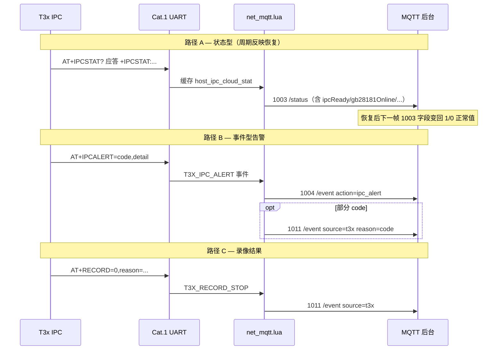

# T3x IPC 异常 → MQTT 后台上行协议与恢复态说明

> **读者**：MQTT 后台 / App 服务端 / 联调  
> **工程**：780EHM_PJ（Cat.1 Lua）+ T3x IPC（`ipc_device_gb28181`）  
> **关联**：[MQTT_PROTOCOL.md](./MQTT_PROTOCOL.md) · [T3X_IPC_CLOUD_EXCEPTION_REPORT.md](./T3X_IPC_CLOUD_EXCEPTION_REPORT.md) · [T3X_RECORD_MQTT_FLOW.md](./T3X_RECORD_MQTT_FLOW.md)  
> **更新**：2026-06-26

---

## 1. 总览：后台会收到什么

T3x **不直连 MQTT**。所有 App 侧可见上行均由 **Cat.1** 发布。

| 项目 | 约定 |
| --- | --- |
| **下行 Topic** | `/panshi/device/{deviceNo}/`（`deviceNo` = Cat.1 IMEI） |
| **上行 Topic** | `/panshi/app/{deviceNo}/` + **后缀**（见下表） |
| **JSON 外壳** | `{"deviceNo":"…","dataType":"100x",…,"time":"YYYY-MM-DD HH:MM:SS"}` |
| **后台 Subscribe 建议** | `/panshi/app/{deviceNo}/#`（或分后缀订阅） |

### 1.1 异常相关上行 dataType 一览

| dataType | Topic 后缀 | 类型 | 含义 |
| --- | --- | --- | --- |
| **1003** | `status` | **状态型** | 周期/事件触发的设备 + IPC 健康快照 |
| **1004** | `event` | **事件型** | 控制应答（`reply=1`）或 IPC 告警（`action=ipc_alert`） |
| **1010** | `event` | **结果型** | PIR 触发 / 抓拍 / T3x 开录活跃 |
| **1011** | `event` | **结果型** | 录像停止（含失败 reason） |
| **1007** | `tfcard` | **查询应答** | TF 卡容量（2007 触发或内部刷新） |
| **1020–1027** | `encode` / `framerate` / `personDetect` / … | **配置应答** | 远程编码/帧率/人形等（200x 触发） |

> **GB28181 SIP 报警**（移动/人形/磁盘满/视频丢失）走国标平台，**不经**上述 MQTT Topic。与 MQTT **并行**，后台需双链对照。

### 1.2 三类上报与后台用法

```text
┌─────────────────────────────────────────────────────────────────┐
│ 状态型 1003  →  表示「当前是否正常」；恢复后字段会随下一条 1003 更新 │
│ 事件型 1004  →  表示「刚发生过一次异常」；无单独 cleared 报文      │
│ 结果型 1011  →  表示「本次录像会话结束及原因」；会话态随之收敛      │
└─────────────────────────────────────────────────────────────────┘
```

**平台对接原则**：

1. **当前健康态**：以 **最新一条 1003** 中的 IPC 扩展字段为准（`ipcReady`、`gb28181Online`、`timeSynced` 等）。
2. **历史异常**：**1004 `ipc_alert`** 为时点事件，应入库/告警；**不会**再发 `alert_cleared`。
3. **录像会话**：以 **1010/1011** + 1003 的 `recordingT3x` 联合判断；1011 后 4G 侧 `session.recording` 会清掉。

---

## 2. 端到端链路



```text
IPC 异常
  ├─ AT+RECORD / AT+SNAPSHOT / AT+PIRMEDIA / AT+PERSONCNT  → 1010/1011（结果型）
  ├─ AT+IPCALERT=…                                          → 1004 ipc_alert（+ 可选 1011）
  ├─ AT+IPCSTAT?（4G 周期拉取）                               → 并入下一条 1003（状态型）
  ├─ AT+USBRECOVERY=EXHAUSTED                               → 1003 usbRecovery*（+ 可选 IPCALERT）
  └─ GB28181 SIP Notify                                     → LiveGBS（非 MQTT）
```

---

## 3. 协议载荷详解

### 3.1 1003 状态（`/panshi/app/{imei}/status`）

**触发时机**：

- MQTT 连接成功（常电 **1001** 或 rest **1002+1003**）
- 周期定时（默认 **30s**，可 2003 改 `interval`）
- 电量/USB 变化（≥30s 防抖）
- USB 恢复状态变化（`mqtt_usb_recovery_changed` → **立即 1003**）
- 2003 带 `interval` / `usbRecoveryReset` 等配置应答

**与 IPC 异常相关的扩展字段**（来自 T3x `AT+IPCSTAT?`，1003 发布后异步刷新）：

| 字段 | 类型 | 含义 | 异常时典型值 | 恢复后 |
| --- | --- | --- | --- | --- |
| `ipcReady` | 0/1 | T3x 生命周期 ready 且 Cat.1 链路可用 | `0`（未就绪/Cat.1 init 失败） | `1` |
| `cat1Link` | 0/1 | Cat.1 runtime 已启动 | `0` | `1` |
| `gb28181Online` | 0/1 | SIP 已注册 | `0`（注册失败/丢失） | `1` |
| `tfPresent` | 0/1 | TF 已挂载 | `0` | `1` |
| `personDetectEnabled` | 0/1 | ini 人形开关 | 配置值 | 配置值 |
| `personDetectAvailable` | 0/1 | IVS 运行时可用 | `0`（模型/通道未起） | `1` |
| `timeSynced` | 0/1 | 系统时间有效 | `0` | `1` |
| `recordingT3x` | 0/1 | T3x 真实写盘 | `0`/`1` | 随录会话变化 |
| `usbRecovery` | string | USB RNDIS 恢复状态 | `exhausted` / `idle` / `ok` | `ok` 或 `idle` |
| `usbRecoveryCount` | int | 本轮 AT+USBRESET 次数 | `3` 等 | 复位后 `0` |
| `usbRecoveryLastErr` | string | 最近失败原因 | `netdev_missing` 等 | `""` |

**示例（节选）**：

```json
{
  "deviceNo": "862323084068124",
  "dataType": "1003",
  "usbInserted": 1,
  "charging": 0,
  "remainPower": "85",
  "lowPowerMode": "normal",
  "interval": 30,
  "usbLogical": 1,
  "usbNetdev": 1,
  "usbRecovery": "idle",
  "usbRecoveryCount": 0,
  "usbRecoveryLastErr": "",
  "ipcReady": 1,
  "gb28181Online": 1,
  "tfPresent": 1,
  "personDetectEnabled": 1,
  "personDetectAvailable": 1,
  "timeSynced": 1,
  "recordingT3x": 0,
  "cat1Link": 1,
  "time": "2026-06-26 14:30:00"
}
```

**恢复态**：上述字段**无单独「恢复报文」**；设备恢复正常后，**下一条 1003**（周期 ≤30s 或 USB/电量触发）会自动携带更新后的 `0/1` 与 `usbRecovery`。

---

### 3.2 1004 IPC 告警（`/panshi/app/{imei}/event`）

T3x `AT+IPCALERT=<alertCode>[,detail]` → Cat.1 `publishIpcAlert`。

**载荷形态**（与 OTA/控制 reply 共用 dataType，靠字段区分）：

```json
{
  "deviceNo": "862323084068124",
  "dataType": "1004",
  "reply": 0,
  "action": "ipc_alert",
  "alertCode": "uart_notify_fail",
  "alertDetail": "record",
  "ret": 0,
  "message": "ok",
  "time": "2026-06-26 14:30:01"
}
```

| 字段 | 说明 |
| --- | --- |
| `reply` | **固定 0**（与 2004 控制应答 `reply=1` 区分） |
| `action` | **固定 `ipc_alert`** |
| `alertCode` | 事件码（见 §4 全表） |
| `alertDetail` | 可选细节（如 `record` / `exhausted` / `register_lost`） |

**同次可能追加 1011**（`source=t3x`，`reason=alertCode`）的 alertCode：

`no_person` · `snapshot_failed` · `defer_record_failed` · `time_sync` · `time_sync_fail` · `recordctrl_fail`

**仅 1004、不映射 1011** 的码：`uart_notify_fail` · `hostevt_read_fail` · `dispatch_failed` · `gb28181_register_fail` · `tf_mount_fail` · `usb_recovery_fail` · `runtime_wakeup_fail` · `time_invalid` · `ipcpoweroff_busy` · `encode_runtime_fail`（4G 侧本地产生）

**恢复态**：**不会**发送 `ipc_alert_cleared`。平台应：

- 告警入库后，用 **后续 1003** 判断链路是否恢复；
- 对录像类异常，以 **1011** 确认会话已结束。

---

### 3.3 1010 / 1011 录像结果（`/panshi/app/{imei}/event`）

#### 1010 — PIR / 开录活跃

```json
{
  "dataType": "1010",
  "pirStatus": "detected",
  "action": "video",
  "uploadMode": "auto",
  "quality": "high"
}
```

或 T3x 写盘后：`pirStatus=t3x_active` 等（见 [T3X_RECORD_MQTT_FLOW.md](./T3X_RECORD_MQTT_FLOW.md)）。

#### 1011 — 停录 / 失败

```json
{
  "dataType": "1011",
  "reason": "disk_full",
  "source": "t3x",
  "uploadMode": "auto",
  "quality": "high"
}
```

| reason（节选） | 来源 | 后台含义 |
| --- | --- | --- |
| `time_sync` / `time_sync_fail` | T3x 开录/校时 | 未校时无法录 |
| `disk_full` / `open_failed` / `no_iframe` / `no_stream` | MP4 写盘 | 录失败 |
| `no_person` | 人形 defer 超时 | 无人不开录/停录 |
| `snapshot_failed` | 抓拍失败 | 无 JPEG |
| `defer_record_failed` | defer 开录失败 | 等人形后仍失败 |
| `recordctrl_fail` | 2012 RECORDCTRL | 平台直连开录失败 |
| `done` / `timer` / `cloud` / `pir_retrigger` | 正常停录 | 会话结束 |

**恢复态**：1011 表示**会话已结束**；下一条 **1003** 中 `recordingT3x=0`；4G `session.recording=false`。新 PIR/2012 会重新发 1010。

---

### 3.4 102x 远程配置应答

#### 1025 帧率设置（`/panshi/app/{imei}/framerate`）

```json
{
  "dataType": "1025",
  "reply": 1,
  "messageId": "…",
  "ret": 0,
  "message": "ok",
  "runtimeApply": 1,
  "body": { "camera": 0, "stream": 0, "framerate": 15 }
}
```

| 字段 | 含义 |
| --- | --- |
| `ret` | 0 成功；-1 失败 |
| `runtimeApply` | **1**=T3x `SetFramerate` 成功；**0**=ini 已写但运行时未生效 |
| 附加 | `runtimeApply=0` 时可能再发 **1004** `encode_runtime_fail`（4G 本地） |

#### 1021 编码设置（`/panshi/app/{imei}/encode`）

同上，含 `needReboot`、`runtimeApply`（热更新码率时反映 `SetVideoBitrate`）。

#### 1026 人形查询（`/panshi/app/{imei}/personDetect`）

```json
{
  "dataType": "1026",
  "reply": 1,
  "ret": 0,
  "enable": 1,
  "personDetectAvailable": 1
}
```

**恢复态**：102x 为**请求-应答**，不周期推送；IVS 恢复后需平台再发 **2026** 查询，或看 **1003.personDetectAvailable**。

---

## 4. 异常场景 → MQTT 上行映射（全表）

| § | 场景 | T3x 侧触发 | MQTT 后台收到 | Topic 后缀 | 恢复后链路如何更新 |
| --- | --- | --- | --- | --- | --- |
| 4.1 | TF 挂载失败 | 启动 bootstrap → pending flush | **1004** `tf_mount_fail` | `event` | **1003** `tfPresent=1`；**1007** 被动查询 |
| 4.2 | 抓拍/both 失败 | media_ops / cat1_module | **1004** `snapshot_failed` + **1011** | `event` | 下次 PIR 成功 → **1010** `snapshot_saved` |
| 4.2 | defer 开录失败 | person_detect / media_ops | **1004** `defer_record_failed` + **1011** | `event` | 下次有人形 → **1010** + **1011** done |
| 4.2 | 帧率/码率运行时失败 | `SetFramerate`/`SetVideoBitrate` fail | **1025/1021** `runtimeApply=0`；可选 **1004** `encode_runtime_fail` | `framerate`/`encode` | 修复后重发 2025/2021 → `runtimeApply=1` |
| 4.3 | UART RECORD 通知失败 | record_notify 重试后 | **1004** `uart_notify_fail` | `event` | **1003** 周期对账 + **1011** sync；`recordingT3x` 对齐 |
| 4.3 | no_person | IPCALERT | **1004** `no_person` + **1011** | `event` | 新 PIR 会话 → **1010** |
| 4.3 | HOSTEVT/dispatch 失败 | media_ops / runtime | **1004** `hostevt_read_fail` / `dispatch_failed` | `event` | 下次唤醒成功开录 → **1010**；**1003** `ipcReady=1` |
| 4.3 | Cat.1 init 失败 | runtime 未起 | （无 IPCALERT） | — | **1003** `ipcReady=0` `cat1Link=0` → 恢复后变 **1** |
| 4.3 | runtime worker 异常 | wait wakeup fail | **1004** `runtime_wakeup_fail` | `event` | Cat.1/T3x 重启后 **1003** `cat1Link=1` |
| 4.4 | Cat.1 TIME 无效 | `client_sync_time_from_cat1` | **1004** `time_invalid` | `event` | Cat.1 校时成功后 **1003** `timeSynced=1` |
| 4.4 | settimeofday 失败 | TIMESET / sync | **1004** `time_sync_fail` | `event` | 同上 |
| 4.4 | 未校时 block 开录 | MP4 -4 | **1011** `reason=time_sync` 或 IPCALERT | `event` | 校时成功后开录 → **1010** |
| 4.5 | GB28181 注册失败/丢失 | network_module | **1004** `gb28181_register_fail` | `event` | 重注册后 **1003** `gb28181Online=1`；SIP 报警恢复 |
| 4.5 | USB 恢复 exhausted | cat1_usb_reenum | **1004** `usb_recovery_fail` + **1003** `usbRecovery=exhausted` | `event`/`status` | 网卡恢复 → **1003** `usbRecovery=ok`；2003 `usbRecoveryReset` → count 清零 |
| 4.6 | defer 无人 | IPCALERT no_person | **1004** + **1011** | `event` | 同 4.3 no_person |
| 4.6 | PERSONCNT UART 失败 | record_notify | **1004** `uart_notify_fail` detail=personcnt | `event` | 下次上升沿仍尝试上报 |
| 4.6 | IVS 未就绪 | 启动失败 | （无单独 alert） | — | **1003/1026** `personDetectAvailable=0` → **1** |
| 4.7 | RECORDCTRL 开录失败 | cloud_remote_ctrl | **1004** `recordctrl_fail` + **1011**；2012 路径 4G 也会发 | `event` | 条件满足后 2012 成功 → **1012**+**1010** |
| 4.7 | IPCPOWEROFF BUSY | uart_host_cmd | **1004** `ipcpoweroff_busy` | `event` | 关机流程完成后 **1002/1003** 低功耗态 |

---

## 5. 恢复态：整条链路会不会更新？

### 5.1 会随设备恢复自动更新的

| 机制 | 更新什么 | 延迟 |
| --- | --- | --- |
| **1003 周期上报** | `ipcReady` · `cat1Link` · `gb28181Online` · `tfPresent` · `timeSynced` · `personDetectAvailable` · `recordingT3x` | ≤ `interval`（默认 30s） |
| **1003 发布后** | 异步 `AT+IPCSTAT?` 刷新缓存（下一条 1003 更准确） | 同周期内 |
| **USB 状态变化** | 立即 **1003**（`usbRecovery*`） | 即时 |
| **1011 / syncStopFromT3x** | 4G 录像会话 `recording=false` | IPCALERT/RECORD=0 后即时 |
| **reconcileHostRecordSession** | 1003 后若 4G 仍在录但 T3x 已停 → 补 **1011** | 每帧 1003 后 task |
| **GB28181 重注册** | **1003.gb28181Online=1**（非 MQTT 侧 SIP 自行恢复） | 下一帧 1003 |

### 5.2 不会自动「撤销」的

| 类型 | 说明 | 平台建议 |
| --- | --- | --- |
| **1004 ipc_alert** | 仅上报发生时刻，**无 cleared 报文** | 告警表 + 用最新 1003 判当前态 |
| **1011** | 历史停录记录，不会发「撤销 1011」 | 按 reason 归档即可 |
| **102x 某次 ret=-1** | 仅该次应答失败 | 重试下行或读 1003/再查询 |

### 5.3 恢复判定推荐逻辑（伪代码）

```text
on MQTT message:
  if dataType == "1004" and action == "ipc_alert":
      insert_alert(deviceNo, alertCode, alertDetail, time)   // 时点事件

  if dataType == "1003":
      update_device_snapshot(deviceNo, {
        ipcReady, cat1Link, gb28181Online, tfPresent,
        timeSynced, personDetectAvailable, recordingT3x,
        usbRecovery, usbRecoveryCount, ...
      })
      // 若此前有未恢复告警，可在此按字段自动 close：
      if ipcReady==1 and cat1Link==1: clear_alert_class("link")
      if gb28181Online==1: clear_alert_class("gb28181")
      if timeSynced==1: clear_alert_class("time")
      if usbRecovery in ("idle","ok"): clear_alert_class("usb")

  if dataType == "1011":
      end_recording_session(deviceNo, reason, source)
```

---

## 6. 后台 Subscribe 与联调清单

### 6.1 建议订阅

```text
/panshi/app/{imei}/#          # 全量（推荐联调）
/panshi/app/{imei}/status     # 1003 健康态 + 恢复
/panshi/app/{imei}/event      # 1004 / 1010 / 1011
/panshi/app/{imei}/framerate  # 1024/1025
/panshi/app/{imei}/encode     # 1020/1021
/panshi/app/{imei}/personDetect  # 1026/1027
/panshi/app/{imei}/tfcard     # 1007
```

### 6.2 联调步骤（异常 → 恢复）

1. 制造异常（如拔 TF、断 SIP、未校时开录、USB mismatch 耗尽）。
2. 确认收到 **1004** 和/或 **1011**（见 §4 表）。
3. 修复环境（插卡、恢复网络、Cat.1 校时、USB 恢复）。
4. **等待 ≤1 个 1003 周期**，确认字段恢复（§3.1 表「恢复后」列）。
5. 可选：下发 **2003** 立即拉一条 **1003**；**2007** 拉 **1007**；**2026** 拉人形可用性。

---

## 7. 源码索引

| 环节 | 路径 |
| --- | --- |
| T3x 告警/状态 | `ipc_device_gb28181/app/cat1/ipc_cloud_report.c` |
| T3x → UART 通知 | `record_notify.c` · `cloud_remote_ctrl.c` · `network_module.c` |
| Cat.1 MQTT 发布 | `/mnt/share/user/net_mqtt.lua`（镜像 `docs/4g_lua/user/`） |
| Cat.1 UART 解析 | `/mnt/share/user/host_uart.lua` |
| 异常分类总表 | [T3X_IPC_CLOUD_EXCEPTION_REPORT.md](./T3X_IPC_CLOUD_EXCEPTION_REPORT.md) |

---

*IPC 仓库镜像：`ipc_device_gb28181/docs/t3x_ipc_exception_mqtt_uplink.md`*
