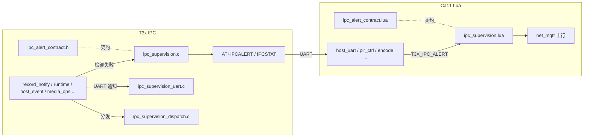

# T3x IPC ↔ Cat.1 监督模块架构

> **原则**：IPC 与 Cat.1 **两侧独立实现**，通过 **共享契约**（头文件 + Lua 镜像 + 本文档）对齐行为。  
> **真源路径**：IPC 仓库 `app/cat1/`；Cat.1 `user/`；契约文档 `doc/T3X_IPC_ALERT_CONTRACT.md`。

---

## 1. 设计目标

| 目标 | 说明 |
|------|------|
| 两侧对称 | IPC `ipc_supervision.*` ↔ Cat.1 `ipc_supervision.lua` |
| 职责清晰 | **检测**留在业务模块；**上报 / 重试 / 对账 / MQTT 策略**收拢到监督模块 |
| 契约单一真源 | `ipc_alert_contract.h`（C）↔ `ipc_alert_contract.lua`（镜像） |
| 可演进 | `ipc_cloud_report.h` 保留为兼容宏，新代码用 `ipc_supervision.h` |

---

## 2. 模块边界



### 2.1 IPC 侧文件

| 文件 | 职责 |
|------|------|
| `ipc_alert_contract.h` | 14 个 `IPC_ALERT_*` 字符串常量（契约真源） |
| `ipc_supervision.h` / `.c` | `ipc_supervision_alert()`、`build_stat()`、TF pending flush |
| `ipc_supervision_uart.h` / `.c` | UART 通知类 AT 3 次重试 |
| `ipc_supervision_dispatch.h` / `.c` | `media_dispatch` / `host_event_dispatch_once` 带重试 + alert |
| `ipc_cloud_report.h` | **兼容层**（宏别名，勿新增逻辑） |

**仍留在业务模块的检测**（仅调用监督 API）：

- `record_notify.c` — RECORD/SNAPSHOT/PIRMEDIA/PERSONCNT
- `runtime.c` — GPIO 唤醒后 media 分发
- `host_event.c` — 休眠轮询 HOSTEVT 分发（`host_event_dispatch_once` 导出单次逻辑）
- `media_ops.c`、`person_detect_pir_sync.c`、`cloud_remote_ctrl.c` 等 — 各自场景 `ipc_supervision_alert`

### 2.2 Cat.1 侧文件

| 文件 | 职责 |
|------|------|
| `ipc_alert_contract.lua` | alertCode 表 + `map1011` / `reconcile` 策略 |
| `ipc_supervision.lua` | `publishAlert`、`onAlert`、`ipcCloudStatFields`、对账/刷新调度 |
| `net_mqtt.lua` | MQTT 传输；`bind()` 注入上行依赖；`publishIpcAlert` 薄封装 |
| `app.lua` | `E.T3X_IPC_ALERT` → `ipc_supervision.onAlert()` |
| `host_uart.lua` | UART 解析 `AT+IPCALERT`，发布 `T3X_IPC_ALERT` 事件（传输层） |

---

## 3. 共享契约

完整码表与策略见 **[T3X_IPC_ALERT_CONTRACT.md](T3X_IPC_ALERT_CONTRACT.md)**。

同步规则：

1. 新增/修改 alertCode 时，**先改** `ipc_alert_contract.h`，再改 `ipc_alert_contract.lua`
2. Cat.1 独有码（如 `encode_runtime_fail`）只写在 `CAT1_ONLY` 段
3. `map1011` / `reconcile` 仅 Cat.1 侧实现，但须在契约 Lua 中声明以便联调对照

---

## 4. 端到端流程

### 4.1 事件型（IPCALERT → 1004）

1. 业务检测失败 → `ipc_supervision_alert(client, IPC_ALERT_*, detail)`
2. IPC 发 `AT+IPCALERT=<code>[,<detail>]`
3. `host_uart.lua` 解析 → `sys.publish(T3X_IPC_ALERT, code, detail)`
4. `app.lua` → `ipc_supervision.onAlert()`
5. `ipc_supervision.publishAlert()` → MQTT **1004** `action=ipc_alert`
6. 按契约：部分码 → **1011** `publishT3xRecordStop`；部分码 → `scheduleRecordReconcile`

### 4.2 状态型（IPCSTAT → 1003）

1. Cat.1 `queryHostIpcCloudStat` → `AT+IPCSTAT?`
2. IPC `ipc_supervision_build_stat()` 填 8 字段
3. `host_uart` 缓存 → `ipc_supervision.ipcCloudStatFields()` 拼入 **1003** 周期状态

### 4.3 UART 通知重试（record_notify）

- 原 `record_notify.c` 内联重试 → `ipc_supervision_uart_request()`
- 失败后 `IPC_ALERT_UART_NOTIFY_FAIL` + detail 区分通道

### 4.4 分发重试（runtime / host_event）

- `ipc_supervision_dispatch_wake_media()` — runtime GPIO 唤醒
- `ipc_supervision_dispatch_host_work()` — 低功耗 HOSTEVT 轮询
- 失败后 `IPC_ALERT_DISPATCH_FAILED`

---

## 5. API 速查

### IPC（C）

```c
#include "ipc_supervision.h"
#include "ipc_alert_contract.h"

ipc_supervision_alert(client, IPC_ALERT_UART_NOTIFY_FAIL, "record");
ipc_supervision_uart_request(client, cmd, resp, sizeof(resp), "+RECORD:", NULL);
ipc_supervision_dispatch_wake_media(client, &event);
ipc_supervision_build_stat(buf, sizeof(buf));
```

### Cat.1（Lua）

```lua
local ipc_sup = require "ipc_supervision"
ipc_sup.onAlert(code, detail)           -- 事件总线入口
ipc_sup.publishAlert(code, detail)      -- 直接 MQTT（需已 bind）
ipc_sup.ipcCloudStatFields()            -- 1003 扩展字段
```

`net_mqtt` 加载末尾：

```lua
ipc_sup.bind({
    publish_uplink = publishUplink,
    esc_json = escJson,
    dt_ul_control = DT.UL_CONTROL,
    nc = NC,
    publish_t3x_record_stop = publishT3xRecordStop,
})
```

---

## 6. 迁移对照（本次重构）

| 原位置 | 新位置 |
|--------|--------|
| `ipc_cloud_report.c` | `ipc_supervision.c`（已删除旧 .c） |
| `ipc_cloud_report.h` 内宏定义 | `ipc_alert_contract.h` |
| `record_notify.c` `uart_notify_request` | `ipc_supervision_uart.c` |
| `runtime.c` / `host_event.c` 内联 dispatch 重试 | `ipc_supervision_dispatch.c` |
| `net_mqtt.lua` `publishIpcAlert` 主体 | `ipc_supervision.lua` |
| `net_mqtt.lua` `map1011` / reconcile 表 | `ipc_alert_contract.lua` |

---

## 9. 缺口补强记录（2026-06）

| 原缺口 | 措施 |
| --- | --- |
| IPCALERT Cat.1 未就绪丢失 | `ipc_supervision.c` 待发队列（8 条）+ `flush_pending` |
| IPCSTAT 告警后仍滞后 | `ipc_supervision.lua` 在 **1004** 后 `scheduleIpcCloudStatRefresh(force=true)` |
| 监督逻辑分散 | 两侧 `ipc_supervision.*` + `ipc_alert_contract` 契约 |
| 电池电压读低 | `mv_calibration = 3812/3608`（见 [T3X_IPC_CAT1_SUPERVISION.md §10](./T3X_IPC_CAT1_SUPERVISION.md)） |

**仍待产品/平台**：运行期 TF 事件、磁盘预警、IPC crash 上报、WLED ack 时序、无 cleared 的告警生命周期。

**联调日志**：Cat.1 缩略 log tag 已还原，见 [CAT1_LOG_TAGS.md](CAT1_LOG_TAGS.md)（IPC 镜像：`docs/cat1_log_tags.md`）。

---

## 10. 联调检查清单

- [ ] 新增 alertCode 已同步 `.h` + `.lua` + 契约 MD
- [ ] IPC `make PLATFORM=x86` 通过
- [ ] Cat.1 烧录后 `T3X_IPC_ALERT` 能出 1004
- [ ] `no_person` 仍不发 `AT+RECORD=0`，走 IPCALERT + 1011
- [ ] `uart_notify_fail` / `dispatch_failed` 触发 `reconcileHostRecordSession`
- [ ] IPCALERT 在 Cat.1 启动前触发 → runtime 后应 flush 到 **1004**
- [ ] **1004** 后下一帧 **1003** IPCSTAT 字段应刷新（即使曾 idle）
- [ ] 1003 含 `ipcReady`…`cat1Link` 八字段
- [ ] **1003** `batteryMv` 与万用表偏差 < 3%（`mv_calibration`）

---

## 8. 关联文档

- [T3X_IPC_ALERT_CONTRACT.md](T3X_IPC_ALERT_CONTRACT.md) — 码表与策略
- [T3X_IPC_CAT1_SUPERVISION.md](T3X_IPC_CAT1_SUPERVISION.md) — 三层监督与历史分析
- [T3X_IPC_CLOUD_EXCEPTION_REPORT.md](T3X_IPC_CLOUD_EXCEPTION_REPORT.md) — §4.x 异常分类
- [T3X_IPC_EXCEPTION_MQTT_UPLINK.md](T3X_IPC_EXCEPTION_MQTT_UPLINK.md) — 后台上行格式

IPC 仓库镜像：`docs/t3x_ipc_supervision_module.md`、`docs/ipc_alert_contract.h`
