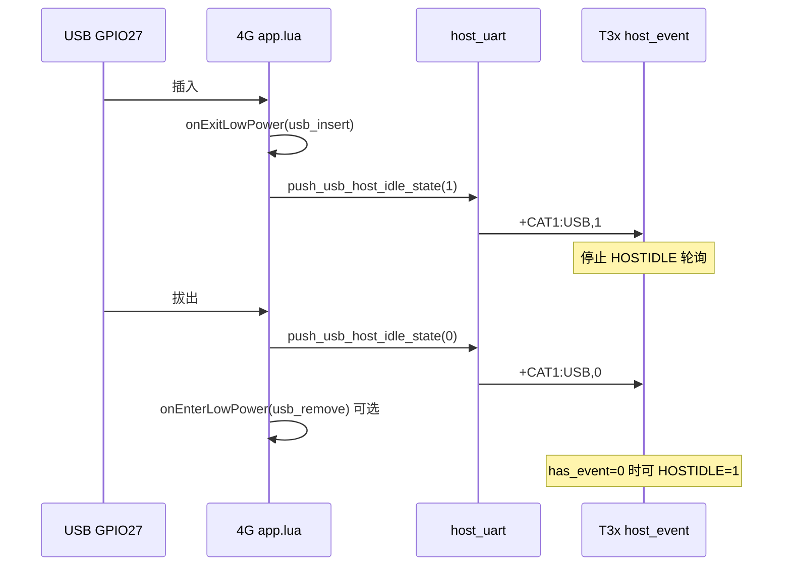
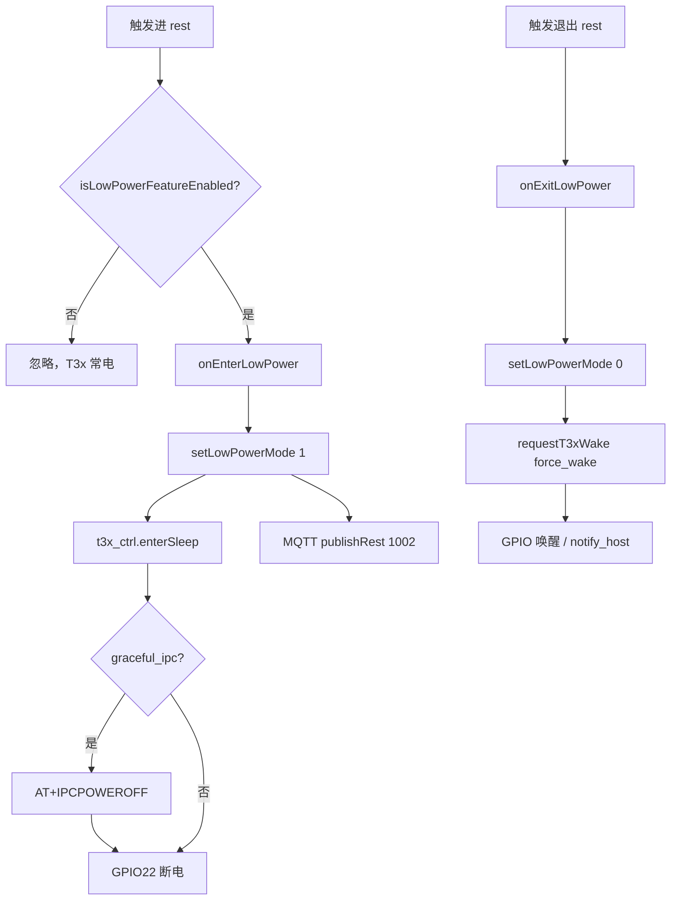
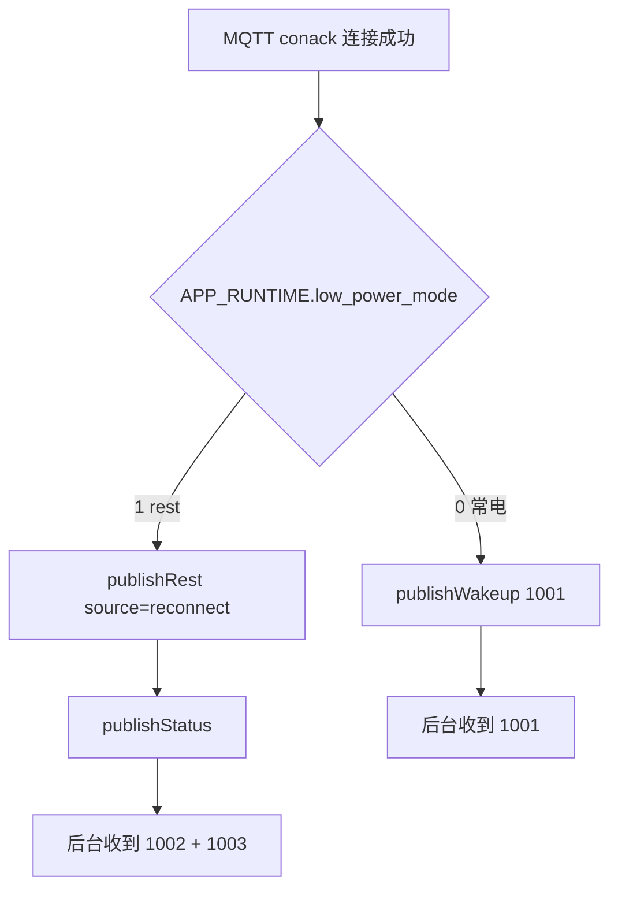

# T3x 低功耗可配置产品能力

> **双端对齐**：T3x 用 `build/config.mk` 宏管**编译能力**，4G 用 `FEATURE_CFG.low_power` 管**运行策略**。两处开关注释同名，改产品能力时**两边一起改**。

---

## 1. 开关对照表

| 能力 | T3x（编译） | 4G（Luat 运行） | 说明 |
|------|------------------|-----------------|------|
| 低功耗总开关 | `WITH_T3X_LOW_POWER ?= yes` | `local LOW_POWER_ENABLE = 1` → `FEATURE_CFG.low_power` | **必须同名**：`yes`↔`1`，`no`↔`0` |
| 优雅 T3x 关机 | `WITH_T3X_LOW_POWER=yes` 时编译 `ipc_power_off.c` | `LOW_POWER_CFG.graceful_ipc = true` → `HOST_IPC_CFG` | `enterSleep` 前发 `AT+IPCPOWEROFF` |
| rest 唤醒门禁 | — | `T3X_POLICY_CFG.enabled` ← `LOW_POWER_CFG.enabled` | rest 下禁止 PIR/MQTT 离线硬唤醒 T3x |
| 电量 rest | — | `battery_guard.enabled()` 读 `FEATURE_CFG.low_power` | 关闭后不走 ≤10% 进 rest |
| 模组深睡 | — | `LOW_POWER_CFG.modem_hibernate = false` | `true` 时 `pm.hibernate()`，MQTT 断开 |

### T3x `build/config.mk`

```makefile
# 与 4G config.lua LOW_POWER_ENABLE 保持一致
WITH_T3X_LOW_POWER ?= yes   # yes | no
```

编译注入：`-DWITH_T3X_LOW_POWER=1/0`（见 `Makefile`）。

关闭时：`AT+IPCSTATUS?` → `+IPCSTATUS:unsupported`；`AT+IPCPOWEROFF` → `+IPCPOWEROFF:NOT_SUPPORTED`。

### 4G `user/config.lua`

```lua
-- 与 ipc_device_gb28181 build/config.mk WITH_T3X_LOW_POWER 保持一致
local LOW_POWER_ENABLE = 1   -- 1=开 | 0=关

_G.FEATURE_CFG = {
    rndis = (RNDIS_ENABLE == 1),
    low_power = (LOW_POWER_ENABLE == 1),
}

_G.LOW_POWER_CFG = {
    enabled = (_G.FEATURE_CFG.low_power ~= false),
    graceful_ipc = true,           -- 需 IPC WITH_T3X_LOW_POWER=yes
    modem_hibernate = false,       -- true=整模组休眠
    rest_mqtt_interval_sec = 30,
}

_G.T3X_POLICY_CFG = { enabled = _G.LOW_POWER_CFG.enabled, ... }
_G.HOST_IPC_CFG = {
    enabled = _G.LOW_POWER_CFG.enabled and _G.LOW_POWER_CFG.graceful_ipc,
    graceful_poweroff = _G.LOW_POWER_CFG.graceful_ipc,
    ...
}
```

`app_config.lua`：`MODULE_FLAGS.low_power` 与 `FEATURE_CFG.low_power` 同步。

---

## 2. 简化模型（避免繁琐感）

```
设备态 low_power_mode ──► onEnter/ExitLowPower（唯一进出门）
        │
        ├── enterSleep / requestT3xWake
        ├── MQTT：1002 事件 + 1003 状态
        └── pir_ctrl.shouldIgnorePirTrigger → suspend | rest | 放行
```

实现收敛项：**进 rest 单入口**、**conack 按态发 1001/1002**、**1002 带 reason**、**PIRSTAT 含 ignore_rest 计数**。

### 2.1 USB 插入与 T3x 休眠互斥（780EHM_PJ）

GPIO27 **USB 插入**时（`APP_RUNTIME.power_status=1`）：

| 行为 | 实现 |
|------|------|
| 4G **不进 rest** | `onEnterLowPower` 入口拦截；`AT+LOWPOWER=ENTER` → `+LOWPOWER:USB` |
| 拒绝 T3x **T3x 断电** | `AT+HOSTIDLE=1` → `+HOSTIDLE:USB`（非 BUSY） |
| **主动通知 T3x** | 串口下发 `+CAT1:USB,1`；T3x 停止 HOSTIDLE 轮询 |
| USB 拔出 | `+CAT1:USB,0`；T3x 恢复轮询，满足 `has_event=0` 时可 `HOSTIDLE=1` |

配置：`user/config.lua` → `HOST_USB_CFG`（`block_host_idle_when_usb` / `notify_t3x_usb_state`）。

**`AT+HOSTIDLE?` 扩展**（查询用）：

```text
+HOSTIDLE:lowpower=0,usb=1,host_idle_allow=0 OK
```

| 字段 | 含义 |
|------|------|
| `usb` | 1=座子插入 |
| `host_idle_allow` | 0=T3x 不应发 `HOSTIDLE=1`；1=允许 |

**T3x 侧**：

| 机制 | 说明 |
|------|------|
| `+CAT1:USB,n` | `uart_host_cmd.c` → `client_set_cat1_usb_inserted(n)` |
| 休眠轮询 | `host_event.c`：`g_cat1_usb_inserted=1` 时**不发** `HOSTIDLE=1` |
| `+HOSTIDLE:USB` | IPC 误发时 4G 拒绝；IPC 置 `usb_inserted=1` |
| Bootstrap | `client_sync_usb_policy_from_cat1()`：`HOSTIDLE?` 的 `usb=` 或 `GETCFG` 的 `power=` |
| `serial_request` 期间 | `uart_host_cmd_try_consume_ursp()` 仍消费 `+CAT1:USB`（避免 URSP 丢失） |



---

## 3. rest 模式主流程（4G 侧）

**rest** = `APP_RUNTIME.low_power_mode = 1`：4G **仍联网/MQTT**，T3x **GPIO22 断电**。



### 进 rest 触发源（统一入口）

**所有路径只调 `app.onEnterLowPower(reason)` → `doEnterLowPowerBody()`**，不再在 `initPowerStatus` 等处直切 `enterSleep`。

| 来源 | reason | 调用方 |
|------|--------|--------|
| USB 拔出（GPIO27） | `usb_remove` | `enterRestIfNeededAfterUsbRemove` |
| 电量 ≤10% | `battery` | `battery_guard` → hooks |
| MQTT 下行 2002 | `mqtt_2002` | `POWER_ENTER_REST` |
| Host AT | `at` | `host_uart` hooks |
| 冷启动无 USB | `boot_no_usb` | `initPowerStatus`（与 `charge` 模块是否加载无关，只看 GPIO27/VBUS） |
| USB 插入 | — | **不进 rest**；见 §2.1 |

总开关关闭时：上述路径在 `app.isLowPowerFeatureEnabled()` / `battery_guard.enabled()` / `host_uart` 处**直接忽略**。

### MQTT 上报（统一语义）

| 类型 | dataType | 含义 | 何时发 |
|------|----------|------|--------|
| 事件 | **1002** | 进入 rest | `doEnterLowPowerBody` 且 MQTT 已连；或 **conack 时已在 rest**（`source=reconnect`） |
| 状态 | **1003** | 当前设备态，`lowPowerMode=rest\|normal` | 周期 60s / 电量变化 / 2003 / **rest 下 conack 补一条** |
| 事件 | **1001** | 唤醒 | **仅常电**且 MQTT conack / 2001 |

**1002 示例**（向后兼容，新增字段）：

```json
{
  "dataType": "1002",
  "lowPowerMode": "enter",
  "reason": "usb_remove",
  "source": "enter"
}
```

`reason` 与 `app.onEnterLowPower` 一致：`boot_no_usb` / `usb_remove` / `battery` / `mqtt_2002` / `at` 等。  
**后台读态以 1003.lowPowerMode 为准**；1002 表示「进 rest 时刻」。

### MQTT conack 首条上行（1001 / 1002+1003）

**`conack`**：MQTT **连接成功**时（含冷启动首次连上、断线自动重连）。  
实现：`net_mqtt.lua` → `publishConnectUplink()`，在 `mqttClient:on("conack")` 里调用。

**`1002+1003` 不是一条报文**：是连上后**连续发两条**上行（两个 topic、两种 dataType）。

#### 三种 dataType 分工

| dataType | 发布主题（约） | 类型 | 含义 |
|----------|----------------|------|------|
| **1001** | `.../wakeup` | 事件 | 设备常电在线，可执行业务 / 可唤醒 T3x |
| **1002** | `.../rest` | 事件 | 进入 rest（T3x 断电，4G 仍联网） |
| **1003** | `.../status` | 状态 | 当前快照：电量、USB、`lowPowerMode=rest\|normal` 等 |

- **1002** 回答：「什么时候 / 为什么进了 rest？」（事件）
- **1003** 回答：「现在是不是 rest、电量多少？」（状态，周期默认约 60s 也会发）

#### conack 分支逻辑



| 连上 MQTT 时设备态 | conack 发送 | 后台应理解 |
|--------------------|-------------|------------|
| **rest**（`low_power_mode=1`） | **1002** 然后 **1003** | 设备在 rest；立刻有状态快照 |
| **常电**（`low_power_mode=0`） | 仅 **1001** | 设备在线且非 rest，可业务 |

**为何 rest 不发 1001？** 旧逻辑 conack 固定发 1001，rest 重连时后台会误以为「已唤醒」，与 T3x 实际断电矛盾。

#### 为何 rest 时要发 1002？

**典型：冷启动无 USB**

```
时间轴 ─────────────────────────────────────────────►

① app 启动
   initPowerStatus → onEnterLowPower("boot_no_usb")
   → low_power_mode=1，T3x enterSleep 断电

② 此时 MQTT 尚未连接
   doEnterLowPowerBody 里 publishRest 发不出去（isConnected=false）

③ 蜂窝就绪 → MQTT conack
   publishConnectUplink 发现 low_power_mode=1
   → 补发 1002（reason 取自 APP_RUNTIME.last_rest_reason，如 boot_no_usb）
   → source=reconnect 表示「连接时补报」，非刚触发进 rest
```

其它进 rest 时若 MQTT 已在线，会在 `doEnterLowPowerBody` 当场发 1002（`source=enter`）；conack 再发一次 1002 多出现在**重连**或**晚连**场景。

#### 为何 rest 时要再发 1003？

1003 除 conack 外，主要靠**周期任务**（默认约 60s）。若 conack 只发 1002：

- 后台知道「有 rest 事件」
- 但要等最多 ~60s 才能从 1003 拿到电量、USB、`lowPowerMode` 等完整态

因此在 rest 的 conack **紧接着发一条 1003**，立即同步 `lowPowerMode:"rest"` 及电量等字段。

#### 1002 在 conack 时的 payload 示例

```json
{
  "deviceNo": "862323084068124",
  "dataType": "1002",
  "lowPowerMode": "enter",
  "reason": "boot_no_usb",
  "source": "reconnect",
  "time": "2026-06-06 12:00:00"
}
```

#### 1003 在 conack 时（紧跟 1002）的 payload 示例

```json
{
  "deviceNo": "862323084068124",
  "dataType": "1003",
  "powerStatus": "0",
  "usbInserted": 0,
  "charging": 0,
  "remainPower": "85",
  "batteryMv": "3850",
  "lowPowerMode": "rest",
  "time": "2026-06-06 12:00:01"
}
```

#### 后台处理建议

| 数据 | 用途 |
|------|------|
| **1003.lowPowerMode** | **主**：判断设备当前是否在 rest |
| **1002** | **辅**：记录进 rest 时刻与 `reason`；`source=reconnect` 为补发 |
| **1001** | 仅当 conack 时设备**非常电 rest**；rest 下不应依赖 1001 判断在线 |

代码位置：`user/net_mqtt.lua`（`publishConnectUplink` / `publishRest` / `publishStatus`）、`user/app.lua`（`doEnterLowPowerBody` 写 `last_rest_reason`）。

### PIR 两道关（产品分层，非重复实现）

| 层级 | 条件 | 行为 | 计数 |
|------|------|------|------|
| suspend | 电量 ≤15% / 烧录 | 停 PIR 业务，T3x **可能仍上电** | `cnt_biz_ignore_suspend` |
| rest | `low_power_mode=1` | 丢弃 PIR，**不** `requestT3xWake` | `cnt_biz_ignore_rest` |

电量 ≤10% 时两者可能同时生效（先命中 suspend）；USB 拔座进 rest 时通常只命中 rest。

### 出 rest 触发源

| 来源 | reason |
|------|--------|
| USB 插入 | `usb_insert` / `battery_usb` |
| 电量恢复 | `battery_recover` |
| MQTT 2002 退出 | `mqtt_2002` |
| Host AT | `AT+LOWPOWER=EXIT` |

退出时 `requestT3xWake(..., { force_wake = true })` 绕过 rest 门禁但仍受 USB/烧录约束。

---

## 4. rest 下的行为约束

| 模块 | rest 中行为 |
|------|-------------|
| `pir_ctrl` | `onPirTriggered` 忽略，计数 `cnt_biz_ignore_rest` |
| `t3x_policy` | `mayPowerT3x` 拒绝非 `force_wake` 唤醒 |
| `t3x_policy` | `shouldWakeOnMqttOffline` 返回 false |
| MQTT | `publishRest` 1002，`low_power_mode=rest` |
| `net_tcp` | 关闭数据通道 |

---

## 5. T3x 侧实现要点（`WITH_T3X_LOW_POWER`）

| 文件 | 行为 |
|------|------|
| `app/cat1/types.h` | 默认 `WITH_T3X_LOW_POWER 1` |
| `app/cat1/ipc_power_off.c` | 关闭时 stub：`unsupported` / `request` 返回 -1 |
| `app/cat1/uart_host_cmd.c` | `AT+IPCSTATUS?` / `AT+IPCPOWEROFF` 条件应答 |

与 `CAT1_WAKE_ENABLE` 同级：可单独关 IPC 低功耗协同而保留 Cat.1 串口 Host AT。

---

## 6. 产品配置示例

### 门球（默认：低功耗开）

```makefile
# IPC config.mk
WITH_T3X_LOW_POWER = yes
```

```lua
-- 4G config.lua
local LOW_POWER_ENABLE = 1
```

### 常电 T3x（低功耗关）

```makefile
# T3x
WITH_T3X_LOW_POWER = no
```

```lua
-- 4G
local LOW_POWER_ENABLE = 0
```

效果：不进 rest、USB 拔出不断 T3x、PIR 常响应、`AT+LOWPOWER` 返回 `NOT_SUPPORTED`。

### 仅断 T3x、不要 T3x 优雅关机

```lua
LOW_POWER_ENABLE = 1
_G.LOW_POWER_CFG.graceful_ipc = false
```

T3x 可保持 `WITH_T3X_LOW_POWER=yes`（其它场景仍可用 IPCSTATUS）；`enterSleep` 直接 `powerOff()`。

---

## 7. 实机验证清单

- [ ] `LOW_POWER_ENABLE=0`：拔 USB **不**进 rest，日志见「低功耗能力已关闭」
- [ ] `LOW_POWER_ENABLE=1`：拔 USB 进 rest，MQTT 1002 含 `reason=usb_remove`，1003 `lowPowerMode=rest`
- [ ] 冷启动无 USB 进 rest：MQTT conack 发 **1002+1003**（不发 1001）
- [ ] rest 中 PIR 不唤醒 T3x（`ignore_rest` 日志）
- [ ] `AT+LOWPOWER=ENTER/EXIT` 在开关关闭时 `NOT_SUPPORTED`
- [ ] IPC `WITH_T3X_LOW_POWER=no`：`AT+IPCPOWEROFF` → `NOT_SUPPORTED`
- [ ] 两边都开：进 rest 前收到 `+IPCPOWEROFF:OK` 再断电

---

## 8. 相关文档

| 文档 | 说明 |
|------|------|
| [LOW_BATTERY_AND_LOW_POWER.md](LOW_BATTERY_AND_LOW_POWER.md) | 电量阈值、USB、场景图 |
| [POWER_USB_BATTERY_T3X_LOGIC.md](POWER_USB_BATTERY_T3X_LOGIC.md) | 模块职责与决策 |
| [T3X_IPC_4G_INTERACTION.md](T3X_IPC_4G_INTERACTION.md) | T3x↔4G 端到端流程 |
| [T3X_HOSTEVT_SLEEP.md](T3X_HOSTEVT_SLEEP.md) | HOSTEVT 四条 AT：汇总 / 消费 / 休眠 |
| [T3X_NAMING.md](T3X_NAMING.md) | `t3x` / `T3x` / `T3X` 命名 |
| IPC [T3X_LOW_POWER.md](../../ipc_device_gb28181/docs/T3X_LOW_POWER.md) | IPC 编译侧精简说明 |

**代码真源**：`user/config.lua`、`user/app.lua`、`user/app_config.lua`、`user/battery_guard.lua`、`user/pir_ctrl.lua`、`user/host_uart.lua`；IPC `build/config.mk`、`app/cat1/ipc_power_off.c`、`app/cat1/uart_host_cmd.c`。

**版本**：v1.0 · 2026-06-06
