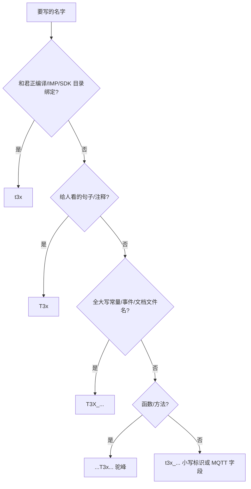

# t3x / t3x / T3x / T3X 命名说明

> 本文约定 **4G 门球（Air780EHM）+ 协处理器 IPC** 工程中的写法，避免把「芯片型号」和「产品系列」混用。  
> 代码真源：`../user/app_config.lua`、`../user/config.lua`；IPC 编译：`ipc_device_gb28181` 的 `build/config.mk`。

---

## 1. 为什么要分两套名字？

| 概念 | 一句话 |
|------|--------|
| **t3x** | 具体 **芯片 / SoC / 编译平台**（当前量产多为君正 T3x 系） |
| **T3x 系列** | **产品统称**，覆盖 T3x、T32 等同架构协处理器摄像头，与具体型号解耦 |

4G 模组侧业务（PIR、MQTT、供电门禁）面向的是 **「协处理器系列产品」**，不应绑死在某一型芯片上；  
IPC 固件、交叉编译、IMP 媒体库则必须落到 **`t3x` 平台** 等具体实现。

---

## 2. 四种写法速查

| 写法 | 类型 | 含义 | 典型场景 |
|------|------|------|----------|
| **t3x** | 全小写 | **芯片 / 平台标识** | `PLATFORM=t3x`、`media_plat/t3x/`、`toolchain/t3x/` |
| **t3x** | 全小写 | **系列标识**（代码、协议） | `t3x_ctrl.lua`、`t3x_boot`、`source=t3x` |
| **T3x** | 首字母大写 | **系列称呼**（给人看） | 文档、注释、日志：「T3x 被唤醒」「T3x 写盘」 |
| **T3X** | 全大写 | **宏 / 常量 / 大写文档名** | `T3X_SNAPSHOT_DONE`、`APP_PIR_WAKE_T3X`、`T3X_RECORD_MQTT_FLOW.md` |

**记忆口诀：**

- 谈 **芯片怎么编** → `t3x`
- 谈 **产品怎么控、怎么上报** → `t3x` / `T3x` / `T3X`（见下表细分）
- **函数名**里系列用驼峰 **`T3x`**：`requestT3xWake()`（不是 `T3XWake`，也不是 `T3xxWake`）

---

## 3. 分项说明

### 3.1 `t3x` — 芯片与编译平台

只用于 **与 SoC / 工具链 / 平台目录** 强绑定的场景：

| 类别 | 示例 |
|------|------|
| Makefile 平台 | `PLATFORM = t3x` |
| 源码目录 | `media_plat/t3x/`、`lib/t3x/` |
| 工具链路径 | `toolchain/t3x/mips-gcc540-...` |
| 编译宏（平台） | `-DIPC_PLATFORM_T3X`（IPC 侧表示「T3x 系列 IPC 运行于 t3x 平台」） |
| 芯片相关注释 | `t3x_linux/audio_prompt.c` |

**不要**用 `t3x` 命名 4G 业务模块（应使用 `t3x_ctrl` 等），也不要在 MQTT JSON 里写 `source=t3x`（应写 `source=t3x`）。

---

### 3.2 `t3x` — 系列（程序标识符 / 协议字段）

全小写，用于 **Lua 模块名、变量、配置键、MQTT 字符串**（大小写敏感）：

| 类别 | 示例 |
|------|------|
| Lua 模块文件 | `user/t3x_ctrl.lua`、`lib/t3x_policy.lua` |
| `require` | `require "t3x_ctrl"` |
| 功能开关 | `MODULE_FLAGS.t3x_app`、`t3x_wakeup` |
| GPIO 配置键 | `GPIO_OUT.t3x_boot`、`t3x_pwr_wake` |
| 状态变量 | `t3x_rec_active`、`t3x_burn_active` |
| MQTT 字段 | `"source": "t3x"`、`pirStatus=t3x_active` |
| 局部函数（snake_case） | `notify_t3x()`、`wake_t3x` |

---

### 3.3 `T3x` — 系列（文档与注释）

首字母 **T** 大写、**x** 小写，用于 **中文/英文正文、日志文案、注释** 里指代协处理器产品：

```text
4G 唤醒 T3x 后，T3x 经 AT+RECORD=1 确认写盘。
```

适用于：产品说明、联调手册、测试步骤、给非芯片同事的通俗描述。

---

### 3.4 `T3X` — 宏、事件常量、大写文档名

**整段大写**（含 `X`），用于 **C/Lua 常量、事件名、全局配置表、Markdown 文件名**：

| 类别 | 示例 |
|------|------|
| 应用事件（Lua 键） | `PIR_WAKE_T3X`、`T3X_RECORD_STOP` |
| 事件字符串 | `"APP_PIR_WAKE_T3X"`、`"APP_T3X_SNAPSHOT_DONE"` |
| 全局配置 | `_G.T3X_BURN_CFG`、`_G.T3X_POLICY_CFG` |
| GPIO `net_name` | `"T3X_BOOT"`、`"T3X_PWR_WAKE"` |
| C 头文件守卫 | `T3X_JPEG_SNAPSHOT_H` |
| 文档文件名 | `T3X_RECORD_MQTT_FLOW.md`、`T3X_BURN_MODE.md` |

历史名 `T3x_SNAPSHOT_DONE`、`T3xX_SNAPSHOT_DONE` 等应统一为 **`T3X_SNAPSHOT_DONE`**。

---

## 4. 函数命名（`T3x` 驼峰）

系列相关 **函数 / 方法** 使用 **`T3x`**（x 小写），不用 `T3X`，也不用 `T3xx`：

| 函数 | 说明 |
|------|------|
| `requestT3xWake()` | 4G 请求唤醒协处理器 |
| `mayPowerT3x()` | 电量/USB 门禁是否允许上电 |
| `syncStopFromT3x()` | T3x `AT+RECORD=0` 同步停录 |
| `publishT3xRecordStop()` | 上报 1011 |
| `getT3xRecActive()` | 查询是否在写盘 |

IPC 侧运行在 t3x 芯片上的运行时 API 可保留平台前缀，如 `t3x_runtime_start()`（**芯片实现**）；与 4G 系列 API 区分开。

---

## 5. 端到端对照示例

### 5.1 PIR 抓拍完成

```text
T3x 固件（t3x 平台）写 SD
  → 串口 AT+SNAPSHOT=/mnt/sdcard/snap/xxx.jpg
  → host_uart 发布 T3X_SNAPSHOT_DONE / APP_T3X_SNAPSHOT_DONE
  → app.lua 订阅处理
  → MQTT 1010 pirStatus=snapshot_saved
```

### 5.2 录像状态 MQTT

| 阶段 | 代码侧 | 云端 JSON |
|------|--------|-----------|
| 开始写盘 | `T3X_RECORD_ACTIVE` | 1010：`t3x_active` |
| 停录 | `T3X_RECORD_STOP` | 1011：`source=t3x` |
| 4G 定时停 | `PIR_STOP_RECORDING` | 1011：`source=4g` |

### 5.3 编译 vs 烧录

```bash
# IPC：芯片平台 t3x
source build/envsetup.sh T3xX_GC4023_H265_RECORD_P2P t3x

# 4G：烧录 Luat 工程（系列逻辑在 t3x_ctrl / t3x_policy）
# 目录：/mnt/share/user/
```

---

## 6. 如何选择？（决策简图）



---

## 7. 与硬件丝印、旧工程名的关系

以下 **不属于** 上表四套规则，单独保留：

| 名称 | 性质 | 说明 |
|------|------|------|
| `T3x_BOOT` | 原理图网络名 / 丝印 | 硬件文档可保留；Luat `net_name` 软件侧用 `T3X_BOOT` |
| `T3xZX_GC4653_*` | IPC **项目**名 | `config.mk` 工程块，非系列 API |
| `T3xX_GC4023_*` | IPC **项目**名 | 同上 |
| `T3x` 单独出现 | 旧口语 | 文档中应改为 **T3x**（系列）或 **t3x**（平台），避免歧义 |

---

## 8. 常见错误

| 错误写法 | 问题 | 应改为 |
|----------|------|--------|
| `t3x_ctrl.lua` | 把芯片名当系列模块名 | `t3x_ctrl.lua` |
| `requestT3xxWake` | 混淆芯片与系列 | `requestT3xWake` |
| `PIR_WAKE_T3x` / `T3x_SNAPSHOT_DONE` | 旧事件名 | `PIR_WAKE_T3X` / `T3X_SNAPSHOT_DONE` |
| `source=t3x` / `t3x_active` | 旧 MQTT | `source=t3x` / `t3x_active` |
| 文档写「t3x 摄像头」指整个产品 | 读者会以为是芯片 | **T3x 摄像头** |
| 宏写成 `T3x_SNAPSHOT_DONE` | 宏应全大写 | `T3X_SNAPSHOT_DONE` |
| 函数写成 `requestT3XWake` | 函数 x 应小写 | `requestT3xWake` |

---

## 9. 本仓库关键路径

| 路径 | 命名域 |
|------|--------|
| `/mnt/share/user/` | 4G Lua，`t3x_*` 模块 + `T3X_*` 事件 |
| `/mnt/share/lib/t3x_policy.lua` | 系列门禁 |
| `/mnt/share/doc/T3X_*.md` | 系列文档（大写文件名） |
| `ipc_device_gb28181/media_plat/t3x/` | **芯片**媒体平台 |
| `ipc_device_gb28181/app/cat1/` | IPC↔4G 桥接；运行时可有 `t3x_runtime_*` |

---

## 10. 相关文档

| 文档 | 内容 |
|------|------|
| [T3X_RECORD_MQTT_FLOW.md](T3X_RECORD_MQTT_FLOW.md) | 录像 MQTT 时序（含 `source=t3x`） |
| [T3X_HOSTEVT_PROTOCOL.md](T3X_HOSTEVT_PROTOCOL.md) | GPIO 唤醒脉冲 |
| [T3X_BURN_MODE.md](T3X_BURN_MODE.md) | 烧录模式与 `T3X_BURN_CFG` |
| [CONFIG.md](CONFIG.md) | `t3x_boot` 等 GPIO 对照 |
| [PROJECT_DOC.md](PROJECT_DOC.md) | 4G 模块职责与事件表 |

---

**版本**：2026-06 · **维护**：命名变更时请同步更新本文与 `app_config.lua` 事件表。
