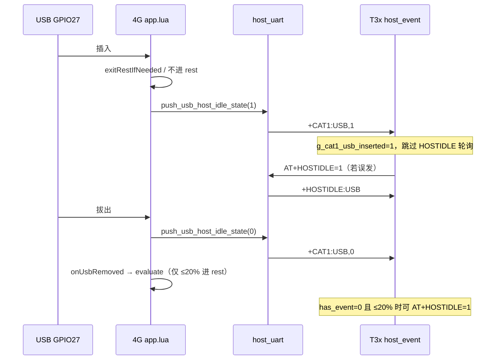

# USB 插入与 T3x / 4G 低功耗互斥（780EHM_PJ）

> **780EHM_PJ** 4G 固件（`user/`）与 T3x（`app/cat1/`）在 **GPIO27 USB 座** 拔插时，对低功耗指令的互斥策略。  
> 关联：[T3X_LOW_POWER.md](T3X_LOW_POWER.md) §2.1、[T3X_HOSTEVT_SLEEP.md](T3X_HOSTEVT_SLEEP.md)

**版本**：v1.1 · 2026-06-26

---

## 1. 需求与实现对照

| 需求 | 实现 |
|------|------|
| USB **插入** → 忽略 T3x 让设备进低功耗 | `AT+HOSTIDLE=1` → `+HOSTIDLE:USB`；T3x 侧停止发 `HOSTIDLE=1` |
| USB **插入** → 4G 模块**不进**低功耗 | `onEnterLowPower` 入口拦截；`AT+LOWPOWER=ENTER` → `+LOWPOWER:USB` |
| USB **插入** → 串口通知 T3x 勿发休眠 AT | 4G 主动发 **`+CAT1:USB,1`** |
| USB **拔出** → 通知 T3x 可恢复休眠轮询 | 4G 发 **`+CAT1:USB,0`** |
| USB **拔出** → 4G 是否进 rest | **仅电量 ≤20%**（`battery_guard.evaluate`）；**>20% 不进 rest**（2026-06-26 起废弃无条件 `usb_remove`） |
| USB **拔出** → T3x 满足条件可再让 4G 休眠 | `has_event=0` 且无 USB 阻塞且 **≤20%** 时可 `HOSTIDLE=1` |

**说明**：T3x「低功耗」在此指 **`AT+HOSTIDLE=1`（请求 4G 对 T3x 断电）**；4G「低功耗」指 **`rest`（`low_power_mode=1`，T3x 断电、模组仍联网）**。USB 插入时**两者均被拦截**（可配置）。

---

## 2. 时序



---

## 3. 串口协议

### 3.1 4G → T3x（主动 URSP，无应答）

| 行 | 含义 |
|----|------|
| `+CAT1:USB,1` | USB 已插入：**禁止** T3x 发 `AT+HOSTIDLE=1` |
| `+CAT1:USB,0` | USB 已拔出：**允许** T3x 在满足 HOSTEVT 条件时发 `HOSTIDLE=1` |

配置：`HOST_USB_CFG.t3x_usb_ursp`（默认 `+CAT1:USB,%d`）。

**推送时机**：

1. `applyUsbInsertState` 拔插瞬间  
2. T3x 首条 AT（`APP_HOST_UART_FIRST_AT`）后同步当前 USB 态（冷启动插 USB 场景）  
3. 冷启动延迟 `boot_notify_delay_ms` 补发

### 3.2 T3x → 4G（查询 / 请求）

| AT | USB 插入时 |
|----|------------|
| `AT+HOSTIDLE?` | `+HOSTIDLE:lowpower=0,usb=1,host_idle_allow=0 OK` |
| `AT+HOSTIDLE=1` | `+HOSTIDLE:USB`（拒绝 T3x 断电，**非** BUSY） |
| `AT+LOWPOWER=ENTER` | `+LOWPOWER:USB`（拒绝 4G 进 rest） |
| `AT+USBRESET` | `+USBRESET:OK`：异步 `usb_rndis.rebind()`；`+USBRESET:REST`：rest 且 T3x 断电，仅日志不 rebind |
| `AT+USBRESET?` | `+USBRESET:busy,count,last,rest_blk,t3x_pwr` |

| 字段 | 含义 |
|------|------|
| `usb` | 1=座子插入 |
| `host_idle_allow` | 0=T3x 不应发 `HOSTIDLE=1` |

---

## 4. 配置（4G `user/config.lua`）

```lua
_G.HOST_USB_CFG = {
    block_host_idle_when_usb = true,   -- HOSTIDLE=1 → +HOSTIDLE:USB
    block_4g_rest_when_usb = true,     -- 4G onEnterLowPower / MQTT 2002 / LOWPOWER=ENTER 拦截
    notify_t3x_usb_state = true,      -- 串口推 +CAT1:USB,n
    allow_t3x_usb_reset = true,       -- AT+USBRESET → usb_rndis.rebind（FEATURE_CFG.usb_reenum）
    usb_reset_min_interval_sec = 60,
    usb_reset_notify_after_ms = 800,
    t3x_usb_ursp = "+CAT1:USB,%d",
    boot_notify_delay_ms = 1500,       -- 冷启动补发 USB 态
}
```

设为 `false` 可单独关闭某一拦截（不推荐量产关闭 `notify_t3x_usb_state`）。

---

## 5. 代码地图

### 4G（780EHM_PJ / `/mnt/share/user/`）

| 文件 | 函数 | 职责 |
|------|------|------|
| `app.lua` | `enterRestIfNeededAfterUsbRemove` | 拔 USB：**仅** `battery_guard.onUsbRemoved()`，**无**无条件 `usb_remove` |
| `app.lua` | `applyUsbInsertState` | GPIO27/PMD 拔插写 `power_status` |
| `battery_guard.lua` | `onUsbRemoved` / `tryExitMismatchedRest` | 拔座重算电量；>20% 误进 rest 立即纠正 |
| `app.lua` | `onEnterLowPower` | USB=1 时直接 return，不进 rest |
| `host_uart.lua` | `push_usb_host_idle_state` | 发 `+CAT1:USB,n` |
| `host_uart.lua` | `uart_hostidle` | `HOSTIDLE:USB` / `HOSTIDLE?` 扩展字段 |
| `host_uart.lua` | `uart_lowpower` | `LOWPOWER:USB` |
| `host_uart.lua` | `uart_usbreset` | `AT+USBRESET` → `usb_rndis.rebind`（**不** `requestT3xWake`） |
| `lib/usb_rndis.lua` | `rebind` | RNDIS 关→开，供 T3x mismatch 恢复 |

### T3x（`app/cat1/`）

| 文件 | 职责 |
|------|------|
| `uart_host_cmd.c` | 解析 `+CAT1:USB,n`；`uart_host_cmd_try_consume_ursp`（`serial_request` 期间也消费） |
| `host_event.c` | `g_cat1_usb_inserted=1` 时**不发** `HOSTIDLE=1`；`+HOSTIDLE:USB` 时置位 |
| `host_event.c` | `client_sync_usb_policy_from_cat1()` bootstrap 同步 |
| `api.c` | bootstrap 调用 USB 策略同步 |
| `runtime.c` | 日志：`HOSTIDLE USB block`（返回码 3） |
| `cat1_usb_reenum.c` | mismatch 超时发 `AT+USBRESET`（`NET_LINK_4G_USB_REENUM`） |
| `net_link_rtnl.c` | watchdog / mismatch；网卡恢复后 `cat1_usb_reenum_reset` |

---

## 6. 验证清单

- [ ] 插 USB：4G 日志 `USB插入`；串口 `+CAT1:USB,1`；T3x `HOSTEVT skip HOSTIDLE`
- [ ] 插 USB：T3x 误发 `HOSTIDLE=1` → `+HOSTIDLE:USB`；4G **不进** rest
- [ ] 拔 USB：**>20%** 不进 rest（1003 `lowPowerMode=normal`）；**≤20%** 进 rest（`reason=battery`）
- [ ] 拔 USB：`+CAT1:USB,0`；`has_event=0` 且 ≤20% 后 T3x `HOSTIDLE accepted`
- [ ] 误进 rest（62% + rest）：ADC 上报后 `lp- battery_recover`
- [ ] 冷启动插 USB：T3x 首 AT 后收到 `+CAT1:USB,1` 或 bootstrap `HOSTIDLE?` 中 `usb=1`
- [ ] mismatch：`[4G_USB] reenum` + 4G `USBRESET done`；**无** `t3x wake` / `powerOn` 日志
- [ ] T3x 已 `enterSleep` 断电：无持续 `AT+USBRESET`（IPC 已停）

---

## 7. USB 恢复与 4G rest / T3x 休眠

> T3x 侧全文：[usb_4g_recovery.md](usb_4g_recovery.md) §11（IPC 仓库 `docs/`）

### 7.1 结论

**4G `low_power_mode=1` 且 T3x 已按 `enterSleep` 断电时，不会因 USB mismatch / `AT+USBRESET` 流程而随便启动 T3x。**

### 7.2 原因摘要

1. **发起方是 T3x IPC**：`AT+USBRESET` 仅由已上电的 T3x 发出；`enterSleep` 成功后 IPC 停止，watchdog 不存在。
2. **4G 处理不上电**：`uart_usbreset` 只做 `usb_rndis.rebind()` 与可选 `+CAT1:USB,1`；**不调用** `requestT3xWake` / `powerOn`。
3. **USB 插入互斥 rest**：`block_4g_rest_when_usb` 使 USB 座插入时 4G 不进 rest；恢复场景与「4G 已 rest」通常不重叠。

### 7.3 与唤醒路径对比

| 路径 | rest 门禁 | 拉 T3x 电 |
|------|-----------|-----------|
| PIR / MQTT → `requestT3xWake` | `t3x_policy.mayPowerT3x` | 可能 |
| `AT+USBRESET` → `uart_usbreset` | 不走唤醒链 | **否** |

### 7.4 rest 防御门禁

`HOST_USB_CFG.block_usb_reset_when_t3x_rest=true`（默认）时，若 `low_power_mode=1` 且 `t3x_ctrl.getState().powered_on=false`，`AT+USBRESET` 返回 **`+USBRESET:REST`**，仅日志、不 `usb_rndis.rebind`。

---

## 8. 相关文档

| 文档 | 说明 |
|------|------|
| [WORK_MODE_BATTERY_20PCT.md §9](WORK_MODE_BATTERY_20PCT.md#9-usb-拔插与-rest仅电量-20) | 拔 USB 仅 ≤20% 进 rest；误进纠正 |
| [LOW_BATTERY_AND_LOW_POWER.md](LOW_BATTERY_AND_LOW_POWER.md) | 场景 B 流程图 |
| [T3X_LOW_POWER.md](T3X_LOW_POWER.md) | rest / MQTT 1002、§2.1 摘要 |
| [T3X_IPC_4G_INTERACTION.md](T3X_IPC_4G_INTERACTION.md) | 端到端总览 |
| T3x `docs/usb_4g_recovery.md` | USB 恢复 + §11 低功耗互斥 |
| T3x `docs/T3X_USB_HOSTIDLE.md` | T3x 侧索引 |
