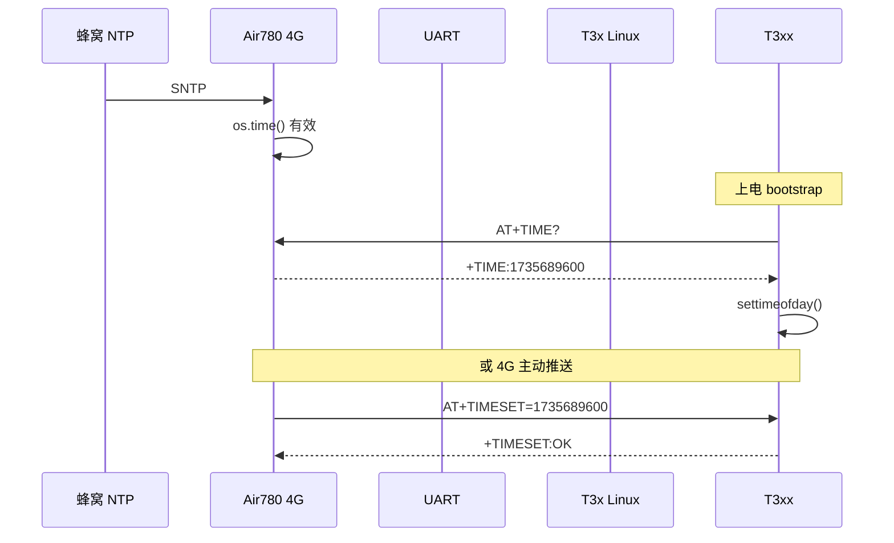

# CAT1 ↔ T3x 时间同步

> 解决 T3x 冷启动系统时间为 **1970** 导致录像时间戳错误的问题。  
> 4G 侧经 **SNTP** 获得网络时间，再经 UART 同步给 T3xx。

---

## 1. 问题

| 现象 | 原因 |
|------|------|
| 录像文件时间为 1970-01-01 | T3x Linux 无 RTC/NTP，上电默认 Unix epoch |
| MQTT 上报时间正常 | 4G 模组 `time_sync` 已同步 |

---

## 2. 方案概览

**双通道保障**

1. **T3x 拉取（bootstrap + 录像前）**：`AT+TIME?` → 4G 返回 `+TIME:<unix>` → `settimeofday()`
2. **4G 推送**：SNTP 成功、低功耗唤醒、GPIO 唤醒前 → `AT+TIMESET=<unix>`

---

## 3. AT 命令

### 3.1 T3x → 4G（查询）

| 命令 | 响应 | 说明 |
|------|------|------|
| `AT+TIME?` | `+TIME:<unix>` `OK` | 4G 时间有效时返回 Unix 秒 |
| | `+TIME:0` `OK` | 4G 尚未 SNTP（低于 `min_valid_unix`） |

实现：`user/host_uart.lua` → `uart_time_query`

### 3.2 4G → T3x（设置）

| 命令 | 响应 | 说明 |
|------|------|------|
| `AT+TIMESET=<unix>` | `+TIMESET:OK` `OK` | T3x 调用 `settimeofday()` |
| | `+TIMESET:ERROR` `ERROR` | 时间无效或设置失败 |

实现：`t3x_linux/uart_host_cmd.c` → `time_sync_apply_unix()`

---

## 4. 触发时机

| 时机 | 侧 | 动作 |
|------|-----|------|
| T3x `client_init` bootstrap | T3x | `client_sync_time_from_cat1()`（失败不阻断启动） |
| PIR/录像唤醒 `media_dispatch_wake_event` | T3x | 若 `time(NULL)` 无效，再拉一次 `AT+TIME?` |
| `SNTP_SYNC_SUCCESS` | 4G | `time_sync.pushToHostAsync(true)` |
| 退出低功耗 `onExitLowPower` | 4G | `time_sync.onT3xWake()` |
| `sendWakePulse` → `notify_host` 前 | 4G | `time_sync.pushBeforeNotifyAsync()` |

---

## 5. 配置

`user/config.lua` → `TIME_SYNC_CFG`：

| 字段 | 默认 | 说明 |
|------|------|------|
| `enabled` | true | 总开关 |
| `min_valid_unix` | 1704067200 | 2024-01-01；低于此视为未同步 |
| `sync_on_sntp` | true | SNTP 成功后推送 |
| `sync_on_wake` | true | 退出低功耗后推送 |
| `sync_before_wake` | true | GPIO 唤醒前先 TIMESET |
| `host_boot_wait_ms` | 1500 | T3x 上电后等待 UART 就绪 |
| `ack_timeout_ms` | 800 | 等待 `+TIMESET:OK` |
| `resync_skew_sec` | 2 | 重复推送节流 |

模块开关：`app_config.lua` → `MODULE_FLAGS.time_sync`

---

## 6. 源码位置

| 模块 | 路径 |
|------|------|
| 4G 编排 | `user/time_sync.lua` |
| 4G AT 查询 | `user/host_uart.lua`（`AT+TIME?`） |
| SNTP | `time_sync.lua` |
| T3x 设时 | `t3x_linux/time_sync.c` |
| T3x 收 AT | `t3x_linux/uart_host_cmd.c` |
| T3x 拉取 | `t3x_linux/api.c` → `client_sync_time_from_cat1` |
| 录像前检查 | `t3x_linux/media_ops.c` |

---

## 7. 边界情况

| 场景 | 行为 |
|------|------|
| 4G 无网 / SNTP 未成功 | `AT+TIME?` 返回 `+TIME:0`；录像可能仍为 1970，SNTP 成功后自动补推 |
| T3x 断电休眠 | 唤醒后 bootstrap 再次 `AT+TIME?` |
| 4G 时间已同步、T3x 刚上电 | `pushBeforeNotify` 在脉冲前先 `AT+TIMESET` |
| 烧录模式 | 与提示音相同，可在业务层跳过（当前未单独限制） |

---

## 8. 验证

1. 4G 日志：`time_sync SNTP 成功` → `AT+TIMESET <unix>` → `T3x 时间已同步`
2. T3x 日志：`time synced unix=...`
3. T3x shell：`date -u` 应为当前 UTC
4. 触发 PIR 录像，检查文件/metadata 时间戳非 1970
