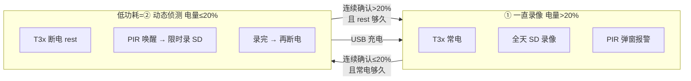
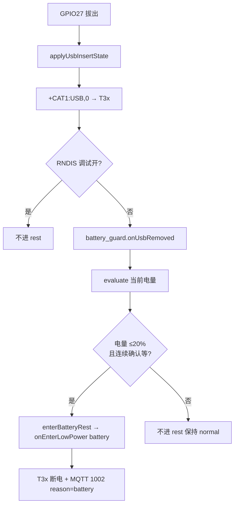

# 工作模式与电量 20% 切换（一直录像 ↔ 动态侦测）

> **产品规则**  
> - **① 一直录像模式**：全程录像至 SD 卡 + 动态侦测弹窗报警  
> - **② 动态侦测模式**：PIR 触发录像至 SD 卡 + 动态侦测弹窗报警  
> - **一直录像模式下**：电量 **≤20%** → 低功耗（= 动态侦测）；电量 **>20%** → 恢复一直录像  
> **代码**：`user/battery_guard.lua` · `user/config.lua` · `user/pir_ctrl.lua` · `lib/t3x_policy.lua` · `user/host_uart.lua`  
> **关联**：[LOW_BATTERY_AND_LOW_POWER.md](LOW_BATTERY_AND_LOW_POWER.md) · [BATTERY_REST_SWITCH_CONDITIONS.md](BATTERY_REST_SWITCH_CONDITIONS.md) · [PIR_PROTOCOL.md](PIR_PROTOCOL.md) · [T3X_IPC_4G_INTERACTION.md](T3X_IPC_4G_INTERACTION.md)

**版本**：v1.2 · 2026-06-26

---

## 0. 与「30 秒进低功耗」的关系

T3x **每 30 秒**空闲轮询（`HOSTEVTPOLL=30000`）触发的 `HOSTIDLE` 断电，与 **电量 20% rest** 是 **两条通路**，默认 **不矛盾**：

- **默认策略 `battery`**：
  - **IPC**：电量 **>20%** 时 **不发** `HOSTIDLE=1`（先 `GETCFG` 读 `battery=`）
  - **4G 兜底**：若仍收到 `HOSTIDLE=1` → `+HOSTIDLE:BUSY`
  - T3x **保持常电** 全天录；仅 **≤20%** 走电量 rest / HOSTIDLE 断电
- 需切换策略时改 `config.lua` 顶部 `LOW_POWER_ENTER_STRATEGY`（`battery` / `hybrid` / `idle_poll`）。

详见 **[LOW_POWER_ENTER_STRATEGY.md](LOW_POWER_ENTER_STRATEGY.md)**。

---

## 1. 两种工作模式

| 模式 | syscfg `record_mode` | 录像行为 | 报警 |
|------|----------------------|----------|------|
| **① 一直录像** | `1` | T3x **常电**，TF 卡 **全天连续 MP4** | PIR / IVS → **GB28181 弹窗报警** |
| **② 动态侦测** | `3` | 仅 **PIR 触发** 限时录像至 SD | 同上 |

平台可通过 MQTT **2010** 配置 PIR 策略（`action=video/photo` 等）；`record_mode` 由 T3x 本地配置或远程下发决定。

**电量不改变 `record_mode`**；电量只决定 T3x **常电还是断电 rest**，以及 rest 下是否允许 PIR 唤醒。

---

## 2. 一直录像 + 电量 20% 规则

产品配置为 **① 一直录像** 时：

| 电量 | 产品表现 | 技术映射 |
|------|----------|----------|
| **>20%** | **一直录像模式** | T3x **常电**；全天 SD 录；`HOSTIDLE=1` → **BUSY**（拒绝休眠） |
| **≤20%** | **低功耗 = 动态侦测模式** | `enterBatteryRest` → `IPCPOWEROFF` → **断 T3x 电**；PIR **仍可唤醒** 限时录 + 报警 |
| **>20%（恢复）** | 恢复 **一直录像** | `exitBatteryRest` → `requestT3xWake(force)` → 全天录恢复 |
| **USB 插入** | 充电优先 | 忽略电量阈值，退出 rest，T3x 上电 |
| **USB 拔出** | **仅当 ≤20%** 才可能进 rest | 见 **§9**；**>20% 拔座不进 rest** |



---

## 3. 电量阈值（默认）

| 配置键 | 默认 | 含义 |
|--------|------|------|
| `t3x_rest_percent` | **20** | ≤20% 进入 rest（低功耗=动态侦测） |
| `recover_rest_percent` | **20** | >20%（≥21%）退出 rest，恢复一直录像 |
| `pir_suspend_percent` | **10** | ≤10% 挂起 PIR |
| `block_wake_below_percent` | **20** | ≤20% 非 PIR 原因不唤醒 T3x |

**滞回 1%**：进 ≤20%，出 >20%（≥21%），避免 20% 单点抖动。

---

## 4. 20% 边界反复启停 — 如何处理

### 4.1 问题

```text
21% → 退出 rest → 启动 T31 一直录像（耗电大）
  → 数分钟跌至 19% → 进入 rest → 断电
  → 充电/静置回到 21% → 再次启动
  → 循环往复 …
```

### 4.2 记两句

> **进 rest**：电量要「**真的低**」+ T31 要「**已经常电够久**」  
> **出 rest**：电量要「**真的高**」+ rest 要「**已经待够久**」

| 口语 | 连续确认（真的低/高） | 最短停留（够久） |
|------|----------------------|-----------------|
| 进 rest | 连续 **2 次** ≤20% | 上次出 rest 后 ≥ **5 分钟** |
| 出 rest | 连续 **3 次** >20% | 进入 rest 后 ≥ **10 分钟** |

详解：[BATTERY_REST_SWITCH_CONDITIONS.md](BATTERY_REST_SWITCH_CONDITIONS.md)

### 4.3 配置（`user/config.lua`）

```lua
_G.BATTERY_CFG.guard = {
    battery_rest_dynamic_detect = true,
    t3x_rest_percent = 20,
    recover_rest_percent = 20,
    min_always_on_duration_sec = 300,
    min_rest_duration_sec = 600,
    enter_rest_confirm_count = 2,
    exit_rest_confirm_count = 3,
    block_host_idle_above_recover = true,
}
_G.T3X_POLICY_CFG = {
    allow_pir_wake_in_battery_rest = true,
    block_wake_below_percent = 20,
}
```

---

## 5. 双端分工

```text
4G（本仓库）
  ADC → battery_guard.evaluate()
  ≤20% + 条件满足 → onEnterLowPower → t3x_ctrl.enterSleep()
  >20% + 条件满足 → onExitLowPower → requestT3xWake(force)
  rest 下 PIR → pir_ctrl 不 ignore → t3x_policy 允许唤醒

T3x IPC（ipc_device_gb28181）
  常电（>20%）：30s HOSTEVT 无事件 → GETCFG 读 battery → **不发 HOSTIDLE**
  低电量（≤20%）：无事件 → AT+HOSTIDLE=1 → 4G enterSleep
  休眠前：AT+IPCPOWEROFF
  被唤醒：GPIO 脉冲重新上电
```

IPC 通过 **`AT+GETCFG` 的 `battery=`** 判断是否 >20%（`app/cat1/host_event.c`），无需本地 ADC。详见 [LOW_POWER_ENTER_STRATEGY.md §3](LOW_POWER_ENTER_STRATEGY.md#3-ipc-侧电量-20-禁止-hostidle双端防护)。

需开启 `WITH_T3X_LOW_POWER=1`、`WITH_T3X_HOSTEVT_SLEEP=1`。

---

## 6. 修改文件清单

| 文件 | 作用 |
|------|------|
| `user/battery_guard.lua` | 20% 进/出 rest、连续确认、最短停留、`shouldAllowHostIdleSleep` |
| `user/config.lua` | 阈值与防徘徊参数 |
| `user/pir_ctrl.lua` | 电量动态 rest 下 **不** ignore PIR |
| `lib/t3x_policy.lua` | rest 下允许 PIR 唤醒；boot ≤20% 不上电 |
| `user/host_uart.lua` | >20% 常电时 `HOSTIDLE=1` → `BUSY`（4G 兜底） |
| **IPC** `app/cat1/host_event.c` | >20% 跳过 HOSTIDLE；`GETCFG` 读 `battery=` |
| **IPC** `app/cat1/types.h` | `T3X_BATTERY_ALWAYS_ON_PERCENT=20` |

---

## 7. 上机验证

| # | 条件 | 预期 |
|---|------|------|
| 1 | `record_mode=1`，电量 30% | T3x 常电，全天录，`lowpower=0` |
| 2 | 降至 18%（连续 2 次） | `lp+ battery`；T3x 断电；MQTT `rest` |
| 3 | 18% 触发 PIR | T3x 唤醒、限时录、报警；结束后再断电 |
| 4 | 回升至 21%（连续 3 次，且 rest≥10min） | `lp- battery_recover`；恢复全天录 |
| 5 | 21% 空闲 30s 轮询无事件 | IPC **不发** HOSTIDLE；日志 `skip HOSTIDLE (battery ... > 20%)` |
| 5b | 21% 若误发 HOSTIDLE | 4G 回 **BUSY**，T3x 保持上电 |
| 6 | 刚退出 rest 1min 内跌至 18% | **5 分钟内不进 rest** |
| 7 | 刚进 rest 3min 内升到 21% | **10 分钟内不退出 rest** |

日志：`lp+ battery` · `lp- battery_recover` · `HOSTEVT skip HOSTIDLE (battery` · `HOSTIDLE:BUSY`

---

## 9. USB 拔插与 rest（仅电量 ≤20%）

> **产品规则**：进 rest **只看电量 ≤20%**（+ 连续确认 + 最短停留），**不是**「拔 USB 就休眠」。  
> **代码**：`user/app.lua` → `enterRestIfNeededAfterUsbRemove` · `user/battery_guard.lua` → `tryExitMismatchedRest`  
> **关联**：[LOW_BATTERY_AND_LOW_POWER.md §场景 B](LOW_BATTERY_AND_LOW_POWER.md#场景-b用户从座上拿走设备拔-usb)

### 9.1 字段别混（1003 联调）

| 字段 | 含义 | 示例 |
|------|------|------|
| `usbInserted` | GPIO27 **USB 座**是否插入 | `0` = 已拔座 |
| `charging` | 充电芯片/ADC **是否在充** | 可与 `usbInserted` 不一致（太阳能等） |
| `remainPower` | 电池电量 **%** | `62` = 62% |
| `lowPowerMode` | 4G **业务 rest** | `rest` 时 T3x 通常断电 |

**异常样例**（修复前会出现）：`remainPower=62`、`usbInserted=0`、`lowPowerMode=rest` — 不符合「≤20% 才 rest」。

### 9.2 拔 USB 流程（2026-06-26 后）



**已删除的旧逻辑**（勿再写进文档/代码）：

```text
拔 USB 且 low_power_mode==0 → 无条件 onEnterLowPower("usb_remove")  // 错误：62% 也会 rest
```

### 9.3 插 USB

```text
GPIO27 插入 → exitRestIfNeededAfterUsbInsert → battery_guard.onUsbInserted()
  → 退出 rest（reason=usb_insert）→ requestT3xWake(force)
  → evaluate 不再按低电量进 rest（USB 优先）
```

### 9.4 误进 rest 的纠正（>20% 仍在 rest）

若历史固件曾用 `usb_remove` 在 **>20%** 进了 rest（`battery_guard.rest_by_battery=false`），新固件在每次 ADC 上报时：

```text
evaluate() → tryExitMismatchedRest()
  → 电量 >20% 且 low_power_mode=1 且非 battery rest
  → onExitLowPower("battery_recover") → 拉起 T3x
```

无需等「连续 3 次 >20% + rest 满 10 分钟」（那是 **电量 rest 正常退出** 用的）。

### 9.5 rest 触发源对照（battery 策略下）

| 触发 | 条件 | MQTT `reason` |
|------|------|---------------|
| **电量** | ≤20% + 连续确认 + 最短常电 | `battery` |
| **拔 USB** | **仅**当 evaluate 判定 ≤20% 才进（同上） | `battery`（非 `usb_remove`） |
| **插 USB** | 任意电量 | 退出 `usb_insert` |
| **MQTT 2002** | 平台下发 enter/exit | `mqtt_2002` |
| **AT+LOWPOWER** | Host AT | `at` |
| ~~拔 USB 无条件~~ | ~~已废弃~~ | ~~`usb_remove`~~ |

> `usb_remove` 仍可能出现在 **未开 battery_guard** 的旧配置；默认 **`LOW_POWER_ENTER_STRATEGY=battery`** 下不应再因高电量拔座出现。

### 9.6 验证

| # | 操作 | 预期 1003 / 日志 |
|---|------|------------------|
| 1 | 62% 拔 USB | `lowPowerMode=normal`，**不进** rest |
| 2 | 18% 拔 USB（连续确认满足） | `lowPowerMode=rest`，`reason=battery` |
| 3 | 误在 62% rest 烧新固件 | 数十秒内 `lp- battery_recover`，1003 变 normal |
| 4 | 插 USB | 立即退出 rest |

---

## 10. 修订记录

| 日期 | 说明 |
|------|------|
| 2026-06-25 | 初版：两种工作模式、20% 切换、验证 |
| 2026-06-26 | §0：IPC 侧 >20% 跳过 HOSTIDLE |
| 2026-06-26 | §9：拔 USB 仅 ≤20% 进 rest；tryExitMismatchedRest；1003 字段说明 |
| 2026-06-26 | v1.2：与 LOW_BATTERY / T3X_USB_HOSTIDLE 交叉引用对齐 |
