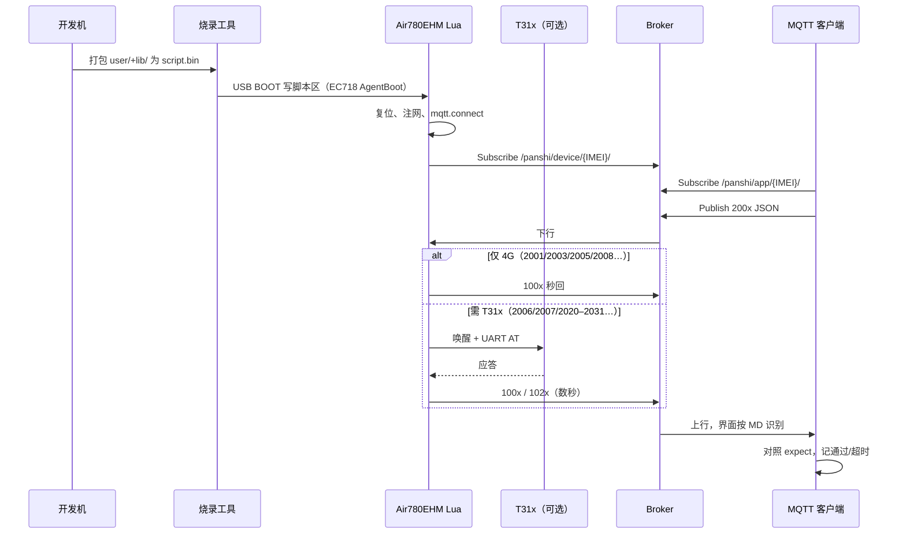

# 磐石 Cat.1 工具链与 MQTT 自动化测试报告

> **日期**：2026-08-17  
> **对象**：Air780EHM（EC718HM）+ 现网样机 IMEI **`862323084068124`**  
> **目的**：把「烧 Lua → 上电联网 → 客户端下发/接收 MQTT → 自动判定」收成一份可执行报告  
> **协议真源**：[`MQTT_PROTOCOL.md`](../mqtt/MQTT_PROTOCOL.md) · **烧录手册**：[`CAT1_FLASH_TOOL.md`](../release/CAT1_FLASH_TOOL.md) · **联调步骤**：[`MQTT_CLIENT_E2E_TEST.md`](../mqtt/MQTT_CLIENT_E2E_TEST.md) · **全指令实机**：[MQTT_ALL_CMD_FLOW_TEST.md](../mqtt/MQTT_ALL_CMD_FLOW_TEST.md)

---

## 1. 结论

本仓库已具备三条可独立使用、也可串成一条流水线的工具：

| 环节 | 工具 | 形态 | 状态 |
|------|------|------|------|
| 烧 Lua / 底层 | `tools/gui/flash/cat1_flash_gui.py` | 图形界面（对齐 Luatools） | 实机已烧通脚本区 |
| 烧 Lua / 底层 | `tools/cat1_flash.py` | 命令行 | 同上 |
| MQTT 下发 / 接收 | `dist/PanshiMqttClient.exe` | 独立 exe（无需 Python） | 已打包，可双击 |
| MQTT 下发 / 接收 | `tools/gui/mqtt/mqtt_tools_gui.py` | 图形界面 | 加载协议 MD、识别、手动/自动测试 |
| MQTT 下发 / 接收 | `tools/gui/mqtt/mqtt_tools_client.py` | 命令行 | `--run-safe` / `--run-all` / `--send 2008` |

**推荐日常路径**：改 `user/` `lib/` → **下载脚本** → USB 日志确认 IMEI/版本 → 打开 **PanshiMqttClient** → 连接现网 Broker → **自动测试（安全查询）** → 需要时再手动发设置/危险命令。

现网身份（2026-08-17 实机 2008）：

| 项 | 值 |
|----|-----|
| IMEI / deviceNo / 设备 ClientId | `862323084068124` |
| 脚本 `VERSION` | `001.000.007`（1008.`scriptVersion`） |
| 合宙 IoT / OTA `version` | `2044.001.007`（1008.`firmwareVersion`） |
| `productKey` | `ThOoUoR77b9EOwNp25mUj6VS2Lce0d5x` |
| Broker | `112.86.146.218:2123`，用户 `fptop1` |
| 下行 Topic | `/panshi/device/862323084068124/` |
| 上行 Topic | `/panshi/app/862323084068124/#` |
| 平台测试 ClientId | `platform-test-001`（**禁止**填 IMEI） |

另一台样机 `862323084068314` 文档见 [`MQTT_862323084068314.md`](../mqtt/MQTT_862323084068314.md)，主题不可混用。

---

## 2. 端到端流程

```text
改 Lua (user/ + lib/)
    │
    ▼
Cat.1 烧录工具  ──下载脚本──►  Air780EHM 脚本区（LuaDB，≤512KB）
    │                              │
    │  USB 日志口 x.2 / 921600     │  模组复位、注网
    ▼                              ▼
日志确认 IMEI / V2044 / 已联网     net_mqtt 连 Broker
                                       │
                                       │  设备 ClientId = IMEI
                                       │  订 /panshi/device/{IMEI}/#
                                       │  发 /panshi/app/{IMEI}/{suffix}
                                       ▼
                         平台客户端（exe / GUI / CLI）
                         ClientId = platform-test-001
                         订 /panshi/app/{IMEI}/#
                         发 /panshi/device/{IMEI}/
                                       │
                    ┌──────────────────┼──────────────────┐
                    ▼                  ▼                  ▼
              协议文档识别        手动选命令发送      自动测试安全集
              dataType/主题/字段   改 JSON 后 Publish   逐条等 100x
```



---

## 3. Cat.1 烧录工具（Lua 代码）

### 3.1 做什么

把仓库里的 **Lua 业务脚本**打成 LuaDB，经 USB 写入 Air780EHM 脚本区。MQTT / PIR / 低功耗等逻辑都在 `user/`、`lib/`，改完必须烧脚本才能在设备上生效。

| 操作 | 界面按钮 | 命令行 | 写入内容 |
|------|----------|--------|----------|
| 只更新业务 | **下载脚本** | `python tools/cat1_flash.py flash-script` | `user/` + `lib/` → 脚本区 |
| 换底层或救砖 | **下载底层和脚本** | `python tools/cat1_flash.py flash-full` | BootLoader + AP + CP + 脚本 |

日常改 MQTT 协议实现：只跑 **下载脚本**。换 `V2044` 内核或模块起不来：用 **下载底层和脚本**。

这是 **4G 模组 USB 烧录**，不是 T31x GPIO28 烧录。

### 3.2 启动

```bat
pip install -r tools/gui/flash/requirements-flash.txt
python tools/gui/flash/cat1_flash_gui.py
```

或双击 `tools/cat1_flash_gui.bat`。

### 3.3 实机要点（已踩过的坑）

| 项 | 正确做法 |
|----|----------|
| 芯片 | Air780EHM = **EC718HM**，AgentBoot 必须用 `tools/agentboot/ec718hm_usb.bin` |
| 错误 AgentBoot | ectool 自带 **EC618** 会在 SCRIPT 写到约 19s 后看门狗复位 |
| USB 写超时 | Windows 整包 64KB 会 `Write timeout`，工具已按 4096 分块 |
| 下载口 | 运行态常见 3～4 个 `VID:19D1`；进 BOOT 后只剩 1 个口才开烧 |
| 日志口 | `location` 含 `x.2`（常见 COM6），921600，`7E00007E` 开日志 |
| 重启 | 日志口发 `AT+ECRST\r\n`（不依赖 Lua） |
| 免 BOOT 进下载 | `AT+ECRST=delay,799` + `7E00027E`；rest / USB 已关则必须按 BOOT |
| 脚本体积 | LuaDB ≤ **512KB**；不要把 `sys.lua` / `log.lua` 等核心库打进去 |

### 3.4 烧完验收（烧录侧）

1. 界面出现「烧录完成」，模组复位。
2. 打开 **4G模块USB打印**，日志出现 `soc poweron`、`LuatOS-SoC_V2044_Air780EHM`。
3. 能解析 `+CSQ` / `+SOCSQ` / IMEI（或随后用 MQTT 2008 核对）。
4. 设备能注网；否则先查 SIM / 天线，不要先怪 MQTT 客户端。

命令行等价：

```bat
python tools/cat1_flash.py flash-script --wait 90
python tools/cat1_flash.py reboot
```

---

## 4. 客户端：下发与接收 MQTT

### 4.1 三种入口（同一套协议）

| 入口 | 命令 | 适用 |
|------|------|------|
| **exe（推荐给测试）** | 双击 `dist/PanshiMqttClient.exe` | 无 Python 环境 |
| **GUI** | `python tools/gui/mqtt/mqtt_tools_gui.py` | 开发机改协议后立刻测 |
| **CLI** | `python tools/gui/mqtt/mqtt_tools_client.py --run-safe` / `--run-all` | 脚本/CI |

重新打包 exe：`tools/build_mqtt_gui_exe.bat`。首次运行 exe 会在同目录写出 `config.json`、`commands.json`、`doc/MQTT_PROTOCOL.md`。

依赖：`pip install -r tools/requirements-mqtt.txt`（`paho-mqtt`）。

### 4.2 连接约定

平台客户端扮演 **App/云**，不是设备：

| 角色 | ClientId | Publish | Subscribe |
|------|----------|---------|-----------|
| 设备 | IMEI | `/panshi/app/{IMEI}/…` | `/panshi/device/{IMEI}/#` |
| 本客户端 | `platform-test-001` | `/panshi/device/{IMEI}/` | `/panshi/app/{IMEI}/#` |

ClientId 填成 IMEI 会把设备踢下线。QoS 用 **1**。载荷 UTF-8 JSON，必须有字符串字段 `dataType`。

默认账号与 `user/config.lua` `MQTT_CFG` 一致，写在 `tools/gui/mqtt/config.json`。

### 4.3 界面页签（下发 / 接收）

| 页签 | 行为 |
|------|------|
| **订阅** | 连接后自动订上行通配；列表显示时间 / dataType / **协议识别** / 主题 / 摘要；点开对照文档字段 |
| **发布** | 手工 JSON 发到设备下行主题 |
| **协议文档** | 默认解析 `doc/MQTT_PROTOCOL.md`（24 条下行 + 24 条上行）；可换其它 md |
| **手动测试** | 从 `commands.json` + 协议表选命令，改 JSON 后发送，等待期望 `100x` |
| **自动测试** | 按分组连跑，记录通过 / 超时 / 跳过 / 耗时 |
| **日志** | 原始 `>>` 下行、`<<` 上行 |

识别规则：用 `dataType` 匹配对照表；1004 再按 `reply=1`（控制回复）或 `stage`（OTA 进度）区分；对照 JSON 示例标出缺字段 / 多字段。

### 4.4 编号规则

下行 **200x** ↔ 上行 **100x**（个位对齐）。主题后缀由协议表决定，例如：

| 下行 | 上行 | 后缀 | 是否秒回 | 是否需 T31x |
|------|------|------|----------|------------|
| 2001 | 1001 | `wakeup` | 是 | 否 |
| 2003 | 1003 | `status` | 是 | 否 |
| 2005 | 1005 | `sim` | 是 | 否 |
| 2008 | 1008 | `version` | 是 | 否 |
| 2006 | 1006 | `identity` | 否（T31x 未就绪则入队） | 是 |
| 2007 | 1007 | `tfcard` | 否 | 是 |
| 2020–2031 | 1020–1031 | `encode` / `record` / `framerate` / `personDetect` / `mic` / `softPhoto` | 否 | 是 |

Lua 入队集合：`user/net_mqtt.lua` `HOST_DL_NEEDS_T31X`（2006/2007/2009/2020–2031）。T31x 没上电时这些命令 **超时是预期**，不能判 Broker 失败。

---

## 5. 自动化测试

### 5.1 命令分组（`tools/gui/mqtt/commands.json`）

**安全集（默认自动跑，只读查询）**

| ID | 名称 | 期望上行 | 需 T31x |
|----|------|----------|--------|
| 2001 | MQTT探活（不上电） | 1001 | |
| 2003 | 状态查询 | 1003 | |
| 2005 | SIM 查询 | 1005 | |
| 2006 | 标识查询 | 1006 | ✓ |
| 2007 | TF 卡查询 | 1007 | ✓ |
| 2008 | 版本查询 | 1008 | |
| 2010q | PIR 查询 | 1010 | |
| 2020 | 编码查询 | 1020 | ✓ |
| 2022 | 录像时长查询 | 1022 | ✓ |
| 2024 | 帧率查询 | 1024 | ✓ |
| 2026 | 人形查询 | 1026 | ✓ |
| 2028 | 麦克风查询 | 1028 | ✓ |
| 2030 | 软光敏查询 | 1030 | ✓ |

**extra**：改 interval、PIR 策略、码率/帧率/人形/麦克风设置。会改设备参数，不要在产线不知情时跑。

**danger**：进 rest、重启、关机、TF 格式化、平台开/停录。GUI 默认不发；CLI 需 `--danger`。

### 5.2 怎么跑

**图形 / exe**

1. 填 IMEI `862323084068124`，ClientId 保持 `platform-test-001`。
2. 连接，确认订阅列表有 `/panshi/app/862323084068124/#`。
3. 打开 **自动测试**：勾选「安全查询」，间隔 0.6s，点 **开始**。
4. 看结果表：通过 / 超时 / 耗时。T31x 未上电时 2006 及之后带 T31x 的条目标「超时」可接受。
5. 需要改字段：到 **手动测试** 选命令，改 JSON，发送。

**命令行**

```bat
python tools/gui/mqtt/mqtt_tools_client.py --send 2008
python tools/gui/mqtt/mqtt_tools_client.py --run-safe
python tools/gui/mqtt/mqtt_tools_client.py --run-all
```

`--run-safe` 只跑安全集，与 GUI 自动测试同源。`--run-all` 含 extra / danger（格式化、重启等），流程与实机见 [MQTT_ALL_CMD_FLOW_TEST.md](../mqtt/MQTT_ALL_CMD_FLOW_TEST.md)。

### 5.3 烧录后标准作业（一次完整自动化）

按顺序做，前一步失败不要跳到 MQTT。

| 步 | 动作 | 通过标准 |
|----|------|----------|
| 1 | `flash-script` 或界面「下载脚本」 | 提示烧录完成，模组复位 |
| 2 | USB 打开打印 | 见 V2044、已联网或正在注网 |
| 3 | 等 MQTT 上线（常电会主动 1001；rest 为 1002+1003） | 客户端订阅后能收到至少一条上行，或 2003 能回 1003 |
| 4 | 手动或自动发 **2008** | 1008：`deviceNo=862323084068124`，`firmwareVersion=2044.001.007`，`scriptVersion=001.000.007` |
| 5 | 自动测试安全集（仅 4G 条） | 2001/2003/2005/2008 **必须通过** |
| 6 | T31x 已上电时再看 2006/2007/2020… | 对应 1006/1007/1020… 在 20s 内到达 |
| 7 | （可选）手动 2003 看电量 / USB | 1003 含 `remainPower`、`lowPowerMode` |
| 8 | （禁止默认）danger | 仅专项测试，且有人值守 |

### 5.4 判定细则

| 结果 | 含义 | 是否算失败 |
|------|------|------------|
| 通过 | 在超时内收到期望 `dataType` | 否 |
| 已发送 | 该命令按 Lua 无固定应答（如 2002 exit） | 否 |
| 超时（需 T31x） | T31x 休眠/未就绪，命令入队 | **4G 单模组验收时不算失败** |
| 超时（2001/2003/2005/2008） | 设备未连上 Broker、IMEI 错、或 ClientId 互踢 | **失败** |
| 跳过 | 未勾选危险分组 | 否 |

2008 黄金样例（现网）：

```json
{
  "deviceNo": "862323084068124",
  "dataType": "1008",
  "scriptVersion": "001.000.007",
  "firmwareVersion": "2044.001.007",
  "coreVersion": "2044",
  "project": "PANSHI_CAT1",
  "buildTag": "v20260730",
  "productKey": "ThOoUoR77b9EOwNp25mUj6VS2Lce0d5x"
}
```

OTA 的 `version` 必须等于 `firmwareVersion`（`2044.001.007`），不能填脚本 `001.000.007`。

---

## 6. 故障对照

| 现象 | 先查 |
|------|------|
| 烧录 SCRIPT 中途复位 | 是否误用 EC618 AgentBoot；本工具应加载 `ec718hm_usb.bin` |
| 烧完无日志 | 等枚举出 3～4 个合宙口，打开 `x.2` 日志口 |
| 客户端连上但无任何上行 | 下行 Topic 是否带尾斜杠；IMEI 是否 8124 而不是 8314；设备是否已 mqtt conack |
| 设备反复掉线 | 测试 ClientId 是否写成了 IMEI |
| 2008 超时 | 设备没联网，或订错了 `/panshi/app/{错误IMEI}/#` |
| 2006/2020 超时、2008 成功 | T31x 未上电，属实现行为 |
| 识别为「未收录」 | 协议 md 未加载，或 dataType 不是字符串 |

---

## 7. 文件清单

| 路径 | 角色 |
|------|------|
| `tools/cat1_flash.py` / `cat1_flash_gui.py` | 烧录逻辑与界面 |
| `tools/agentboot/ec718hm_usb.bin` | EC718 USB AgentBoot |
| `tools/gui/mqtt/mqtt_tools_gui.py` | MQTT 图形客户端 |
| `tools/gui/mqtt/mqtt_tools_client.py` | MQTT 命令行 |
| `tools/gui/mqtt/protocol_md.py` | 解析协议 Markdown |
| `tools/gui/mqtt/commands.json` | 自动/手动测试用例 |
| `tools/gui/mqtt/config.json` | Broker / IMEI / 平台 ClientId |
| `dist/PanshiMqttClient.exe` | 已打包客户端 |
| `tools/build_mqtt_gui_exe.bat` | 重新打 exe |
| `doc/MQTT_PROTOCOL.md` | 协议完整版（客户端默认加载） |
| `doc/MQTT_ALL_CMD_FLOW_TEST.md` | 全指令流程、AT、实机结果 |
| `user/net_mqtt.lua` | 设备侧分发与上行 |
| `user/main.lua` | `VERSION` / `PRODUCT_KEY` / `IOT_VERSION` |
| `user/config.lua` | `MQTT_CFG` |

---

## 8. 一页口令

```bat
:: 1) 烧最新 Lua
python tools/cat1_flash.py flash-script --wait 90

:: 2) 命令行冒烟（设备已联网）
python tools/gui/mqtt/mqtt_tools_client.py --send 2008
python tools/gui/mqtt/mqtt_tools_client.py --run-safe
:: 全指令（含 extra/danger，见 MQTT_ALL_CMD_FLOW_TEST.md）
python tools/gui/mqtt/mqtt_tools_client.py --run-all

:: 3) 或开界面 / exe
python tools/gui/flash/cat1_flash_gui.py
dist\PanshiMqttClient.exe
```

界面自动测试：只勾「安全查询」→ 开始。  
**2001 / 2003 / 2005 / 2008 全绿**，即认为本次烧录后的 MQTT 主链路通过。
