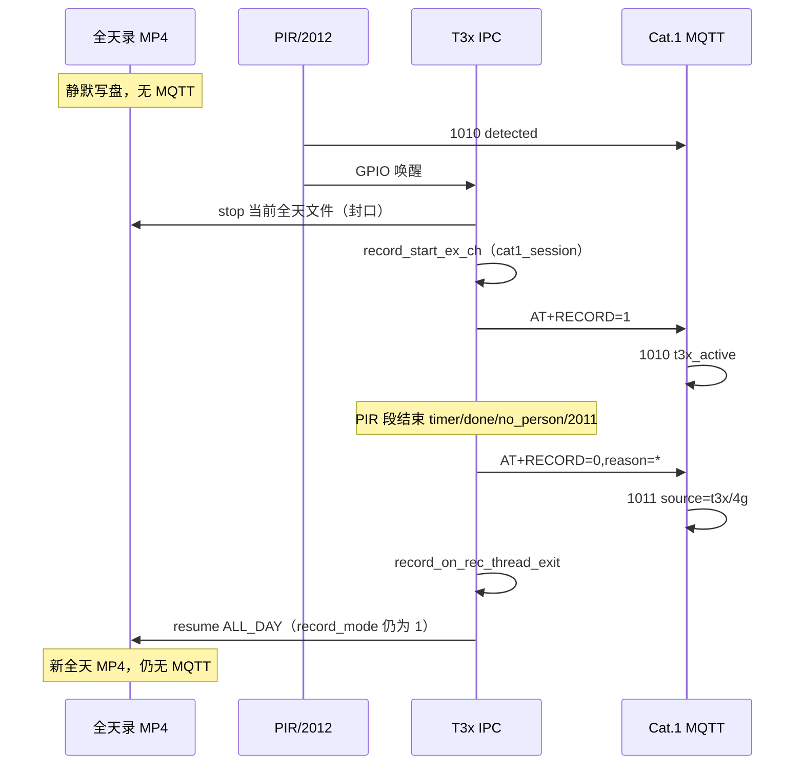

# 全天录像 vs PIR 事件录 — 后台调度与 MQTT / GB28181 区分说明

> **定位**：说明 `record_mode=1`（全天录）与 PIR / 平台 **2012** 事件录在设备侧如何叠加；**MQTT、TF 卡、GB28181** 各能区分什么；后台如何调度「PIR 录像信息」。  
> **关联**：[record_mode_and_storage_paths.md](record_mode_and_storage_paths.md) · [cat1_pir_mqtt_action_config.md](cat1_pir_mqtt_action_config.md) · [T3X_RECORD_MQTT_FLOW.md](T3X_RECORD_MQTT_FLOW.md) · [gb28181_livegbs_alarm_e2e.md](gb28181_livegbs_alarm_e2e.md) · [pir_person_detect_complementary_flow.md §13](pir_person_detect_complementary_flow.md#13-gb28181-融合已有什么还要改什么)

---

## 1. 两套「在录」概念（必读）

很多人把「TF 卡在写 MP4」和「PIR 触发了录像」混成一件事。设备里实际是 **两层状态**：

| 层级 | 谁维护 | 典型条件 | 含义 |
|------|--------|----------|------|
| **T31x 本地写盘** | IPC `record_*` | `record_enable=1` 且 **`record_mode=1`（全天）** | 开机 `record_start_ch()`，**持续写 TF 卡** |
| **4G PIR 会话** | `pir_ctrl.session.recording` | PIR 或 **2012** 后 `beginVideoSession` | MQTT **1010/1011/1012**、定时器、`stopOnCloud` 都看这层 |

| 配置 | 开机行为 |
|------|----------|
| **`record_mode=3`**（门球默认） | 开机 **不写盘**；PIR/2012 才开段 |
| **`record_mode=1`** | 开机 **全天写盘**；PIR `video/both` 会 **打断** 当前文件再开事件段 |

**要点**：全天录进行时，4G 侧 **`session.recording` 常为 0**，且 **不一定** 有 `AT+RECORD=1`；TF 卡却在持续增长。

---

## 2. 全天 + PIR 叠加时的设备流程

前提：`record_mode=1` + MQTT 2010 `action=video` 或 `both`（或平台 **2012**）。



| 阶段 | TF 卡 | MQTT | 内部标志 |
|------|-------|------|----------|
| 全天进行中 | 长 MP4 持续增长 | **无** 1010/1011 | 无 `cat1_session` |
| PIR 打断 | 旧文件 **提前结束** | `detected` → `t3x_active` | `record_set_cat1_session_ch(1)` |
| PIR 段结束 | **短 MP4** 封口 | **1011** + `reason`/`source` | `record_on_rec_thread_exit` |
| 恢复全天 | **新** 长 MP4 | **仍无** | `storage_mp4_try_resume_all_day_ch` |

源码：`cat1_module.c` `ipc_record_start`（已在录则先 `record_stop_ch`）；`storage_mp4_api.c` `storage_mp4_try_resume_all_day_ch`。

**PIR 段结束后会恢复全天录**，条件是 **`record_mode` 仍为 1**；恢复的是 **新文件**，不是接着旧全天文件写。

| PIR `action`（2010） | 全天已开时 |
|----------------------|------------|
| **photo** | 只抓拍，**不打断**全天 MP4 |
| **video** / **both** | **打断**并重开 PIR 会话段 |
| 平台 **2012** | 同 **video**（`last=cloud_start`，立即开录） |

---

## 3. 四条并行链路（后台总览）

```text
链路 A  MQTT 1010/1011/1012     → 磐石后台（4G 发）— 标「事件录会话」
链路 B  UART HOSTEVT/PIRSTAT    → IPC 读参（无文件类型）
链路 C  GB28181 SIP 报警         → LiveGBS alarm/list（IPC 发）— 标「报警事件」
链路 D  TF 卡 MP4               → 本地 / P2P / GB28181 回放（无 pir/allday 字段）
```

| 链路 | 能否标「这段 MP4 是全天还是 PIR」 |
|------|----------------------------------|
| **MQTT** | ✅ 有 1010/1011 的时段 → **事件录**；无 MQTT 的长文件 → **启发式全天** |
| **GB28181 报警** | ⚠️ 仅 PIR/人形 **报警时刻**；**不能**标录像文件类型 |
| **GB28181 录像回放** | ❌ RecordInfo 与 TF 索引 **无** 类型字段 |
| **TF 文件名** | ❌ 同路径 `ch0_开始_结束.mp4` |

---

## 4. MQTT：后台如何调度 PIR 录像信息

### 4.1 订阅主题

```text
/panshi/app/{IMEI}/pir      → 1010
/panshi/app/{IMEI}/event    → 1011 / 1012 / 1004
```

### 4.2 PIR 触发事件录（典型上行）

| 顺序 | dataType | 主题 | 关键字段 | 含义 |
|------|----------|------|----------|------|
| 1 | **1010** | `pir` | `pirStatus=detected` | PIR 硬件触发 |
| 2 | **1010** | `pir` | `pirStatus=t3x_active`, `active=1` | T3x 已写盘（**可对 MP4**） |
| 3 | **1011** | `event` | `source`, `reason` | 事件段结束 |

可选：`person_update`（`personCount`）、`1001`（`uploadMode=auto` 唤醒）。

### 4.3 平台 2012 开录（无 `detected`）

| dataType | 含义 |
|----------|------|
| **1004** | `action=pir_start` |
| **1012** | 平台开录受理（`source=4g`） |
| **1010** | 可选 `t3x_active` |
| **1011** | 停录（`reason=timer/device/...`） |

4G `PIRSTAT` 里 `last=cloud_start` 表示平台开录，IPC **立即开录**（不等人形宽限）。

### 4.4 标志字段：`source` 与 `reason`

**`source`（1011）**

| 值 | 含义 |
|----|------|
| `t3x` | T3x `AT+RECORD=0` 结束（写盘侧） |
| `4g` | 4G 会话结束（如定时到且 T3x 未写盘） |

**`reason`（1011 / AT+RECORD=0）**

| reason | 含义 |
|--------|------|
| `done` | 正常写完 |
| `timer` | 4G `max_sec` 到 |
| `device` | 平台 **2011** |
| `no_person` | 宽限内无人（`stop_if_no_person=1`） |
| `pir_retrigger` | 录像中二次 PIR |
| `time_sync` / `no_iframe` / `open_failed` | 开录失败或异常 |

### 4.5 全天录在 MQTT 上的表现

| 现象 | 说明 |
|------|------|
| TF 在写、无 1010/1011 | **正常**：全天录 **不上报** MQTT |
| `2010 query` 里 `recording=0` | **正常**：4G 会话未开，与 TF 是否在写 **可能不一致** |
| `2011` 无 1011 | 若未开 4G 会话，**停不了** 全天录 |

**调度建议**：用 **1010 `t3x_active` 时刻 ~ 1011 时刻** 框定「事件录 MP4」；无 MQTT 的连续长文件视为「全天段」（启发式）。

---

## 5. TF 卡文件：无类型字段

路径（主码流 ch0）：

```text
/mnt/sdcard/media/vi0/YYYYMMDD/ch0_YYYYMMDDHHMMSS_YYYYMMDDHHMMSS.mp4
```

| 特征 | 更可能 |
|------|--------|
| 时段内有 **1010/1011** | **PIR/平台事件段** |
| 很长、前后无 MQTT 录像事件 | **全天段** |
| PIR 打断全天 | 前文件突然变短 + 短文件 + 再出现长文件 |

---

## 6. GB28181：能否区分全天 vs PIR 录像

### 6.1 结论

| 问题 | 答案 |
|------|------|
| GB28181 能否标「这个 MP4 是全天还是 PIR」？ | **不能**（索引/回放无类型） |
| GB28181 能否标「发生过 PIR/人形事件」？ | **能**（`alarm/list` 报警时间轴） |
| 全天录开始/恢复是否上报警？ | **不会**自动上报 |

### 6.2 门球默认报警（`gb28181_defer_pir_motion=1`）

| 场景 | GB28181 | AlarmDescription |
|------|---------|------------------|
| 全天静默写盘 | **无** | — |
| PIR 唤醒（defer=1） | **通常无** | 不报 `PIR Motion` |
| IVS 确认人形 | **有** | `Person Detect` |
| 宽限无人（可选） | 可选 | `PIR Unconfirmed` |
| `defer=0` | **有** | `PIR Motion` |

统一：`AlarmMethod=5`，`AlarmType=2`；靠 **Description** 区分，**无** `recordType=all_day|pir`。

### 6.3 与 MQTT 对照（门球默认 defer=1）

| 事件 | MQTT | GB28181 |
|------|------|---------|
| PIR 唤醒 | 1010 `detected` | 通常 **无** |
| 人形确认 | `person_update` | **`Person Detect`** |
| 无人停录 | 1011 `no_person` | 无或 `PIR Unconfirmed` |
| 全天录 | **无** | **无** |

### 6.4 LiveGBS 侧调度 PIR 相关录像

```text
1. GET /api/v1/alarm/list
   → AlarmMethod=5，Description=Person Detect / PIR Motion / PIR Unconfirmed

2. 取 alarm_time（注意 30s 防抖）为 PIR 事件窗口

3. RecordInfo / TF 拉片 → StartTime/EndTime 落在窗口内的 MP4 → 视为事件段

4. 长时间且无上述报警的 MP4 → 启发式标为全天段
```

**精确标事件录仍以 MQTT 1010/1011 为主**；GB28181 适合 LiveGBS **预案抓拍/录像** 触发。

---

## 7. 内部标志（运维 / 串口，一般不给云）

| 标志 | 全天录 | PIR/事件录 |
|------|--------|------------|
| `record_mode=1` | 配置层全天 | 配置仍可为 1 |
| `record_set_cat1_session_ch` | 无 | 有 |
| `AT+RECORD=1/0`（T3x→4G） | 不发 | 发 |
| 4G `PIRSTAT recording=1` | 0 | 1 |
| Host `AT+RECORD?`（4G 问 T3x） | `running=1` 可无 MQTT | 与 1010/1011 一致 |

---

## 8. 产品配置与后台策略

| 产品目标 | T31x `record_mode` | MQTT 2010 | 后台策略 |
|----------|-------------------|-----------|----------|
| 纯 PIR 门球 | **3** | `video` | 全靠 MQTT 1010/1011 |
| 7×24 存证 + PIR 只抓拍 | **1** | **photo** | 长文件=全天；抓拍看 `snapshot_saved` |
| 7×24 + PIR 也录段 | **1** | `video` | MQTT 事件窗 + 文件时长；GB28181 `Person Detect` 辅助 |
| 不要全天 | **3** | `video` | 无静默全天文件 |

---

## 9. 若后台必须显式 `recordType`

当前协议 **无** 统一字段。可选增强（需改固件）：

- MQTT 1011/1012 增加 `recordType=pir|allday`
- GB28181 自定义 Description 或扩展字段
- TF 索引增加 `session=cat1`

---

## 10. 联调检查清单

| # | 场景 | MQTT | GB28181 | TF 卡 |
|---|------|------|---------|-------|
| 1 | `record_mode=1` 开机 | 无 1010/1011 | 无报警 | 持续增长 MP4 |
| 2 | PIR + video | detected → t3x_active → 1011 | Person Detect（defer=1） | 短 MP4 |
| 3 | PIR 结束后 | 无新 1010 | 无 resume 报警 | 新长 MP4 |
| 4 | 仅 2012 | 1012 + 1011 | 无 Motion（cloud_start） | 事件段 MP4 |
| 5 | `record_mode=3` | 仅 PIR 时有 1010/1011 | 同 PIR 列 | 无静默全天 |

---

## 11. 源码索引

| 能力 | 位置 |
|------|------|
| PIR 打断全天开录 | `app/cat1/cat1_module.c` `ipc_record_start` |
| 恢复全天录 | `third/libmedia/librecord_mp4/storage_mp4_api.c` `storage_mp4_try_resume_all_day_ch` |
| MQTT 1010/1011 | 4G `net_mqtt.lua` |
| GB28181 PIR/人形 | `app/cat1/media_ops.c`、`person_detect_pir_sync.c` |
| 开机全天 | `main.c` + `record_mode=1` |

---

## 12. 相关文档

| 文档 | 内容 |
|------|------|
| [mqtt_2010_2012_2011_pir_flow.md](mqtt_2010_2012_2011_pir_flow.md) | 2010/2012/2011 与 PIR |
| [cat1_pir_mqtt_action_config.md](cat1_pir_mqtt_action_config.md) | 全天 vs PIR action 配对 |
| [T3X_RECORD_MQTT_FLOW.md](T3X_RECORD_MQTT_FLOW.md) | 1010/1011 reason 全表 |
| [pir_person_detect_complementary_flow.md](pir_person_detect_complementary_flow.md) | PIR+IVS、GB28181 §13 |
| [gb28181_livegbs_alarm_e2e.md](gb28181_livegbs_alarm_e2e.md) | LiveGBS alarm/list |
| [record_mode_and_storage_paths.md](record_mode_and_storage_paths.md) | record_mode 四种模式 |

---

## 修订记录

| 日期 | 说明 |
|------|------|
| 2026-06-07 | 初版：全天 vs PIR 叠加、MQTT/TF/GB28181 区分与后台调度 |
