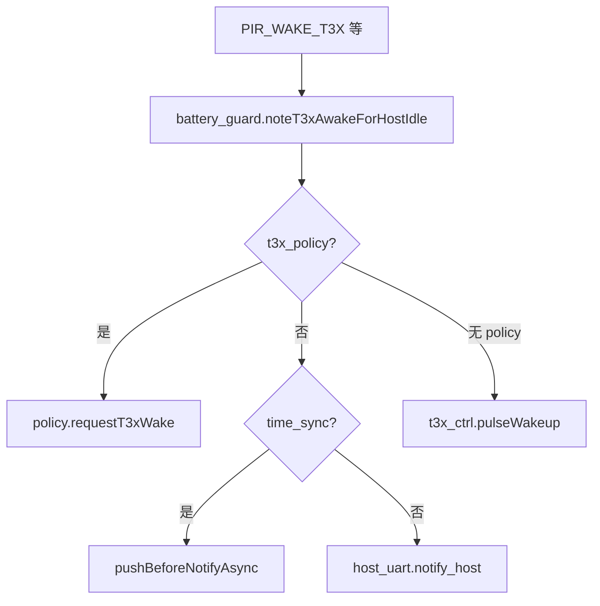

# app.lua 事件总线

> **代码真源**：[`user/app_config.lua`](../../user/app_config.lua)（`APP_EVENTS`）· [`user/app.lua`](../../user/app.lua)（订阅表）  
> **总览**：[LUA_MODULES.md](../LUA_MODULES.md) §2

---

## 1. 设计原则

| 原则 | 说明 |
|------|------|
| 常量集中 | 事件名定义在 `APP_EVENTS`，避免字符串散落 |
| 编排集中 | `app.lua` 是唯一「跨模块副作用」订阅中心 |
| lib 不反向依赖 user | `pir_ctrl` / `host_uart` 只 `sys.publish`，不 `require net_mqtt` |
| 内部事件 | `BATTERY_UPDATE`、`net_ready`、`mqtt_pub` 等未列入 `APP_EVENTS` |

订阅入口：`setupEventHandlers()` → `subscribeAll(buildSystemEventHandlers())` + `subscribeAll(buildPirMqttHandlers())`。

---

## 2. 系统事件（`buildSystemEventHandlers`）

| 事件 | 发布方 | app 处理 |
|------|--------|----------|
| `POWER_ENTER_REST` | `net_mqtt` 2002、`host_uart` AT | `onEnterLowPower("mqtt_2002")` |
| `POWER_EXIT_REST` | 同上 | `onExitLowPower("mqtt_2002")` |
| `POWER_ENTERED_REST` | `app.doEnterLowPowerBody` | 广播（可扩展） |
| `POWER_EXITED_REST` | `app.onExitLowPower` | 广播 |
| `DEVICE_REBOOT_REQUEST` | `net_mqtt` 2004、`host_uart` | `onReboot` |
| `DEVICE_POWER_OFF_REQUEST` | 同上 | `onPowerOff("mqtt")` |
| `GPIO_PWRKEY_LONG` | `peripheral` | 关机（USB 插入宽限期内忽略） |
| `GPIO_BOOTKEY_LONG` | `peripheral` | `tryEnterT3xBurnMode` |
| `GPIO_COPROC_READY` | `peripheral` | 退出烧录、恢复 PIR/MQTT |
| `GPIO_USB_DET_CHANGED` | `usb_charge` | `applyUsbInsertState` + 延迟 1003 |
| `GPIO_CHG_STATE_CHANGED` | `usb_charge` | 充电状态变化 → `publishStatus` |
| `GPIO_VBUS_CHANGED` | PMD、`initPowerStatus` | 电源状态同步 |
| `BATTERY_UPDATE` | `vbat` | `battery_guard.onBatteryUpdate` |
| `MQTT_OFFLINE` | `net_mqtt` | `onMqttOffline` → 可选 `requestT3xWake` |

---

## 3. PIR / T3x → MQTT 桥（`buildPirMqttHandlers`）

| 事件 | 发布方 | app → 下游 |
|------|--------|------------|
| `PIR_WAKE_T3X` | `pir_ctrl` | `wakeT3xForPir` + 可选 `publishWakeup` |
| `PIR_MEDIA_EFFECTIVE` | `pir_ctrl` | `publishPirToMqtt`（media_sync） |
| `PIR_REQUEST_T3X_STOP` | `pir_ctrl` | `wakeT3xForPir("pir_stop_*")` |
| `PIR_STOP_RECORDING` | `pir_ctrl` | 1011 / T3x 优先 + fallback 定时器 |
| `PIR_TIMER_EXPIRED` | `pir_ctrl` | `publishStopRecording(timer)` |
| `GPIO_PIR_TRIGGERED` | `pir_ctrl` | `publishPirToMqtt`（detected） |
| `T3X_SNAPSHOT_DONE` | `host_uart` | `publishPirSnapshotDone` |
| `T3X_RECORD_ACTIVE` | `host_uart` | `publishPirRecordActive` |
| `T3X_RECORD_STOP` | `host_uart` | `publishT3xRecordStop` |
| `T3X_PERSON_CNT` | `host_uart` | `publishPirToMqtt`（person_update） |
| `T3X_IPC_ALERT` | `host_uart` | `ipc_supervision.onAlert` |

---

## 4. 唤醒路径（`wakeT3xForPir` / `requestT3xWake`）



`noteT3xAwakeForHostIdle`：5~20% 中间档 PIR 唤醒后 **30s** 内拒绝 HOSTIDLE（见 [BATTERY_GUARD_TIERS.md](BATTERY_GUARD_TIERS.md)）。

---

## 5. 低功耗与 USB 编排

### 5.1 进入 rest（`onEnterLowPower`）

1. `usb_policy.blocks4gRest()` 门禁  
2. 可选低电提示音  
3. `doEnterLowPowerBody`：`POWER_ENTERED_REST` → `t3x_ctrl.enterSleep` → `publishRest` → `low_power_wakeup.onEnterRest`

### 5.2 退出 rest（`onExitLowPower`）

1. `setLowPowerMode(false)` → `POWER_EXITED_REST`  
2. `exitRestIfNeededAfterUsbInsert`（USB 去重唤醒）  
3. `requestT3xWake`（**不再**重复 `time_sync.onT3xWake`）  
4. `low_power_wakeup.onExitRest`

### 5.3 USB 插入（`applyUsbInsertState`）

- 更新 `APP_RUNTIME.power_status`  
- `battery_guard.onUsbInserted` / 取消关机定时器  
- `notifyT3xUsbHostIdlePolicy`  
- 冷启动 `source=="boot"` 时跳过重复 `wake_t3x`

---

## 6. 其它 APP_EVENTS（少订阅或仅发布）

| 事件 | 说明 |
|------|------|
| `PIR_HW_TRIGGERED` | 硬件中断 → `pir_ctrl` 内部消费 |
| `MQTT_CONNECTED` | `net_mqtt` conack；身份上报钩子 |
| `MQTT_SERVER_DATA` | 每条下行后日志 |
| `MQTT_PUBLISH_WAKEUP` / `REST` | 上行发布后 |
| `MQTT_STATUS_INTERVAL_CHANGED` | 2003 改心跳间隔 |
| `MQTT_USB_RECOVERY_CHANGED` | USB 恢复策略 |
| `DEVICE_OTA_REQUEST` | 2004/2005 OTA |
| `HOST_UART_FIRST_AT` | 首条 AT 后自动身份上报 |
| `UART_RX_*` | `uart_bridge` 原始数据（可选） |

完整常量列表见 `user/app_config.lua` 中 `_G.APP_EVENTS`。

---

## 7. 启动顺序（与事件相关）

```text
app.start
  → battery_guard.start(hooks)
  → setupUartBridge / host_uart.start
  → initPowerStatus（可能触发 USB 事件）
  → t3x_ctrl.start / bootPowerOn
  → setupEventHandlers（PIR + 系统订阅）
  → startBackgroundServices（vbat → BATTERY_UPDATE）
  → bootMqtt
```
