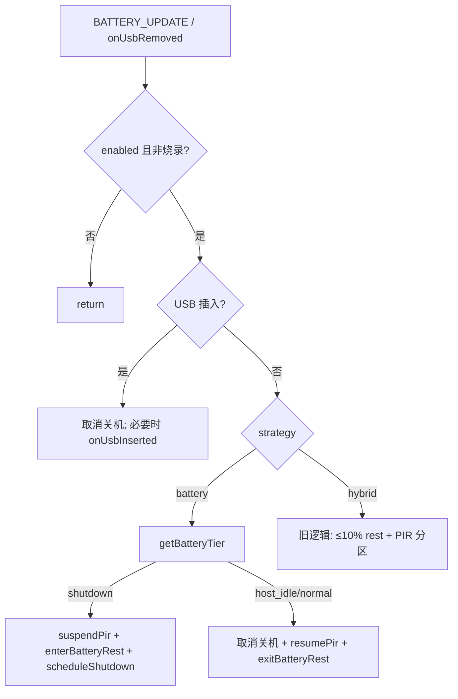

# battery_guard 电量分档策略

> **代码真源**：[`user/battery_guard.lua`](../../user/battery_guard.lua) · [`user/config.lua`](../../user/config.lua)  
> **关联**：[POWER_USB_BATTERY_T3X_LOGIC.md](../POWER_USB_BATTERY_T3X_LOGIC.md) · [LOW_POWER_ENTER_STRATEGY.md](../LOW_POWER_ENTER_STRATEGY.md)

---

## 1. 策略开关

| 项 | 说明 |
|----|------|
| `MODULE_FLAGS.battery_guard` | 模块总开关 |
| `BATTERY_CFG.guard.enabled` | 配置开关 |
| `LOW_POWER_ENTER_STRATEGY` | `battery`（默认）/ `hybrid` / `idle_poll` |

---

## 2. 三档模型（`battery` 策略，默认）

| 档位 | 电量 | 4G | T31 | PIR |
|------|------|-----|-----|-----|
| `normal` | **> 20%** | normal | 常电，**拒 HOSTIDLE** | 正常 |
| `host_idle` | **5% < pct ≤ 20%** | normal（不进 rest） | 允许 HOSTIDLE 断电 | 可唤醒；30s 内拒 HOSTIDLE |
| `shutdown` | **≤ 5%** | rest + 关机定时器 | 断电 | `suspendPir` |

暴露：`getBatteryTier(pct)` · `APP_RUNTIME.battery_tier`

配置键：`host_idle_below_percent=20` · `shutdown_percent=5` · `host_idle_min_awake_sec=30`

---

## 3. evaluate 决策流



**USB 始终优先**：插入后 `evaluate` 在 USB 检测处直接 return，不按百分比断 T31。

---

## 4. HOSTIDLE 门禁 API

| 函数 | 用途 |
|------|------|
| `shouldAllowHostIdleSleep()` | 仅 `host_idle` 档返回 true |
| `canAcceptHostIdleSleep()` | 唤醒后 `host_idle_min_awake_sec` 内返回 false |
| `noteT3xAwakeForHostIdle()` | PIR/唤醒时记录时间戳 |

调用方：`host_uart.uart_hostidle` → `+HOSTIDLE:BUSY` 或 `OK`

---

## 5. USB 插入（`onUsbInserted`）

| 步骤 | 行为 |
|------|------|
| 1 | `cancelShutdownTimer()` |
| 2 | 清除 rest / PIR 挂起状态 |
| 3 | 若在 rest → `onExitLowPower("usb_insert")`（**唯一唤醒链**） |
| 4 | 否则且 `source≠"boot"` → `wake_t3x` |
| 5 | 冷启动 USB → 跳过 `wake_t3x`，由 `t3x_ctrl.bootPowerOn` |

---

## 6. ≤5% 关机路径

```
handleShutdownZone
  → suspendPir()
  → enterBatteryRest() → hooks.on_enter_low_power("battery")
       → app.onEnterLowPower → MQTT 1002 + t3x enterSleep
  → scheduleShutdown(3s) → hooks.on_power_off → notifyPowerOff → pm.shutdown
```

插 USB 可取消定时器；`onPowerOff` 内再次检查 `isUsbInserted()`。

---

## 7. hybrid 策略（旧机型）

| 阈值 | 行为 |
|------|------|
| ≤ `t3x_rest_percent`（10%） | 进 4G rest（连续确认 + 最短停留） |
| `pir_suspend_percent` ~ `pir_resume_percent` | 挂起/恢复 PIR |
| ≤ `shutdown_percent` | 同 battery 关机 |

---

## 8. hooks（`battery_guard.start`）

| hook | app 绑定 |
|------|----------|
| `on_enter_low_power` | `onEnterLowPower` |
| `on_exit_low_power` | `onExitLowPower` |
| `on_power_off` | `onPowerOff("battery")` |
| `wake_t3x` | `requestT3xWake("battery_usb", force)` |
| `is_usb_inserted` | `usb_charge` / `power_status` |

---

## 9. getState 调试字段

`battery_tier` · `pir_suspended` · `rest_by_battery` · `shutdown_pending` · `host_idle_wake_ts` · `enter_confirm_streak` 等。

---

**版本**：2026-06-30
