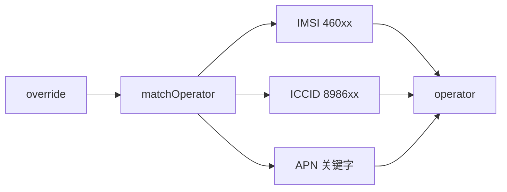

# cellular_bootstrap 蜂窝入网引导

> **代码真源**：[`lib/cellular_bootstrap.lua`](../../lib/cellular_bootstrap.lua)  
> **配置**：`CELLULAR_CFG`（[`config.lua`](../../user/config.lua)）  
> **启动**：[`user/main.lua`](../../user/main.lua) · **MQTT**：[`net_mqtt.lua`](../../user/net_mqtt.lua) `bootstrapNetwork`

---

## 1. 模块职责

| 项 | 说明 |
|----|------|
| **运营商识别** | IMSI / ICCID / APN / 小区 PLMN → mobile/unicom/telecom |
| **APN 下发** | 按运营商选 `apn_by_operator` 或模组 auto |
| **入网等待** | `waitForNetwork` → `IP_READY` + 有效 IP |
| **运行时导出** | `APP_RUNTIME.sim_operator*` / `cellular_apn` / `sim_present` |

`MODULE_FLAGS.cellular=false` 或 `CELLULAR_CFG.enabled=false` 时短路。

---

## 2. 启动顺序（main.lua）

```text
cellular_bootstrap.start()
  → subscribe SIM_IND
  → mobile.setAuto(...)
  → task: waitSimInfo → applyApnForSim
app.start → net_mqtt.bootstrapNetwork()
  → 内部可调用 waitForNetwork()
```

RNDIS 开启时：`usb_rndis.open()` 完成后再 `bootstrapNetwork`（见 [USB_RNDIS_FLOW.md](USB_RNDIS_FLOW.md)）。

---

## 3. 运营商检测



| 方法 | 优先级 |
|------|--------|
| `sim_operator_override` | 最高（配置强制） |
| IMSI 前缀 `46000`~`46013` | 高 |
| ICCID 前 6 位 | 中 |
| 当前 APN 关键字 | 低 |

`detectServingOperator()`：可选后台 `reqCellInfo` + `CELL_INFO_UPDATE` 刷新服务小区 PLMN。

---

## 4. APN 策略（`applyApnForSim`）

| 条件 | 行为 |
|------|------|
| `apn_auto` 且非 `force_explicit_apn[op]` | `mobile.apn(0,1,"","",...)` auto |
| `apn_by_operator[op]` 有值 | 显式 APN（如联通 `3gnet`） |
| `force_explicit_apn.unicom=true` | 联通强制显式，不用 auto |

联通入网失败时 `waitForNetwork` 第一次重试可切 `unicom_apn_fallback`（默认 `scuiot`），再 `mobile.reset()`。

---

## 5. waitForNetwork

```text
waitSimInfo(sim_wait_ms)
  → applyApnForSim
循环 max_reset_attempts（默认 3）:
  → sys.waitUntil("IP_READY", bootstrap_timeout_ms)
  → socket.localIP 有效?
      是 → 成功
      否 → reset_delay → mobile.reset → 再 applyApn
```

失败写 `lastState.ip_ready=false` 并 `exportRuntime()`。

---

## 6. SIM 热插拔（`SIM_IND`）

| status | 行为 |
|--------|------|
| `RDY` | `sim_present=true`；延迟 500ms `applyApnForSim` |
| `NORDY` | `sim_present=false`；`apnApplied=false` |

---

## 7. 配置（`CELLULAR_CFG` 摘要）

| 键 | 默认 | 说明 |
|----|------|------|
| `apn_auto` | true | 优先模组 auto APN |
| `apn_by_operator` | cmnet/ctnet/3gnet | 三网显式 APN |
| `force_explicit_apn.unicom` | true | 联通不用 auto |
| `unicom_apn_fallback` | scuiot | 联通重试备用 APN |
| `sim_wait_ms` | 30000 | 等 IMSI/ICCID |
| `bootstrap_timeout_ms` | 60000 | 单次 IP_READY 超时 |
| `max_reset_attempts` | 3 | 模组 reset 次数 |
| `reset_delay_ms` | 30000 | reset 前等待 |
| `cell_info_refresh_on_start` | false | 启动即刷小区信息 |

---

## 8. 对外 API

| 函数 | 说明 |
|------|------|
| `start()` | 订阅 SIM、setAuto、异步 APN |
| `waitForNetwork()` | 阻塞等 IP（bootstrap 用） |
| `applyApnForSim()` | 按卡选 APN |
| `detectOperator` / `resolveOperator` | 运营商识别 |
| `detectServingOperator()` | 服务小区运营商 |
| `getLastState()` / `getOperatorName()` | 快照 |

MQTT clientId / 主题 IMEI 依赖 `device_id`（见 [LIB_RUNTIME_UTILS.md](LIB_RUNTIME_UTILS.md)），与蜂窝引导并行无硬依赖。
