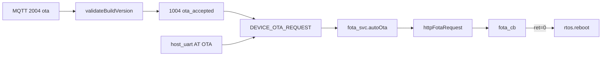

# fota_svc LuatOS OTA

> **代码真源**：[`user/fota_svc.lua`](../../user/fota_svc.lua) · [`user/main.lua`](../../user/main.lua)（`PRODUCT_KEY` / 版本）  
> **配置**：`FOTA_CFG`（[`config.lua`](../../user/config.lua)）  
> **触发**：MQTT 2004 `action=ota` · `DEVICE_OTA_REQUEST` · `REST_SEND_OTA`  
> **详述**：[OTA_FLOW.md](../OTA_FLOW.md) · [OTA_SERVER.md](../OTA_SERVER.md)

---

## 1. 模块职责

| 项 | 说明 |
|----|------|
| **输入** | 云端 MQTT 2004、内部事件 `DEVICE_OTA_REQUEST` |
| **下载** | 合宙 IoT 平台 HTTP 或 MQTT 下发的完整 `url` |
| **上报** | `publishStatus` 回调 → `net_mqtt.publishOtaStatus`（1004 OTA 阶段） |
| **完成** | 下载成功默认 `rtos.reboot()` |

`MODULE_FLAGS.fota=false` 时不启动；`app.setupFota` 注入 `publishStatus`。

---

## 2. 触发链路



`net_mqtt` `DL2004_ACTIONS.ota`：校验 `version` 格式（`xxx.yyy.zzz`）后 `reply(0)` 并发布事件。

---

## 3. `autoOta` 执行步骤

1. **busy 检查** — 进行中则 `reportStatus("busy", ...)`
2. **等网络** — `waitNetworkReady(network_wait_ms)`，默认 120s
3. **构建 opts** — `buildIotOpts(data)`：
   - 有 `url` / `otaUrl` / `firmwareUrl` → 直连 HTTP（`###` 前缀表示 URL 已含查询串）
   - 否则合宙 IoT：`project_key` + `version` + `firmware_name` + IMEI/MAC/UID
4. **校验** — `validateIotConfig`（缺 `PRODUCT_KEY` / version 等则失败）
5. **HTTP 下载** — `httpFotaRequest` → `libfota` 或写 `/update.bin`
6. **超时兜底** — `callback_timeout_ms`（默认 320s）未回调则 `callback_timeout`
7. **回调** — `fota_cb(ret)` → 上报 + 可选重启

---

## 4. 返回码（`FOTA_RET`）

| ret | stage | message | 重启 |
|-----|-------|---------|------|
| 0 | success | download_ok | 是（默认） |
| 1 | failed | connect_failed | 否 |
| 3 | failed | iot_rejected | 否 |
| 4 | failed | recv_error | 否 |
| 5 | failed | version_format_error | 否 |

---

## 5. 合宙 IoT URL 构建

默认：`http://iot.openluat.com/api/site/firmware_upgrade?`

```
{imei|mac|uid}&project_key=...&firmware_name={PROJECT}_LuatOS-SoC_{bsp}&version={IOT_VERSION}
```

- `firmware_name`：默认 `{PROJECT}_LuatOS-SoC_{bsp}`（BSP 去 `-` 后缀）
- `version`：经 `_G.resolveIotOtaVersion` 转换（与 `main.lua` OTA 版本规则一致）

`FOTA_CFG.server_mode = "iot"` 为默认；**自建 OTA** 由 MQTT 2004 携带 `url`，不依赖 `server_mode`。

---

## 6. 配置（`FOTA_CFG`）

| 键 | 默认 | 说明 |
|----|------|------|
| `server_mode` | `"iot"` | 合宙云；自建走 MQTT url |
| `request_delay_ms` | 500 | 发起 HTTP 前延时 |
| `network_wait_ms` | 120000 | 等 IP 超时 |
| `callback_timeout_ms` | 320000 | 等下载回调超时 |
| `timeout_ms` | 300000 | HTTP 超时 |
| `auto_reboot_on_success` | true | 成功后重启 |

---

## 7. 与 T3x 烧录的区别

| | Cat.1 `fota_svc` | T3x 烧录 |
|--|------------------|----------|
| 目标 | AIR780 LuatOS 固件 | T31 协处理器镜像 |
| 入口 | MQTT 2004 / OTA 事件 | BOOT 长按烧录模式 |
| 期间 | 正常运行或独立任务 | app 挂起 MQTT/UART/PIR |

烧录期间 `fota_svc` 仍可能响应 OTA，但通常云端不会对烧录中设备下发 Cat.1 OTA。

---

## 8. 对外 API

| 函数 | 说明 |
|------|------|
| `start(options)` | 订阅 OTA 事件；注入 `publishStatus` |
| `request(data)` | 手动触发 `autoOta` |
| `configure` / `getConfig` | 运行时配置 |
| `getState()` | `busy`、`request_count`、`last_result` |
