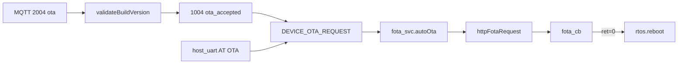

# fota_svc LuatOS OTA

> **代码真源**：[`user/fota_svc.lua`](../../user/fota_svc.lua) · [`user/main.lua`](../../user/main.lua)（`PRODUCT_KEY` / 版本）  
> **配置**：`FOTA_CFG` / `resolveFotaSelfUrl`（[`config.lua`](../../user/config.lua)）— **拉包 URL 唯一来源**  
> **触发**：MQTT 2004 `action=ota` · `DEVICE_OTA_REQUEST` · `REST_SEND_OTA`  
> **详述**：[OTA_FLOW.md](../../ota_server/docs/OTA_FLOW.md) · [OTA_SERVER.md](../../ota_server/docs/OTA_SERVER.md)

---

## 1. 模块职责

| 项 | 说明 |
|----|------|
| **输入** | 云端 MQTT 2004、内部事件 `DEVICE_OTA_REQUEST` |
| **下载** | 自建 OTA HTTP（`FOTA_CFG`）或合宙 IoT / MQTT 下发的完整 `url` |
| **上报** | `pubStatus` 回调 → `net_mqtt.pubOtaStatus`（1004 OTA 阶段） |
| **完成** | 下载成功默认 `rtos.reboot()` |

`MODULE_FLAGS.fota=false` 时不启动；`app.setupFota` 注入 `pubStatus`。

---

## 2. 触发链路


```mermaid
flowchart LR
    M[MQTT 2004 ota] --> V[validateBuildVersion]
    V --> R[1004 ota_accepted]
    R --> E[DEVICE_OTA_REQUEST]
    AT[host_uart AT OTA] --> E
    E --> F[fota_svc.autoOta]
    F --> H[httpFotaRequest]
    H --> CB[fota_cb]
    CB -->|ret=0| RB[rtos.reboot]
```

`net_mqtt` `DL2004_ACTIONS.ota`：校验 `version` 格式（`xxx.yyy.zzz`）后 `reply(0)` 并发布事件。

---

## 3. 自建 OTA 地址选择（config 唯一来源）

**约定**：`user/*.lua` 内禁止硬编码 `firmware_upgrade` 站点；一律经 `_G.resolveFotaSelfUrl()` 或读 `FOTA_CFG`。

### 3.1 配置位置

[`user/config.lua`](../../user/config.lua) 中：

```lua
local FOTA_URL_PANSHI = "http://112.86.146.219:18080/api/site/firmware_upgrade?"
local FOTA_URL_LEGACY = "http://43.136.55.143/api/site/firmware_upgrade?"

_G.FOTA_CFG = {
	server_mode = "self",   -- self：用下方 servers；其它：走 libfota2 合宙默认
	server = "panshi",      -- 端点键名
	default_url = FOTA_URL_PANSHI,
	servers = {
		panshi = FOTA_URL_PANSHI,  -- / new 同址
		new = FOTA_URL_PANSHI,
		legacy = FOTA_URL_LEGACY,  -- / old 同址（兼容原服）
		old = FOTA_URL_LEGACY,
	},
	-- self_url = "http://...",  -- 可选：强制覆盖 server 选择
}
```

### 3.2 如何切换

| 目的 | 改法 |
|------|------|
| 现网（默认） | `FOTA_CFG.server = "panshi"` 或 `"new"` |
| 原服务器 | `FOTA_CFG.server = "legacy"` 或 `"old"` |
| 临时指定任意地址 | 设 `FOTA_CFG.self_url` 或 `custom_url`（优先于 `server`） |
| 改 IP/端口 | 只改 `FOTA_URL_PANSHI` / `FOTA_URL_LEGACY`（或 `servers` 表） |

### 3.3 解析优先级（`resolveFotaSelfUrl`）

```mermaid
flowchart TD
    A[resolveFotaSelfUrl] --> B{self_url / custom_url 非空?}
    B -->|是| C[返回手动 URL]
    B -->|否| D[servers[server]]
    D --> E{命中?}
    E -->|是| F[返回该端点]
    E -->|否| G[default_url → panshi → legacy]
```

### 3.4 谁在什么时候用这个地址

| 场景 | 行为 |
|------|------|
| MQTT 2004 `action=ota` **带** `url` | 直接用平台下发的 `url`，不改写 |
| 2004 **不带** `url`，且 `server_mode` 为 `self`/`custom` | `net_mqtt` 调用 `resolveFotaSelfUrl()` 填入 `data.url` |
| `fota_svc` 自建拉包 | `selfUrl()` → 同上解析；**不**在本文件写死站点 |
| `server_mode` 非 self（如走合宙） | 无自定义 url 时走 `libfota2` 默认 `iot.openluat.com` |

联调 GUI：`tools/gui/mqtt` 默认 OTA URL 与现网 `panshi` 一致；平台也可显式带 `url` 覆盖设备配置。

---

## 4. `autoOta` 执行步骤

1. **busy 检查** — 进行中则 `reportStatus("busy", ...)`
2. **等网络** — `waitNetworkReady(network_wait_ms)`，默认 120s
3. **构建 opts** — `buildRequestOpts(data)`：
   - 有 `url` / `otaUrl` / `firmwareUrl` → 直连 HTTP（自建或平台下发）
   - 否则合宙 IoT：`project_key` + `version` + `firmware_name` + IMEI/MAC/UID
4. **校验** — 缺必要字段则失败
5. **HTTP 下载** — `httpFotaRequest` → `libfota` / `libfota2`
6. **超时兜底** — `callback_timeout_ms`（默认 320s）未回调则 `callback_timeout`
7. **回调** — `fota_cb(ret)` → 上报 + 可选重启

---

## 5. 返回码（`FOTA_RET`）

| ret | stage | message | 重启 |
|-----|-------|---------|------|
| 0 | success | download_ok | 是（默认） |
| 1 | failed | connect_failed | 否 |
| 3 | failed | iot_rejected | 否 |
| 4 | failed | recv_error | 否 |
| 5 | failed | version_format_error | 否 |

---

## 6. 合宙 IoT URL（非自建模式）

`server_mode` 非 `self`/`custom`，且请求无完整 `url` 时，由 `libfota2` 使用：

`https://iot.openluat.com/api/site/firmware_upgrade?`

```
{imei|mac|uid}&project_key=...&firmware_name={PROJECT}_LuatOS-SoC_{bsp}&version={IOT_VERSION}
```

- `firmware_name`：默认 `{PROJECT}_LuatOS-SoC_{bsp}`（BSP 去 `-` 后缀）
- `version`：经 `_G.resolveIotOtaVersion` 转换（与 `main.lua` OTA 版本规则一致）
- 须在合宙 IoT 后台上传固件并配置升级范围

---

## 7. 配置项（`FOTA_CFG`）

| 键 | 默认 | 说明 |
|----|------|------|
| `server_mode` | `"self"` | `self`/`custom`：用自建端点；其它：合宙 IoT |
| `server` | `"panshi"` | `servers` 表键名：`panshi`/`new`/`legacy`/`old` |
| `servers` | 见上 | 端点表；URL 只维护在此 |
| `default_url` | panshi 地址 | `server` 未命中时的兜底 |
| `self_url` / `custom_url` | nil | 手动覆盖，优先于 `server` |
| `request_delay_ms` | 500 | 发起 HTTP 前延时 |
| `network_wait_ms` | 120000 | 等 IP 超时 |
| `callback_timeout_ms` | 320000 | 等下载回调超时 |
| `timeout_ms` | 300000 | HTTP 超时 |
| `auto_reboot_on_success` | true | 成功后重启 |

---

## 8. 与 T3x 烧录的区别

| | Cat.1 `fota_svc` | T3x 烧录 |
|--|------------------|----------|
| 目标 | AIR780 LuatOS 固件 | T31 协处理器镜像 |
| 入口 | MQTT 2004 / OTA 事件 | BOOT 长按烧录模式 |
| 期间 | 正常运行或独立任务 | app 挂起 MQTT/UART/PIR |

烧录期间 `fota_svc` 仍可能响应 OTA，但通常云端不会对烧录中设备下发 Cat.1 OTA。

---

## 9. 对外 API

| 函数 | 说明 |
|------|------|
| `start(options)` | 订阅 OTA 事件；注入 `pubStatus` |
| `request(data)` | 手动触发 `autoOta` |
| `configure` / `getConfig` | 运行时配置 |
| `getState()` | `busy`、`request_count`、`last_result`、`server`、`self_url` |
